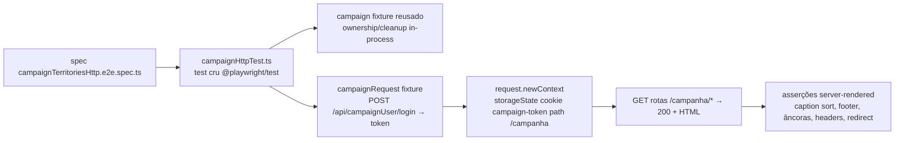

# Impl: E2E full-stack sem browser (paradigma HTTP) para asserções de servidor

Status: aprovado
Atualizado em: 2026-08-10
Issue: #600
Intenção: docs/plans/e2e-full-stack-sem-browser.md
Appetite restante: herdado (~1–1,5 dia eng; este plano corta para a prova do paradigma + 1 família + medição, como a intenção manda)

## Leitura da intenção

- **Outcome:** um modo de spec e2e que roda no job e2e existente (mesmo servidor + DB reais) **sem lançar browser**, com sessão real de campanha; a primeira família migra com asserções equivalentes; o ganho de tempo por família é medido e registrado no changelog; o guard de falhas client permanece exclusivo do browser.
- **O que NÃO negociar:** asserções migradas 1:1 em cobertura (nada removido sem equivalente); sessão real (`campaign-token`), sem duplicar lógica de auth no teste; sem chamar server actions por HTTP cru (protocolo RSC); sem framework de teste novo.
- **O que reavaliar:** (1) a recomendação da intenção para login "browser real por run → storageState" — esta análise opta por login REST do Payload, 100% sem browser; (2) a nomenclatura `*.http.e2e.spec.ts` da intenção **não casa** com o `testMatch` do projeto (`/campaign.*\.e2e\.spec\.ts/` — descoberta de execução) — o marcador vira sufixo `Http` mantendo o prefixo `campaign`; (3) a escolha da primeira família (a intenção sugeria "uma família pequena"; análise: `campaignTerritories` é a única cujas 4 specs são ~100% servidor).

## Abordagem recomendada

**Opções consideradas:** A | B | C (sessão) e A | B (nomenclatura)
**Recomendação:** login REST + mesma família no projeto `campaign` — porque exercita o endpoint real do app sem browser nenhum, e a sessão via cookie canônico `campaign-token` é exatamente o que `getCampaignUser()` lê (nada duplicado, nada simulado).
**Rejeitadas:** ver Decisões de engenharia.

### Decisões de engenharia

**D1 — Como o modo HTTP obtém sessão de campanha?**

- **Opções:**
  - **A) Login REST do Payload** — `POST /api/campaignUser/login` (`{ email, password }` ou `{ username, password }`, aceito pelo `loginWithUsername.allowEmailLogin` da collection) → resposta `{ token, user }` → `request.newContext({ storageState: { cookies: [{ name: 'campaign-token', value: token, domain, path: '/campanha', expires: -1, httpOnly: true, secure: scheme === 'https:', sameSite: 'Lax' }], origins: [] } })`. O token é o JWT canônico com `_sid`, verificado por `payload.auth()` em `getCampaignUser` — o mesmo fluxo de `loginCampaign`, sem reimplementar nada.
  - **B) Login de browser real num setup spec** (recomendação da intenção) — um login por run numa spec `setup` → `storageState` em arquivo → `request.newContext({ storageState: arquivo })`. Lança browser (pelo menos 1 navegador no run), depende de artefato de estado gravado em disco e de o projeto `setup` executar antes.
  - **C) Assinar JWT no teste** com `PAYLOAD_SECRET` + inserir sessão via Local API — duplica a lógica de auth do app no teste (anti-goal explícito da intenção).
- **Recomendação: A** — é a única 100% sem browser (o título da Issue é literalmente "sem browser"), usa o endpoint real do app sobre HTTP real, token canônico com sessão real, e o cookie com `path: /campanha` replica o contrato de `setCampaignAuthCookie` (`src/utilities/campaignAuth.ts:163-169`). O TTL não é re-assinado para 8 h como o login do app faz (o login REST devolve o token de 14 dias configurado em `tokenExpiration`) — irrelevante para uma sessão de teste de minutos; o servidor valida o JWT, não o atributo do cookie.
- **Rejeitadas:** B porque lança browser no run (o que este item quer eliminar) e cria dependência de artefato/ordem entre projetos; C porque viola "não duplicar lógica de auth no teste" e mexe com segredo de produção.

**D2 — Nomenclatura e registro no Playwright**

- **Opções:**
  - **A) Mesmo projeto `campaign`**, arquivo `campaign<Family>Http.e2e.spec.ts` (ex.: `campaignTerritoriesHttp.e2e.spec.ts`). Casa com o `testMatch` atual `/campaign.*\.e2e\.spec\.ts/` e com o `E2E_SPEC_RE = /^tests\/e2e\/[^/]+\.e2e\.spec\.ts$/` do `test-affected-core.mjs`. A dependência `setup` (prewarm) já está declarada no projeto.
  - **B) Projeto Playwright próprio** `campaign-http` com `testMatch: /\.http\.e2e\.spec\.ts$/` (a letra `*.http.e2e.spec.ts` da intenção) — bloco de config novo, `dependencies: ['setup']` repetido, e dois projetos para a mesma família.
  - **C) Manter o nome do arquivo da família** (`campaignTerritories.e2e.spec.ts`) e marcar o modo só em comentário — o modo fica invisível para config/scripts/humano.
- **Recomendação: A** — mesma recomendação da intenção ("família própria no projeto existente, menos configuração, mesmo servidor"), com o ajuste de nomenclatura obrigatório descoberto na análise (a letra da intenção não roda no testMatch atual). O sufixo `Http` é o marcador de modo.
- **Rejeitadas:** B porque adiciona config e estado de projeto sem ganho funcional (o job CI já roda todos os projetos com `pnpm test:e2e`); C porque esconde o modo.

**D3 — Base de fixtures do modo HTTP**

- `tests/e2e/fixtures/campaignHttpTest.ts`:
  - `test` estende do **`test` cru de `@playwright/test`** — nunca de `e2eTest.ts`: o guard `e2eFailureGuard` é `auto: true` e puxaria os fixtures `page`/`context`, lançando browser em toda spec (aceite da intenção: o guard de falhas client permanece exclusivo das specs de browser).
  - Reusa o fixture `campaign` de `campaignE2EFixtures.ts` (ownership/cleanup/DB in-process — mesmo padrão, **nenhum caminho de seed paralelo**). Para isso, o fixture hoje inline vira `export const campaignFixture` (mudança mínima, comportamento idêntico no `test` atual).
  - Novo fixture `campaignRequest(user, password) → Promise<APIRequestContext>`: login REST (D1) + contexto por teste com o cookie. Espelha o formato de `campaign.login` (browser): recebe identificador + senha, devolve um contexto autenticado.
  - `CAMPAIGN_TOKEN_COOKIE` hardcoded como `'campaign-token'` com comentário apontando `src/utilities/campaignAuth.ts:12` (não é importável: módulo `server-only`; precedente: `tests/unit/campaignLoginAction.unit.spec.ts:27`).
  - `secure` derivado do scheme do `baseURL` (`https:` → true), nunca do `NODE_ENV` do processo de teste — todos os ambientes de teste usam `http://localhost:<porta>` (CI: `pnpm start` com `PLAYWRIGHT_BASE_URL` local), e o request context do Playwright trata localhost como origem confiável para cookies Secure.
- **Depth check:** o helper de login é o único lugar que conhece a forma do corpo REST + cookie; o fixture `campaign` já é o módulo profundo de ownership — não criar twin.

**D4 — Primeira família: `campaignTerritories` (4 specs, migração com equivalência)**

O motivo da escolha: `loadTerritoryOverview` + `sortTerritoryRows/filterTerritoryRows` rodam **no servidor** (`page.tsx:41-45`), a tabela é RSC com `CampaignTable` filtrando colunas ocultas **antes do render** (`CampaignTable.tsx:168` `resolveVisibleColumns`), e o estado de sort/filtro é URL. As 4 specs atuais são navegação + conteúdo renderizado + redirect — nada de hidratação/interação client. Equivalências:

| Spec browser (atual)                                         | Equivalente HTTP                                                                                                                                                                                                                                                                                                                                                                                                                                                                                                                                          |
| ------------------------------------------------------------ | --------------------------------------------------------------------------------------------------------------------------------------------------------------------------------------------------------------------------------------------------------------------------------------------------------------------------------------------------------------------------------------------------------------------------------------------------------------------------------------------------------------------------------------------------------- | --- | --------------------------------------------------------------------------------------------------------------------------------------------------------------------------------------------------------------------------------------------------------------------------------------------------------------------------------------------------------------- |
| staff sort/filtra/abre fila de municípios (cliques em links) | GET `/campanha/territorios` → 200 + HTML com link de sidebar `Territórios` (href `/campanha/territorios`), link `Irecê (N)`; GET `?sort=votes2022` → HTML com caption `Ordenado por 2022 (maior primeiro)` (`formatTerritoryListSortSummary`, `territoryListUrl.ts:74-82`); GET `?region=Irecê` → HTML com `1 território encontrado` (footer `CampaignListFooter`); GET `/campanha/municipios?region=Irecê` → 200 + conteúdo de municípios do recorte                                                                                                     |
| âncoras hash dos territórios-pai                             | GET `/campanha/territorios` → HTML contém `id="ti-irece"` e `id="ti-velho-chico"` (`territoryAnchorId`)                                                                                                                                                                                                                                                                                                                                                                                                                                                   |
| colunas de rede em painel largo (2200px)                     | GET `/campanha/territorios` → HTML contém os headers sortáveis `2022`/`Captura`/`2026`/`Classe`/`Assessoria` e os headers de rede `Assessor`/`Liderança`/`Dobradinha` (sempre renderizados, rungs CSS por container query — `TerritoryListColumns.tsx:247-253`); `Cobertura` **ausente** do HTML (oculta por default via `columnVisibility` → não renderizada). Perda documentada: a **visibilidade CSS por viewport** é concern de browser (anti-goal "viewports" da intenção); o contrato de servidor (o que é renderizado por estado) fica 100% pinado |
| leader não abre a página                                     | GET `/campanha/territorios` com sessão leader (login **por username/telefone**, como no spec browser) → `maxRedirects: 0` aceita `200                                                                                                                                                                                                                                                                                                                                                                                                                     | 307 | 308`e assere o **destino** do redirect, nunca o transporte:`200`→ meta`http-equiv="refresh" content="1;url=/campanha/contatos"`(Next`next-route-redirect`—`redirect()`pós-stream responde 200 + meta, medido em dev e prod);`3xx`→ header`location`terminando em`/campanha/contatos`. GET `/campanha/contatos`(home do leader) → HTML **sem** link`Territórios` |

Famílias rejeitadas para esta primeira leva (medição decide a próxima): `campaignLeaderships`/`campaignConcepts`/`campaignAgendaFeed`/`campaignActivity`/`campaignHomeActions` (interação client é o ponto — popover/autosave/dialog/forms), `campaignMunicipalities` (a mais pesada, mas maior superfície client), `campaignNearestMunicipality`/`campaignZoneMap` (geolocalização/mapa Leaflet).

## Componentes / mudanças

- **`campaignFixture` exportado** (`tests/e2e/fixtures/campaignE2EFixtures.ts`): o fixture inline atual vira `export const campaignFixture`; o `test` existente continua `base.extend({ campaign: campaignFixture })` — zero mudança de comportamento.
- **`campaignHttpTest.ts`** (`tests/e2e/fixtures/`): base crua + fixture `campaignRequest` (D1/D3). Sem guard de falhas client (documentado no header do arquivo).
- **`campaignTerritoriesHttp.e2e.spec.ts`** (novo, 4 specs de D4) e **remoção de `campaignTerritories.e2e.spec.ts`** (browser) — nada fica duplicado.
- **`scripts/lib/e2e-affected-manifest.mjs`**: entrada `specs: ['campaignTerritories']` → `['campaignTerritoriesHttp']` (o pin unit `e2eAffectedManifest.unit.spec.ts` valida que os nomes existem como arquivos).
- **Migration:** nenhuma. **Access/Consent:** nenhum toque. **UI:** nenhuma.
- **CHANGELOG-AGENTS.md:** entrada com a medição (D5).

### Dados → forma

- Forma: wall time por spec (relatório list do Playwright) nas duas versões da família, mesma máquina/worktree, mesmo servidor dev, após prewarm. Registro: `campaignTerritories — browser X s vs HTTP Y s (−Z%)` + nota do ambiente (dev server, porta do worktree). Nenhuma superfície de dados de produto (intenção: métrica de processo).

## Fases verificáveis

1. **Tracer/infra** (quota: 0,35 dia) — export `campaignFixture`; `campaignHttpTest.ts` com `campaignRequest`; spec smoke de prova (`campaignHttpSmoke` temporário, removido no fim da fase ou fundido): login REST → GET `/campanha` autenticado 200 + nome do usuário no HTML; redirect leader 3xx. Verificação: spec roda **sem lançar browser** (rodar com `--project=campaign` e conferir que nenhum browser abre — o `request` fixture não lança).
2. **Migração** (quota: 0,4 dia) — `campaignTerritoriesHttp.e2e.spec.ts` com as 4 specs equivalentes (asserções ajustadas ao markup real verificado no passo 1); remover o spec browser; atualizar o manifesto e2e-affected; `pnpm test:e2e` das 4 specs verde (dev) + `E2E_PROD=1` na entrega.
3. **Medição + fechamento** (quota: 0,3 dia) — medir browser (baseline: as 4 specs ainda em git, ou registro de antes da migração) vs HTTP; entrada no CHANGELOG-AGENTS; gates `pnpm gate:fast`, `pnpm exec knip`, `pnpm check:cycles`, `pnpm format:check`, `pnpm build` (DB local), scan Aikido dos arquivos tocados; `pnpm push` → PR `--base main` `Closes #600` → auto-merge → `gh pr checks --watch --required`.

## Rabbit holes / Não escopo (engenharia)

- Migrar mais famílias nesta entrega — a medição desta família é o input da decisão da próxima leva (item próprio).
- storageState em arquivo / login por projeto — contexto por teste, criado sob demanda.
- "Aproveitar e asserir as rotas JSON de mutação" (`campaignJsonMutationRoute`) — superfície legítima do paradigma, mas é família **nova**, não migração; fora deste corte.
- Parser de HTML / framework de asserção — `response.text()` + `toContain`/regex é suficiente (Playwright já dá o `expect`).
- Chamar server actions por HTTP (protocolo RSC criptografado) — anti-goal da intenção.
- Mexer no `playwright.config.ts` (projects/timeouts) — não precisa.

## Adiado com gatilho (triage capture-review-debts 2026-08-10)

- **Constantes de cookie `campaign-token`/`/campanha` compartilhadas** (módulo em `src/lib/`, precedente `campaignSessionTtl.ts`): hoje hardcoded no fixture com comentário apontando `campaignAuth.ts` (módulo `server-only`). Risco real baixo — um rename quebra os specs HTTP ruidosamente (a suíte é o guard). **Gatilho:** mudança do contrato de cookie OU 3º consumidor.
- **`rendered()` (strip de `<!-- -->`) no base `campaignHttpTest.ts`**: hoje local na spec; será idêntico na próxima família. **Gatilho:** 2ª família HTTP migrar (mover junto, precedente `campaignPageChrome` no `campaignE2EFixtures`).
- **Visibilidade CSS das colunas de rede de Territórios** (rungs `@min-[Nrem]`): a família migrou inteira e o spec browser de 2200px saiu; o HTML pina presença + classes de rung, mas uma regressão de CSS (container queries) passaria. **Candidato a Issue pequena própria** (ver tabela de triage no gate) ou **gatilho:** regressão de CSS de colunas medida / próxima família com responsividade migrar.

## Riscos e mitigação

- **REST login do Payload inexercitado no app** (o login do app usa Local API): a rota `/api/campaignUser/login` é default do Payload (sem `api: false` na collection), mas o smoke da fase 1 prova o contrato real antes da migração. Se algo bloquear (ex.: access control customizado), cair para B (storageState via browser) com reabertura do gate.
- **HTML grande e substrings ambíguas** ("Territórios" aparece em sidebar/breadcrumb): asserções por par específico (href + texto, caption exato, `1 território encontrado` exato), verificadas contra o markup real no passo 1.
- **Redirect dev vs prod**: `redirect()` lançado **pós-stream** (gate `noLeader` da página, depois do layout) responde **200 com meta `next-route-redirect`** em dev e prod (medido); quando vence o stream vira 307 (dev) / 308 (prod). A asserção aceita os três e pina o **destino** (`meta url` ou `location`), nunca o transporte.
- **Renomear spec quebra pins/contagens**: manifesto e2e-affected (unit-pinned) atualizado; contagem de specs não muda (4 → 4); TESTING.md não conta por nome.
- **Medição contaminada por cold compile**: prewarm (`setup` project) antes de medir as duas versões; medição em execução única no mesmo worktree.
- **Cookie Secure no request context**: `secure` derivado do scheme; em CI/`E2E_PROD` o baseURL é `http://localhost` (origem confiável) — validado no smoke.

## Aceite de engenharia

- [ ] Aceite de produto da intenção ainda coberto (modo sem browser no job existente; família migrada com asserções equivalentes; medição no changelog; RBAC leader no conteúdo/redirect; guard client exclusivo do browser)
- [ ] Invariantes AGENTS/engineering-standards (sem migration, sem banco prod, identificadores em inglês, `assertTestDatabase` no fixture reusado, zero caminho de seed paralelo)
- [ ] Testes previstos: as 4 specs HTTP migradas são os testes; smoke de login na fase 1; pins unit existentes mantidos (manifesto e2e-affected atualizado, não enfraquecido)
