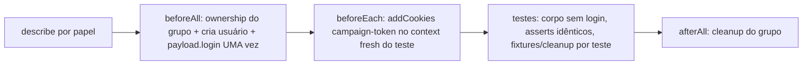

# Impl: E2E — journeys com sessão compartilhada nos arquivos pesados (amortizar overhead por teste)

Status: em execução
Atualizado em: 2026-08-10
Issue: #601
Intenção: docs/plans/e2e-journeys-seriais-arquivos-pesados.md
Appetite restante: ~1 dia eng (herdado)

## Leitura da intenção

- **Outcome:** wall time dos 3 arquivos (`campaignHomeActions` 17, `campaignMunicipalities` 20, `campaignBottomNav` 9) cai de forma **mensurável**; cada teste continua um teste separado no relatório (falha localizada, retry por teste); **zero asserções removidas/enfraquecidas**; classe de flake por interação não piora; decisão por arquivo com medição.
- **O que NÃO negociar:** granularidade por teste (retry/diagnóstico); fixtures **por teste** (ownership por runID; cleanup por teste); paralelismo entre arquivos; nenhum caminho deixa de ser testado.
- **O que reavaliar:** (1) a premissa "cada teste paga `getPayload`" — **falsa**: Payload 3.82 memoiza a instância em `global._payload` keyed por `options.key`; medido: 364 ms na 1ª chamada do worker, **0 ms** nas seguintes (fixture já amortiza). (2) "login no `beforeAll` + reuso do contexto no modo serial" — substituível por **seed de sessão** (mesma via de login do app, sem browser), que preserva contexto fresh por teste e dispensa o serial. (3) "grupos = describes atuais" — na prática os describes misturam papéis (ex.: B47 tem coordinator, leader e advisor no MESMO describe); o agrupamento viável é **por papel**.

## Medições (baseline, 2026-08-10, máquina sob load ~55, 2 workers, dev server)

| Fase                                           | Medido                                                                                                         |
| ---------------------------------------------- | -------------------------------------------------------------------------------------------------------------- |
| `getPayload` cold                              | 364 ms (1ª por worker)                                                                                         |
| `getPayload` warm                              | 0 ms (memoizado)                                                                                               |
| Teste simples (coordinator + login + 1 assert) | **1.9–2.3 s** — login ≈ metade                                                                                 |
| Teste wizard / municípios                      | 5–11 s (navegações RSC, não amortizáveis)                                                                      |
| Baseline dos 3 arquivos                        | 29 passou / **20 falhou** em 10.0 m; falhas concentradas no **login** (timeout no fill de "E-mail ou celular") |

Conclusão: o overhead amortizável real é **o login de browser + a criação de usuário por teste** (bcrypt) — não o Payload. Sob carga, o login é também o primeiro a estourar o timeout de 60 s: removê-lo do caminho crítico de 46 testes reduz a superfície de flake **e** o wall time.

## Abordagem recomendada

**Sessão compartilhada por grupo de papel, semeada por cookie — sem browser login, sem modo serial.**



**Opções consideradas:**

- **A — Seed de sessão (recomendada):** `beforeAll` do grupo cria o usuário (numa instância de ownership do grupo) e minta o token via `payload.login` — **a mesma via do login real** (cria a session row, respeita `loginWithUsername`, retorna o token que o app valida). `beforeEach` injeta `campaign-token` no context do teste (fresh por teste, como hoje). Login de browser desaparece dos testes compartilhados; `describe.configure({ mode: 'serial' })` **não é necessário** (a sessão não é reusada por contexto — é semeada por cookie).
- **B — Serial + storageState (a letra da intenção):** um `beforeAll` faz o login de browser UMA vez e grava `storageState`; `test.use({ storageState })`; describes em `mode: 'serial'`. **Rejeitada** porque: (1) falha em teste N **skipa N+1..k** do grupo no relatório — perde diagnóstico, exatamente o anti-goal "mega-teste" da intenção em versão diluída; (2) arquivo de estado por worker + `test.use` registrado em tempo de definição cria acoplamento de path e corrida entre workers; (3) retry+serial tem semântica de skip que a intenção diz não piorar.
- **C — Login por `describe` original (a hipótese da intenção):** **impossível como está** — os describes misturam papéis (B47: coordinator/leader/advisor no mesmo bloco); um login por describe exigiria um usuário por describe e quebraria o que cada teste assere. Reagrupar por papel É o que a opção A faz, sem pagar serial.

**Rejeitadas em detalhe:** B (skips em cascata + storageState file race) e C (roles mistos no describe).

### Componentes / mudanças

- **`tests/e2e/fixtures/campaignE2EFixtures.ts`** — dois helpers novos (o dono do login já é este módulo):
  - `mintCampaignSession(payload, user): Promise<string>` — `payload.login({ collection: 'campaignUser', data: { email, password } })` → token (mesma via do login action; não inventar JWT à mão — a session row do `useSessions` precisa existir).
  - `seedCampaignSession(context, baseURL, token): Promise<void>` — `context.addCookies([{ name: CAMPAIGN_TOKEN_COOKIE, value: token, url: baseURL, path: '/campanha', httpOnly: true, sameSite: 'Lax' }])` (espelha `campaignCookieOptions`; sem `secure` em http de teste).
  - Objeto `campaign` ganha `sessionFor(context, user)` = mint+seed (para usuários por-teste que continuam existindo: advisors, journeys mistas).
  - `CampaignE2EOwnership` **intocado** — o proxy/cleanup por runID continua sendo o contrato por teste.
- **Padrão por grupo (repetido nos 3 arquivos):**
  ```ts
  test.describe('… (papel)', () => {
    let groupFixtures: CampaignE2EOwnership
    let coordinator: CampaignUser & { password: string }
    let sessionToken: string
    test.beforeAll(async () => {
      const payload = await getPayload({ config }) // memoizado; sem custo
      groupFixtures = new CampaignE2EOwnership(payload)
      coordinator = await groupFixtures.createCampaignUser('coordinator', {
        name: groupFixtures.value('…'),
      })
      sessionToken = await mintCampaignSession(payload, coordinator)
    })
    test.beforeEach(async ({ campaign, context }) => {
      await seedCampaignSession(context, campaign.baseURL, sessionToken)
    })
    test.afterAll(async () => {
      await groupFixtures.cleanup()
      await groupFixtures.expectNoOwnedRows()
    })
  })
  ```
  Testes do grupo: **removem** `createCampaignUser` + `campaign.login` do corpo; quando o teste usa `coordinator.id` (B193 footer: `author`), usa o do grupo. Asserções intactas.
- **Agrupamento por arquivo (decisão por medição — os 3 têm fração coordinator dominante):**
  - `campaignHomeActions`: grupo coordinator (14 testes), grupo leader (2), advisor OPS29 (1 — mantém fresh por teste, exige portfólio vazio; seed via `sessionFor`).
  - `campaignMunicipalities`: grupo coordinator (16), advisors fresh por teste (4, incl. 2 OPS29 que exigem portfólio vazio — **não compartilhar advisor**), journey mista advisor→leader (1: **mantém `campaign.login` de browser** — é o único teste dos 3 arquivos que troca de sessão no meio e preserva o caminho de login UI).
  - `campaignBottomNav`: grupo coordinator (7), grupo leader (2).
- **Migration:** sem migration.
- **Access / Consent:** sem mudança (fixtures de teste; `ensureLeasedConsent` intocado).
- **UI:** N/A (infra de testes; Impeccable A).

### Decisões de engenharia

- **Mecanismo de sessão:** A (seed por cookie) > B (storageState+serial) > C (login por describe original). Por quê: mesmo ganho de wall time sem os skips em cascata do serial, sem arquivo de estado, sem corrida de workers; contexto fresh por teste preserva o `e2eFailureGuard` e o isolamento de cookies/localStorage como hoje.
- **Onde minta o token:** `beforeAll` do grupo (UMA chamada `payload.login` por worker) — o seed por teste é só `addCookies` (custo ~0). Não re-logar por teste: anula o ganho.
- **Usuários compartilhados:** apenas coordinator/leader (sem estado mutável entre testes — auditado: `payload_preferences` só é escrito pelo B184 'Recorte B184', e nenhum teste posterior do grupo assere ausência de filtro salvo; colunas vêm de cookie por contexto, não do usuário). Advisors **nunca** compartilhados (OPS29 exige portfólio vazio; B176 atribui portfólio).
- **`mode: 'serial'`:** **não usar** — é o mecanismo da intenção para reusar a sessão; com seed a sessão não precisa de reuso de contexto, e o serial piora o relatório em falha (skips). Divergência declarada.
- **Cobertura do login UI:** os 46 testes deixam de exercitar a página de login; o caminho continua coberto por `campaignAuth.e2e.spec.ts` (login/logout/reset/biometria) e pelo journey misto t9 que mantém browser login. Nenhum caminho deixa de ser testado.

## Fases verificáveis

1. **Tracer (mais barato que comprova):** helpers no fixture + converter UM describe (B47 coordinator, 5 testes) → rodar os 5 + verificar sessão válida (`getCampaignUser` aceita o token seedado; asserts passam). Medir o subconjunto estável antes/depois (testes rápidos ~2 s: B47 staff + bottomNav básico).
2. **Conversão dos 3 arquivos** (grupos coordinator/leader; exceções OPS29/t9 conforme acima) — corpo de teste editado no mínimo (só remoção de create+login).
3. **Medição pós + changelog:** re-rodar os mesmos subconjuntos; registrar antes/depois em `docs/CHANGELOG-AGENTS.md` (quota: o outcome da intenção é o registro mensurável).
4. **Gates:** `tsc --noEmit`, `lint`, `format:check`, `knip`, `check:cycles`, unit+int, e2e dos 3 arquivos, `build`. Apagar `tmp-time-payload.ts`.

## Rabbit holes / Não escopo (engenharia)

- Migrar os outros ~29 arquivos para o padrão (decisão por medição, não por princípio — fora da intenção).
- `describe.configure({ mode: 'serial' })` em qualquer outro arquivo.
- storageState/arquivos de estado; reuso de page/context entre testes (acopla estado de browser — anti-goal).
- Ajustar `fullyParallel`/workers/CI (OPS34 é outro item).
- Corrigir flakes pré-existentes (ledger separado; o baseline corrompido por load NÃO entra no changelog como regressão).

## Riscos e mitigação

- **Token seedado rejeitado pelo app** (ex.: sid/session row): mitigado pelo tracer da fase 1 — se `payload.login` não bastar, caímos no storageState (opção B) só para o caso que falhar.
- **Prefs acumuladas no usuário compartilhado** (B184): auditado por teste; nenhuma asserção depende de ausência de filtro salvo; cleanup do grupo apaga usuário+prefs no afterAll.
- **Falha no `beforeAll` do grupo** derruba os testes do grupo com erro claro — mesma superfície de hoje (o login de browser também falhava em cadeia sob carga).
- **Testes que usam `coordinator.id`** (B193 footer): usar o id do grupo — erro de compilação pega qualquer referência órfã a variável removida.
- **Worker crash vaza o usuário do grupo:** mesmo comportamento do estado atual (leak só no banco de teste até o próximo wipe).

## Aceite de engenharia

- [x] Aceite de produto da intenção ainda coberto (46 testes, granularidade, zero asserções removidas, medição antes/depois no changelog)
- [x] Invariantes AGENTS/engineering-standards (sem DB de prod; fixtures por teste; ownership intocado)
- [x] Testes de domínio previstos: e2e dos 3 arquivos verdes (nos mesmos workers/CI) + medição registrada
