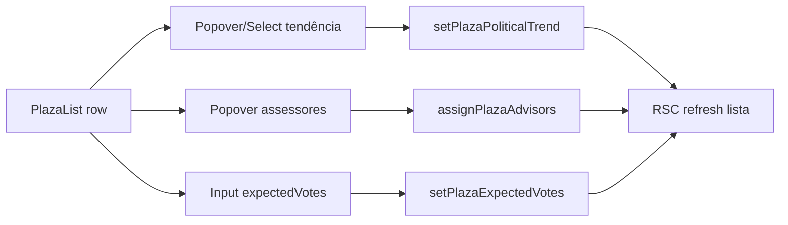

# Edição rápida na lista de Praças

Status: entregue 2026-07-21 (branch; deploy pendente com remodelagem)
Atualizado em: 2026-07-21
Item do roadmap: [docs/roadmap.md](../roadmap.md) (Trilha B, item B9 — entregue 2026-07-21)
Impeccable: B — encaixe em `PlazaList` / cards mobile em `/campanha/pracas` (sem rota nova)
Appetite: ~1–1,5 dia eng; 3 affordances na linha + reuso de actions (A9 + plaza); sem migration própria
Responsável: —

_Revisão 2026-07-21 (pós-implementação + `/simplify`): `PlazaList*Control` + `listFormActions`; coluna Tendência; `PlazaAdvisorAvatarStack`. Débitos → **A9+** F2 / **C8** F4 (ver seção Simplify abaixo)._

## Design (Impeccable)

Âncoras: `PRODUCT.md` / `DESIGN.md` (register product — Field Desk) · tema `data-theme='campaign'` · shells `CampaignPageShell`, `PlazaList`, shadcn `Table`/`Popover`/`NativeSelect`/`Input`.

Na implementação (`implement-roadmap-item`): craft compacto → critique → polish (sem shape longo — interação em tabela existente).

Brief compacto:

- **Persona / contexto:** Alex (Coordenador Geral / Assessor) na lista de 436 Praças sob pressão de convenções — precisa designar assessoria, marcar conjuntura e lançar o **total esperado** da Praça sem abrir N páginas `/editar`.
- **Job principal:** editar Assessores, Tendência e **Votos estimados (total da Praça)** sem sair da lista, com refresh RSC após save.
- **Estratégia de cor:** Restrained (inalterada).
- **Anti-goals:** planilha editável full-row; data-grid genérico; Sheet de pledges como substituto do total da Praça; bulk multi-select neste item.

## Contexto

Em `/campanha/pracas`, `PlazaList` é **somente leitura**. Com **A9** entregue, a coluna “Votos estimados” mostra `plaza.expectedVotes` (total esperado staff-only), com a soma de `votePledge` como cobertura secundária (“Nas lideranças”). Tendência já filtra (`?trend=`) mas ainda não aparece na tabela.

Edição hoje exige `/campanha/pracas/[slug]/editar` (assessores, tendência, `expectedVotes` via A9) ou o detalhe para pledges por liderança.

Pedido de produto (2026-07-21): edição rápida na tabela de Assessores, Votos estimados e Tendência. Correção de modelo (2026-07-21): Votos estimados = total da Praça (A9), **não** o agregado de lideranças — por isso B9 **depende de A9**.

## Objetivos

- Staff edita na linha: **Assessores** (só Coordenador Geral), **Tendência** (`favoravel|neutra|desfavoravel` + limpar) e **Votos estimados** (`expectedVotes` — input numérico direto na coluna / popover curto).
- Coluna **Tendência** visível na tabela/cards staff.
- Coluna **Votos estimados** edita `expectedVotes` (action A9); a cobertura “Nas lideranças” permanece **read-only** na lista (edição de pledges continua no detalhe da Praça).
- Access idêntico às actions existentes.
- Guardrails: **sem migration neste item** (A9); sem Consent; leader sem colunas staff.

## Decisões travadas

- **Item B9 na trilha B; dependência dura de A9.** Sem `expectedVotes` a coluna não tem o que editar. (Usuário, 2026-07-21.) **Rejeitado:** B9 só com Sheet de pledges (plano anterior); fundir A9+B9 num único ID (mistura schema caro com UI).
- **Coluna “Votos estimados” = edição direta de `expectedVotes`.** Popover/campo numérico + salvar (ou blur+Enter); reusa `setPlazaExpectedVotes`. **Rejeitado:** Sheet de pledges como affordance principal da coluna; editar `voteGoals` no lugar.
- **Pledges fora do affordance da coluna.** Cobertura “Nas lideranças” é informativa; deep-link “Abrir Praça” para CRM pessoa a pessoa. **Rejeitado:** dois editores na mesma célula (confunde total vs cobertura).
- **Padrão UX: Popover por célula (não contentEditable em massa).** Tendência = select; Assessores = checkboxes; Votos = number input. Touch `min-h-11`. **Rejeitado:** inputs sempre montados em todas as linhas.
- **Tendência v1 = status only; nota no `/editar`.** **Rejeitado:** nota obrigatória na lista.
- **Assessores: reusar `assignPlazaAdvisors`.** Coordenador-only. **Rejeitado:** bulk multi-Praça neste item.
- **i18n e naming** (AGENTS.md): `PlazaListTrendControl`, `PlazaListAdvisorsControl`, `PlazaListExpectedVotesControl`; strings pt-BR.

## Questões em aberto

- **Salvar votos no blur, Enter ou botão explícito?** **Opções:** A) Enter + botão | B) debounce blur | C) só botão. **Recomendação:** A — evita gravação acidental em scroll mobile; alinhado a forms Field Desk.
- **Carregar opções de assessor na página ou sob demanda?** **Opções:** A) SSR staff | B) action ao abrir. **Recomendação:** A se o conjunto for pequeno; default A _(assumido — validar no craft)_.
- **Refresh:** padrão `revalidatePath` / RSC refresh dos formActions da Praça.

## Abordagem proposta

Componentes:

- **`PlazaList`**: coluna Tendência; células Assessores / Votos estimados / Tendência = gatilhos staff; cobertura de pledges read-only; cards mobile espelham. Leader inalterado.
- **`PlazaListTrendControl`**: select status → `setPlazaPoliticalTrend` (A9 já deve ter `politicalTrend.status` no list select se B9 precisar — senão incluir aqui).
- **`PlazaListAdvisorsControl`**: Popover checkboxes como `PlazaAdvisorsForm`; só `coordinator`.
- **`PlazaListExpectedVotesControl`**: input do total → `setPlazaExpectedVotes` (A9). Mostra “—” quando null; após save, refresh.
- **Form actions** thin em `pracas/`: wrappers das actions em `actions/plaza.ts`.
- **Depth check:** sem `plazaQuickEditService`; sem editable-cell genérico (&lt;3 call sites).
- **Migration:** nenhuma (A9).
- **Testes:** access (advisor não assign; leader sem controles); int/e2e leve de update `expectedVotes` pela lista.

## Dependências

- **Dura:** **A9** ([estimativa-votos-praca.md](estimativa-votos-praca.md)) — campo + action `setPlazaExpectedVotes`.
- **Dura:** R2 — entregue (transitiva via A9).
- **Suave:** R6; fill-in [filtros-auto-pracas.md](filtros-auto-pracas.md).
- Reusa: `assignPlazaAdvisors` / `setPlazaPoliticalTrend` / `setPlazaExpectedVotes`, `PlazaAdvisorsForm`, `plazaViewModels`, `campaignAccess`.

## Não escopo

- Schema `expectedVotes` / mapa fallback → A9.
- Edição de pledges por liderança na lista; metas (`voteGoals`); nota de tendência; bulk assign.
- B7 mapa filtrado; B8 polígonos; Pixel Meta.

## Rabbit holes

- **Data-grid / spreadsheet mode.** **Mitigação:** três affordances nomeadas.
- **Optimistic UI do total.** **Mitigação:** save → refresh servidor.
- **Reabrir Sheet de pledges “só para completar”.** **Mitigação:** fora de escopo explícito; detalhe da Praça.

## Adiado com gatilho

- **Nota de tendência no popover.** Feedback de uso.
- **Bulk assign de assessor a N Praças.** Volume real na fila “Sem assessor”.
- **Atalho “ajustar lideranças” a partir da cobertura.** Se assessores pedirem sem abrir a Praça.
- **Hook/shell popover compartilhado (`usePlazaListPopoverForm`).** Gatilho: 4º inline editor na campanha.
- **`PlazaAdvisorCheckboxList` extraído de `PlazaAdvisorsForm`.** Gatilho: 3º uso ou refactor do form `/editar`.
- **Layout responsivo único (uma árvore React vs mobile+desktop duplicados).** Gatilho: page size >25 ou profiling de hydration.
- **~75 hooks `useActionState` por página.** Gatilho: reclamação de perf ou **R6**.
- **E2E save inline na lista.** Gatilho: smoke pós-merge B9.

## Simplify (2026-07-21)

Limpezas aplicadas no cleanup da sessão (não reabrir): `politicalTrend.note` via hidden field (sem `findByID` extra); `politicalTrendBadgeVariant` em `plazaUi.ts`; `PlazaAdvisorAvatarStack`; tipos `PoliticalTrendStatus`; `max={1_000_000}` no input; higiene de testes.

Débitos absorvidos noutros planos: twin `listFormActions` ↔ `/editar` → **C8 F4** ([escala-dry-pos-c6.md](escala-dry-pos-c6.md)); `revalidatePath` full-page pós-save → **A9+ F2** ([escala-dry-pos-a9.md](escala-dry-pos-a9.md)).

**Explicitamente fora (triage):** lazy-load `getEligibleAdvisorOptions`; `PopoverAnchor` não usado; helper `parsePoliticalTrendStatus`; unit tests dos `PlazaList*Control`.

## Referências

- `docs/roadmap.md` (Trilha B / B9; depende de A9)
- `docs/plans/estimativa-votos-praca.md` — modelo + action
- `src/components/campaign/PlazaList.tsx` — superfície alvo
- `src/app/(campaign)/campanha/(app)/pracas/page.tsx`
- `src/app/(campaign)/campanha/actions/plaza.ts`
- `src/utilities/plazaViewModels.ts`
- AGENTS.md — Campaign auth, naming, overrideAccess
- `PRODUCT.md` / `DESIGN.md` — Field Desk
