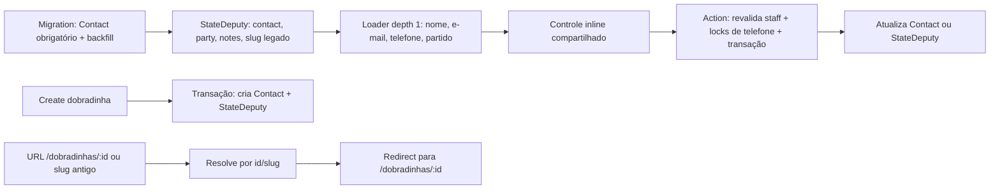

# Impl: Editar nome, partido, e-mail e telefone na lista de dobradinhas

Status: aprovado
Atualizado em: 2026-08-06
Issue: #391
Intenção: docs/plans/editar-campos-lista-dobradinhas.md
Appetite restante: ~1–1,5 dia de engenharia; um vertical slice de Contact + edição inline, sem remodelar as relações da lista

## Leitura da intenção

- **Outcome:** staff corrige Nome, Partido, E-mail e Telefone na própria lista de `/campanha/dobradinhas`, com feedback de salvamento, sem perder o link da ficha no texto do nome.
- **O que NÃO negociar:** `Contact` é a fonte de nome/e-mail/telefone; dobradinha nova já nasce com Contact; nome no texto abre a ficha; clique na célula fora do texto edita; partido continua em `stateDeputy`; ID é a chave canônica da ficha; `leader` não acessa a superfície; conflito de telefone falha sem merge.
- **O que reavaliar:** a hipótese de manter `stateDeputy.name` e a rota `[slug]`. Manter nome duplicado criaria drift entre a lista e Contact; manter slug como chave canônica faria rename continuar perigoso.

## Abordagem recomendada

**Opções consideradas:**

- **A — manter `stateDeputy.name` e espelhar o valor no Contact:** menor diff imediato, mas cria duas fontes de verdade para a pessoa e torna qualquer edição futura um problema de sincronização.
- **B — `Contact` obrigatório, backfill dos existentes, `slug` preservado somente como alias legado:** mantém o padrão de `Leadership.contact`, satisfaz a criação atômica e torna rename independente da URL.
- **C — criar Contact somente no primeiro e-mail/telefone editado:** parece reduzir a migration, mas viola o aceite de Contact na criação e deixa a lista com duas formas de registro.

**Recomendação:** B — o custo irreversível é concentrado numa migration explícita e o restante passa a ter uma única fonte de verdade, sem criar uma collection paralela de pessoa.

**Alternativas rejeitadas:** A porque perpetua drift e o `name` paralelo explicitamente proibido pela intenção; C porque deixa dobradinhas recém-criadas sem Contact e complica o vínculo posterior.

### Decisões de engenharia

- **Schema:** remover `StateDeputy.name`; adicionar `contact` obrigatório e único, seguindo `Leadership.contact`; manter `slug` único e imutável como alias de compatibilidade, nunca como identidade canônica. A ação de criação recebe o nome, cria o Contact e o hook deriva o slug do Contact.
- **Migration:** gerar a migration com `pnpm migrate:create add_state_deputy_contact`, revisar o snapshot JSON e hand-write apenas o backfill necessário. A subida adiciona a coluna nullable, cria um Contact name-only (`state: 'BA'`) por dobradinha existente, liga cada linha, aplica FK/índice único/not-null e remove `state_deputy.name`/índice antigo. A descida restaura `name` a partir do Contact antes de remover a relação, sem apagar Contacts que podem ter sido compartilhados; deve ser protegida contra perda de dados alterados.
- **URL:** renomear o segmento interno para `[id]`, mas o resolver aceita número ou slug legado. Toda leitura por slug redireciona para `/campanha/dobradinhas/<id>`; novos links de dados já resolvidos usam ID. O slug permanece consultável para não quebrar links antigos.
- **Escrita:** criar Contact + StateDeputy numa única `withPayloadTransaction`, passando `req` a todas as operações. A edição de Contact primeiro lê a dobradinha com `user` + `overrideAccess: false`; somente depois usa o bypass administrativo justificado para atualizar o Contact na mesma transação.
- **Telefone:** mover a checagem de lock/ambiguidade hoje privada de `leadership.ts` para o dono da invariável (`contactPhoneInvariant.ts`) e reutilizá-la em Leadership e StateDeputy. `CONTACT_PHONE_CONFLICT_MESSAGE` e `CONTACT_PHONE_AMBIGUOUS_MESSAGE` continuam mensagens seguras e allowlisted.
- **UI:** extrair a máquina de edição de `LeadershipContactFieldControl` para um controle compartilhado de célula. Ele preserva o modo `lápis` de lideranças e adiciona o modo `célula` das dobradinhas; aceita link no valor do nome, formato de telefone, action e nome do campo sem copiar a lógica de autosave. Partido usa a mesma máquina, mas grava somente `stateDeputy.party`.
- **Admin/access:** `contact` pode ser preenchido na criação, mas não alterado por update comum da dobradinha; a edição de pessoa fica nas actions autorizadas. `canReadContacts` passa a incluir Contacts ligados a `stateDeputy` para assessores, sem abrir Contacts de lideranças/apoiadores fora do escopo; coordenador/candidato já são irrestritos e líder continua negado.

### Componentes / mudanças

- **`src/collections/StateDeputy.ts`:** usar `contact` como título/admin column; remover hook/validação dependente de `name`; derivar o alias `slug` do Contact na criação; proteger `contact` e `slug` contra updates de campanha.
- **`src/migrations/<timestamp>_add_state_deputy_contact.{ts,json}` + `src/migrations/index.ts`:** migration de schema e backfill idempotente, sem editar migrations congeladas.
- **`src/lib/schemas/stateDeputy.ts`:** separar nome de criação (destinado ao Contact), update de partido/notas e update inline de partido; manter limites de Contact e mensagens de conflito.
- **`src/lib/schemas/contact.ts` (ou owner equivalente após o depth check):** contrato puro de edição por campo compartilhado por Leadership e StateDeputy; eliminar o contrato duplicado em `leadership.ts` se a extração confirmar os mesmos limites.
- **`src/app/(campaign)/campanha/actions/stateDeputy.ts`:** criação transacional, `updateStateDeputyContactRecord`, update inline de partido e revalidação dos caminhos por ID; nenhum caminho aceita `leader` ou grava Contact sem a checagem da dobradinha.
- **`src/app/(campaign)/campanha/actions/leadership.ts` + `src/utilities/contactPhoneInvariant.ts`:** reutilizar o helper genérico de telefone sem alterar a política B153.
- **`src/utilities/access/contacts.ts`:** incluir Contacts de dobradinhas no conjunto de leitura do assessor, com query administrativa somente para resolver IDs de linhas que o acesso de StateDeputy já permite.
- **`src/utilities/stateDeputyData.ts` e `src/utilities/stateDeputyListUrl.ts`:** buscar/sortear/filtrar por `contact.name`, montar `name/email/phone` a partir de `depth: 1` e manter view models mínimos.
- **`src/utilities/campaignRelationOptions.ts`, `src/utilities/homeSearch/searchHomeStateDeputies.ts`, `src/lib/campaignHomeSearchHits.ts` e ferramentas AI:** trocar leituras de `stateDeputy.name` por `contact.name`; carregar ID; manter slug somente onde o contrato legado ainda precisa aceitá-lo.
- **`src/components/campaign/shared/CampaignInlineEditableCell.tsx` (nome final a confirmar no código):** máquina client-safe de edição, foco, blur, debounce existente, Escape, pending/erro e refresh; preservar copy-on-click/lápis de B153 e adicionar trigger por célula.
- **`src/components/campaign/leadership/*`:** usar o controle compartilhado e manter o comportamento visual/funcional já entregue em B153.
- **`src/app/(campaign)/campanha/(app)/dobradinhas/page.tsx`:** colunas Nome, Partido, E-mail e Telefone; nome como link somente no texto, célula fora do link como editor; placeholders legíveis; relações existentes permanecem intactas.
- **`src/app/(campaign)/campanha/(app)/dobradinhas/[id]/`:** resolver ID/slug legado, redirecionar para ID, exibir bloco Contact editável e deixar o form longo responsável apenas por partido/notas.
- **Links de primeira parte em listas, chips, busca, relação e redirect de criação:** usar ID; contratos AI que ainda recebem slug ficam protegidos pelo fallback/redirect até uma mudança explícita do contrato de ferramenta.

### Dados → forma

- **Forma escolhida:** células de leitura com um único editor ativo por gesto; Nome tem texto-link e área restante editável; Partido/E-mail/Telefone entram em input ao clicar na célula; pending/erro ficam no próprio controle e sucesso chama `router.refresh()`.
- **Por quê:** corresponde ao gesto travado de “edit where you see”, preserva a varredura da lista e evita uma tabela-planilha com inputs sempre montados.
- **Rejeitadas:** toggle global de edição, inputs permanentes e lápis obrigatório nas dobradinhas; todos aumentam o modo mental e divergem do canvas/aceite.

## Fases verificáveis

1. **Tracer / schema + dados:** adicionar `contact` no StateDeputy, escrever/revisar migration e backfill, gerar types, adaptar fixture de StateDeputy para criar Contact name-only e provar que create/rollback não deixa órfão de dobradinha.
2. **Server / access:** implementar criação transacional, edição de Contact/partido com schema e locks, atualizar loader/list/search/AI e cobrir coordenador, assessor, líder negado, telefone conflitante e slug legado.
3. **UI:** extrair o controle compartilhado B153; adicionar as quatro colunas e bloco Contact da ficha; alinhar links para ID e feedback de blur. Validar teclado, foco, placeholder, Escape e responsividade da tabela.
4. **Gates:** rodar focused unit/int após cada slice; depois `pnpm generate:types`, `pnpm gate:fast`, `pnpm format:check`, `pnpm exec knip`, `pnpm check:cycles`, `pnpm test`, build local/test DB e `pnpm push` conforme o fechamento do pipeline.

## Rabbit holes / Não escopo (engenharia)

- Unificar Contact entre dobradinha, liderança e assessor; a relação fica compatível com esse futuro, mas não haverá merge/reuso automático por nome ou telefone.
- Alterar a política de acesso ou criar Consent para dado interno; não há novo opt-in LGPD nesta superfície.
- Migrar a API de ferramentas AI de slug para ID como um redesign separado; basta que o resolver legado redirecione e que novas superfícies próprias usem ID.
- Criar uma tabela/collection de aliases, editar em massa, debounce novo ou mecanismo de autosave paralelo.
- Reorganizar chips de municípios/lideranças/assessores ou mudar filtros/ordenação além da troca do campo de nome para `contact.name`.

## Riscos e mitigação

- **Backfill destrutivo ou parcialmente aplicado:** migration idempotente, contador/`RAISE NOTICE` de linhas afetadas, teste de fonte e rehearsal no banco local; nunca rodar contra produção manualmente.
- **Contact de assessor não consegue ler a nova coluna:** incluir o vínculo StateDeputy no access de Contact e testar leitura como advisor e negação como leader.
- **Telefone duplicado/ambíguo:** lock advisory dos telefones antigo/novo e consulta administrativa limitada; testar corrida/conflict e não oferecer merge.
- **Nome linkável perde o gesto de célula:** teste de componente para clique no texto versus área externa, com `stopPropagation`, foco e Escape.
- **Rename deixa link antigo quebrado:** slug permanece imutável como alias e a rota aceita slug antes de redirecionar ao ID.
- **View model vaza documento inteiro:** selects explícitos e resumo de Contact; nenhuma nova leitura usa `depth` sem necessidade.
- **Refactor B153 regrede copy/lápis:** testes existentes e novos testes do controle compartilhado devem cobrir ambos os modos antes de trocar a implementação.

## Aceite de engenharia

- [x] Aceite de produto da intenção ainda coberto
- [x] `stateDeputy.name` não permanece como segunda fonte; nome/e-mail/telefone vêm de Contact
- [x] Create e Contact update multi-collection usam transação e `req`
- [x] Local API com actor usa `overrideAccess: false`; bypass do Contact está justificado após row access
- [x] `leader` continua fora e assessor só vê Contacts permitidos
- [x] Telefone usa lock/invariante existente e mensagens seguras
- [x] URLs novas usam ID; slug antigo resolve e redireciona
- [x] Testes de migration, domínio/access e UI previstos

**Self-score decision-quality: 5/5** — decisões caras têm alternativas rejeitadas; o appetite permanece bounded; rabbit holes estão nomeados; o controle B153 e a invariável de telefone são reutilizados; o outcome da intenção não foi alterado.
