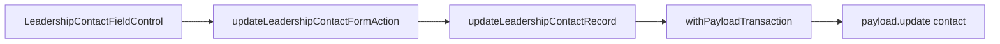

# Impl: Editar nome, e-mail e celular da liderança (lista + detalhe)

Status: aprovado
Atualizado em: 2026-08-03
Issue: #349
Intenção: docs/plans/editar-contato-liderancas-lista-detalhe.md
Appetite restante: herdado (~1 dia eng)

## Leitura da intenção

- **Outcome:** Staff edita nome, e-mail e celular da liderança in-place (lápis → input focado → blur grava) na lista e no bloco Contato do detalhe, preservando link do nome e copy-on-click de e-mail/celular no modo leitura.
- **O que NÃO negociar:** só staff no escopo existente; leader lockdown; sem toggle “Editar” da tabela; sem inputs sempre montados; falha fechada em conflito de telefone (sem merge); Contact como join único.
- **O que reavaliar:** hipótese de JSON route (B32) vs form action (B19 assessores) — form action com discriminador `field` é mais simples para texto debounced/blur e reusa `AdvisorDebouncedTextCell` mechanics sem Popover.

## Abordagem recomendada

**Opções consideradas:**

- A — JSON route + `useCampaignCellAutosave` (espelho B32 support-status)
- B — Form action per-field + componente pencil/blur (espelho assessores, UX B153)
- C — Estender `updateLeadershipWizard` com PATCH parcial

**Recomendação:** B — `updateLeadershipContactFormAction` + `LeadershipContactFieldControl` compartilhado lista/detalhe. Debounce/blur de `AdvisorDebouncedTextCell`; read mode com `CampaignCopyableCell` (e-mail/celular) e `Link` (nome). Um campo em edição por instância do controle.

**Rejeitadas:** A (JSON route é melhor para selects; texto com debounce já tem precedente em form action); C (wizard exige todos os campos); toggle Editar da tabela (anti-goal produto); Popover overlay (anti-goal produto).

### Componentes / mudanças

- **`leadershipContactUpdateSchema`** (`src/lib/schemas/leadership.ts`): discriminated union `field` ∈ name|email|phone; phone nullable (completar seed sem celular).
- **`updateLeadershipContactRecord`** (`actions/leadership.ts`): extrai lógica de lock/unicidade de `updateLeadershipWizardRecord`; atualiza só o campo pedido no Contact.
- **`updateLeadershipContactFormAction`** (`liderancas/formActions.ts`): discriminador `field` como assessores.
- **`LeadershipContactFieldControl`** (`components/campaign/leadership/`): read (link/copy) + pencil `min-h-11` + input inline + pending/erro.
- **`LeadershipContactSection`** (`components/campaign/leadership/`): bloco Contato no detalhe (três controles).
- **Lista** (`liderancas/page.tsx`): substituir células name/email/phone pelos controles.
- **Detalhe** (`liderancas/[id]/page.tsx`): substituir prosa por `LeadershipContactSection`.
- **Migration:** sem migration.
- **Access:** staff via `getFreshStaffActor` + `assertMunicipalitiesWithinScope` (mesmo gate do wizard).
- **UI:** Impeccable B — shape alinhado a `campaignReadCellClassName`; craft com pencil separado do valor; critique mobile hit area.

### Dados → forma

- Forma: célula valor+lápis / bloco Contato com labels — não KPI; affordance de escrita sobre Contact existente.

## Fases verificáveis

1. **Schema+server** — schema, record helper, form action, int tests (update, phone conflict, advisor scope).
2. **UI** — `LeadershipContactFieldControl`, lista, detalhe.
3. **Gates** — `pnpm gate:fast`; push via `pnpm push`.

## Rabbit holes / Não escopo (engenharia)

- Merge de Contact duplicado; busca por e-mail/telefone; edição leader; inputs sempre visíveis.

## Riscos e mitigação

- **Conflito telefone:** locks + `assertContactPhoneAvailable`; mensagens em safeMessages.
- **Refresh durante digitação:** guard `document.activeElement === inputRef` (precedente AdvisorDebouncedTextCell).
- **Revalidação lista:** `router.refresh()` no cliente; `revalidatePath` só no detalhe (chip writes não revalidam lista).

## Débitos deferidos (simplify B153)

- **Hook debounce compartilhado** com `AdvisorDebouncedTextCell` — revisit quando um 3º call site aparecer ou ao tocar assessores de novo.
- **`nullableBrazilianMobileInput` em primitives** — duplicação com advisor schema; extrair no próximo touch de phone schemas.

## Aceite de engenharia

- [x] Aceite de produto da intenção ainda coberto
- [x] Invariantes AGENTS/engineering-standards
- [x] Testes de domínio previstos (int) onde write paths mudam
