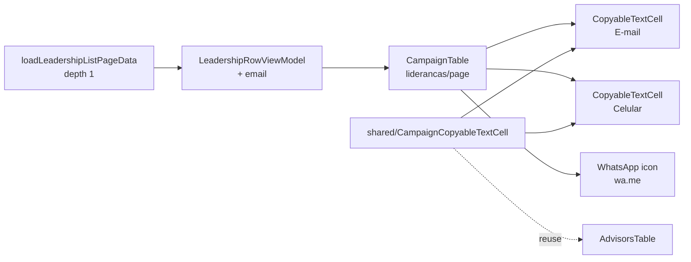

# E-mail e celular na lista de lideranças

Status: entregue
Atualizado em: 2026-07-26
Item do roadmap: [docs/roadmap.md](../roadmap.md) (Trilha B, item **B28**)
Impeccable: B — encaixe em `/campanha/liderancas` (colunas + células no `CampaignTable` existente); sem rota nova
Appetite: ~0,5–0,75 dia eng; expor `email` no view model da lista + 2 colunas + células copiáveis + ícone WhatsApp (padrão B19 ✓); sem migration
Responsável: —

**Nota de revisão (2026-07-26):** entregue como especificado — `CampaignCopyableCell` nasceu compartilhado (`shared/`) já no 2º call site (`AdvisorsTable.tsx` migrado no mesmo PR), `whatsAppHrefForPhone` promovido a `lib/phone.ts`, `LeadershipRowViewModel.email` populado sem query nova, e `loadLeadershipDetail` deduplicado (reusa `row.email` de `toLeadershipRows` em vez de reparsear `doc.contact`). Ordem de colunas final: Nome → E-mail → Celular → Status → Municípios → Organizações → Acesso ao app → Ações (WhatsApp), exatamente como travado abaixo. Gate completo (tsc/lint/format/knip/cycles/test/build) verde; `pnpm exec knip` mantém o erro pré-existente ao carregar `payload.config.ts` (P3, não relacionado); `pnpm test:e2e` reproduziu apenas o flake pré-existente já documentado em `campaignMunicipalities.e2e.spec.ts` (checkbox de consentimento do `LeaderContactsPanel` antes da hidratação) — nenhuma falha nas rotas tocadas por este item.

## Design (Impeccable)

Âncoras: `PRODUCT.md` (princípios 2 clareza sob pressão, 8 Feel the action; anti spreadsheet) / `DESIGN.md` (register `product`; Field Desk) · tema `data-theme='campaign'` · precedente de interação [`AdvisorsTable.tsx`](../../src/components/campaign/advisor/AdvisorsTable.tsx) (B19 ✓) · shells `CampaignTable` / `CampaignPageShell`.

Na implementação (`implement-roadmap-item`): craft compacto → critique → polish. `harden`/`optimize` só sob gatilho do Passo 8.

Brief compacto:

- **Persona / contexto:** CG / Assessor no desk ou no celular, varrendo a rede de lideranças para **ligar, copiar contato ou abrir ZAP** sem abrir a ficha de cada pessoa.
- **Job principal:** ver e usar e-mail/celular da liderança na própria lista, com o mesmo gesto da tabela de assessores (clique copia; WhatsApp na linha).
- **Estratégia de cor:** Restrained — colunas de leitura; sem badge de “tem e-mail”.
- **Edit where you see:** **não neste item** — só leitura + copy + `wa.me`. Correção de contato continua no fluxo de criação / detalhe (e-mail/celular **ainda não** são editáveis na ficha interna; ver Adiado). Anti-goal: modo “Editar” full-row na lista de lideranças (spreadsheet).
- **Anti-goals:** clonar `AdvisorsTable` inteira; toggle “Editar” + debounce na lista; segunda coluna de ações genérica; expor PII além do escopo staff já autorizado.

## Dados → decisão → apresentação

- **Vou apresentar dados?** Sim, superfície neste item — canais de contato já persistidos em `Contact`, hoje só legíveis abrindo `/campanha/liderancas/[id]` (e o `phone` já chega no view model da lista sem UI).
- **Decisões desbloqueadas:**
  - Coordenador / Assessor: “tenho como falar com esta liderança agora (celular / WhatsApp / e-mail) sem sair da varredura?”
  - Coordenador / Assessor: “esta ficha seedada pela planilha (E4R ✓) ainda está sem telefone — preciso completar antes de convidar?”
- **Forma escolhida:** **tabela/lista** — colunas “E-mail” e “Celular” + botão WhatsApp por linha (quando há celular válido). **Rejeitado:** KPI de “% com telefone” (vaidade); chart; coluna só ícone sem número legível; só link “ver ficha”.
- **Profile:** categórico/texto (e-mail, telefone BR 11 dígitos); granularidade = `leadership`×`Contact`; tamanho típico dezenas–centenas no escopo do ator; absoluto (o número em si), não relativo eleitoral.
- **Anti-goals de dado:** sem métrica eleitoral; sem ranking de “lideranças contactáveis”.

Self-check dados: 5/5.

## Contexto

`/campanha/liderancas` ([`page.tsx`](<../../src/app/(campaign)/campanha/(app)/liderancas/page.tsx>)) usa `CampaignTable` com colunas Nome · Status · Municípios · Organizações · Acesso ao app. O loader [`leadershipData.ts`](../../src/utilities/leadershipData.ts) já monta `LeadershipRowViewModel.phone` a partir do `Contact` (`depth: 1`), mas **a lista não renderiza** telefone nem e-mail. E-mail só entra em `LeadershipDetailViewModel` (detalhe).

Em `/campanha/assessores` (**B19 ✓**), a tabela cliente [`AdvisorsTable.tsx`](../../src/components/campaign/advisor/AdvisorsTable.tsx) mostra E-mail · Celular com:

- leitura: clique copia para a área de transferência (toast);
- vazio: “—”;
- celular formatado (`formatBrazilianPhoneInput`);
- ação WhatsApp (`buildWhatsAppUrl` / `MessageCircleIcon`) quando o número normaliza.

Pedido de produto (2026-07-25): **as mesmas colunas e o mesmo funcionamento de leitura/ação** na lista de lideranças.

Diferença estrutural importante: assessores editam `campaignUser` na própria tabela (toggle Editar + `AdvisorDebouncedTextCell`); lideranças guardam contato em `Contact` via join, e `LeadershipInternalForm` **não** atualiza e-mail/celular após o create. Paridade de **edição** in-list exigiria action nova + locks de telefone — fora do appetite deste slice (ver Adiado / Rabbit holes).

## Objetivos

- Em `/campanha/liderancas` (staff): colunas **E-mail** e **Celular** na `CampaignTable`, após Nome (ou imediatamente após — ordem travada abaixo).
- Células no modo leitura do B19: clique copia; “—” se vazio; celular com máscara BR; e-mail truncável.
- Botão/ícone **WhatsApp** por linha quando há celular válido (`wa.me`, `noopener noreferrer`); desabilitado com `aria-label` honesto quando não há.
- `LeadershipRowViewModel` inclui `email: string | null` (hoje só no detalhe); `toLeadershipRows` / `contactNameAndPhone` (ou rename) passam a carregar e-mail.
- Extrair o primitivo de copy (+ helper WhatsApp de linha, se couber) para `shared/` no **mesmo PR** — este é o 2º call site do padrão do B19; `AdvisorsTable` consome o compartilhado (knip zero; sem divergência).
- Guardrails: sem migration, sem collection, sem Consent novo, sem mudança de URL/filtros; access inalterado (`overrideAccess: false` na lista; PII só no escopo staff já permitido por `canReadContacts` / leadership row access); `leader` continua fora da rota.

## Decisões travadas

- **Item de trilha B28 (não fill-in de rename).** Colunas + interação (copy / WhatsApp) + view model + extrair primitivo compartilhado — ~½–¾ dia, paralelizável, cortável. (2026-07-25, classificação roadmap-item.) **Rejeitado:** fill-in só-string (subestima a interação e o 2º call site); absorver em R6 (atrasa quick win de campo); clonar `AdvisorsTable` como lista de lideranças (abandona `CampaignTable` / Pass 2 W1).
- **Paridade = modo leitura + WhatsApp do B19; não o toggle “Editar”.** O job do pedido é contactar na varredura. Edição de `Contact` pós-create não existe nem no detalhe — resolvê-la na lista seria rabbit hole (locks, action, UI de edição em RSC table). **Rejeitado:** debounce in-list neste item; modo spreadsheet; “funcionamento igual” interpretado como CRUD completo da tabela de assessores.
- **Ordem das colunas: Nome → E-mail → Celular → Status → Municípios → Organizações → Acesso (+ ações WhatsApp).** Contato perto do nome (padrão assessores). **Rejeitado:** WhatsApp só como texto do celular sem ícone (piora o gesto de campo); coluna WhatsApp sem número visível.
- **Extrair primitivo compartilhado agora (2º call site).** `CampaignCopyableTextCell` (ou nome equivalente) + helper `whatsAppHrefForPhone` em `shared/` (ou `lib/phone` se já couber o href). **Rejeitado:** copiar-colar o JSX do `AdvisorsTable` (diverge no 3º uso); abstrair `EditableContactRow` genérica (classitis — só precisamos do copy).
- **i18n e naming** (AGENTS.md): identificadores em inglês (`email`, `phone`, `LeadershipContactCells`); strings pt-BR (“E-mail”, “Celular”).

## Questões em aberto

- **WhatsApp: coluna própria de ações ou ícone colado na célula Celular?** **Opções:** A) coluna de ações à direita (espelha assessores) | B) ícone inline na célula Celular. **Recomendação:** **A** — mesmo layout mental do B19; célula Celular fica só número/copy. _(assumido)_
- **Busca da lista (`q`) deve incluir e-mail/telefone?** **Opções:** A) não neste item | B) estender o lookup de Contact. **Recomendação:** **A** — pedido é coluna; busca por nome já resolve o caminho feliz. Gatilho: feedback de uso.
- **Painel de lideranças no detalhe do município — mostrar telefone também?** **Opções:** A) não | B) sim neste item. **Recomendação:** **A** — fora do pedido (`/campanha/liderancas`); se incomodar, fill-in.

## Abordagem proposta

Componentes:

- **`leadershipData.ts`**: estender `contactNameAndPhone` (ou equivalente) para `{ id, name, phone, email }`; `LeadershipRowViewModel.email`; detalhe reusa o mesmo campo (sem duplicar parse).
- **`liderancas/page.tsx`**: novas colunas `email` / `phone` (+ head de ações WhatsApp se coluna dedicada); células = ilhas cliente do primitivo compartilhado (a `CampaignTable` já aceita `ReactNode` por célula).
- **`shared/CampaignCopyableTextCell.tsx`** (nome final no craft): botão com `READ_CELL_CLASS`-equivalente, `navigator.clipboard`, toast sonner; props `value`, `label` (“E-mail”/“Celular”), `emptyDisplay`, `className`.
- **Helper WhatsApp:** reusar `buildWhatsAppUrl` / `normalizeBrazilianPhone` de `src/lib/phone.ts`; botão `Button asChild` + `MessageCircleIcon` como no B19.
- **`AdvisorsTable.tsx`**: passar a consumir o primitivo compartilhado (mesmo PR — evita dois copy-toasts divergindo).
- **Testes:** unit do helper de formatação/empty se extrair lógica; pin opcional de colunas em teste de componentes se já houver precedente para lideranças; int **não** obrigatório (sem access/schema novo) — só se o loader de e-mail precisar de pin de select.
- **Migration:** Sem migration, sem collection, sem server action de escrita.

Depth check: reusa `CampaignTable`, `phone` helpers, padrão visual do B19; extrai só o que o 2º call site justifica; não inventa lista cliente paralela.

## Dependências

- Nenhuma dura de item aberto. Soft: **B19 ✓** (padrão visual/interação); Pass 2 W1 (`CampaignTable`).

## Não escopo

- Toggle “Editar” / auto-save de e-mail·celular na lista — Adiado (abaixo).
- Editar contato na ficha interna / action `updateLeadershipContact` — Adiado.
- Busca por e-mail/telefone; filtros novos; sort por coluna.
- Painel de lideranças no município (`MunicipalityLeadershipsPanel`) / dossiê.
- Programa WhatsApp interno **D3–D5** (bridge) — aqui é só `wa.me` 1:1 como no B19.
- Seletor de colunas (**B17**) — se existir, estas colunas entram como `defaultVisible` quando B17 chegar às lideranças (fora deste item).

## Rabbit holes

- **“Igual ao assessores” = clonar tabela cliente com modo edição.** Explode access/`Contact` locks e abandona o sistema de listas. **Mitigação:** paridade travada em leitura + WhatsApp; edição adiada.
- **Action de update de telefone “só para completar a célula”.** Locks `contact-phone`, merge de duplicatas, Consent — escopo de outro item. **Mitigação:** sem escrita neste PR.
- **Promover head genérico / B22 descriptions nesta lista.** Fora do pedido. **Mitigação:** `CampaignTableHead` simples basta; B22 é soft depois.

## Adiado com gatilho

- **Editar e-mail/celular da liderança (detalhe e/ou lista com debounce).** Revisitar quando: (1) produto pedir correção de contato sem `/admin`, **ou** (2) E4R/name-only seed gerar volume de fichas sem telefone que o time precise completar em massa na lista. Entrega mínima futura: action `updateLeadershipContact` + campos na ficha interna; lista in-place só se o 2º gesto se repetir.
- **Incluir e-mail/telefone na busca `q`.** Revisitar quando: ≥1 feedback de uso pedindo achar liderança pelo número.
- **Achado do `/simplify` (2026-07-26): botão de ação WhatsApp por linha duplicado verbatim entre `liderancas/page.tsx` e `AdvisorsTable.tsx`** (mesma estrutura `Button`/`<a>`/disabled — só o `whatsAppHrefForPhone` foi promovido a `lib/phone.ts`, não o JSX do botão). Só 2 call sites hoje — extrair um `CampaignWhatsAppIconButton` agora seria abstração prematura (padrão do repo: 3+ call sites). Revisitar quando um 3º botão de WhatsApp por linha aparecer (candidato natural: `/campanha/apoiadores`).
- **Achado do `/simplify` (2026-07-26): `copyText` (`CampaignCopyableCell.tsx`) duplica a forma de `copyMessage` em `SupporterShareKit.tsx`** (clipboard write + toast sucesso/erro; formatos de UI diferentes — célula vs. botão com label toggle). Pré-existente, não introduzido por este item. Revisitar quando um 3º site de copy-to-clipboard-com-toast aparecer — aí sim vale um `copyToClipboard(value, { successMessage, errorMessage })` em `src/lib/`.

## Referências

- `docs/roadmap.md` (Trilha B / Janela 1 — B28)
- [`AdvisorsTable.tsx`](../../src/components/campaign/advisor/AdvisorsTable.tsx) — copy + WhatsApp + empty
- [`liderancas/page.tsx`](<../../src/app/(campaign)/campanha/(app)/liderancas/page.tsx>) — colunas atuais
- [`leadershipData.ts`](../../src/utilities/leadershipData.ts) — view model / loader
- [`phone.ts`](../../src/lib/phone.ts) — normalize / format / `buildWhatsAppUrl`
- [`gerenciar-assessores.md`](gerenciar-assessores.md) — B19 (precedente)
- AGENTS.md — Campaign auth, naming, `Contact` join, `overrideAccess: false`
- `PRODUCT.md` / `DESIGN.md` — Field Desk; Feel the action no copy/WhatsApp (feedback imediato no clique)
