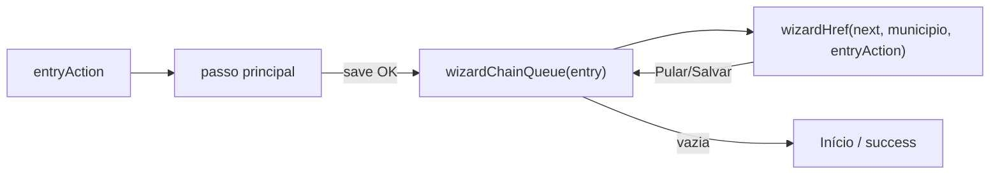

# Encadear ajustes após a ação principal do wizard

Status: em implementação
Atualizado em: 2026-08-01
Issue: #106
Priority: P1
Model: cursor-grok-4.5-medium
Impeccable: C — orquestração multi-fluxo no chassis `/campanha/acoes`
Appetite: ~1–2d eng; matriz de cadeia + navegação pós-sucesso; sem migration
Responsável: —

## Design (Impeccable)

Âncoras: `PRODUCT.md` (Ação → Local → Quem; Continuity) / `DESIGN.md` · `fluxos-acao-primeiro-inicio.md` · B59/B75 chassis · tema `campaign`.

Na implementação: shape → craft → critique → polish.

Brief compacto:

- **Persona / contexto:** CG no polegar; acabou o ajuste principal (ex. votos) e ainda tem contexto do município na cabeça.
- **Job principal:** oferecer **na sequência** os ajustes que costumam vir juntos, sem voltar ao Início e reescolher município; poder **Pular** cada um.
- **Estratégia de cor:** Restrained; reusa tiles/passos já existentes.
- **Edit where you see:** writes reusam actions existentes (não segundo sistema).
- **Anti-goals:** state machine XState global; forçar todos os ajustes; reescolher município entre elos; resumo mega-commit (v1 pode gravar por elo como hoje).

### Wireframe (texto)

```text
Ajustar votos (entry)
  Município → votos (X) → tendência [Pular] → sinal [Pular] → liderança [Pular] → Início

Registrar sinal (entry)
  Município → sinal (X) → tendência [Pular] → votos [Pular] → liderança [Pular] → Início

Mudar tendência (entry)
  Município → tendência (X) → sinal [Pular] → votos [Pular] → liderança [Pular] → Início

Atualizar liderança (entry)
  Município → liderança (X) → sinal [Pular] → votos [Pular] → tendência [Pular] → Início
```

## Dados → decisão → apresentação

Dados: N/A como métrica nova — encadeia writes já existentes (votos, tendência, sinal, liderança). Decisão = “registrar agora o próximo ajuste neste município ou pular”.

## Contexto

O rascunho UX-1 ([fluxos-acao-primeiro-inicio.md](fluxos-acao-primeiro-inicio.md)) pediu continuidade no fim de A1 (“Quer também…?: sinal / tendência / liderança”). Os wizards standalone existem (votos, sinal, tendência, liderança), com `entryAction` query **já** usada para skip (sinal/liderança) e prefill de nota de tendência — mas **ninguém navega** de um fluxo ao próximo após o save.

`WizardExpectedVotesStep` tinha fase `saved` com placeholder — B98 substitui por redirect imediato ao próximo elo.

Pedido (2026-08-01): ao iniciar uma ação → município → **ajuste principal** → **encadear** outros ajustes que façam sentido (ex. votos → tendência).

## Objetivos

- Matriz v1 (travada abaixo) de `entryAction` → fila ordenada de subfluxos após sucesso da principal.
- Após Salvar da principal: ir ao **primeiro** elo da fila **no mesmo município** (URL do wizard alvo + `entryAction` + `municipio=`), não ao Início.
- Cada elo encadeado: chrome **Pular** (B96) → próximo elo ou fim; Salvar → próximo / fim.
- Fim: Início (ou tela curta de sucesso reusando copy de votos) **sem** re-pedir município.
- Guardrails: mesmas actions/access; sem migration; leader fora (layout `acoes` já gateia staff).

## Decisões travadas

- **Cadeia = navegação entre rotas/passos existentes + `entryAction`, não um mega-form único.** Reusa B61/B63/B64/B70. **Rejeitado:** um só POST transacional de tudo (caro; quebra skip parcial); checkboxes “Quer também?” sem subfluxo (raso demais vs tiles já feitos).
- **Matriz v1 (confirmada com produto 2026-08-01):** cada entry encadeia os **outros três** fluxos na ordem abaixo (a principal não se repete na fila).

  | Entry (botão Início) | Principal | Encadeadas (ordem)            |
  | -------------------- | --------- | ----------------------------- |
  | `update-votes`       | votos     | tendência → sinal → liderança |
  | `register-signal`    | sinal     | tendência → votos → liderança |
  | `change-trend`       | tendência | sinal → votos → liderança     |
  | `update-leadership`  | liderança | sinal → votos → tendência     |

  **Rejeitado:** incluir nível de envolvimento (E14) / assessor na v1 (A7/A8 do UX-1); cadeia só parcial (ex. liderança sem elos) — produto pediu os quatro caminhos completos.

- **Pular / Salvar avançam a fila; X só na principal (B96).** Encadeada nunca usa X como “pular um elo” — X abortaria o ritual inteiro só se quisermos dismiss global; **recomendação:** nas encadeadas dismiss/skip = próximo ou fim (Pular), sem X que descarte a principal já salva sem aviso. **Rejeitado:** X nas encadeadas = Início (ok como dismiss explícito se B75 mantiver — produto pediu Pular no lugar do X).
- **Gravação por elo (já existente), não commit único no fim.** **Rejeitado:** rascunho multi-collection até o CTA final (appetite + U4).
- **i18n:** `wizardChain`, `entryAction`, `nextChainHref`; copy pt-BR nos títulos de fluxo já do catálogo.

## Questões em aberto

- _(nenhuma — Option A da tela intermediária de votos fechada no craft 2026-08-01)_

## Abordagem proposta



Componentes:

- **`src/lib/wizardActionChain.ts`** (puro): `wizardChainAfter(entry): CampaignWizardActionId[]`; `nextWizardChainStep(...)`; unit-pinned.
- **Pontos de sucesso:** `WizardExpectedVotesStep` (fase saved → replace por redirect ao próximo); `WizardTrendNoteStep` / signal body / leadership continue — após save, consultar fila restantes.
- **URLs:** reusar `wizardTrendHref` / `wizardSignalHref` / `wizardActionHref` com `entryAction` = dono da sessão de cadeia (o botão original).
- **B97** deve estar verde antes de encadear a partir de tendência (senão o save da tendência loopa e nunca avança).
- **Migration:** Sem migration.

## Dependências

- Duras: **B96** (Pular nas encadeadas) ✓ done/in-prod (#104), **B97** (Salvar tendência não loopa) ✓ done/in-prod (#105). Soft: B61/B63/B64/B70 ✓.
- Soft: OPS11 só para ver em prod.

## Não escopo

- Resumo multi-campo + CTA único “Registrar atualização” (UX-1 passo 8) — adiado.
- E14 / troca de assessor na cadeia.
- Demanda (A5) na matriz v1.
- Persistência de rascunho mid-Zap (B59 adiado).

## Rabbit holes

- **XState / orquestrador multi-route genérico.** **Mitigação:** array puro + hrefs.
- **Transação única multi-collection.** **Mitigação:** grava por elo.
- **Reordenar a strip do Início “porque a cadeia mudou o ritual”.** **Mitigação:** fora (B99 à parte).

## Adiado com gatilho

- **Tela de resumo antes do fim.** Revisitar se CG reportar “não sei o que gravei”.
- **Cadeia a partir de sugestão E11.** Quando E11 deep-linkar wizards com município pré-escolhido.

## Freshness audit (2026-08-01)

- Arquivos do plano existem; `entryAction` / skip resolvers / href builders batem com o código.
- B96 (#104) e B97 (#105) `done`+`in-prod`.
- Skip ainda apontava para Início — B98 redefine para o próximo elo.
- Votos não recebia `entryAction` — wiring adicionado na page do wizard.
- **Tela intermediária de votos:** Option A (redirect direto) confirmada no craft.

## Referências

- [fluxos-acao-primeiro-inicio.md](fluxos-acao-primeiro-inicio.md)
- `src/components/campaign/shared/WizardExpectedVotesStep.tsx`
- `src/lib/campaignActionRoutes.ts` · `campaignWizardCopy.ts` · `wizardActionChain.ts`
- [wizard-header-x-vs-pular.md](wizard-header-x-vs-pular.md) (B96) · [bug-salvar-tendencia-fecha-wizard.md](bug-salvar-tendencia-fecha-wizard.md) (B97)
- `PRODUCT.md` / `DESIGN.md`

Qualidade de decisão: 5/5 (matriz v1 confirmada no gate 2026-08-01)
