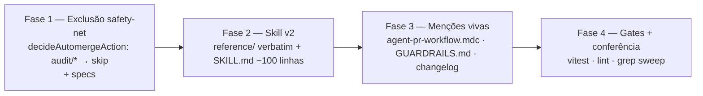

# Impl: OPS98 — Skill engineering-audit v2: autônoma, sub-agentes e ponte para o fluxo de Issues

Status: aprovado
Atualizado em: 2026-08-25
Issue: #903
Intenção: docs/plans/engineering-audit-v2.md
Appetite restante: herdado (~0,5–1 dia eng; um outcome verificável)

## Leitura da intenção

- **Outcome:** `/engineering-audit` roda autônomo de ponta a ponta numa noite: avalia → propõe → sub-agentes escrevem `-impl` das melhorias → sub-agentes implementam em série numa única branch → **UM PR Ready (base `main`, SEM auto-merge)** cuja descrição é o relatório completo; loop de correção até CI green + mergeable; o humano só explora e mescla. O método de auditoria (smells, triagem P0–P3, passo 4b, canon obrigatório) fica intacto — só muda a embalagem e a entrega.
- **O que NÃO negociar:** método de auditoria inalterado; docs históricos intocáveis (`entrega-engenharia-p4/p5.md`, histórico de `IMPROVE-CODE-QUALITY-PLAN.md`); harvest de misses → `GUARDRAILS.md`; carga do canon ANTES de julgar continua obrigatória; exclusão do safety-net restrita e testada; dormentes do agent-pool intocados; changelog imutável (entrada nova via `docs/changelog/`).
- **O que reavaliar:** a hipótese "prefixo de branch é mecanismo suficiente" foi confirmada na exploração (`normalizePullRequest` descarta labels enquanto `head.ref` já chega pronto — scripts/lib/github-api.mjs:170-181; o workflow não tem evento `labeled` — .github/workflows/agent-pr-ready-automerge.yml:23). O ponto de inserção exato no veredicto e a ordem dos checks são decisão deste plano.

## Abordagem recomendada

**Opções consideradas (exclusão do safety-net):** A | B | C
**Recomendação:** A — prefixo de branch `audit/*` avaliado dentro da função pura `decideAutomergeAction` (scripts/lib/github-pr-flow.mjs:42-51), espelhando o par existente `CURSOR_HEAD_PREFIX`/`isCursorHead` (:12-15). Porque: `head.ref` já chega normalizado pelo API client (github-api.mjs:179), a função já é 100% coberta por pins unitários (tests/unit/githubPrFlow.unit.spec.ts), o CLI já trata `skip` como sucesso com exit 0 (scripts/github-pr-automerge.mjs:68-71), e a mudança é aditiva — nenhum PR não-`audit/*` muda de veredicto.
**Rejeitadas:**

- B — label dedicada (ex. `no-automerge`): dupla objeção fatal — `normalizePullRequest` descarta labels (github-api.mjs:170-181), exigindo mudança de normalização; e o workflow dispara só em `[opened, reopened, synchronize, ready_for_review, converted_to_draft]` (agent-pr-ready-automerge.yml:23), então aplicar a label depois do `opened` **não reavalia** o PR — a exclusão chegaria tarde demais ou nunca. Superfície maior para o mesmo efeito.
- C — mecanismo dedicado fora do veredicto (workflow separado / env no job): fragmenta a política de merge em dois lugares, perde os pins unitários existentes como rede, e um `if:` extra no YAML é invisível aos testes — exatamente a classe "guarda dodgeable não verificável" que o próprio audit caça.

**Opções consideradas (ponto de inserção do veto):** logo após o check de PR nulo | após o check de draft | após o check de base.
**Recomendação:** logo após `if (!pr)` — veto dominante: qualquer PR `audit/*` (ready **ou** draft) retorna `{ action: 'skip', reason: 'audit-veto' }`. Modelo mental único ("branches `audit/*` nunca são tocadas"), sem interação com a lógica de draft.
**Rejeitadas:** após o check de draft — um draft `audit/*` cairia em `draft-veto` antes do veto de audit, produzindo razão enganosa nos logs; após o check de base — mesma ambiguidade para PRs de base errada, sem ganho algum.

### Teto de implementações por Pass (decisão exigida pela intenção)

**Critério de elegibilidade (conjuntivo):**

1. Severidade **P0 ou P1** da triagem deste Pass. P2/P3 → somente ledger (`open — Pass N`), como hoje. (Severidade já codifica dano; a intenção sugere exatamente este corte.)
2. Esforço estimado **S ou M** na linha do ledger. L → ledger + Issue de pendência (padrão `plan-issue`) — nada de entrega grande sem humano na noite.
3. **Fora da noite por construção** (independe de severidade): qualquer item que toque migração de schema (migração = entrega própria pelas regras do repo), contrato de URL público, ou behavior delta na lista "not allowed" do protocolo do passo 3 (Consent/LGPD fail-closed, shapes públicos). São as zonas onde o repo já exige aprovação deliberada — autônomo não decide isso sozinho.

**Teto numérico duro: máx. 6 implementações por Pass**, ordenadas P0 primeiro, depois P1, dentro de cada severidade por blast radius crescente. Guardrails colhidos de misses contam para o teto (regra do passo 4b: guarda embarca na mesma entrega do fix).

**Overflow e parada:** candidato elegível além do 6º fica no ledger marcado `deferred: teto do Pass` e vai para o relatório. Se o mesmo delivery acumular **3 ciclos consecutivos de correção** sobre a mesma falha de CI: estacionar o delivery (reverter seus commits se necessário para voltar ao verde), registrar como bloqueador no relatório e seguir para o próximo — nunca iterar indefinidamente; se o PR seguir inviável após esforço limitado, parar gracefully e documentar (contrato da intenção).

**Por quê 6:** appetite de uma noite (~8h) com execução serial e gate completo por delivery; cada S/M cabe em 1–2 ciclos de correção; acima disso o PR único deixa de ser explorável e o índice commit→achado vira ruído — o rabbit hole nomeado na intenção ("branch única vira geradora infinita de trabalho"). Número baixo o bastante para revisão humana matinal real, alto o bastante para uma noite produtiva; se menos itens qualificarem, o teto não infla escopo.

### Componentes / mudanças

- **`scripts/lib/github-pr-flow.mjs`**: exportar `AUDIT_HEAD_PREFIX = 'audit/'` + `isAuditHead(ref)` (espelho exato de `CURSOR_HEAD_PREFIX`/`isCursorHead`); inserir em `decideAutomergeAction`, logo após o check de PR nulo: `if (isAuditHead(pr.head?.ref)) return { action: 'skip', reason: 'audit-veto' }`. Atualizar o comentário de cabeçalho (superfície de decisão ganha o caso audit). Zero mudança nos caminhos existentes.
- **`tests/unit/githubPrFlow.unit.spec.ts`**: novas linhas de pin (ver Plano de testes abaixo). Padrão idêntico às linhas OPS57 (`cursor/*`).
- **`scripts/github-pr-automerge.mjs` + `.github/workflows/agent-pr-ready-automerge.yml`**: **somente comentários de cabeçalho** — documentar o veto `audit/*` junto à política de draft. Comportamento do CLI/workflow inalterado (skip já sai 0).
- **`.agents/skills/engineering-audit/reference/`** (novo diretório) — conteúdo movido **VERBATIM** do SKILL.md atual (nenhuma retocada de método no caminho):

| Arquivo novo                 | Origem verbatim no SKILL.md atual | Conteúdo                                                                                                                      |
| ---------------------------- | --------------------------------- | ----------------------------------------------------------------------------------------------------------------------------- |
| `reference/canon.md`         | Passo 0a, L45–59                  | Ordem de leitura do canon (11 itens), precedents de consolidação (L58) e lista rejected-with-reason (L59)                     |
| `reference/smells.md`        | Passo 2, L80–110                  | Famílias de Fowler com leitura Teqo, smells Teqo-specific, disciplina legacy-code, "existing guards are findings too"         |
| `reference/consolidation.md` | Passo 3, L112–133                 | Anti-DRY trap, classes de equivalência, terrenos férteis, táticas de generalização, abstraction gate, behavior-delta protocol |
| `reference/guards.md`        | Passo 4b, L146–162                | Escada de classes 1–6 + regras (guarda na mesma entrega, hardening, judgment-only declarado)                                  |

Cada arquivo recebe **apenas** um cabeçalho de 1–2 linhas apontando de volta ao SKILL.md (contexto de uso); o corpo é cópia byte-a-byte. A obrigatoriedade da leitura do canon antes de julgar permanece no SKILL.md — muda só o local.

- **`.agents/skills/engineering-audit/SKILL.md`** — reescrita para ~90–110 linhas (hoje 182):
  - Cabeçalho: contrato autônomo-first (modo primário = noite sem supervisão; interativo = fallback documentado) + nota histórica curta do modo solitário/precheck morto desde OPS65 (sem precheck, sem remediação in-session como conceito).
  - **Contrato de entrega** (novo): branch `audit/pass-<N>`; UM PR Ready, base `main`, **sem auto-merge** (mecanismo: veto `audit/*` em `decideAutomergeAction` — Fase 1 é pré-requisito); descrição = relatório completo (o que+porquê, achados com números, índice dos artefatos, decisões autônomas + justificativas, bloqueadores, **índice commit→achado**); estado terminal = required check verde + mergeable (rebase em `main` se conflito; parada graceful documentada); commits separados por entrega (soft). Corpo do relatório carrega `Closes #N` repetido-por-número para misses resolvidas por guardrail na entrega (preserva o flip determinístico `issue-done-on-main-merge` sem criar Issues por entrega); todo o resto usa keyword nenhuma.
  - **Teto de implementações** (critério decidido acima, codificado na skill).
  - **Decomposição em sub-agentes** (padrão `plan-issue/SKILL.md:32-51` / `work-issue/SKILL.md:17-61` — campos bold **Quando:/Input:/Task:/Output:**, Task com verbo + proibição, Output com limite duro):
    - _Varredor de área_ (paralelo, 1 por área do passo 2) — Input: escopo da área + caminho de `reference/smells.md` + formato de linha do passo 4. Task: varrer e retornar achados. **Não corrigir nada.** Output: ≤20 linhas de ledger-row.
    - _Caçador de consolidação_ — Input: hotspot map + `reference/consolidation.md` + precedents de `reference/canon.md`. Task: classificar candidatos (merge agora / register-with-trigger / look-alike). **Não propor abstrações fora das táticas listadas.** Output: ≤15 candidatos com knowledge nomeado.
    - _Escritor de -impl_ (paralelo, 1 por melhoria elegível) — Input: linha(s) do ledger aprovada(s) + `work-issue/implementation-template.md` + `decision-quality.md`. Task: escrever o conteúdo de `docs/plans/<slug>-impl.md`. **Não criar arquivos nem registrar Issues.** Output: conteúdo markdown, self-score ≥4.
    - _Implementador serial_ (um por vez, sempre o mesmo padrão `agent-work-issue`: §Prep Cloud sem Docker, gates sem DB) — Input: UM `-impl` aprovado + branch `audit/pass-<N>` compartilhada. Task: executar o plano, commit(s) separado(s) por entrega, gate completo bare. **Proibido: mergear, abrir PR, criar branch nova, tocar migração.** Output: hash(es) de commit + resultado do gate (≤10 linhas).
  - Checklist reescrita: 0a canon (obrigatório, ler `reference/canon.md`), 0b harvest misses, 1 hotspot + âncora de delta (instrução mantém apontar para a **seção mais recente** de `docs/IMPROVE-CODE-QUALITY-PLAN.md` — hoje Pass 5, 2026-08-03, docs/IMPROVE-CODE-QUALITY-PLAN.md:215), 2 sweep via sub-agentes, 3 consolidação via sub-agente, 4 triagem, 4b guarda determinística (ler `reference/guards.md`; ledger em `GUARDRAILS.md`), 5 artefatos escritos direto na branch (fallback interativo apresenta antes), 6 melhorias planejadas por escritores `-impl`, 7 implementação serial com teto, 8 PR único + relatório + loop até verde.
  - Ground rules preservadas (leitura-only na varredura adaptada aos writes permitidos da noite; gates bare; `knip --fix`; DB; números) e seção "Done when" atualizada ao novo estado terminal.
  - Método re-explicado inline aponta a skill-fonte canônica (padrão metaskill `improve-code-quality/SKILL.md:82` "**Invoke:** `<slug>`"); layout segue o precedente `code-simplification` (SKILL.md enxuto + `reference/language-guide.md` → aqui 4 arquivos).
- **`.agents/rules/agent-pr-workflow.mdc`**: :34 — exceção explícita ("exceto branches `audit/*` do engineering-audit: Ready **sem** auto-merge, merge humano"); :88-90 — substituir "Não há opt-out por skill (audit incluído)" pela exceção restrita ao prefixo `audit/`, com apontamento para `scripts/lib/github-pr-flow.mjs` + spec de pins. Nenhum outro trecho do contrato (Ready, base main, `pnpm push`) muda.
- **`docs/GUARDRAILS.md:5`**: referência à "skill engineering-audit passo 4b" passa a apontar `reference/guards.md` (o conteúdo moveu; a escada não mudou).
- **`.agents/skills/capture-review-debts/SKILL.md:114`**: conferência apenas — o harvest continua existindo; alteração esperada: **nenhuma**.
- **Migration:** sem migration. **Access / Consent:** N/A (nada de produto). **UI:** N/A.

## Fases verificáveis

1. **Fase 1 — Tracer: exclusão do safety-net** (pré-requisito do "Ready sem auto-merge"): constante + helper + inserção no veredicto + novas linhas de spec + comentários no CLI/workflow. Verificação: `pnpm vitest run tests/unit/githubPrFlow.unit.spec.ts` verde com os pins novos **e** todos os pins antigos intactos; lint/format nos arquivos tocados. É a quota tracer do appetite — pequena, end-to-end, verificável sozinha.
2. **Fase 2 — Skill v2**: (a) criar `reference/` com os 4 arquivos movidos verbatim; verificar cópia byte-a-byte com `git diff --no-index` entre o trecho original e o corpo do arquivo novo; (b) reescrever SKILL.md (~90–110 linhas, medir com `wc -l`) com contrato de entrega, teto, sub-agentes e checklist novos; (c) conferir que nenhuma linha de método foi editada no caminho (verbatim-first — ajuste de método é Issue separada).
3. **Fase 3 — Menções vivas + registro**: editar `agent-pr-workflow.mdc` (:34, :88-90), `GUARDRAILS.md:5`, conferir `capture-review-debts/SKILL.md:114`; entrada única em `docs/changelog/2026-08-25-ops98.md` (convenção do repo — nunca editar agregados/HISTORY).
4. **Fase 4 — Gates**: `pnpm exec tsc --noEmit`, `pnpm lint`, `pnpm format:check`, `pnpm exec knip`, `pnpm check:cycles`, `pnpm test` (unit cobre o veredicto; int/e2e desnecessários — nenhuma superfície de app), `pnpm build` dispensável nesta superfície mas barato via `gate:push`. Push via `pnpm push -u origin HEAD` (esta entrega OPS98 segue o fluxo normal — branch de agente comum, auto-merge armado normalmente).

## Plano de testes

- **Unit — `tests/unit/githubPrFlow.unit.spec.ts`**, novas linhas (mesmo estilo `pr({overrides})` existente):
  - ready `audit/pass-6` → `{ action: 'skip', reason: 'audit-veto' }` (o caso que viabiliza o PR único);
  - draft `audit/pass-6` → também `audit-veto` (precedência sobre `draft-veto`/`mark-ready`);
  - `isAuditHead`: true para `audit/pass-6`; false para `OPS71-x`, `cursor/x`, `''`, `undefined`, e negativo importante: `auditoria/x` **não** casa (o veto é o prefixo exato `audit/`);
  - regressão estrutural: matriz existente "no poll path" estendida com o caso audit (todos os caminhos terminam em skip/mark-ready/enable, nada de poll).
  - Pins antigos intocados provam que nenhum PR não-`audit/*` mudou de veredicto.
- **Doc-only (skill/reference/regras):** sem teste automatizado aplicável — verificação por guards e inspeção: `wc -l` do SKILL.md dentro de 90–110; `git diff --no-index` prova o verbatim dos 4 arquivos; grep de conferência (abaixo).

## Rabbit holes / Não escopo (engenharia)

- **Mover texto vira redesenhar método.** Corte: movimentação verbatim primeiro e verificada por diff; qualquer retoque em smells/severidades/táticas/classe de guarda é Issue separada. Os 4 arquivos de `reference/` recebem só cabeçalho de navegação.
- **Exclusão ampla vira furo permanente.** Corte: prefixo exato `audit/`, função pura, pins de razão e negativos na spec; nenhum segundo mecanismo (label/env) paralelo.
- **Enxugar = perder o canon crítico** (repropor ports-and-adapters NO-GO etc.). Corte: leitura de `reference/canon.md` permanece passo 0a obrigatório antes de qualquer julgamento — só o local mudou.
- **PR gigante inexplorável** (risco do futuro Pass, não desta entrega, mas o plano codifica os freios): teto de 6, execução serial, commits por entrega, índice commit→achado, humano com o poder final de não mesclar.
- **Confundir a branch desta entrega com a branch dos futuros audits.** Esta OPS98 mergeia por fluxo normal (auto-merge armado). Renomeá-la para `audit/*` desarmaria o safety-net desta própria entrega — não fazer.
- **Não escopo restado (da intenção):** mudar o método de auditoria; reescrever/apagar docs históricos; limpeza dos dormentes do agent-pool (`scripts/agent-pool.mjs`, `.agents/skills/agent-pool/SKILL.md`); produto/site/campanha; executar remediações específicas neste item — esta entrega constrói a máquina; o primeiro Pass v2 produzirá seu próprio PR `audit/*` depois.

## Riscos e mitigação

- **Veto mal calibrado desarma auto-merge de PR legítimo** (ex.: outra convenção de branch futura começando com `audit/`). Mitigação: prefixo específico documentado em `agent-pr-workflow.mdc` como reservado ao engineering-audit; pins negativos (`auditoria/x`) na spec; falha do tipo é visível (log `skip (audit-veto)` no run do workflow) e reversível em 1 linha.
- **Reescrita da skill arrasta método junto.** Mitigação: ordem das fases (verbatim antes do rewrite), diff byte-a-byte, proibição registrada na fase 2.
- **Loop de correção infinito na noite.** Mitigação: regra dos 3 ciclos + revert-to-green + parada graceful documentada (codificada na skill, fase 2).
- **Knip reclama de exports novos.** Mitigação improvável de ser necessária: `CURSOR_HEAD_PREFIX` já é importado pela spec — mesmo consumo para os exports novos.
- **Menção órfã quebrando doc-guard.** Mitigação: grep sweep final `engineering-audit` em `.agents/`, `docs/GUARDRAILS.md`, `docs/AGENT-OPS.md` — toda menção restante deve apontar para o novo layout ou continuar válida (harvest).

## Aceite de engenharia

- [ ] Aceite de produto da intenção ainda coberto (autônomo-first, PR único sem auto-merge com relatório, sub-agentes com output limitado, canon sob demanda obrigatório, modo solitário reduzido a nota histórica, menções vivas atualizadas, guardrails preservados)
- [ ] Invariantes AGENTS/engineering-standards (identifiers em inglês; changelog via `docs/changelog/`; docs históricos e dormentes intocados; gates bare)
- [ ] Testes de domínio previstos: pins unitários do veredicto (`decideAutomergeAction` audit/\*) incluídos na entrega — access/write paths de app não mudam (sem int/e2e novos)
- [ ] Self-score decision-quality registrado abaixo (≥4)

---

**Self-score (decision-quality, 0–5):**

1. Decisões caras têm rejeitadas? — **5** (mecanismo de exclusão, ponto de inserção, granularidade de `reference/`, teto do Pass — todas com alternativa rejeitada e motivo)
2. Abordagem cabe no appetite? — **4** (fase 1 tracer minúscula; fases 2–3 mecânicas e delimitadas; risco de estouro concentrado no rewrite da skill, mitigado pelo verbatim-first)
3. Rabbit holes nomeados? — **5** (cinco cortes explícitos, incluindo a confusão de branch desta entrega)
4. Depth check: reusa o que existe? — **5** (estende a função pura já pinada em vez de política nova; espelha o par `cursor/`; copia os contratos de sub-agente de plan-issue/work-issue; layout `reference/` de code-simplification; zero módulo novo de runtime além do veredicto existente)
5. Intenção permanece satisfeita — engenharia não reescreveu o outcome? — **5** (todas as decisões travadas da intenção carregadas como-is; método intacto; único espaço aberto deixado pela intenção — o teto — decidido aqui com justificativa)
