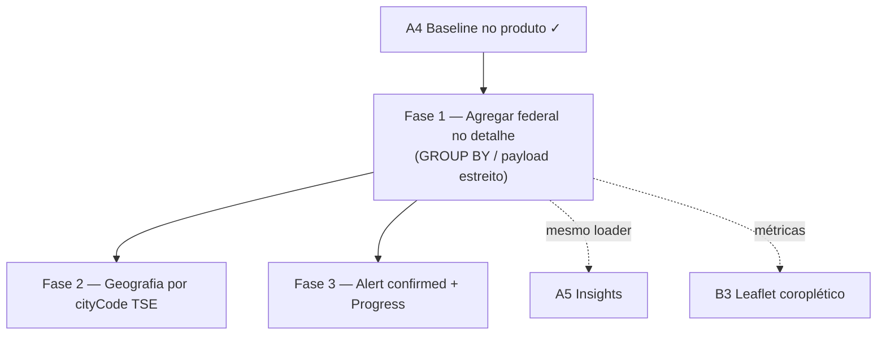

# Escala e DRY pós-A4 (baseline TSE no produto)

Status: registrado no roadmap (fases pendentes)
Atualizado em: 2026-07-19
Item do roadmap: [docs/roadmap.md](../roadmap.md) (Trilha A, item A7)
Responsável: —

## Contexto

O A4 ([baseline-eleitoral-tse.md](baseline-eleitoral-tse.md) Fases 2–4) entregou o baseline TSE 2022 no detalhe do núcleo e no overview da lista: `getNucleusElectoralBaseline` / `loadNucleusBaseline2022Overview`, `computeGapVs2022`, UI `NucleusElectoralBaseline` + `NucleusInsights`, card "Baseline 2022". Três passagens `/simplify` (2026-07-18) já limparam o que cabia em cleanup: papéis genéricos (`BASELINE_TICKET_2022`), `geographyWhere` por cidade com `zoneNumber in […]`, overview só consulta núcleos com estimativa confirmada, helpers compartilhados (`toNucleusElectionGeographyInput`, `formatElectionNumber`, `NO_ELECTION_BASELINE_MESSAGE`).

Os revisores (performance / reuse / quality) marcaram como **importantes e maiores que simplify** os follow-ups abaixo. Sem registro, o A5 (insights) e o coroplético do B3 herdariam o mesmo custo de I/O no path do detalhe.

1. **Detalhe puxa todas as linhas nominais de dep. federal (1º turno) na geografia.** `detailVoteWhere` + `loadElectionVotes` em `src/utilities/nucleusElectoralBaseline.ts` buscam o ranking local inteiro para `winnerFederal` e `candidate.rank`. Em núcleo multi-município / TI inteiro isso pode ser milhares de rows por abertura da aba Visão geral (`pagination: false`).
2. **Filtro geográfico por `cityName` (texto), não por `cityCode` TSE.** O índice natural das collections de eleição é `(year, office, turn, cityCode, zoneNumber)`; filtrar por nome impede o plano ótimo e complica OR grandes na união do overview (já mitigado no simplify, mas o detalhe/TI ainda sofre).
3. **DRY de UI do Gap "acima".** `NucleusInsights` usa `Alert variant="pending"` para abaixo/neutro, mas o estado "acima" aplica classes ad-hoc com tokens `--estimate-confirmed*`. O `Alert` já tem o precedente `pending` espelhando o Badge; falta a variante simétrica. A barra do candidato no card também reimplementa `role="progressbar"` em vez de reusar `Progress` (`NucleusListOverview`).

**Explicitamente fora (revisores pediram skip no simplify):** map JSX de linhas Lula/Jerônimo, dropar `candidate.rank` / `electorate.aptos` / `ratio` do tipo público só por higiene (só fariam sentido se a F1 deixar de calcular rank), e o cast `as unknown as RawOverviewNucleus` da B1 (não é débito novo do A4).

## Objetivos

- Abrir a aba Visão geral de um núcleo com TI/multi-município permanece barato: o loader de baseline não transferir o conjunto completo de candidatos federais da geografia.
- Filtros de geografia eleitoral preferem `cityCode` TSE quando o mapa nome→código existir, sem mudar a UX (continua resolvendo a partir de `cities` / `regions` do núcleo).
- Gap "acima" usa a mesma família de variantes do Alert que o âmbar (`pending`); a barra do candidato reusa `Progress`.
- Guardrails: preferir **sem migration** nas Fases 1 e 3; Fase 2 pode ser só tabela estática (como `bahiaMunicipalityCodes` / seed TSE) — se precisar de índice novo no Postgres, migration dedicada e cortável. Sem Consent (dado público TSE). Access continua `overrideAccess: false` + `canReadElectionData`.

## Decisões travadas

- **Um item A7, três fases ordenadas.** Mesmo racional do B5/C7/C8: um ID de roadmap, PRs por fase. Ordem: agregação do detalhe (custo real) → `cityCode` (escala BA-wide) → DRY de Alert/Progress (barato, UI).
- **Dependência dura de A4.** Só faz sentido com o loader/UI já no produto; não reabre o escopo do Gap vs 2022 nem do card Baseline.
- **Fase 1 não remove o "mais votado aqui" da UI.** O produto do A4 inclui `winnerFederal`; a otimização agrega no SQL/drizzle (ou limita o payload), não corta a feature. Se produto decidir que rank/winner saem do card, a F1 encolhe para "só o candidato da chapa + tallies".
- **Cortável se a geografia real dos núcleos permanecer pequena** (1–2 municípios tipados). Vira não-cortável de qualidade quando A5/B3 passarem a martelar o mesmo helper em TI inteiro.
- **Não registrar no A7 o cast `as unknown` do overview B1** — débito de tipagem do select Payload da lista; só tocar se um PR de A7 já estiver no arquivo.
- **i18n e naming** (AGENTS.md): identificadores em inglês (`aggregateFederalTotalsByGeography`, `tseCityCodeForMunicipality`, `alertVariants.confirmed`), strings visíveis em pt-BR inalteradas.

## Questões em aberto

- **Fase 1: Local API `find` + agregação em memória vs `payload.db.drizzle` `GROUP BY`?** **Recomendação:** drizzle (como o seed TSE) para `SUM(votes) GROUP BY candidate_number` no escopo federal T1 + geografia, mais uma query estreita para presidente/governador da chapa; manter `overrideAccess`/ACL lendo via Local API só se o drizzle for privilegiado — espelhar o padrão do import (`overrideAccess: true` só em CLI). No app, preferir Local API com `select` mínimo **ou** uma query drizzle encapsulada que ainda respeite `canReadElectionData` (checagem explícita antes). Definir no PR da F1 com um teste int de TI grande (fixture expandida ou assert de limite de rows).
- **Fase 2: de onde vem o mapa nome canônico → `CD_MUNICIPIO` TSE?** **Recomendação:** extrair do próprio seed/`electionTally`/`electionCandidateVote` (já têm `cityCode`+`cityName`) para uma tabela estática gerada (`src/lib/bahiaTseCityCodes.ts`) no mesmo espírito de `bahiaMunicipalityCodes` (IBGE) — **não** confundir com código IBGE. Script re-executável opcional; sem migration se for só arquivo versionado.
- **Fase 3: nome da variante Alert — `confirmed` ou `estimate-confirmed`?** **Recomendação:** `confirmed`, alinhado aos tokens CSS `--estimate-confirmed` / classe utilitária já usada pelo Badge `estimate-confirmed`, sem inventar terceira nomenclatura.

## Abordagem proposta

### Fase 1 — Agregação do ranking federal no detalhe

- Em `src/utilities/nucleusElectoralBaseline.ts`: deixar de materializar todas as rows nominais federais da geografia só para `aggregateFederalCandidateTotals`.
- Caminho preferido: query agregada (drizzle) → lista `{ candidateNumber, name, party, votes }` já somada; candidato da chapa + winner/rank derivados dessa lista curta (N candidatos distintos, não N×zonas).
- Manter query estreita para presidente/governador da `BASELINE_TICKET_2022` (já filtrada por número).
- Tallies: inalterado (já é 1 row por city×zone federal T1).
- Testes: unit da agregação pura; int com geografia multi-zona assertando winner/rank/solla votes **e** teto de rows transferidas (ou mock do finder).
- Critério: abrir overview de núcleo com ≥2 municípios / TI não escala linearmente com (#candidatos × #zonas) no wire.

### Fase 2 — Filtro por `cityCode` TSE

- Gerar/commitar mapa canônico `cityName` → `cityCode` (BA 2022) a partir dos dados já importados.
- `resolveNucleusElectionGeography` (ou camada ao lado) passa a expor `cityZonePairs` com código; `geographyWhere` usa `cityCode: { equals|in }` + `zoneNumber: { in }`.
- Overview union e detalhe compartilham o mesmo helper.
- Sem mudança de UX; fallback fail-closed se o município do núcleo não mapear (mesmo espírito de `canonicalizeMunicipalityName`).

### Fase 3 — Alert `confirmed` + `Progress` no card

- `src/components/ui/Alert.tsx`: adicionar variant `confirmed` espelhando `pending` com tokens `--estimate-confirmed` / foreground.
- `NucleusInsights`: trocar o `cn(...)` ad-hoc por `variant={gap.status === 'above' ? 'confirmed' : 'pending'}` (ou `default` só se neutro — manter pending para noBaseline/noEstimate).
- `NucleusElectoralBaseline`: substituir a barra custom por `Progress` (já usado no overview), preservando `aria-label`.

**Migration:** nenhuma nas Fases 1 e 3. Fase 2 preferencialmente só artefato estático versionado; índice Postgres extra só se o EXPLAIN ainda doer após `cityCode` (aí `pnpm migrate:create` cortável).

## Dependências

- **Dura:** A4 Baseline no produto + Gap vs 2022 — implementado (loader + UI).
- **Suave:** A5 Insights e B3 coroplético — consomem/amplificam o mesmo helper; se A5 chegar antes da F1, herda o custo.
- Reusa: `BASELINE_TICKET_2022`, `ba2022Scope` / `geographyWhere`, collections `electionCandidateVote` / `electionTally`, padrão drizzle do `scripts/seed-tse-results.mjs`, tokens `estimate-confirmed` / `estimate-pending`, `Progress`.

## Não escopo

- Novos insights de produto → **A5** (planos `insight-*.md`).
- Dobradinha 2026 → **A6**.
- Lazy load de geometrias / cache CLI → **B5**.
- Escala de apoiadores / agenda → **C6/C7/C8**.
- Remover rank/winner da UI por decisão de produto sem agregação — fora; se produto cortar, fechar F1 como "só chapa + tallies".
- Tipagem genérica dos `select` Payload do overview B1.

## Referências

- `docs/roadmap.md` (Trilha A, item A7; A4/A5/B3)
- `docs/plans/baseline-eleitoral-tse.md` — plano pai do A3/A4
- `docs/plans/escala-dry-pos-b2.md` / `escala-dry-pos-c3.md` / `escala-dry-pos-c6.md` — precedente pós-`/simplify`
- `src/utilities/nucleusElectoralBaseline.ts` — `detailVoteWhere`, `loadElectionVotes`, `aggregateFederalCandidateTotals`
- `src/lib/electionInsights.ts` / `src/components/campaign/NucleusInsights.tsx` — Gap UI
- `src/components/campaign/NucleusElectoralBaseline.tsx` — barra do candidato
- `src/components/ui/Alert.tsx` — variant `pending` a espelhar
- `src/components/ui/Progress.tsx` — reuso no card
- AGENTS.md — Election baseline data; Local API `overrideAccess: false`; naming inglês
