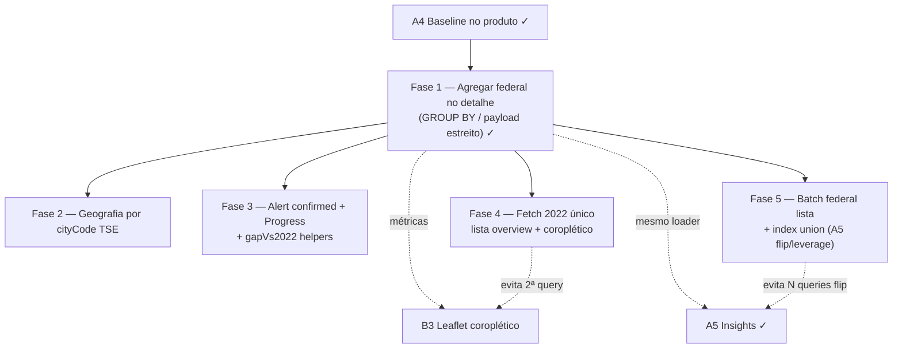

# Escala e DRY pós-A4 (baseline TSE no produto)

Status: Fase 1 implementada (Fases 2–5 pendentes; merge pendente)
Atualizado em: 2026-07-19 (Fase 5 lista flip/leverage + extensão F3 gap registradas via `capture-review-debts` pós-A5 `/simplify`)
Item do roadmap: [docs/roadmap.md](../roadmap.md) (Trilha A, item A7)
Responsável: —

## Contexto

O A4 ([baseline-eleitoral-tse.md](baseline-eleitoral-tse.md) Fases 2–4) entregou o baseline TSE 2022 no detalhe do núcleo e no overview da lista — **implementado e mesclado em `main` (2026-07-18):** `getNucleusElectoralBaseline` / `loadNucleusBaseline2022Overview`, `computeGapVs2022`, UI `NucleusElectoralBaseline` + `NucleusInsights`, card "Baseline 2022". Três passagens `/simplify` no mesmo PR já limparam o que cabia em cleanup: papéis genéricos (`BASELINE_TICKET_2022`), `geographyWhere` por cidade com `zoneNumber in […]`, overview só consulta núcleos com estimativa confirmada, helpers compartilhados (`toNucleusElectionGeographyInput`, `formatElectionNumber`, `NO_ELECTION_BASELINE_MESSAGE`).

Os revisores (performance / reuse / quality) marcaram como **importantes e maiores que simplify** os follow-ups abaixo. Sem registro, o A5 (insights) e o coroplético do B3 herdariam o mesmo custo de I/O no path do detalhe.

1. **Detalhe puxa todas as linhas nominais de dep. federal (1º turno) na geografia.** ~~`detailVoteWhere` + `loadElectionVotes`~~ **Resolvido na Fase 1 (2026-07-19):** `loadFederalCandidateTotalsAggregated` (`src/utilities/federalCandidateTotalsAggregate.ts`) agrega via drizzle `SUM(votes) GROUP BY candidate_number`; o detalhe usa Local API só para presidente/governador da chapa (`loadTicketOfficeVotes`). A série histórica E2 (`loadCandidateSeriesByGeography`) já era magra por `candidateNumber`.
2. **Filtro geográfico por `cityName` (texto), não por `cityCode` TSE.** O índice natural das collections de eleição é `(year, office, turn, cityCode, zoneNumber)`; filtrar por nome impede o plano ótimo e complica OR grandes na união do overview (já mitigado no simplify, mas o detalhe/TI ainda sofre).
3. **DRY de UI do Gap "acima".** `NucleusInsights` usa `Alert variant="pending"` para abaixo/neutro, mas o estado "acima" aplica classes ad-hoc com tokens `--estimate-confirmed*`. O slice **A5-1 conversão** reutiliza o mesmo `confirmedInsightAlertClass` para o alerta de taxa de conversão (reduto/consolidado) — interim até a Fase 3. A barra do candidato no card também reimplementa `role="progressbar"` em vez de reusar `Progress` (`NucleusListOverview`).
4. **Query duplicada de votos 2022 na lista de núcleos com coroplético B3.** `nucleusListOverviewPageData.ts` chama em paralelo `loadNucleusListElectionOverview` (union → `loadCandidateSeriesByGeography` multi-ano) e `loadNucleusChoroplethBundle` → `loadBaseline2022VotesByCityNames` (segunda passagem `loadCandidateSeriesByGeography` só 2022 sobre geografia sobreposta). O simplify B3 unificou resolve interno do choropleth, mas não compartilha o resultado da série 2022 já obtida no loader de gap/tendência/conversão.
5. **N+1 de agregação federal no flip da lista (A5 Fase 2).** `loadNucleusListElectionOverview` chama `loadFederalCandidateTotalsAggregated` **uma vez por núcleo** com geografia resolvida para `computeTicketFlipForGeography`, enquanto série/ticket/majoritarian já vêm numa união. Com dezenas de núcleos filtrados, `Promise.all` paraleliza latência mas não reduz carga no Postgres — mesmo anti-padrão que A7 F1 resolveu no **detalhe**.
6. **Re-scan in-memory de linhas union por núcleo (leverage A5).** No loop `comparableIndexes`, `majoritarianTicketVoteTotals` filtra todo `ticketVotes` (union) por geografia a cada iteração; o flip por núcleo re-filtra `majoritarianTallies` union. Aceitável em filtros pequenos; escala com TI inteira.

**Já resolvido no simplify pós-F1 / `capture-review-debts` (não reabrir):** remoção de `cities` derivado em `NucleusElectionGeography` (só `zonesByCity` + `cityZonePairs`); `assertCanReadElectionData` com `asserts` e entrada `CampaignUser | User | null | undefined`; testes reais de `loadFederalCandidateTotalsAggregated` (mock drizzle) em `federalCandidateTotalsAggregate.unit.spec.ts`; int spy estrutural (`whereContainsField*`) em vez de `JSON.stringify(where)`; inline do SQL builder federal; comentário em `aggregateFederalCandidateTotals` como oracle in-memory para unit tests.

**Já resolvido no simplify pós-A5 alavancagem (não reabrir):** `ticketFlip` pré-computado no VM (`aggregateNucleusElectoralBaseline`) e consumido em `NucleusInsights` (paridade detail/overview em empates majoritários); `resolveMajoritarianWinners` compartilhado; winners/federalRace reutilizados sem segunda passagem no detalhe; `Promise.all` série+ticket+majoritarian no overview (remove waterfall); loop flip sem `null` filter; guard redundante `leverage.ticketVotes`; testes gap com `GapVs2022Baseline`; assert `ticketFlip` no unit de baseline.

**Explicitamente fora (revisores pediram skip no simplify ou descartados no triage):** map JSX de linhas Lula/Jerônimo, dropar `candidate.rank` / `electorate.aptos` / `ratio` do tipo público só por higiene (só fariam sentido se a F1 deixar de calcular rank), cast `as unknown as RawOverviewNucleus` da B1 (não é débito novo do A4), parity test drizzle vs `aggregateFederalCandidateTotals` (int + unit cobrem comportamento), typed drizzle rows/zod no `drizzleResultRows` (padrão plataforma C6/C8), `requirePostgresDrizzle` em `supporterListOverviewAggregate.ts` (fora do escopo A7 — DRY de ~6 linhas; ver C10 quando o plano existir), micro-opt `aggregateElectorate`/`matchesGeography` com `Set` (impacto negligível), `BahiaMap` `setStyle` incremental → **B6** ([escala-dry-pos-b3.md](escala-dry-pos-b3.md)), factory geometrias mun/TI → **B5 F3** ([escala-dry-pos-b2.md](escala-dry-pos-b2.md)); **pós-A5:** `buildUnionGeography` 2× (micro-opt), mover testes leverage/flip para `electionInsights.unit.spec.ts`, unions discriminadas `TicketLeverage`/`TicketFlip`, estreitar campos VM/result flip, `ticketFlipAlertVariant`/`formatPercent` export, `MajoritarianTallyRow` tipo separado, maps de ícones em `NucleusInsights`, wrapper `NucleusInsightAlert` além da F3 (E7 adia DRY do stack até mais insights).

## Objetivos

- Abrir a aba Visão geral de um núcleo com TI/multi-município permanece barato: o loader de baseline não transferir o conjunto completo de candidatos federais da geografia.
- Filtros de geografia eleitoral preferem `cityCode` TSE quando o mapa nome→código existir, sem mudar a UX (continua resolvendo a partir de `cities` / `regions` do núcleo).
- Gap "acima" usa a mesma família de variantes do Alert que o âmbar (`pending`); a barra do candidato reusa `Progress`.
- Lista com flip A5 não escala com N round-trips drizzle de federal por núcleo; Fase 5 batch na união antes de particionar por geografia.
- Guardrails: preferir **sem migration** nas Fases 1 e 3; Fase 2 pode ser só tabela estática (como `bahiaMunicipalityCodes` / seed TSE) — se precisar de índice novo no Postgres, migration dedicada e cortável. Sem Consent (dado público TSE). Access continua `overrideAccess: false` + `canReadElectionData`.

## Decisões travadas

- **Um item A7, cinco fases ordenadas.** Mesmo racional do B5/C7/C8/E7: um ID de roadmap, PRs por fase. Ordem: agregação do detalhe (custo real) → `cityCode` (escala BA-wide) → DRY de Alert/Progress + helpers gap (barato, UI) → fetch único 2022 lista+coroplético (B3) → batch federal + indexação union na lista (A5 flip/leverage).
- **Dependência dura de A4.** Só faz sentido com o loader/UI já no produto; não reabre o escopo do Gap vs 2022 nem do card Baseline.
- **Fase 1 não remove o "mais votado aqui" da UI.** O produto do A4 inclui `winnerFederal`; a otimização agrega no SQL/drizzle (ou limita o payload), não corta a feature. Se produto decidir que rank/winner saem do card, a F1 encolhe para "só o candidato da chapa + tallies".
- **Cortável se a geografia real dos núcleos permanecer pequena** (1–2 municípios tipados). Vira não-cortável de qualidade quando A5/B3 passarem a martelar o mesmo helper em TI inteiro.
- **Não registrar no A7 o cast `as unknown` do overview B1** — débito de tipagem do select Payload da lista; só tocar se um PR de A7 já estiver no arquivo.
- **i18n e naming** (AGENTS.md): identificadores em inglês (`aggregateFederalTotalsByGeography`, `tseCityCodeForMunicipality`, `alertVariants.confirmed`), strings visíveis em pt-BR inalteradas.
- **Impeccable:** Fase 1 = classe **A** (só backend); Fase 2 = **A**; Fase 3 = **B** (encaixe em `Alert`/`NucleusInsights`/`NucleusElectoralBaseline` existentes).

## Questões em aberto

- **Fase 1: Local API `find` + agregação em memória vs `payload.db.drizzle` `GROUP BY`?** **Resolvido (2026-07-19):** drizzle `GROUP BY candidate_number` em `federalCandidateTotalsAggregate.ts`, com gate ACL explícito (`assertCanReadElectionData`) antes do `execute`; presidente/governador e série histórica permanecem no Local API magro.
- **Fase 2: de onde vem o mapa nome canônico → `CD_MUNICIPIO` TSE?** **Recomendação:** extrair do próprio seed/`electionTally`/`electionCandidateVote` (já têm `cityCode`+`cityName`) para uma tabela estática gerada (`src/lib/bahiaTseCityCodes.ts`) no mesmo espírito de `bahiaMunicipalityCodes` (IBGE) — **não** confundir com código IBGE. Script re-executável opcional; sem migration se for só arquivo versionado.
- **Fase 3: nome da variante Alert — `confirmed` ou `estimate-confirmed`?** **Recomendação:** `confirmed`, alinhado aos tokens CSS `--estimate-confirmed` / classe utilitária já usada pelo Badge `estimate-confirmed`, sem inventar terceira nomenclatura.

## Abordagem proposta

### Fase 1 — Agregação do ranking federal no detalhe ✓ (2026-07-19)

- `src/utilities/federalCandidateTotalsAggregate.ts`: drizzle `SUM(votes) GROUP BY candidate_number` + `assertCanReadElectionData`.
- `src/utilities/nucleusElectoralBaseline.ts`: `loadTicketOfficeVotes` (Local API magro) + `aggregateNucleusElectoralBaseline` recebe `federalTotals` já agregados; `getNucleusElectoralBaseline` widened para `Pick<Payload, 'find' | 'db'>`.
- Testes: unit `federalCandidateTotalsAggregate.unit.spec.ts`; int spy em `payload.find` garante que queries federal T1 no Local API sempre filtram `candidateNumber`.

### Fase 2 — Filtro por `cityCode` TSE

- Extrair tipos/helpers de geografia para `src/utilities/nucleusElectionGeography.ts` (quebra o ciclo `federalCandidateTotalsAggregate` ↔ `nucleusElectoralBaseline`; hoje o aggregate importa `NucleusElectionGeography` do baseline).
- Gerar/commitar mapa canônico `cityName` → `cityCode` (BA 2022) a partir dos dados já importados.
- `resolveNucleusElectionGeography` (ou camada ao lado) passa a expor `cityZonePairs` com código; `geographyWhere` e `buildFederalCandidateTotalsSql` usam `cityCode: { equals|in }` + `zoneNumber: { in }` (unifica Payload `Where` e SQL cru).
- Overview union e detalhe compartilham o mesmo helper.
- Sem mudança de UX; fallback fail-closed se o município do núcleo não mapear (mesmo espírito de `canonicalizeMunicipalityName`).

### Fase 3 — Alert `confirmed` + `Progress` + helpers Gap vs 2022

- `src/components/ui/Alert.tsx`: adicionar variant `confirmed` espelhando `pending` com tokens `--estimate-confirmed` / foreground.
- `NucleusInsights`: trocar o `cn(...)` ad-hoc e `confirmedInsightAlertClass` (Gap "acima" **e** conversão reduto/consolidado desde A5-1 **e** leverage ≥100% / tendência increase) por `variant={… ? 'confirmed' : 'pending'}` (ou `default` só se neutro — manter pending para noBaseline/noEstimate).
- `src/lib/electionInsights.ts`: `gapVs2022AlertVariant(status)` e `supportLine` em `computeGapVs2022` (ou `gapVs2022SupportLine`) — simetria com `conversionRateAlertVariant` / `ticketLeverageAlertVariant`; remove ternários e string montada no componente.
- `NucleusElectoralBaseline`: substituir a barra custom por `Progress` (já usado no overview), preservando `aria-label`.

### Fase 4 — Fetch único de votos 2022 (lista overview + coroplético B3)

- `loadNucleusListElectionOverview` já obtém `votes2022` via `loadCandidateSeriesByGeography` na união do conjunto filtrado — expor helper ou retorno auxiliar com `Map<cityName, votes>` (ou reutilizar `sumCandidateVotesForGeography` por cidade) sem segunda query.
- `loadNucleusChoroplethBundle` / `nucleusListOverviewPageData.ts`: aceitar `baselineVotesByCity` pré-carregado do overview (ou função `loadNucleusListOverviewElectionAndChoropleth` que faz uma passagem de série + monta gap/trend/conversão + bundle).
- Manter `loadBaseline2022VotesByCityNames` para call sites isolados (dashboard geral, detalhe) até um follow-up opcional.
- Testes: int ou unit garantindo que overview com coroplético não chama `loadCandidateSeriesByGeography` duas vezes para 2022 (spy estrutural como Fase 1 federal).
- **Verificar:** paridade numérica do coroplético `baseline2022Votes` antes/depois.

### Fase 5 — Batch federal na lista + indexação union (A5 flip/leverage)

- Uma query drizzle na **união** do conjunto filtrado: `GROUP BY city_name, zone_number, candidate_number` (ou `city_code` após F2), materializando mapa `cityZoneKey → federalTotals[]` reutilizável por núcleo — mesmo espírito da F1 no detalhe, estendido ao path `loadNucleusListElectionOverview`.
- Substituir o `Promise.all` de N× `loadFederalCandidateTotalsAggregated` no flip por slice in-memory por geografia de cada núcleo.
- Pré-indexar `ticketVotes` e `majoritarianTallies` union por `cityZoneKey` (ou fingerprint de geografia) antes do loop `comparableIndexes`; `majoritarianTicketVoteTotals` / `resolveMajoritarianWinners` leem do índice em O(pares do núcleo) em vez de re-filtrar todas as linhas union.
- Helper compartilhado `sumElectorateFromTallies` unificando `aggregateElectorate` e `sumElectorateForGeography` (overview vs detalhe).
- Testes: int spy garantindo **uma** execução drizzle federal na lista com N núcleos (espelhar guard da F1); unit de particionamento por geografia; paridade numérica flip/leverage antes/depois.
- **Cortável** se filtros típicos permanecerem em poucos núcleos (≤10); **não cortável** quando TI-wide ou dezenas+ núcleos forem rotina.

**Migration:** nenhuma nas Fases 1, 3, 4 e 5. Fase 2 preferencialmente só artefato estático versionado; índice Postgres extra só se o EXPLAIN ainda doer após `cityCode` (aí `pnpm migrate:create` cortável).

## Dependências

- **Dura:** A4 Baseline no produto + Gap vs 2022 — implementado (loader + UI).
- **Suave:** A5 Insights e B3 coroplético — consomem/amplificam o mesmo helper; se A5 chegar antes da F1, herda o custo.
- Reusa: `BASELINE_TICKET_2022`, `ba2022Scope` / `geographyWhere`, collections `electionCandidateVote` / `electionTally`, padrão drizzle do `scripts/seed-tse-results.mjs`, tokens `estimate-confirmed` / `estimate-pending`, `Progress`.

## Não escopo

- Novos insights de produto → **A5** (planos `insight-*.md`).
- Dobradinha 2026 → **A6**.
- Lazy load de geometrias / cache CLI / factory mun-TI → **B5** (F1 ✓, F2–F3 pendentes).
- `BahiaMap` `setStyle` incremental → **B6** ([escala-dry-pos-b3.md](escala-dry-pos-b3.md)).
- Escala de apoiadores / agenda → **C6/C7/C8**.
- Remover rank/winner da UI por decisão de produto sem agregação — fora; se produto cortar, fechar F1 como "só chapa + tallies".
- Tipagem genérica dos `select` Payload do overview B1.

## Referências

- `docs/roadmap.md` (Trilha A, item A7; A4/A5/B3)
- `docs/plans/baseline-eleitoral-tse.md` — plano pai do A3/A4
- `docs/plans/escala-dry-pos-b2.md` / `escala-dry-pos-c3.md` / `escala-dry-pos-c6.md` — precedente pós-`/simplify`
- `src/utilities/federalCandidateTotalsAggregate.ts` — drizzle aggregate federal T1 (Fase 1)
- `src/utilities/nucleusElectoralBaseline.ts` — `loadTicketOfficeVotes`, `aggregateNucleusElectoralBaseline`, série E2 lean
- `src/utilities/campaignAccess.ts` — `assertCanReadElectionData` / `ElectionDataReader` (gate ACL do path drizzle)
- `src/utilities/drizzleBulk.ts` — `requirePostgresDrizzle` (read-only aggregates)
- `docs/plans/insight-taxa-conversao.md` — A5-1 usa `confirmedInsightAlertClass` até F3
- `docs/plans/insight-alavancagem-chapa.md` — A5 flip/leverage (motiva F5)
- `src/lib/electionInsights.ts` / `src/components/campaign/NucleusInsights.tsx` — Gap + conversão UI
- `src/components/campaign/NucleusElectoralBaseline.tsx` — barra do candidato
- `src/components/ui/Alert.tsx` — variant `pending` a espelhar
- `src/components/ui/Progress.tsx` — reuso no card
- `src/utilities/nucleusListOverviewPageData.ts` — `Promise.all` overview + choropleth
- `src/utilities/nucleusChoroplethPageData.ts` — `loadBaseline2022VotesByCityNames`
- AGENTS.md — Election baseline data; Local API `overrideAccess: false`; naming inglês
