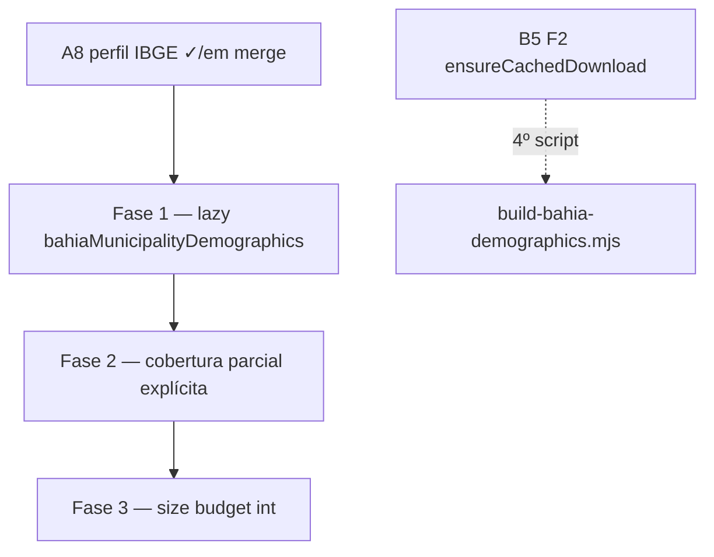

# Escala e DRY pós-A8 (perfil IBGE Eleitorado)

Status: Fases 1–3 pendentes (engenharia A8 em implementação no branch)
Atualizado em: 2026-07-20 (`capture-review-debts` pós-dois `/simplify` na entrega A8)
Item do roadmap: [docs/roadmap.md](../roadmap.md) (Trilha A, fill-in **A8+** pós-A8)
Impeccable: A — N/A (sem superfície UI; perf/integridade de dado)
Appetite: ~0,5–1 dia eng (3 fases pequenas; PR único ou 2 PRs)
Responsável: —

## Contexto

O A8 ([perfil-eleitorado-ibge.md](perfil-eleitorado-ibge.md)) entrega artefato estático `bahiaMunicipalityDemographics.ts`, derivação `getNucleusIbgeVoterProfile`, aba Eleitorado com dynamic import de `NucleusElectorateTab`, e opt-in “Usar como perfil manual”. Duas passagens `/simplify` (pré e pós-rebase em `main` com A7 F2) já limparam o que cabia em cleanup: `safeMessages` + `router.refresh`, `NucleusVoterProfileCard`, helpers `voterProfileNullsToUndefined` / `normalizedVoterProfilesForWrite`, `resolveNucleusTerritoryCities` compartilhado com `nucleusElectionGeography`, JSDoc de zone rules restaurado, formatters `Intl` em cache.

Os revisores (performance / reuse / quality) marcaram como **maiores que cleanup** os follow-ups abaixo. Sem registro, o cold start da aba Eleitorado e da server action de cópia continuam pagando parse do módulo ~68KB, e núcleos com município inválido na lista podem exibir perfil parcial sem aviso.

**Já resolvido no simplify/critique (não reabrir):** form action com `updateNucleus` + `CampaignFormActionState`; lazy import da aba; DRY card manual + normalização de write; `toNucleusElectionGeographyInput` na leitura; `NucleusElectionGeographyInput` unificado com `NucleusTerritoryCitiesInput`; `export` removido de `AGE_BAND_CATEGORY_IDS` no script; testes unit/int A8 verdes.

## Objetivos

- Cold start da aba Eleitorado e da action de cópia não avaliam `bahiaMunicipalityDemographics.ts` até `getNucleusIbgeVoterProfile` ser chamado (padrão B5 F1 / lazy geometries).
- Agregação IBGE **não mente por omissão**: quando `matchedCities < effectiveCities`, o produto falha fechado ou sinaliza cobertura parcial de forma explícita na UI — sem PII, sem migration.
- Artefato demographics versionado ganha soft budget de bytes nos testes int (regressão de codegen), espelhando B2 geometries.
- Guardrails: sem migration, sem collection, sem Consent, sem HTTP SIDRA em runtime; access inalterado (staff-only).

## Decisões travadas

- **Um fill-in A8+, três fases ordenadas.** Mesmo racional de A7/C6/B5: um slug de plano, PRs por fase. Ordem: lazy load (impacto cold start) → integridade de cobertura (produto) → size budget (higiene). **Rejeitado:** item de roadmap separado `A9` — follow-up pós-entrega, não feature nova.
- **Dependência dura de A8.** Só faz sentido com `bahiaMunicipalityDemographics.ts`, `getNucleusIbgeVoterProfile` e aba Eleitorado já mergeados; não reabre escopo SIDRA/renda/RAIS.
- **Lazy load no deriver, não no componente.** Dynamic import da aba já isola rotas não-Eleitorado; F1 move o custo do módulo estático para dentro de `getNucleusIbgeVoterProfile` (e callers async se necessário). **Rejeitado:** segundo dynamic import só no card IBGE — duplicaria fronteira async.
- **Cortável pós-propaganda.** Fill-in de qualidade/perf; não bloqueia Onda 0 nem propaganda 16/08 se A8 principal já estiver em prod.
- **Cache CLI do build demographics → B5 F2**, não este plano. `scripts/build-bahia-demographics.mjs` é 4º clone de `ensureCached*`; absorvido em [escala-dry-pos-b2.md](escala-dry-pos-b2.md).
- **i18n e naming** (AGENTS.md): identificadores em inglês (`loadDemographicsModule`, `demographicsCoverageStatus`); strings visíveis em pt-BR só na UI de aviso de cobertura parcial.

## Questões em aberto

- **Fail-closed vs aviso parcial na F2?** **Opções:** (A) `status: 'semPerfil'` quando qualquer cidade falha; (B) `available` com flag `partialCoverage` + copy na UI; (C) aviso só em `notes`. **Recomendação:** (B) — coordenação ainda vê o perfil ponderado dos municípios válidos, com badge/linha “Cobertura parcial (N de M municípios)”; evita empty state enganoso sem esconder dado útil.
- **`getNucleusIbgeVoterProfile` sync ou async após F1?** **Opções:** função `async` sempre; loader interno com `await import()` e API sync que lança se módulo não carregado. **Recomendação:** `async` + `await getNucleusIbgeVoterProfile` em `NucleusElectorateTab` (server) e na form action — poucos call sites, sem Promise em cada render de card.

## Abordagem proposta

### Fase 1 — Lazy load do artefato demographics

- Introduzir `loadBahiaMunicipalityDemographicsModule()` (ou dynamic `import('@/lib/bahiaMunicipalityDemographics')` cacheado em `let modulePromise`) consumido por `getNucleusIbgeVoterProfile`.
- Tornar `getNucleusIbgeVoterProfile` **async**; atualizar `NucleusElectorateTab`, `nucleusIbgeVoterProfileFormActions.ts` e testes unit.
- Critério: import estático de `NucleusActiveTab` / rotas não-Eleitorado não puxam `bahiaMunicipalityDemographics.ts` no grafo (inspeção de bundle ou análise de imports).

### Fase 2 — Cobertura parcial explícita

- Contar `matchedCities` vs `effectiveCities` em `getNucleusIbgeVoterProfile`.
- Se `matchedCities === 0` → `{ status: 'semPerfil' }` (inalterado).
- Se `matchedCities < effectiveCities` → `available` com metadado de cobertura (`partialCoverage: true`, contagens) e copy pt-BR na UI (`NucleusIbgeVoterProfile` ou view model).
- Testes unit: cidade inválida no meio de duas válidas → parcial; todas inválidas → `semPerfil`.

### Fase 3 — Size budget no artefato

- Teste int em `tests/int/bahiaMunicipalityDemographics.int.spec.ts`: `stat` de `src/lib/bahiaMunicipalityDemographics.ts` ≤ ~100 KB (margem sobre ~68 KB atuais).
- Sem mudança de comportamento de runtime.

**Migration:** nenhuma nas três fases.

## Dependências

- **Dura:** A8 [perfil-eleitorado-ibge.md](perfil-eleitorado-ibge.md) — artefato + derivação + aba (merge em `main`).
- **Suave:** B5 F1 lazy geometries — precedente de padrão, não bloqueia.
- Reusa: `resolveNucleusTerritoryCities`, `NucleusElectorateTab` dynamic import, `tests/int/bahiaGeometries.int.spec.ts` (modelo de size budget).

## Não escopo

- HTTP SIDRA em request path → rabbit hole A8 (perfil-eleitorado-ibge.md).
- Pré-agregar demographics por TI no build → defer no plano-pai A8 (gatilho: region-only lento).
- Renomear `semPerfil` para inglês → higiene score 1; descartado no triage.
- `Promise.all` nos fetches do build script → só build-time; descartado.
- Helper CLI `ensureCachedDownload` → **B5 F2** ([escala-dry-pos-b2.md](escala-dry-pos-b2.md)).
- Impeccable polish classe B da aba → defer no plano-pai até marcar A8 entregue em prod.
- Alinhar semântica IBGE vs mapa TSE (cidades vs zonas) → produto/documentação no plano-pai, não engenharia neste fill-in.

## Rabbit holes

- **Re-exportar demographics no barrel `bahiaGeometries` ou entry de campanha.** Mitigação: import lazy **só** dentro de `nucleusIbgeVoterProfile.ts`.
- **Collection Payload “só para cachear demographics”.** Mitigação: manter artefato estático versionado (decisão A8).
- **Unificar perfil IBGE com baseline TSE (A3/A4).** Mitigação: fontes distintas; sem join neste fill-in.

## Adiado com gatilho

- **Pré-agregação demographics por TI no build.** Revisitar quando núcleos region-only com >15 municípios mostrarem latência perceptível em prod.
- **`formatPercent` compartilhado cross-codebase.** Revisitar no 3º consumer além de IBGE + insights.
- **Testes unit dedicados a `resolveNucleusTerritoryCities`.** Revisitar no 3º consumer (hoje: election geography + IBGE).
- **Semântica IBGE (todas as cidades) vs mapa (geografia TSE).** Documentado no plano-pai; revisitar se usuários reportarem footprint vazio com perfil IBGE visível.

## Explicitamente fora (triage `capture-review-debts` 2026-07-20)

- Renomear `semPerfil` → `noProfile` (pureza de naming).
- `Promise.all` paralelo nos 28 fetches SIDRA do build (só CLI).
- Harmonizar `revalidatePath` slug vs `[slug]` page entre form actions.
- Impeccable critique/polish da aba Eleitorado antes de prod (defer no plano-pai A8).

## Referências

- `docs/roadmap.md` (Trilha A, A8 + fill-in A8+)
- `docs/plans/perfil-eleitorado-ibge.md` — plano pai A8
- `docs/plans/escala-dry-pos-b2.md` — B5 F2 cache CLI (4º call site `build-bahia-demographics.mjs`)
- `src/lib/bahiaMunicipalityDemographics.ts` — artefato ~68KB
- `src/utilities/nucleusIbgeVoterProfile.ts` — derivação
- `src/components/campaign/NucleusElectorateTab.tsx` — consumidor server
- `src/app/(campaign)/campanha/(app)/nucleos/[slug]/nucleusIbgeVoterProfileFormActions.ts` — action de cópia
- `scripts/build-bahia-demographics.mjs` — CLI (cache → B5 F2)
- `tests/int/bahiaGeometries.int.spec.ts` — precedente size budget
- AGENTS.md — naming EN/pt-BR; dado estático B2; sem PII
