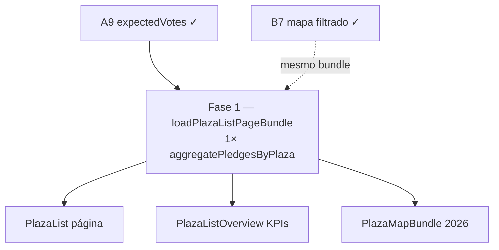

# Escala e DRY pós-A9 (loader da lista de Praças)

Status: registrado no roadmap (Fase 1 pendente; **B7 entregue 2026-07-21** — prioridade sobe)
Atualizado em: 2026-07-21 (`capture-review-debts` pós-B7 + `/simplify`)
Item do roadmap: [docs/roadmap.md](../roadmap.md) (Trilha A, fill-in **A9+** pós-A9)
Impeccable: A — N/A (sem superfície UI; otimização de loader)
Appetite: ~0,5–1 dia eng (1 fase; PR único)
Responsável: —

## Contexto

O A9 ([estimativa-votos-praca.md](estimativa-votos-praca.md)) entrega `plaza.expectedVotes` (staff-only), `setPlazaExpectedVotes`, fallback `expectedVotes ?? effectiveTotal` em mapa/overview/dashboard, UI em `/editar` + leitura na lista/detalhe, migration `20260721_133444_add_plaza_expected_votes`, e helpers `resolvePlazaStaffVoteTotal` / `rollupPlazaStaffVotes` / `sumStaffPledgeEffectiveTotal` em `votePledgeData.ts`.

Uma passagem `/simplify` pós-entrega já limpou o que cabia em cleanup: form `optionalIntegerFormValue` único; remoção de `hasStaffVoteData`; `StaffPlazaVotesDisplay` compartilhado; JSDoc da métrica 2026; testes unit do rollup.

O revisor de **performance** marcou como **maior que simplify** o follow-up abaixo. Sem registro, cada abertura de `/campanha/pracas` (staff) dispara **três** agregações de pledges sobre conjuntos sobrepostos.

1. **Query triplicada de pledges na página `/campanha/pracas`.** `page.tsx` chama em paralelo `loadPlazaListPageData` (pledges da página atual), `loadPlazaListOverviewData` (pledges de **todo** o conjunto filtrado) e `loadPlazaMapBundle` (pledges do conjunto filtrado do mapa — desde **B7** o escopo segue `buildPlazaListWhere`, não mais todas as Praças acessíveis). Cada loader ainda invoca `aggregatePledgesByPlaza` de forma independente.

2. **Dois `find` de Praças no mesmo filtro (overview + mapa).** Ambos usam `buildPlazaListWhere` com `pagination: false` e `select` distinto — duplicação de round-trip por request quando o mapa está visível (staff, conjunto não vazio).

**Já resolvido no simplify/critique (não reabrir):** parsing duplo do form `expectedVotes`; `hasStaffVoteData` derivado de `staffVoteTotal > 0`; `rollupPlazaStaffVotes` + `sumStaffPledgeEffectiveTotal`; `StaffPlazaVotesDisplay`; assinatura estreita de `resolvePlazaStaffVoteTotal`; testes unit do rollup. **Pós-B7 simplify:** `PlazaListSearchParams` exportado de `plazaUi.ts`; parse único no map loader (`loadScopedPlazas` recebe `PlazaListState`).

**Explicitamente fora (triage `capture-review-debts` 2026-07-21 pós-A9):** semântica lista (só `expectedVotes` manual) vs mapa/overview (fallback) — decisão de produto A9; merge de forms Estratégia + Votos no `/editar`; grid cosmético do `PlazaStrategyCard`; `loadPlazaPledges` em abas distintas do detalhe (uma aba por request); débitos adiados/não escopo do plano A9 (nota/autor, chip auto-sugerir, histórico, filtro `?expectedVotes=`); critique Impeccable formal por superfície → **R6**.

**Explicitamente fora (triage `capture-review-debts` 2026-07-21 pós-B7):** `Promise.all` nos loads TSE por ano em `plazaMapData` (micro-opt pré-existente; gatilho abaixo); testes int extras em `plazaMapData` (`region`/`leader`/`compare`) — cobertura opcional no próximo toque no loader; split do teste advisor por `kind` (legibilidade).

## Objetivos

- Abrir `/campanha/pracas` com filtro amplo não executa **três** `aggregatePledgesByPlaza` independentes quando um mapa de agregados compartilhado basta.
- Overview, mapa 2026 e coluna da página reutilizam o mesmo `Map<plazaId, PlazaPledgeAggregate>` (e, onde os filtros coincidirem, o mesmo `find` de Praças).
- Paridade funcional: KPIs, métrica 2026 e sublinha “Nas lideranças” permanecem idênticos ao comportamento pós-A9.
- Guardrails: sem migration, sem collection, sem Consent, sem server action nova; access inalterado (`overrideAccess: false` nos reads de Praça; agregado de pledges continua admin-bypass intencional com ids já access-checked).

## Decisões travadas

- **Um fill-in A9+, uma fase (F1).** Mesmo racional de A7/C6/A8+: um slug de plano, PR único. **Rejeitado:** item de roadmap separado `A10` — follow-up pós-entrega, não feature nova.
- **Dependência dura de A9.** Só faz sentido com `expectedVotes`, `rollupPlazaStaffVotes` e os três loaders já no produto; não reabre escopo de schema ou UI de edição.
- **F1 não remove overview nem mapa.** Otimiza como os dados chegam; paridade com a plano A9 permanece. **Rejeitado:** unificar lista+overview num único `find` unpaginado sem validar regressão de paginação/`depth`.
- **Cortável** se a lista com mapa permanecer aceitável em campo com dezenas de assessores; **menos cortável desde B7 entregue** (mapa filtrado + sempre visível para staff amplifica o custo do triplo agregado quando o filtro é amplo).
- **i18n e naming** (AGENTS.md): identificadores em inglês (`loadPlazaListPageBundle`, `PlazaListPledgeAggregates`); strings visíveis inalteradas em pt-BR.

## Questões em aberto

- **Bundle único vs compartilhar só o mapa de pledges?** **Opções:** (A) `loadPlazaListPageBundle` retorna `{ list, overview, mapInputs, pledgeAggregates }`; (B) só deduplicar `aggregatePledgesByPlaza` num helper `loadPlazaPledgeAggregatesForListPage` consumido pelos três loaders. **Recomendação:** (A) se os três `find` de Praças puderem compartilhar escopo sem duplicar lógica de filtro; senão (B) como primeiro passo — ganho imediato no hot path de pledges.
- **Overview unpaginado vs página paginada?** **Recomendação:** manter dois `find` de Praças (conjunto filtrado inteiro vs página) — o gargalo registrado é o **terceiro** agregado de pledges, não a paginação em si; unificar `find` só se profiling mostrar custo dominante em Praças, não em pledges.

## Abordagem proposta

### Fase 1 — Loader compartilhado da lista de Praças

- Introduzir `loadPlazaListPageBundle` (ou equivalente em `plazaPageData.ts` + ajuste fino em `plazaMapData.ts`) que:
  - Resolve filtros uma vez (`parsePlazaListParams` / `buildPlazaListWhere`).
  - Carrega Praças do escopo necessário (página + overview + mapa) com o mínimo de round-trips.
  - Chama `aggregatePledgesByPlaza` **uma vez** sobre a união de ids necessários (ou sobre o conjunto filtrado inteiro se mais simples e dentro do appetite).
  - Expõe `pledgeAggregates` reutilizado por `toPlazaListViewModel`, `rollupPlazaStaffVotes` e `loadPlazaMapBundle` (refatorar para aceitar agregados pré-computados ou extrair helper puro).
- Atualizar `src/app/(campaign)/campanha/(app)/pracas/page.tsx` para consumir o bundle.
- Testes: int ou unit do bundle — paridade de `staffVoteTotal` e métrica 2026 antes/depois; advisor scope inalterado.

**Migration:** nenhuma.

## Dependências

- **Dura:** A9 [estimativa-votos-praca.md](estimativa-votos-praca.md) — campo, agregadores e superfícies (merge em `main`).
- **Suave:** B7 [mapa-pracas-filtrado.md](mapa-pracas-filtrado.md) — entregue 2026-07-21; mesmo URL de filtro; F1 deduplica pledges e pode compartilhar parse/`find` onde os escopos coincidem.
- Reusa: `aggregatePledgesByPlaza`, `rollupPlazaStaffVotes`, `resolvePlazaStaffVoteTotal`, precedente E6 F1 em [escala-dry-pos-e1.md](escala-dry-pos-e1.md).

## Não escopo

- SQL aggregate de pledges (`COUNT(*) FILTER`) — volume ainda baixo; reavaliar no 3º hot path ou com evidência de latency.
- Unificar `loadPlazaPledges` entre abas Overview/Lideranças no detalhe — defer (uma aba por request).
- Edição inline na lista → **B9** ([edicao-rapida-lista-pracas.md](edicao-rapida-lista-pracas.md)).
- Merge de forms no `/editar` — fora do triage.
- Impeccable critique das superfícies A9 → **R6**.

## Rabbit holes

- **Unificar lista+overview+mapa num único `find` unpaginado de 436 Praças sempre.** Mitigação: F1 foca em deduplicar **pledges**; `find` de Praças permanece paginado onde já é.
- **Cache cross-request de agregados.** Mitigação: bundle por request RSC apenas; sem Redis/memória global neste fill-in.

## Adiado com gatilho

- **SQL aggregate espelhando `buildPlazaListWhere`.** Revisitar quando profiling mostrar `aggregatePledgesByPlaza` dominando TTFB com filtros amplos + mapa sempre montado.
- **Compartilhar bundle com dashboard geral.** Revisitar se o dashboard passar a carregar mapa+lista na mesma rota.
- **Loads TSE sequenciais por ano em `loadPlazaMapBundle`.** Revisitar com `Promise.all` só se profiling com `?compare=` mostrar latência dominante (pré-existente; fora do escopo A9+).

## Referências

- `docs/roadmap.md` (Trilha A, A9 entregue + fill-in A9+)
- `docs/plans/estimativa-votos-praca.md` — plano pai A9
- `docs/plans/escala-dry-pos-e1.md` — precedente E6 F1 (lista+overview núcleos)
- `src/app/(campaign)/campanha/(app)/pracas/page.tsx` — `Promise.all` dos três loaders
- `src/utilities/plazaPageData.ts` — `loadPlazaListPageData`, `loadPlazaListOverviewData`
- `src/utilities/plazaMapData.ts` — `loadPlazaMapBundle`, métrica 2026
- `src/utilities/votePledgeData.ts` — `aggregatePledgesByPlaza`, `rollupPlazaStaffVotes`
- AGENTS.md — naming EN/pt-BR; access staff; sem PII
