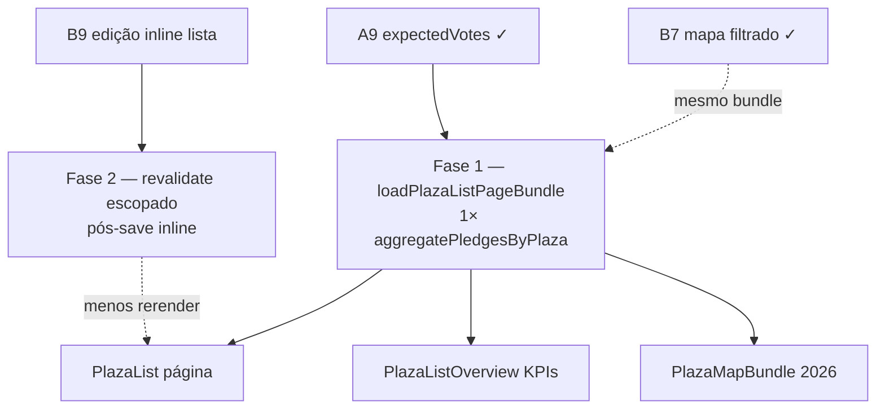

# Escala e DRY pós-A9 (loader da lista de Praças)

Status: entregue 2026-07-21 (F1+F2; aguardando merge/deploy com remodelagem)
Atualizado em: 2026-07-21 (implementação + `/simplify` + rebase em `main` com B11; `capture-review-debts` pós-implementação)
Item do roadmap: [docs/roadmap.md](../roadmap.md) (Trilha A, fill-in **A9+** pós-A9)
Impeccable: A — N/A (sem superfície UI; otimização de loader)
Appetite: ~1–1,5 dia eng (F1 loader + F2 revalidate pós-B9; PR único ou dois commits)
Responsável: —

## Contexto

O A9 ([estimativa-votos-praca.md](estimativa-votos-praca.md)) entrega `plaza.expectedVotes` (staff-only), `setPlazaExpectedVotes`, fallback `expectedVotes ?? effectiveTotal` em mapa/overview/dashboard, UI em `/editar` + leitura na lista/detalhe, migration `20260721_133444_add_plaza_expected_votes`, e helpers `resolvePlazaStaffVoteTotal` / `rollupPlazaStaffVotes` / `sumStaffPledgeEffectiveTotal` em `votePledgeData.ts`.

Uma passagem `/simplify` pós-entrega já limpou o que cabia em cleanup: form `optionalIntegerFormValue` único; remoção de `hasStaffVoteData`; `StaffPlazaVotesDisplay` compartilhado; JSDoc da métrica 2026; testes unit do rollup.

O revisor de **performance** marcou como **maior que simplify** os três problemas abaixo (contexto pré-A9+). **Resolvidos na entrega F1+F2:**

1. ~~**Query triplicada de pledges**~~ — `loadPlazaListPageBundle` chama `aggregatePledgesByPlaza` uma vez; overview, mapa e coluna da página reutilizam o mesmo `Map`.
2. **Dois `find` de Praças no mesmo filtro** — mantido de propósito (paginado + conjunto filtrado inteiro); ver “Questões em aberto”.
3. ~~**Revalidação full-page sem escopo no detalhe**~~ — `revalidatePlazaListPaths({ slug })` via hidden `plazaSlug`; lista ainda revalida full-page (filtros `?trend=` + KPIs).

## Como entregue (2026-07-21)

**F1 — Loader:** `loadPlazaListPageBundle` em `plazaPageData.ts`; `buildPlazaMapBundleFromPlazas` + `scopePlazasFromDocs` em `plazaMapData.ts`; `page.tsx` com uma única chamada; removidos `loadPlazaListPageData` / `loadPlazaListOverviewData` do export público.

**F2 — Revalidate:** `plazaRevalidation.ts` (`revalidatePlazaListPaths` com validação de slug); hidden `plazaSlug` em `PlazaList*Control`, `PlazaStrategyForm`, `PlazaAdvisorsForm`; `plazaStaffFormActions` + `editar/formActions` (via **C8 F4**).

**Helpers compartilhados (prep C8 F4):** `optionalPlazaSlugFromForm`, `parsePoliticalTrendStatusFormValue`.

**Testes:** `tests/int/plazaPageData.int.spec.ts` (4 casos: vazio, rollup, advisor+filtro, leader sem mapa/overview).

**Validação:** `tsc --noEmit`; int `plazaPageData` + `plazaMapData` verdes; Aikido 0 findings nos arquivos editados.

**Já resolvido no simplify/critique (não reabrir):** parsing duplo do form `expectedVotes`; `hasStaffVoteData` derivado de `staffVoteTotal > 0`; `rollupPlazaStaffVotes` + `sumStaffPledgeEffectiveTotal`; `StaffPlazaVotesDisplay`; assinatura estreita de `resolvePlazaStaffVoteTotal`; testes unit do rollup. **Pós-B7 simplify:** `PlazaListSearchParams` exportado de `plazaUi.ts`; parse único no map loader (`loadScopedPlazas` recebe `PlazaListState`). **Pós-B11 simplify:** `Promise.all` nos loads TSE por ano em `loadPlazaMapBundle` (votes + válidos em paralelo; branch `?compare=` também paraleliza os 3 `loadCandidateVotesByCityZone`) — micro-opt que estava fora do escopo A9+; resolvido no cleanup B11, não reabrir aqui.

**Explicitamente fora (triage `capture-review-debts` 2026-07-21 pós-A9):** semântica lista (só `expectedVotes` manual) vs mapa/overview (fallback) — decisão de produto A9; merge de forms Estratégia + Votos no `/editar`; grid cosmético do `PlazaStrategyCard`; `loadPlazaPledges` em abas distintas do detalhe (uma aba por request); débitos adiados/não escopo do plano A9 (nota/autor, chip auto-sugerir, histórico, filtro `?expectedVotes=`); critique Impeccable formal por superfície → **R6**.

**Explicitamente fora (triage `capture-review-debts` 2026-07-21 pós-B7):** testes int extras em `plazaMapData` (`region`/`leader`/`compare`) — cobertura opcional no próximo toque no loader; split do teste advisor por `kind` (legibilidade).

**Explicitamente fora (triage `capture-review-debts` 2026-07-21 pós-B9):** ~75 hooks `useActionState` por página (3 controles × 25 linhas × 2 views) — gatilho: reclamação de perf ou **R6**; ~~merge `listFormActions` ↔ `/editar` → **C8 F4**~~ (entregue 2026-07-21); hook popover compartilhado / layout responsivo único / lazy advisor options → gatilhos no plano B9.

## Simplify pós-implementação (2026-07-21)

Passagem `/simplify` sobre o diff A9+ (F1+F2) após rebase em `main` com B11.

**Já resolvido (não reabrir):** `optionalPlazaSlugFromForm` (`formData.ts`); `parsePoliticalTrendStatusFormValue` (`schemas/plaza.ts`); colapso `needsFilteredSet` → `isCampaignStaff`; remoção de `declaredVotesTotal` / `highPriorityCount` mortos em `PlazaListOverviewData`; validação de slug em `revalidatePlazaListPaths`; `compareCandidate` no branch `?compare=` de `buildPlazaMapBundleFromPlazas`; int `plazaPageData` sem re-query redundante de pledges.

**F2 como entregue:** `plazaRevalidation.ts` + hidden `plazaSlug` nos forms; lista e `/editar` chamam `revalidatePlazaListPaths({ slug })` — revalida o detalhe de forma estreita quando o slug está presente; a lista continua com `revalidatePath` full-page (paridade com filtros `?trend=` e KPIs). **Rejeitado neste fill-in:** cache por tag / matriz `scope` por tipo de save.

**Explicitamente fora (triage `capture-review-debts` 2026-07-21 pós-implementação A9+):** `scope: 'detail'` só em save de tendência (a lista precisa refletir filtro `?trend=`); cache/revalidate por tag (rabbit hole); mover `plazaListFilteredSelect` → `plazaViewModels` (gatilho: 3º consumidor); paralelizar pledge aggregate + loads TSE no mesmo tick do bundle (gatilho: profiling TTFB); unificar os dois `find` de Praças (decisão travada em “Questões em aberto”); ~~twin completo `listFormActions` ↔ `/editar` → **C8 F4**~~ (entregue 2026-07-21 — ver [escala-dry-pos-c6.md](escala-dry-pos-c6.md) Fase 4).

## Objetivos

- Abrir `/campanha/pracas` com filtro amplo não executa **três** `aggregatePledgesByPlaza` independentes quando um mapa de agregados compartilhado basta.
- Overview, mapa 2026 e coluna da página reutilizam o mesmo `Map<plazaId, PlazaPledgeAggregate>` (e, onde os filtros coincidirem, o mesmo `find` de Praças).
- Saves inline da lista (B9) não disparam rerender full-page desnecessário quando um refresh parcial (segmento de lista, tag de cache, ou `revalidatePath` estreito) preserva paridade de KPIs/mapa.
- Paridade funcional: KPIs, métrica 2026 e sublinha “Nas lideranças” permanecem idênticos ao comportamento pós-A9.
- Guardrails: sem migration, sem collection, sem Consent, sem server action nova; access inalterado (`overrideAccess: false` nos reads de Praça; agregado de pledges continua admin-bypass intencional com ids já access-checked).

## Decisões travadas

- **Um fill-in A9+, duas fases ordenadas (F1 loader + F2 revalidate).** Mesmo racional de A7/C6/A8+: um slug de plano, PR único. **Rejeitado:** item de roadmap separado `A10` — follow-up pós-entrega, não feature nova.
- **Dependência dura de A9.** Só faz sentido com `expectedVotes`, `rollupPlazaStaffVotes` e os três loaders já no produto; não reabre escopo de schema ou UI de edição.
- **F1 não remove overview nem mapa.** Otimiza como os dados chegam; paridade com a plano A9 permanece. **Rejeitado:** unificar lista+overview num único `find` unpaginado sem validar regressão de paginação/`depth`.
- **Cortável** se a lista com mapa permanecer aceitável em campo com dezenas de assessores; **menos cortável desde B7 entregue** (mapa filtrado + sempre visível para staff amplifica o custo do triplo agregado quando o filtro é amplo).
- **i18n e naming** (AGENTS.md): identificadores em inglês (`loadPlazaListPageBundle`, `PlazaListPledgeAggregates`); strings visíveis inalteradas em pt-BR.

## Questões em aberto

- **Bundle único vs compartilhar só o mapa de pledges?** **Resolvido (2026-07-21):** opção (A) — `loadPlazaListPageBundle` com um `find` unpaginado filtrado + um `aggregatePledgesByPlaza`; `buildPlazaMapBundleFromPlazas` recebe agregados pré-computados.
- **Overview unpaginado vs página paginada?** **Recomendação:** manter dois `find` de Praças (conjunto filtrado inteiro vs página) — o gargalo registrado é o **terceiro** agregado de pledges, não a paginação em si; unificar `find` só se profiling mostrar custo dominante em Praças, não em pledges.

## Abordagem proposta

### Fase 1 — Loader compartilhado da lista de Praças

- Introduzir `loadPlazaListPageBundle` (ou equivalente em `plazaPageData.ts` + ajuste fino em `plazaMapData.ts`) que:
  - Resolve filtros uma vez (`parsePlazaListParams` / `buildPlazaListWhere`).
  - Carrega Praças do escopo necessário (página + overview + mapa) com o mínimo de round-trips.
  - Chama `aggregatePledgesByPlaza` **uma vez** sobre a união de ids necessários (ou sobre o conjunto filtrado inteiro se mais simples e dentro do appetite).
  - Expõe `pledgeAggregates` reutilizado por `toPlazaListViewModel`, `rollupPlazaStaffVotes` e `loadPlazaMapBundle` (refatorar para aceitar agregados pré-computados ou extrair helper puro).
- Atualizar `src/app/(campaign)/campanha/(app)/pracas/page.tsx` para consumir o bundle.
- Testes: int ou unit do bundle — paridade de `staffVoteTotal` e métrica 2026 antes/depois; advisor scope inalterado.

### Fase 2 — Revalidação escopada pós-B9

- Avaliar `revalidatePath` estreito (só segmento necessário) ou tag de cache dedicada à lista vs full-page `revalidatePath('/campanha/pracas', 'page')` em `plazaStaffFormActions.ts` — gatilho: N saves inline + profiling de rerender inaceitável (ver Adiado com gatilho).
- Critério de aceite: após N saves inline seguidos, overview/mapa/lista permanecem corretos sem rerodar loaders caros quando o dado alterado não afeta KPI agregado (ex.: tendência não muda métrica 2026 — validar caso a caso).
- ~~Coordenar com **C8 F4** se extrair `revalidatePlazaListPaths` compartilhado entre lista e `/editar`.~~ Entregue 2026-07-21.
- Testes: int leve ou e2e smoke de save inline + paridade visual de KPIs (manual ok se appetite apertar).

**Migration:** nenhuma.

## Dependências

- **Dura:** A9 [estimativa-votos-praca.md](estimativa-votos-praca.md) — campo, agregadores e superfícies (merge em `main`).
- **Suave:** B7 [mapa-pracas-filtrado.md](mapa-pracas-filtrado.md) — entregue 2026-07-21; mesmo URL de filtro; F1 deduplica pledges e pode compartilhar parse/`find` onde os escopos coincidem.
- **Suave:** B9 [edicao-rapida-lista-pracas.md](edicao-rapida-lista-pracas.md) — F2 só faz sentido com saves inline na lista; não reabre escopo de UI B9.
- Reusa: `aggregatePledgesByPlaza`, `rollupPlazaStaffVotes`, `resolvePlazaStaffVoteTotal`, precedente E6 F1 em [escala-dry-pos-e1.md](escala-dry-pos-e1.md).

## Não escopo

- SQL aggregate de pledges (`COUNT(*) FILTER`) — volume ainda baixo; reavaliar no 3º hot path ou com evidência de latency.
- Unificar `loadPlazaPledges` entre abas Overview/Lideranças no detalhe — defer (uma aba por request).
- Implementar os controles inline da lista → **B9** (entregue em código; polish Impeccable → **R6**).
- Merge de forms no `/editar` — fora do triage.
- Impeccable critique das superfícies A9 → **R6**.

## Rabbit holes

- **Unificar lista+overview+mapa num único `find` unpaginado de 436 Praças sempre.** Mitigação: F1 foca em deduplicar **pledges**; `find` de Praças permanece paginado onde já é.
- **Cache cross-request de agregados.** Mitigação: bundle por request RSC apenas; sem Redis/memória global neste fill-in.

## Adiado com gatilho

- **SQL aggregate espelhando `buildPlazaListWhere`.** Revisitar quando profiling mostrar `aggregatePledgesByPlaza` dominando TTFB com filtros amplos + mapa sempre montado.
- **Compartilhar bundle com dashboard geral.** Revisitar se o dashboard passar a carregar mapa+lista na mesma rota.
- **Paralelizar pledge aggregate + loads TSE históricos no bundle.** Revisitar se profiling mostrar TTFB dominado pelo mapa com filtro amplo (anos TSE já paralelizam dentro de `buildPlazaMapBundleFromPlazas` desde B11/A9+ simplify).
- **Cache/revalidate por tag ou `scope` por tipo de save.** Revisitar se N saves inline seguidos na lista mostrarem custo de rerender inaceitável em campo.

## Referências

- `docs/roadmap.md` (Trilha A, A9+ entregue 2026-07-21)
- `docs/plans/estimativa-votos-praca.md` — plano pai A9
- `docs/plans/escala-dry-pos-e1.md` — precedente E6 F1 (lista+overview núcleos)
- `src/app/(campaign)/campanha/(app)/pracas/page.tsx` — consome `loadPlazaListPageBundle`
- `src/app/(campaign)/campanha/(app)/pracas/plazaStaffFormActions.ts` — `revalidatePlazaListPaths` com `plazaSlug`
- `src/utilities/plazaPageData.ts` — `loadPlazaListPageBundle`
- `src/utilities/plazaMapData.ts` — `buildPlazaMapBundleFromPlazas`, `scopePlazasFromDocs`
- `src/utilities/plazaRevalidation.ts` — helper compartilhado (C8 F4)
- `tests/int/plazaPageData.int.spec.ts` — paridade overview/mapa/escopo
- `src/utilities/plazaMapData.ts` — `loadPlazaMapBundle`, métrica 2026
- `src/utilities/votePledgeData.ts` — `aggregatePledgesByPlaza`, `rollupPlazaStaffVotes`
- AGENTS.md — naming EN/pt-BR; access staff; sem PII
