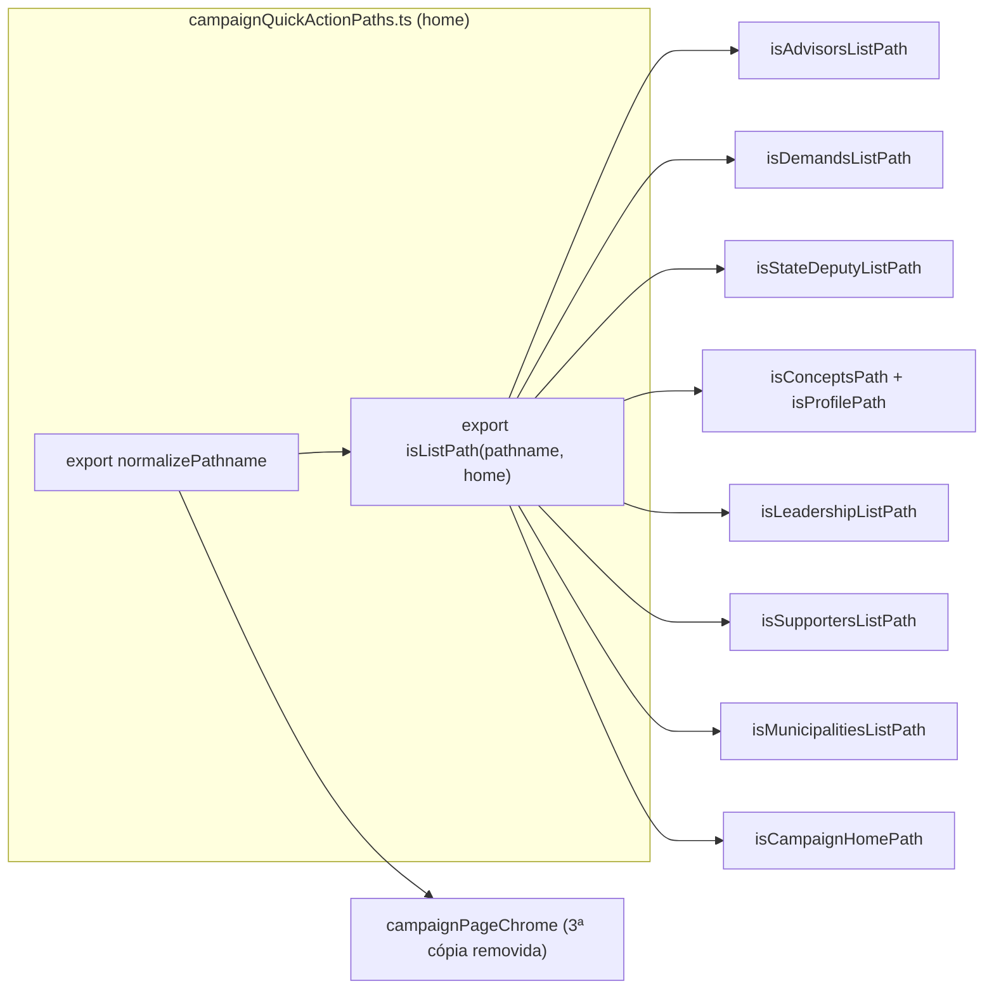

# Impl: Escala/DRY pós-B86 — normalização de pathname de lista nas ações rápidas

Status: aprovado
Atualizado em: 2026-08-04
Issue: #353
Intenção: docs/plans/escala-dry-pos-acoes-rapidas.md
Appetite restante: herdado (~0,25–0,5 dia eng; sem migration)

## Leitura da intenção

- **Outcome:** o conhecimento "normalizar pathname de lista (match exato + trailing slash)" deixa de estar duplicado nos módulos da família de ações rápidas; um helper compartilhado em `campaignQuickActionPaths.ts` é a fonte única; os exports públicos `isXListPath` continuam existindo como wrappers delegando.
- **O que NÃO negociar:** comportamento idêntico (refactor puramente estrutural); exports públicos preservados (specs + registry importam `isDemandsListPath` etc.); client-safe (zero server-only); sem migration; wrappers de superfície activity/organization intactos além de reusar o `normalizePathname` exportado.
- **O que reavaliar:**
  - A intenção lista "6+ call sites" e nomeia 7 módulos. O inventário real tem **9 sites com o mesmo shape** — `isMunicipalitiesListPath` (`campaignMunicipalityQuickActions.ts`) e `isCampaignHomePath` (`campaignQuickActionMount.ts`) ficaram de fora da lista.
  - A intenção fala de um `normalizePathname` privado "só usado pelos parsers de superfície activity/organization". Há uma **3ª cópia idêntica** em `campaignPageChrome.ts` (usada por `resolveCampaignPageChrome`), não citada na intenção.

## Abordagem recomendada

**Opções consideradas:** ver Decisões D1–D4.

**Recomendação:** exportar `normalizePathname` + novo `isListPath(pathname, home)` em `campaignQuickActionPaths.ts`; os 9 wrappers de lista (7 públicos + 2 privados) delegam; `campaignPageChrome` importa o `normalizePathname` exportado (mata a 3ª cópia); testes novos para o helper compartilhado.

**Rejeitadas:** só `normalizePathname` exportado (o spelling de comparação continua duplicado em cada site); só `isListPath` sem exportar `normalizePathname` (`campaignPageChrome` mantém a cópia); migrar apenas os 7 nomeados (deixa gêmeos do mesmo conhecimento); derivar as regex de detalhe numérico agora (gatilho não atingido).

### Decisões de engenharia

**D1 — Shape do helper.**
Opções: A) exportar `normalizePathname` **e** `isListPath(pathname, home)` | B) só `normalizePathname`; cada site faz `normalizePathname(pathname) === HOME` | C) só `isListPath`; `normalizePathname` segue privado.
Recomendação: **A** — `isListPath` nomeia o conceito "lista casa exatamente, com trailing slash opcional" (a semântica que os 9 sites repetem), e `normalizePathname` é a primitiva que os parsers activity/organization já usam no mesmo arquivo e que `campaignPageChrome` duplica. Ambos são puros, client-safe, 1–2 linhas.
Rejeitadas: B — a comparação `=== HOME` fica repetida em cada site, que é exatamente a duplicação que o lote remove; C — `campaignPageChrome` não tem uso de list-match, só de normalize; continuaria com cópia própria.

**D2 — Escopo da migração.**
Opções: A) só os 7 módulos nomeados na intenção | B) os 9 sites com o mesmo shape (`+ isMunicipalitiesListPath`, `+ isCampaignHomePath`) e também a 3ª cópia de `normalizePathname` em `campaignPageChrome`.
Recomendação: **B** — `isMunicipalitiesListPath` e `isCampaignHomePath` são byte-idênticos em shape, semântica e intenção de comentário ("matches exactly"); consolidar 7 e deixar 2 gêmeos seria o anti-padrão que o lote existe para corrigir. `campaignPageChrome.normalizePathname` é a função idêntica — vira import de 2 linhas e a 3ª cópia morre. Nenhum comportamento muda; cada superfície tem spec própria pinando o resultado.
Rejeitadas: A — duplicação residual de 2 sites + 1 cópia de normalize; o "6+" da intenção já sinaliza inventário não-exaustivo.

**D3 — Derivar regex de detalhe numérico da home.**
Opções: A) `escapeRegExp(home)` novo + regex derivada para advisor/supporter (`(\d+)(?:\/|$)`) | B) defer com gatilho (3º vertical com `[id]` numérico).
Recomendação: **B** — `escapeRegExp` não existe em `src/` (helper novo para 2 sites); `parseLeadershipDetailId` usa âncora diferente (`(\d+)$`, sem tolerância a trailing slash) — derivação compartilhada mudaria semântica ou precisaria de opção; o diff deixa de ser limpo. O gatilho da própria intenção ("3º vertical com [id] numérico — hoje são 2: advisor + supporter") não está atingido.
Rejeitadas: A — helper novo + diff sujo para consolidar conhecimento que só existe em 2 sites (abaixo do limiar de DRY do repo, <3 call sites).

**D4 — Testes do helper compartilhado.**
Opções: A) specs existentes dos 9 wrappers cobrem a delegação; helper novo sem testes diretos | B) + describe novo em `campaignQuickAction.unit.spec.ts` para `isListPath`/`normalizePathname` (bordas: `/`, `/campanha/`, multi-slash, home `'/campanha'`).
Recomendação: **B** — o helper é API pública nova; os specs dos wrappers pinam a delegação, não as bordas do helper (ex. `normalizePathname` com `length > 1` preservando `/`, `isListPath` recusando `/campanha/foo`). O arquivo já hospeda os testes da família (`campaignQuickActionPaths` activities/organizations).
Rejeitadas: A — regressão das bordas ficaria descoberta quando um 3º/4º vertical passar a usar o helper.

### Componentes / mudanças

- **`normalizePathname` + `isListPath`** (`src/lib/campaignQuickActionPaths.ts`): `normalizePathname` deixa de ser privado (mesma implementação); `isListPath(pathname, home)` = `normalizePathname(pathname) === home`. Home nunca é `/` no repo, então o guard `length > 1` é inócuo para os 9 sites — nota no JSDoc.
- **Wrappers (delegam a `isListPath`, exports/contrato intactos):**
  - `isAdvisorsListPath` (`campaignAdvisorQuickActions.ts`, público)
  - `isDemandsListPath` (`campaignQuickActionDemands.ts`, público — importado pelo registry)
  - `isStateDeputyListPath` (`campaignQuickActionDobradinhas.ts`, privado)
  - `isConceptsPath` / `isProfilePath` (`campaignReferenceQuickActions.ts`, públicos)
  - `isLeadershipListPath` (`campaignQuickActionLeadership.ts`, privado)
  - `isSupportersListPath` (`supporterQuickActions.ts`, público)
  - `isMunicipalitiesListPath` (`campaignMunicipalityQuickActions.ts`, público)
  - `isCampaignHomePath` (`campaignQuickActionMount.ts`, público)
- **`campaignPageChrome.ts`**: remove o `normalizePathname` privado; importa o exportado. Zero mudança em `resolveCampaignPageChrome`.
- **Migration:** nenhuma (refactor client-safe, sem schema).
- **Access / Consent:** nenhum (path helpers puros; nada de escrita, PII ou chave nova).
- **UI:** Impeccable A — sem superfície de UI.

### Dados → forma

N/A — refactor estrutural; nenhuma métrica, série, ranking ou mapa novo.

## Fases verificáveis

1. **Helper + migração** (todo o appetite): exportar `normalizePathname` + `isListPath` → migrar os 9 wrappers → `campaignPageChrome` → testes novos do helper. `pnpm gate:fast` (lint + typecheck + unit) — os specs existentes de cada módulo pinam a delegação.
2. **Gates de entrega:** `pnpm check:cycles` (madge — `campaignQuickActionPaths` não importa nada, sem ciclo), `pnpm format:check`, `pnpm exec knip` (nenhum export morre: todos os `isXListPath` seguem públicos/usados), `pnpm push`.

## Rabbit holes / Não escopo (engenharia)

- Renomear `campaignQuickActionPaths.ts` ou mover para outro diretório — o arquivo já é o home designado pela intenção; renomear é noise de diff.
- Derivação de regex de detalhe numérico (D3) — defer com gatilho.
- Tocar `isDemandDetailPath`, `parseStateDeputyDetailSlug`, `parseMunicipalityDetailSlug`, `parseLeadershipDetailId` — não são list-match; ficam como estão.
- `isLeaderContactsPath` / `isCampaignActionsPath` (`campaignQuickActionMount.ts`) — prefix-match de descendentes, semântica diferente; fora.
- Normalizar em vez de comparar nos wrappers (mudar `isListPath` para aceitar descendants) — mudaria comportamento.
- Cache `Map<CampaignRole>` (S7 da intenção) — defer com gatilho (4º site com shape compatível); não é deste lote.

## Riscos e mitigação

- **Diff ruidoso (9 sites + chrome):** wrappers de 1 linha delegando mantêm cada diff mínimo; specs de cada módulo já existem e pinam o comportamento (`campaignAdvisorQuickActions`, `campaignQuickAction`, `campaignReferenceQuickActions`, `supporterQuickActions`, `campaignMunicipalityQuickActions`, `campaignPageChrome` unit specs).
- **Ciclo de import:** `campaignQuickActionPaths.ts` não importa nada; todos os importadores apontam para ele (folha do DAG) — `check:cycles` confirma.
- **Regressão de trailing slash em chrome:** `resolveCampaignPageChrome('/campanha/')` já é coberto por spec (`campaignPageChrome.unit.spec.ts` L10-13) e o normalize exportado é idêntico ao removido.

## Aceite de engenharia

- [ ] Aceite de produto da intenção ainda coberto: conhecimento de list-match em fonte única; exports preservados; comportamento idêntico
- [ ] Invariantes AGENTS/engineering-standards: client-safe, sem migration, sem access/Consent, identificadores em inglês
- [ ] Testes de domínio: specs existentes dos 9 wrappers + describe novo de `isListPath`/`normalizePathname`
- [ ] Self-score decision-quality: 5/5 (decisões caras com rejeitadas; appetite respeitado; rabbit holes nomeados; depth check reusa o home existente; outcome preservado)

## Simplify (2026-08-04) — aplicado e deferido

3 revisores paralelos (read-only) no diff da sessão; veredito do revisor de corretude: **bordas fechadas, comportamento preservado** (tabela de equivalência borda a borda dos matchers antigo × `isListPath`). Revisor de reuse: **sem duplicação real remanescente** (zero matchers exatos fora do diff; prefix-matches de descendentes deixados de fora por semântica diferente).

**Aplicados (fixes pontuais que preservam comportamento):**

- JSDoc de `normalizePathname` documenta o invariante "homes nunca são `/` nem terminam com slash" (S1 quality).
- Wording do JSDoc de `isListPath` corrigido ("equals `home`, optionally with a single trailing slash") (S3 quality).
- Testes novos pinando multi-slash (`/campanha//`) e inputs degenerados (`''`, `'/'` como home, double trailing slash) (S2 quality + S1 correctness).
- Comentário de `isCampaignHomePath` encurtado para o why ("same exact-match rule as the sidebar nav") (S4 quality).

**Descartados:**

- `isLeadershipListPath` como wrapper privado com 1 call site — manter (consistência de padrão com os 7 irmãos; inline seria micro-otimização de estilo) (S1 reuse, score 1).
- Contrato `home` sem tipo restrito — JSDoc documenta; gatilho: chamador futuro com home terminando em `/` (S2 correctness, score 1).

**Defer com gatilho (já registrados na intenção, não reabrir):** derivação de regex numérica de detalhe (3º vertical com `[id]` numérico — hoje 2: advisor + supporter); cache `Map<CampaignRole>` (4º site com shape compatível); id `register-supporter` sobrecarregado (agregação de catálogos).
