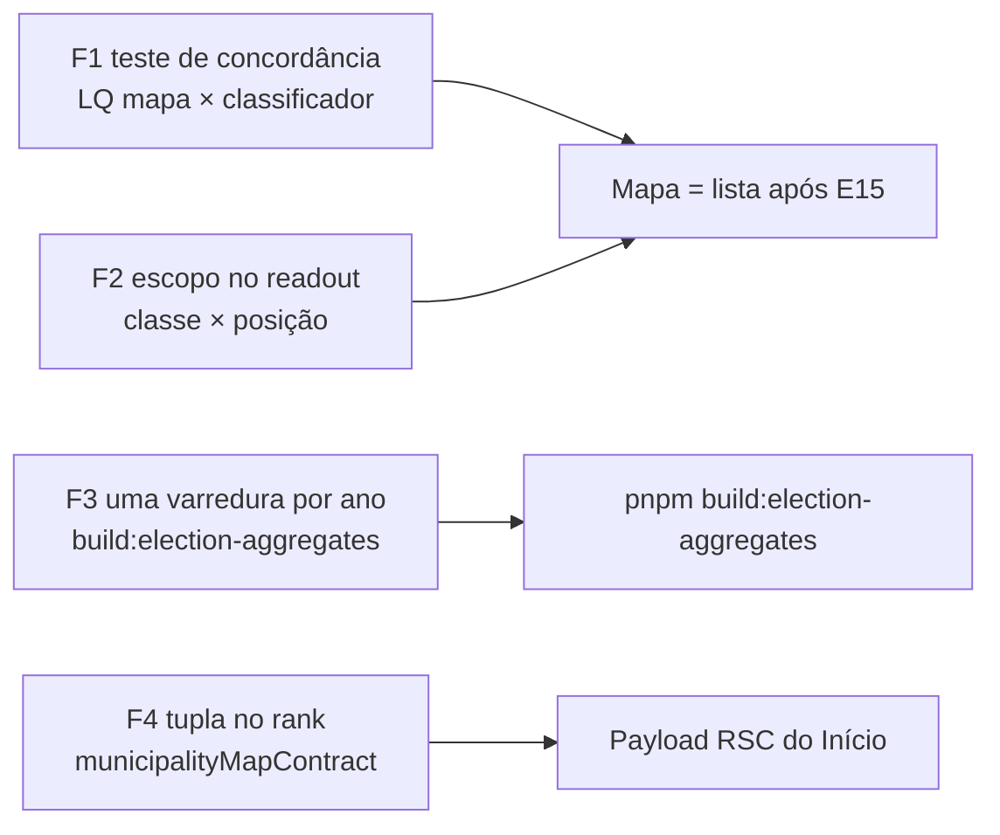

# Escala e DRY pós-B13 (escala relativa no mapa dos Municípios)

Status: entregue (2026-07-29)
Atualizado em: 2026-07-29
Item do roadmap: [docs/roadmap.md](../roadmap.md) (Fill-ins abertos, **B13+**, fill-in de engenharia)
Impeccable: A — N/A (nenhuma superfície nova; as quatro fases preservam o comportamento visível do B13, exceto uma linha de copy em F2)
Appetite: ~0,5–0,75 dia eng; quatro fases independentes, nenhuma com migration, collection ou `Consent`
Responsável: —

## Dados → decisão → apresentação

- **Vou apresentar dados?** Não (N/A) — o lote é custo e coerência de dados já entregues pelo B13/E10. F2 muda **uma frase** do readout do mapa (declarar o escopo de um número que hoje aparece sem qualificação), não a métrica nem a forma.
- **Anti-goals de dado:** nenhuma escala nova, nenhuma métrica nova, nenhum chart. Se uma fase começar a propor escala, ela virou outro item.

## Contexto

**B13** ([escala-relativa-mapa.md](escala-relativa-mapa.md), entregue 2026-07-26) trocou o coropleto quase monocromático do Início por três escalas relativas em classes discretas — quantis (novo default), padrão próprio (LQ) e posição no município — mais uma camada opcional de bolhas por válidos projetados coloridas pela classe do E10, e estendeu o artefato TSE commitado para v3 (`federalRankByIbgeCode`). O `/simplify` da entrega (três revisores em paralelo — quality / performance / reuse, 2026-07-26) aplicou o cleanup barato na hora e deixou quatro achados **maiores que cleanup**, registrados aqui.

Os dois primeiros são de **coerência**, não de custo, e é por isso que abrem o lote: o B13 criou duas superfícies que dizem a mesma coisa sobre um município (o mapa e a coluna "Classe" da lista) usando dois caminhos de cálculo diferentes, e criou um readout onde dois números vizinhos têm escopos geográficos diferentes sem dizer isso ao leitor. Nenhum dos dois é bug hoje; ambos são o tipo de deriva que só aparece depois que alguém recalibra (**E15**) ou depois que um assessor abre o mapa achando que vê a mesma classe que o coordenador vê.

**Já resolvido no simplify (não reabrir):** o bug semântico do `computeAggregateTerritorialClass` (somava o headroom dos slugs e comparava contra a mediana **de uma unidade**, o que classificava um grupo grande como `expansao` quando ele é `marginal` — a mediana agora escala por `slugs.length`, com teste); as bolhas passaram do centro do bounding box para o centróide real (`path.getCenter()`) e ganharam **pane próprio** com `z-index: 450`, porque o `bringToFront` do hover escondia a bolha atrás do polígono; `mode` entrou nas deps do efeito de bolhas; legenda e pintura passaram a compartilhar o mesmo predicado (discordavam nas bordas); a copy dos quantis parou de dizer "faixas de igual tamanho" (quantil iguala a **contagem** por faixa, não a largura); `NO_DATA_FILL` e o raio das bolhas viraram fonte única compartilhada entre mapa e legenda; `formatMunicipalityVoteRank` virou `formatPlacementOrdinal` em `electionFormat.ts` (client-safe, 2 consumidores); o flag `reduced` ambíguo saiu de `MapScaleClassing`; os buckets de rank viraram dados como os de LQ; o `default` morto da `ChoroplethLegend` caiu; `buildMunicipalitiesByIbgeCode` substituiu o agrupamento manual duplicado no loader; e o subtítulo do painel parou de dizer "em 2026, pelas estimativas da campanha" com 2022 selecionado (defeito herdado do B11).

## Objetivos

- Um lugar só decide o que é "o padrão próprio dele" — mapa e lista não podem divergir numa recalibração.
- Todo número do readout do mapa declara a geografia sobre a qual foi calculado, ou é calculado sobre a mesma geografia do vizinho.
- Uma varredura da fatia estadual do TSE por ano no `pnpm build:election-aggregates`, em vez de três.
- O payload RSC do Início não carrega a escala mais pesada do B13 quando ninguém pediu por ela.
- Guardrails: sem migration, sem collection, sem `Consent`, sem server action; contrato de URL, escalas, cortes (`TERRITORIAL_CLASS_ANCHORS`) e o artefato v3 **inalterados**; `overrideAccess: false` preservado em toda leitura com `user`.

## Decisões travadas

- **F1 pina a concordância com teste, não extrai um "serviço de LQ".** A razão é uma linha (`votos / válidos / padrão estadual`) escrita em dois lados por um motivo real: o classificador é `server-only` (arrasta o artefato de ~600 KB) e o painel é client component — foi exatamente por isso que `TERRITORIAL_CLASS_ANCHORS` mudou de casa para `src/lib/territorialClassAnchors.ts` no B13. O que falta não é uma abstração, é a **prova** de que os dois caminhos concordam. Fonte: `/simplify` B13 (2026-07-26). **Rejeitado:** mover o cálculo do LQ para o servidor e mandar `lqByCode` no bundle (paga bytes em toda visita para uma escala opcional, o oposto de F4); expor um helper puro compartilhado só para a divisão (wrapper raso — `depth check` do `engineering-standards.mdc` reprova).
- **F2 declara o escopo em vez de mudar o cálculo.** No readout do mapa a **posição** vem do artefato e vale para a cidade inteira (Salvador = 19 zonas somadas), enquanto a **classe** é calculada sobre os slugs que aquele usuário enxerga — dois assessores com fatias diferentes de Salvador veem classes diferentes para o mesmo polígono, e a lista mostra uma terceira (por slug, sobre o catálogo inteiro). O caminho barato e honesto é o que o E10 já travou como regra: a classe nunca aparece sem o porquê, e agora também não aparece sem a geografia. **Rejeitado:** classificar sempre sobre o catálogo inteiro ignorando o escopo (o mapa do assessor passaria a pintar municípios que ele não administra com a autoridade de um dado dele); esconder a classe para assessor (rebaixa a tela de quem mais usa o mapa).
- **F3 amplia o loader mais geral em vez de somar um quarto.** `loadFederalVotesByCityZoneAndCandidate` já lê a mesma fatia estadual que `loadCampoFederalVotesByCityZone` e um superconjunto da de `loadCandidateVotesByCityZone`; falta `party` no `select` para ele virar superconjunto **estrito** dos três. É build-time, então o ganho é tempo de build e não latência de request — o que o torna barato, não urgente. **Rejeitado:** view materializada / índice novo no Postgres (schema por um script que roda à mão); manter três varreduras "porque o build é offline" (é o mesmo argumento que deixou o script de 2 min virar 6).
- **F4 corta bytes sem cortar a escala.** `competitiveRankByYear` é ~57 KB dos ~63,6 KB que o B13 somou ao payload RSC, e o par `{rank, candidates}` repete duas chaves 1.251 vezes. Tupla `[rank, candidates]` corta ~metade sem mudar nada do que o usuário vê. **Rejeitado:** carregar o rank sob demanda por endpoint quando o usuário escolhe a escala (troca 10 KB de gzip por um round-trip e um estado de carregamento numa troca que hoje é instantânea — o "Feel the action" perde mais do que os bytes ganham); mandar só o ano selecionado (a troca de ano é o gesto central do mapa).
- **i18n e naming** seguem o AGENTS.md: identificadores em inglês, strings visíveis em pt-BR.

## Questões em aberto

- **F2 deve dizer o escopo no readout, na legenda, ou nos dois?** **Opções:** (a) uma linha no readout, junto do "por quê" da classe; (b) uma frase na nota da legenda; (c) ambos. **Recomendação:** (a) — a assimetria é entre dois números que se tocam **no readout**; na legenda a frase vira ruído para o coordenador, que é quem mais usa a tela e para quem escopo = catálogo.
- **F4 vale sozinho ou espera a próxima escala?** **Opções:** (a) fazer agora; (b) esperar E11/E12/B13 v2 trazerem mais um campo por município ao bundle. **Recomendação:** (a) — a linha do ledger que pedia "profiling antes de agir" (2026-07-23) foi respondida pelo B13, e a tupla é uma mudança de encoding local a `municipalityMapContract.ts` + um consumidor; esperar só aumenta o número que se vai cortar depois.

## Abordagem proposta

Componentes:

- **F1 — teste de concordância do LQ.** `MunicipalityMapPanel.tsx:210` calcula `lq[code] = votes / validVotes / statewideShare`; `municipalityTerritorialClass.ts:108` calcula `const lq = ownVotes / validVotes / stateShare`. Novo pin em `tests/unit/` que roda os dois caminhos sobre a mesma entrada (um município do catálogo, ano 2022) e exige o mesmo resultado, mais uma asserção de que ambos leem `TERRITORIAL_CLASS_ANCHORS`/o mesmo padrão estadual — a rede de segurança do **E15**, que vai mexer nos cortes. Sem mudança de runtime.
- **F2 — escopo no readout.** `MunicipalityMapPanel.tsx` (`relativeReadingFor` `:381` e `bubbleReadingFor`): quando o ator **não** é irrestrito e o polígono agrega mais de um slug do escopo, o texto da classe passa a nomear a geografia ("na sua carteira", contra "na cidade" da posição). A regra de quem é irrestrito já existe (`lib/campaignRoles.ts`); nada de novo no bundle.
- **F3 — uma varredura por ano.** `municipalityElectoralBaseline.ts:349` ganha `party: true` no `select`; `loadFederalVotesByCityZoneAndCandidate` passa a devolver o número **e** o partido por candidato, e `build-election-aggregates.mjs:87` (o `Promise.all` de 4 loaders) e `:189` (o laço do rank) passam a compartilhar uma leitura por ano — `loadCandidateVotesByCityZone` e `loadCampoFederalVotesByCityZone` viram dobras em memória (`isCampoParty` já é puro). Os dois loaders continuam exportados: são a superfície de leitura por candidato usada fora do build.
- **F4 — tupla no rank.** `municipalityMapContract.ts` troca `{ rank, candidates }` por `[rank, candidates]` em `competitiveRankByYear`, com um leitor nomeado no consumidor (`MunicipalityMapPanel`) para o índice não vazar como número mágico. `municipalityMapData.ts` emite a tupla; o teste de contrato do bundle acompanha.
- **Migration**: sem migration, sem collection, sem server action, sem rebuild de artefato (F3 não muda o **conteúdo** de `bahia-federal-baseline.json` — o snapshot test do artefato é justamente o pin de que não mudou).

## Dependências

- Nenhuma dura de outro item aberto. F1 é pré-requisito **suave** do **E15** (recalibrar os cortes sem o pin é onde mapa e lista divergem em silêncio); F2 é suave com **B13 v2**/E11 se estes tocarem o readout.
- Reusa: `territorialClassAnchors.ts`, `municipalityTerritorialClass.ts`, `municipalityElectoralBaseline.ts`, `municipalityMapContract.ts`, `campaignRoles.ts`, o snapshot test de `bahiaElectionAggregates`.

## Não escopo

- **Recalibrar as âncoras do LQ** — **E15** (backtest 2014–2022). Este lote só garante que, quando ela acontecer, as duas superfícies se movem juntas.
- **Rollup de Território de Identidade** — **E12**, que herda `computeAggregateTerritorialClass` do B13 em vez de escrever o seu.
- **Memoizar `computeAggregateTerritorialClass` para grupos multi-slug** — adiado com gatilho abaixo (o custo real só chega com os 27 TIs do E12).
- **`municipalityLabels` arrastando `municipalityCatalog` (~66 KB de fonte) para o chunk do mapa** — adiado com gatilho abaixo; medido em ~0,8 ms de init num chunk carregado sob demanda, ou seja, custo de leitura e não de usuário.
- **Rank em 2026** — não existe dado do TSE; a escala se declara indisponível e o painel cai para quantis (comportamento do B13, não débito).

## Rabbit holes

- **"Já que estou pinando o LQ, unifico o cálculo num módulo só."** Se alguém "só completar": ou o painel importa o classificador `server-only` (e o artefato de 600 KB entra no bundle do cliente), ou nasce um wrapper raso sobre uma divisão. **Mitigação:** F1 é **só teste**; qualquer mudança de runtime aqui precisa de evidência nova.
- **"Já que estou no readout, reescrevo a hierarquia do painel."** Se alguém "só completar": vira um ciclo Impeccable inteiro num lote classificado A. **Mitigação:** F2 é uma condição e uma string; o painel saiu de um critique recente.
- **"Já que estou no script, refatoro o pipeline de agregados."** Se alguém "só completar": o script vira framework e o snapshot do artefato passa a mudar por acidente. **Mitigação:** F3 tem um critério binário — `pnpm build:election-aggregates` roda e o snapshot test do artefato **não** muda.

## Adiado com gatilho

- **`CampaignConceptLink` / `MapLegendNote` compartilhados.** O link "Saiba mais" para `/campanha/conceitos` e o parágrafo de nota da legenda estão em 2–3 pontos (`MapScaleLegend`, `ChoroplethLegend`, tooltips do E18). Revisitar quando: **3º call site fora do mapa** pedir o mesmo par — abaixo disso é a abstração prematura que o `engineering-standards.mdc` proíbe (3+ call sites ou uma política com nome).
- **`municipalityLabels.ts` puxa `municipalityCatalog` + conceitos para o chunk do mapa.** Separar as constantes de apresentação da classe (`territorialClassMapFill`, labels) do resto do módulo removeria ~66 KB de fonte do chunk. Revisitar quando: uma **3ª superfície cliente** precisar da apresentação da classe (hoje são a lista e o mapa) — ou quando o chunk do mapa aparecer num orçamento de bundle real.
- **`computeAggregateTerritorialClass` sem memo.** Cada polígono multi-slug (só Salvador hoje) reclassifica por render. Revisitar no **E12**: 27 TIs × ~16 municípios cada é outra ordem de grandeza, e o precedente de memo de processo já está escrito (`bahiaElectionAggregates`, `municipalityVoteRank`).
- **Modo compare (`?compare=`): varredura federal no loader.** F3 unificou o scan no `build:election-aggregates`; em runtime `municipalityMapData` ainda pode chamar `loadCandidateVotesByCityZone` até 3× por ano para o divergente. Revisitar quando: profiling do compare no dashboard ou fechamento da linha em [TECH-DEBT.md](../TECH-DEBT.md) (“Compare mode still queries per candidate”).

## Explicitamente fora (descartes deste triage)

- **`lqMultipleFormatter` deveria morar em `electionFormat.ts`** — score 1; formatador de uma linha com um consumidor. Se ganhar o segundo, vai junto de graça.
- **`lqByCode` recalcula na troca de ano mesmo fora do modo LQ** — o próprio revisor de performance concluiu que o guard custa mais legibilidade do que economiza (417 divisões).
- **`MapFeatureReadout` e `TerritoryListColumns` com formatadores de percentual próprios** — pré-existente em `main`, fora do escopo do B13, e unificar exige decisão de produto sobre a casa decimal (mesmo descarte registrado no [escala-dry-pos-e10.md](escala-dry-pos-e10.md)).
- **Flakiness dos e2e** (`campaignMunicipalities`, `campaign-pwa`) — reproduzida em `main` limpo, portanto não é débito do B13: foi para o ledger ([TECH-DEBT.md](../TECH-DEBT.md), linha de test-infra, causa afinada e prioridade P3 → P2).
- **`territorialClassMapFill` como segunda paleta fora do `DESIGN.md`** — resolvido na própria sessão: o `DESIGN.md` § Status Badge agora declara o acoplamento (Leaflet pinta hex, não `var()`) e a obrigação de re-derivar à mão.
- **Skeleton compartilhado do mapa** — score 2; um único `loading` do painel já cobre o caso.
- **Sincronizar `scaleMode` quando o ano esconde rank competitivo** — score 2; o readout já declara indisponível; trocar escala automaticamente seria surpresa de UX.
- **Separar memos de classificação territorial no painel** — score 2; micro-otimização de render sem gatilho de produto.

## Referências

- `docs/roadmap.md` (Fill-ins abertos — **B13+**)
- [escala-relativa-mapa.md](escala-relativa-mapa.md) — o pai do lote (B13 ✓)
- [classificacao-territorial-relativa.md](classificacao-territorial-relativa.md) — E10 ✓, dono dos cortes que F1 protege
- [conta-da-cadeira.md](conta-da-cadeira.md) — E8 ✓, dono dos válidos projetados que as bolhas dimensionam
- [TECH-DEBT.md](../TECH-DEBT.md) — linha "Map bundle serializes all years × scenarios" (F4 responde ao pedido de profiling de 2026-07-23) e a linha de flake dos e2e
- `src/components/campaign/map/MunicipalityMapPanel.tsx` (`:210` LQ, `:381` readout) — F1, F2
- `src/utilities/municipalityTerritorialClass.ts` (`:108` LQ) + `src/lib/territorialClassAnchors.ts` — F1
- `src/utilities/municipalityElectoralBaseline.ts` (`:242`, `:286`, `:329`) + `scripts/build-election-aggregates.mjs` (`:87`, `:189`) — F3
- `src/utilities/municipalityMapContract.ts` + `src/utilities/municipalityMapData.ts` — F4
- `DESIGN.md` § Status Badge — as duas encodificações da classe territorial (badge e fill do mapa)
- AGENTS.md — escada de cache, `overrideAccess: false` com `user`, gate por entrega
