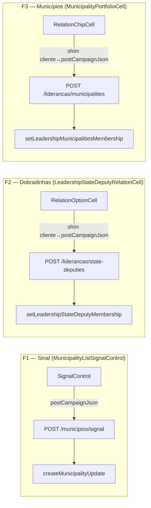

# Impl: Padrão de escrita de célula — migrar quick-edits via form action para rota (célula → rota)

Status: aprovado
Atualizado em: 2026-08-04
Issue: #368
Intenção: docs/plans/escala-dry-pos-b155-padrao-rota.md
Appetite restante: ~0,5–1 dia eng; sem migration

## Leitura da intenção

- **Outcome:** As 3 anomalias de quick-edit (1 sinal em municípios, 2 colunas em lideranças) que ainda passam por form action são migradas para o padrão `campaignJsonMutationRoute` + `postCampaignJson` — mesmo transporte das 8+ rotas irmãs que já usam. Sem mudança de comportamento, sem migration.
- **O que NÃO negociar:** `campaignJsonMutationRoute` é obrigatório (codebaseConventions recusa POST nu); as actions record existentes são reusadas sem mudança de domínio; `useCampaignCellAutosave` nos controles de lista mantém debounce/abort.
- **O que reavaliar:** A hipótese da intenção é que cada controle troca `useActionState`/form action por `postCampaignJson` diretamente. Para F2 e F3 isso é mais sutil — o `MunicipalityPortfolioCell` e o `LeadershipStateDeputyRelationCell` são células compartilhadas que aceitam `commitAction`/`membershipAction` com assinatura `(state, formData) => Promise<{status, message}>`. A abordagem recomendada é manter as shared cells inalteradas e trocar **o que a página passa** de server action para um shim cliente que chama `postCampaignJson` → essa é a mudança de transporte preservando o contrato de chamada.

## Abordagem recomendada

**Opções consideradas:** A (controles trocam internamente) | B (shim cliente com mesma assinatura) | C (refatorar shared cells para aceitar ambos os transportes)

**Recomendação:** **B para F2+F3, A para F1** — porque:

- **F1 — A:** O `MunicipalityListSignalControl` é específico da lista de municípios e só tem 1 consumidor. Trocar `useActionState` → `postCampaignJson` direto é simples e elimina a dependência de form action no componente. O `useCampaignFormSuccessToast` é substituído por feedback inline (padrão dos outros controles da mesma lista que já são rota: advisors, leaderships, level, trend — todos usam `useCampaignCellFailureChannel` + mensagem inline).
- **F2+F3 — B:** `MunicipalityPortfolioCell` e `LeadershipStateDeputyRelationCell` são shared cells com múltiplos consumidores (lideranças + assessores + dobradinhas). Mudar seu transporte interno quebraria os outros consumidores ou exigiria refatoração dupla. Um shim cliente que aceita `(state, formData)` e chama `postCampaignJson` preserva o contrato e isola a mudança ao call site da página `/campanha/liderancas`.

**Rejeitadas:**

- **A para F2+F3:** refatorar shared cells para `postCampaignJson` interno → afeta assessores (outro PR, outro domínio) e quebra o princípio de "transporte apenas".
- **C:** adicionar um terceiro modo de transporte às shared cells (prop `transport: 'form' | 'route'`) → complexidade desnecessária para 2 call sites, e o plano é que toda escrita de célula migre para rota — não faz sentido manter os dois modos.

### Componentes / mudanças

- **`POST /campanha/municipios/signal/route.ts`** (nova rota): `campaignJsonMutationRoute` com body `{ municipalityId, body?, signalType? }`. Reusa `createMunicipalityUpdate({ kind: 'sinal', … })` + `revalidateMunicipalityListPaths`. Response: `{ status: 'success', message, savedSignal: { kind, body, signalType, createdAt } }`.
- **`MunicipalityListSignalControl`** (editado): remove `useActionState`/`formAction` prop; troca por `postCampaignJson(SIGNAL_ENDPOINT, …)` com feedback via `useCampaignCellFailureChannel` (padrão dos controles irmãos). Remove `useCampaignFormSuccessToast`.
- **`MunicipalityList` + `municipios/page.tsx`** (editado): remove `signalFormAction` prop; `MunicipalityListSignalControl` já não a recebe.
- **`POST /campanha/liderancas/state-deputies/route.ts`** (nova rota): `campaignJsonMutationRoute` com body `{ leadershipId, stateDeputyId, assigned }`. Reusa `setLeadershipStateDeputyMembership`. Response: `{ status: 'success', message }`.
- **`POST /campanha/liderancas/municipalities/route.ts`** (nova rota): `campaignJsonMutationRoute` com body `{ leadershipId, municipalityIds[], assigned }`. Reusa `setLeadershipMunicipalitiesMembership`. Response: `{ status: 'success', message }`.
- **`liderancas/page.tsx`** (editado): troca `setLeadershipMunicipalitiesFormAction` e `setLeadershipStateDeputyMembershipFormAction` por shims cliente que chamam `postCampaignJson` nas novas rotas e retornam `{ status, message }`.
- **`liderancas/formActions.ts`** (editado): remove `setLeadershipStateDeputyMembershipFormAction` e `setLeadershipMunicipalitiesFormAction` (ficam sem consumidores).
- **`municipalityStaffFormActions.ts`** (editado): remove `createMunicipalityListSignalFormAction`.
- **`municipio/[slug]/v2/formActions.ts`** (editado): `createMunicipalityV2SignalFormAction` deixa de importar de `municipalityStaffFormActions` e passa a chamar a rota (ou vira um shim rota também).
- **Migration:** nenhuma.
- **Access / Consent:** sem mudança — as actions record reusadas já têm access control (`overrideAccess: false`). A rota herda a verificação de sessão do `campaignJsonMutationRoute` (que chama `getCampaignUser` implicitamente via as actions — na verdade, o `campaignJsonMutationRoute` NÃO autentica; quem autentica são as actions chamadas dentro do handler. As actions existentes já fazem `requireCampaignPageActor` → OK).
- **UI:** Impeccable A — refactor de transporte; sem mudança de comportamento nem de UI. Nenhuma shape/craft/critique.

### Dados → forma

Não se aplica (transporte apenas, sem mudança de apresentação).

## Decisões de engenharia

### Shim cliente vs refatoração interna da shared cell

**Opções:** A (shim: função cliente com assinatura de form action que chama `postCampaignJson`) | B (refatorar `RelationChipCell`/`RelationOptionCell` para `postCampaignJson` interno)

**Recomendação:** A — porque as shared cells têm múltiplos consumidores e a mudança de transporte é específica de `/campanha/liderancas`. Um shim é ~15 linhas, auto-contido no call site, e a assinatura `(state, formData) => Promise<{status, message}>` já é exatamente o que `postCampaignJson` resolve. As shared cells chamam `commitAction({}, formData)` como async function regular (não é `useActionState`), então qualquer função com a assinatura certa funciona.

**Rejeitadas:** B porque exigiria refatorar também os consumidores de assessores/dobradinhas, que não estão no escopo deste lote.

### F1: remover `formAction` prop vs wrapper interno

**Opções:** A (remover a prop, controle chama `postCampaignJson` direto) | B (manter a prop, passar um shim)

**Recomendação:** A — o `MunicipalityListSignalControl` tem 1 consumidor e é específico da lista de municípios. Remover a prop `formAction` simplifica o componente e o torna consistente com os controles irmãos (AdvisorsControl, LeadershipsControl, LevelControl, TrendControl — nenhum recebe form action, todos chamam `postCampaignJson` internamente).

**Rejeitadas:** B porque manteria uma prop desnecessária e um nível de indireção que os controles irmãos já não têm.

### Revalidação após mutation

**Situação:** As actions record (`setLeadershipStateDeputyMembership`, `setLeadershipMunicipalitiesMembership`, `createMunicipalityUpdate`) já fazem `revalidatePath` internamente. As form actions wrappers NÃO adicionavam revalidação extra para a lista de `/campanha/liderancas`. A intenção confirma: "as actions record reusadas já revalidam paths de detalhe; a lista onde o chip está NÃO é revalidada — contrato B34/B31."

**Decisão:** As novas rotas mantêm esse contrato — sem `revalidatePath` adicional. Se a lista precisar de refresh, o RSC re-fetch natural (navegação ou recarga) cobre. Alterar o contrato de revalidação agora seria mudança de comportamento, não de transporte.

## Fases verificáveis

### Fase 1 — F1: sinal de municípios (ROI mais alto — mesma superfície já no padrão)

1. Criar `src/app/(campaign)/campanha/(app)/municipios/signal/route.ts` + `types.ts`
2. Editar `MunicipalityListSignalControl`: remover `useActionState`/`formAction` prop, trocar por `postCampaignJson` + `useCampaignCellFailureChannel`
3. Remover `signalFormAction` prop de `MunicipalityList` e `municipios/page.tsx`
4. Remover `createMunicipalityListSignalFormAction` de `municipalityStaffFormActions.ts`
5. Atualizar `municipio/[slug]/v2/formActions.ts` (shim para a rota)
6. Atualizar `WizardSignalBodyStep` (usa `createMunicipalityListSignalFormAction` como `useActionState`)
7. Adicionar rota ao prewarm do e2e setup
8. Rodar gates: `pnpm gate:fast`, testes afetados

### Fase 2 — F2 + F3: colunas de `/campanha/liderancas`

1. Criar `src/app/(campaign)/campanha/(app)/liderancas/state-deputies/route.ts` + `types.ts`
2. Criar `src/app/(campaign)/campanha/(app)/liderancas/municipalities/route.ts` + `types.ts`
3. Criar shims cliente em `liderancas/page.tsx` (ou módulo auxiliar) que chamam `postCampaignJson`
4. Trocar `commitAction`/`membershipAction` em `liderancas/page.tsx` para os shims
5. Remover `setLeadershipStateDeputyMembershipFormAction` e `setLeadershipMunicipalitiesFormAction` de `liderancas/formActions.ts`
6. Adicionar rotas ao prewarm do e2e setup
7. Rodar gates: `pnpm gate:fast`, testes afetados (campaignLeaderships e2e)

### Fase 3 — Gates finais

1. `pnpm gate:fast` (todas as fases)
2. `pnpm exec knip` — remover exports órfãos
3. `pnpm check:cycles`
4. `pnpm test:e2e` — campaignMunicipalities, campaignLeaderships
5. `pnpm push` + PR + auto-merge

## Rabbit holes / Não escopo (engenharia)

- **Generalizar controles de chip** durante a migração — refactor de transporte apenas; os 2+2 controles seguem espelhos.
- **Mudar o contrato do sinal** (hoje sem debounce automático — `useCampaignCellAutosave` era mencionado na intenção mas o código atual não o usa; o controle faz submit explícito com botão "Registrar sinal").
- **Fundir com UX** — nenhum achado de critique nesta superfície; manter o lote só-engenharia.
- **Adicionar `revalidatePath` na lista de `/campanha/liderancas`** — seria mudança de comportamento, não de transporte.

## Riscos e mitigação

- **`WizardSignalBodyStep`:** Este componente usa `createMunicipalityListSignalFormAction` com `useActionState`. Migrar para rota exigiria mudar o fluxo do wizard (que hoje usa form POST). **Mitigação:** O `WizardSignalBodyStep` pode continuar usando uma server action — o que muda é que essa server action deixa de ser `createMunicipalityListSignalFormAction` (que era uma casca sobre `runCampaignFormAction`) e vira uma ação própria que chama `createMunicipalityUpdate` diretamente (ou via `postCampaignJson` — mas no wizard faz mais sentido manter server action, já que é um form multi-campo, não um quick-edit de célula). A intenção diz que "forms multi-campo usam server action" — e o wizard é exatamente isso. Então `createMunicipalityListSignalFormAction` é substituída por uma action local ao wizard.
- **`codebaseConventions`:** O teste varre `src/app` por `POST` handlers sem `campaignJsonMutationRoute`. As 3 novas rotas entram automaticamente no enforcement. **Mitigação:** As rotas são criadas com `campaignJsonMutationRoute` desde o início.
- **`knip`:** Remover as 3 form actions vai orfanar exports. **Mitigação:** Rodar `pnpm exec knip` e verificar cada remoção com `git grep`.

## Aceite de engenharia

- [ ] Aceite de produto da intenção ainda coberto
- [ ] Invariantes AGENTS/engineering-standards
- [ ] Testes de domínio previstos (unit/int) onde access/write paths mudam
- [ ] `codebaseConventions` — novas rotas passam no sweep
- [ ] `knip` — zero novos exports órfãos
- [ ] `pnpm check:cycles` — zero ciclos
