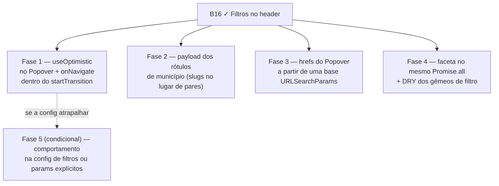

# Escala e DRY pós-B16 (filtros no header da lista)

Status: rascunho
Atualizado em: 2026-07-25
Item do roadmap: [docs/roadmap.md](../roadmap.md) (B16+, fill-in de engenharia)
Impeccable: A — N/A (sem superfície UI nova; as fases preservam o comportamento visível de B16)
Appetite: ~0,5–1 dia eng; três fases independentes, nenhuma com migration
Responsável: —

## Dados → decisão → apresentação

- **Vou apresentar dados?** Não (N/A) — o lote é custo de render/transferência das opções de filtro já entregues em B16; nenhuma métrica nova.
- **Anti-goals de dado:** N/A.

## Contexto

**B16** ([filtros-no-header-lista-municipios.md](filtros-no-header-lista-municipios.md), entregue 2026-07-25) colocou um Popover de filtro em cada header da lista de municípios, com multi-seleção OR em município (435 opções), território, assessores e tendência. A passagem `/simplify` da entrega (três revisores em paralelo — quality / performance / reuse, 2026-07-25) aplicou o cleanup barato na hora e deixou três achados **maiores que cleanup**, registrados aqui.

**Defeitos funcionais achados na revisão e corrigidos na entrega (não reabrir):** (1) as facetas omitiam só o param multi, então marcar "Prioritária" escondia todo município não-prioritário da lista onde o próprio check mora, e "Sem assessor" esvaziava o popover de Assessores — agora cada faceta omite o **grupo de params do seu popover** (`slugs`+`priority`, `advisors`+`coverage`), coberto por int test; (2) "todas as tendências" tinha duas codificações — selecionar as três deixava três `trend=` na URL filtrando nada, com o funil se declarando inativo — agora `parseMunicipalityListParams` canonicaliza o conjunto completo para ausente e `narrowingMunicipalityTrends` sumiu; (3) o Território tinha desaparecido do mobile (o filtro virou multi e o mobile só montava `single|toggle`), de volta como `MobileMultiFilterField` alimentado pela faceta.

**Já resolvido no simplify (não reabrir):** setter único sobre params crus em `municipalityUi.ts` (elimina as duas escadas de `if` e os três casts `as BahiaIdentityTerritory[]` / `as PoliticalTrendStatus[]` / `as MunicipalityListState['coverage']`, além do `state.trends!`); cadeia de três funções do resumo de filtros colapsada com helper `firstNamesLabel`; remoção do array `municipalitySlugFilterOptions` (435 objetos montados no bundle do cliente e nunca lidos), do modo de seleção `'name'` e do campo `clearWhenOptionsAtLeast`; unificação das duas linhas de opção do Popover num `FilterOptionLink` com prop `checkbox`; `useEffect` de limpeza da busca dobrado no `onOpenChange`; dois `onClick={stopPropagation}` que não protegiam nada; memoização dos rótulos normalizados para busca; empty state da tabela navegando pela transição compartilhada e preservando `sort`/`dir`; `colSpan` derivado de uma constante junto do header; facets reusando o escopo já carregado na request (`loadMunicipalityScope` passou a selecionar `region`); `getEligibleAdvisorOptions` de volta a coordenador-only, com `loadAdvisorSummaries` rotulando o facet de assessores e as duas leituras em `Promise.all`; `allParamValues` sem o split por vírgula que nada emitia.

## Objetivos

- Um único mecanismo de estado otimista nos controles de filtro/sort, sem janela de reversão visível em cliques encadeados.
- Abrir o Popover de município (435 opções) sem custo de render proporcional a duas serializações de estado por opção.
- Parar de mandar ~20 KB de rótulos de município do servidor para o cliente a cada navegação da lista.
- Guardrails: sem migration, sem collection, sem `Consent`; contrato de URL (`?slug=`/`?region=`/`?advisor=`/`?trend=`) e comportamento visível de B16 inalterados.

## Decisões travadas

- **Um plano B16+, três fases independentes.** Mesmo precedente de `A9+`/`O0+`/`RS+`: um registro no roadmap, PR por fase, nenhuma fase bloqueia a outra. **Rejeitado:** um item de trilha B (não é feature, é custo herdado); três fill-ins separados (poluiria a lista para ~0,5d de trabalho).
- **Contrato de URL congelado.** As fases são internas ao render e ao payload; qualquer mudança em nome de param ou semântica de "todas as tendências = sem filtro" sai do escopo — **B18** (filtros salvos) já vai depender desse contrato. **Rejeitado:** aproveitar a Fase 2 para encurtar params (`?s=`), que quebraria URLs compartilhadas e o `resolveMunicipalityListUrl`.
- **i18n e naming** seguem o AGENTS.md: identificadores em inglês (`useOptimistic`, `buildMunicipalityFilterHref`, `municipalityFilterOptionsForSlugs`), strings visíveis em pt-BR.

## Questões em aberto

- **Fase 2: mandar slugs e rotular no cliente, ou só omitir quando o facet = catálogo inteiro?** **Opções:** (A) `columnFilterOptions.name` vira `string[]` e o Popover rotula com `municipalityNameBySlug` (já no bundle); (B) servidor manda `undefined` quando o facet cobre as 435 e o cliente cai no catálogo; (C) manter. **Recomendação:** A — corta o payload nos dois casos (filtrado e não filtrado) e mantém uma fonte de rótulo só; o custo é a assimetria de a coluna `name` receber valores enquanto `region`/`advisor` recebem pares.
- **Fase 3: `URLSearchParams` base + swap de um param, ou cap de lista?** **Opções:** (A) montar a base uma vez e trocar só o param da opção; (B) renderizar as primeiras N até a busca estreitar; (C) as duas. **Recomendação:** A — mantém a lista completa navegável por teclado/scroll (B muda UX sem pedido de campo) e é onde está o custo real (~870 parses por abertura).
- **Fase 1 vale o risco?** A janela de reversão só aparece em dois cliques antes de o servidor responder. **Recomendação:** fazer, mas com verificação manual do caso que originou o mecanismo atual (clicar em "Prioritária" e ver se não desmarca sozinha) antes de considerar pronta — foi exatamente o bug relatado em campo em 2026-07-25.

## Abordagem proposta

Componentes:

- **`src/components/campaign/MunicipalityHeaderFilter.tsx`** (Fase 1): trocar o par `{ baseKey, next }` em `useState` por `useOptimistic(state, (_, next: MunicipalityListState) => next)`. React descarta o valor otimista quando a transição de navegação assenta, o que apaga a comparação `optimistic?.baseKey === stateKey`. Precedente no código: `ActionPlanTaskChecklist.tsx`.
- **`src/components/campaign/CampaignListPending.tsx`** (Fase 1): mover `onNavigate?.()` para **dentro** do callback de `startTransition` — `useOptimistic` fora de transição dispara warning do React. O anchor é compartilhado (`MunicipalitySortableHead`, paginação, empty state), então a mudança precisa de smoke nas três superfícies.
- **`src/app/(campaign)/campanha/(app)/municipios/page.tsx` + `MunicipalityList.tsx`** (Fase 2): `columnFilterOptions.name` passa a carregar slugs; o Popover rotula com `municipalityFilterOptionsForSlugs` (já existe em `municipalityUi.ts`) no cliente.
- **`src/utilities/municipalityUi.ts`** (Fase 3): expor um builder que receba os params canônicos uma vez e devolva o href de cada opção trocando um único valor, em vez de `toggleMunicipalityMultiFilterValue` + `buildMunicipalityFilterHref` (duas voltas state→raw→parse) por opção renderizada.
- **`src/utilities/municipalityPageData.ts`** (Fase 4): hoje `loadMunicipalityListFilterFacets` é aguardado **depois** do `Promise.all` das leituras principais, então toda request com filtro ativo paga um round-trip serial a mais. A chave da semente sai de `where` de forma síncrona, então dá para passar a **promise** do escopo como semente e entrar no mesmo `Promise.all`.
- **DRY que caiu no mesmo lote** (Fase 4, tudo pequeno): `municipalitySlugSet`/`municipalityNameBySlug` refazem o que `isMunicipalitySlug`/`getMunicipalityCatalogEntry` já exportam em `municipalityCatalog.ts`; "limpar tudo preservando o sort" está escrito literalmente igual em `MunicipalityFilters.tsx` e `MunicipalityList.tsx` (vira `clearMunicipalityListFilters`); os selects mobile continuam lendo a verdade do servidor enquanto os popovers desktop já são otimistas — se a Fase 1 virar um hook, o mobile usa o mesmo.
- **Sem migration, sem collection, sem server action.**

## Dependências

- **B16 ✓** (entregue 2026-07-25) — este plano só existe sobre o que ele entregou.
- Suave com **B17** (seletor de colunas) e **B18** (filtros salvos): ambos pousam na mesma barra/header; fazer a Fase 1 antes evita replicar o mecanismo otimista atual num terceiro controle.
- Reusa `campaignListUrl.ts`, `municipalityUi.ts`, `campaignMunicipalityScope.ts`, `municipalityViewModels.ts`.

## Não escopo

- Qualquer mudança de UX dos filtros (novos params, chips, ordenação de opções) → **B17**/**B18** ou fill-in próprio.
- Unificar a busca do Popover com a busca da lista (`matchesAtWordStart` vs `includes`) → ver Adiado com gatilho.
- Resiliência do build do site público ao global `metadata` ausente → bullet próprio na seção "Site público" do roadmap (pai diferente; não entra neste lote).

## Rabbit holes

- **"Já que estou no Popover, uso `ui/Command`."** O componente existe (`src/components/ui/command.tsx`), mas trocar a lista por `Command` reescreve seleção, teclado e o modo checkbox de quatro filtros de uma vez. **Mitigação:** fora deste lote; ver gatilho abaixo.
- **"Aproveito para tornar a config de filtros realmente genérica."** `municipalityFilterDefinitions` hoje é genérica na forma e especializada em todo consumidor. Consertar de verdade significa mover comportamento (`toApplied(state, value)`) para a config e reescrever os dois consumidores. **Mitigação:** Fase 4 condicional — só se a Fase 1 esbarrar nela; senão, aceitar e documentar.
- **"Enquanto mexo no payload, mando o catálogo inteiro pro cliente e acabou."** Isso ressuscita os 435 objetos que o simplify acabou de remover do bundle. **Mitigação:** a Fase 2 manda **slugs do facet**, não o catálogo.

## Adiado com gatilho

- **`MunicipalityFilterHead` vs `MunicipalitySortableHead` (gêmeos).** Revisitar quando existir um **3º** header não-ordenável com filtro — hoje só "Assessores" justifica o par.
- **Popover sobre `ui/Command`.** Revisitar quando um **2º** Popover de busca com multi-seleção aparecer no produto (candidato: B17/B18).
- **Predicado de busca unificado (`includes` no Popover vs `matchesAtWordStart` na lista).** Revisitar se alguém em campo estranhar que buscar "cruz" no Popover casa "Santa Cruz" mas a busca da lista não se comporta igual.
- **Multi-seleção mobile honesta.** O `<select>` com `value=""` e prefixo `✓` é um stand-in deliberado (chips de `RelationMultiSelect`/`CampaignFilterChips` são a alternativa pronta). Revisitar se o R6 (critique da vertical) apontar o controle, ou se um assessor reclamar em uso real.
- **Cap/virtualização das 435 âncoras do popover.** Só vale junto com a Fase 3 (ou com `ui/Command`); sozinho troca custo por UX pior. Revisitar se a Fase 3 não bastar em telefone de campo.
- **Leitura única do catálogo acessível (≤435 linhas) com filtro/faceta/sort em memória.** Colapsaria list query + escopo + até 3 facetas numa leitura, mas mexe na semântica de E8/E9. Revisitar se as leituras full-scope aparecerem no p95 do `/campanha/municipios`.
- **`getEligibleAdvisorOptions` devolvendo `phone`** para o coordenador derivar `loadAdvisorSummaries` em memória (−1 query). Revisitar quando a lista de assessores crescer além de algumas dezenas.
- **`onNavigate` + estado otimista em `CampaignFilterChips` e na paginação.** Revisitar quando a Fase 1 extrair o hook — aí é adoção, não duplicação.

## Explicitamente fora (simplify desta sessão — não reabrir)

- Renomear/mover o gêmeo `MunicipalityFilterHead`, tirar `text-left`/`text-muted-foreground` redundantes do header, branches `align === 'right'|'center'` inalcançáveis no caminho com filtro (score ≤2).
- `aria-live` do resumo de filtros re-anunciando por tecla: **pré-existente**, fora do diff de B16 — só entra se virar achado de a11y no R6.
- Tolerância a params separados por vírgula em `allParamValues`: removida no simplify; não reintroduzir sem um caso real de URL editada à mão.
- `columnCount = isStaffView ? 9 : 5` derivado de um array de descritores de coluna; over-select das facetas (chavear o cache por `where + select` quebraria a semente que torna o caso comum grátis); bundle de metas rodando no caminho de zero resultados (deliberado — a visão geral fica zerada na tela); quarta grafia de `{ value, label }` e o comparador `localeCompare('pt-BR')` repetido (drift pré-existente, não regressão deste diff).
- `CampaignListEmptyState` compartilhado e as quatro cópias locais de `firstValue`: **absorvidos no C8** ([escala-dry-pos-c6.md](escala-dry-pos-c6.md)) — são de outro pai (shells de lista de campanha), não de B16.

## Referências

- [filtros-no-header-lista-municipios.md](filtros-no-header-lista-municipios.md) — B16, entrega que originou o lote
- [escala-dry-pos-reset-senha-perfil.md](escala-dry-pos-reset-senha-perfil.md) — precedente de plano por fases pós-simplify
- `src/components/campaign/MunicipalityHeaderFilter.tsx`, `MunicipalitySortableHead.tsx`, `MunicipalityList.tsx`, `MunicipalityFilters.tsx`
- `src/components/campaign/CampaignListPending.tsx`, `ActionPlanTaskChecklist.tsx` (precedente `useOptimistic`)
- `src/utilities/municipalityUi.ts`, `src/utilities/municipalityPageData.ts`, `src/utilities/campaignListUrl.ts`
- `src/app/(campaign)/campanha/(app)/municipios/page.tsx`
- `docs/roadmap.md` (fill-ins, B16+)
- AGENTS.md — naming em inglês, `overrideAccess: false`, client boundary
