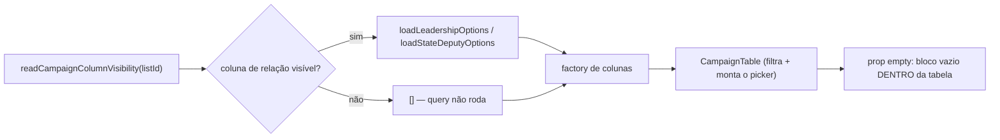

# Escala e DRY pós-B17 (seletor de colunas)

Status: entregue
Atualizado em: 2026-07-29
Item do roadmap: [docs/roadmap.md](../roadmap.md) (Fill-ins abertos, **B17+**)

**Revisão (2026-07-29):** F1 implementado via condicionamento dos loaders em `dobradinhas/page.tsx` e `liderancas/page.tsx` à leitura prévia do cookie `campaign_columns`. F2 implementado movendo o `CampaignListEmptyState` para a prop `empty` nas tabelas de demandas, organizações e apoiadores.
Impeccable: A — N/A na F1 (só loader); a F2 move um bloco já desenhado (`CampaignListEmptyState`) para dentro de um shell existente, sem pixel novo
Appetite: ~0,5 dia eng, duas fases independentes. Se a F1 sozinha estourar meio dia, a F2 é cortável.
Responsável: —

## Dados → decisão → apresentação

- **Vou apresentar dados?** Não (N/A) — nenhuma métrica, série ou mapa nasce aqui. A F1 **remove** uma query, a F2 mantém montado um controle que já existe.
- **Anti-goals de dado:** N/A.

## Contexto

O B17 (entregue 2026-07-28) fez o seletor de colunas filtrar **no servidor**: `resolveVisibleColumns` corta a coluna antes do loop de linhas, então uma coluna oculta não gasta 25 chamadas de `cell()` e não entra no payload RSC. Em `/campanha/liderancas` isso significa 25 ilhas `MunicipalityPortfolioCell` ou `LeadershipStateDeputyRelationCell` a menos — um ganho bem maior que qualquer custo do picker.

O `/simplify` do fechamento (2026-07-28) mediu o que **não** foi economizado e achou duas lacunas, ambas de estrutura, nenhuma de cálculo:

**F1 — a coluna oculta ainda paga a query da relação.** As páginas carregam o catálogo da relação dentro do `Promise.all` e leem o cookie **depois**:

```ts
// src/app/(campaign)/campanha/(app)/dobradinhas/page.tsx:153-161
const [{ rows, totalDocs, totalPages, filterFacets }, leadershipOptions] = await Promise.all([
  loadStateDeputyListPageData(payload, user, state),
  loadLeadershipOptions(payload, user),
])
const columnVisibility = await readCampaignColumnVisibility('dobradinhas')
```

`loadLeadershipOptions` (`src/utilities/campaignRelationOptions.ts:114`) é `limit: 0, pagination: false, depth: 1` — toda liderança que o ator enxerga, com o `contact` populado — e existe só para alimentar a célula de relação da coluna "Lideranças". Esconder a coluna não desliga a query. `loadStateDeputyOptions` (`:85`) é o gêmeo em `/campanha/liderancas`. `cookies()` não faz I/O (lê o request store já parseado), então antecipar a leitura é de graça: é ordem de statements, não uma query nova.

**F2 — o picker some junto com a tabela no estado vazio.** Três superfícies trocam a tabela inteira por um bloco vazio (`{rows.length ? <tabela/> : <CampaignListEmptyState/>}` em `demandas/page.tsx:149`, `organizacoes/page.tsx:103` e no ternário de `apoiadores/page.tsx:65`), enquanto municípios, lideranças e territórios mantêm a tabela montada e passam o vazio pela prop `empty` que a `CampaignTable` já expõe (`CampaignTable.tsx:153`, renderizada em `:210`). Antes do B17 a diferença era invisível; agora, quem filtra até zero linhas nessas três rotas perde junto o botão "Colunas" — inclusive quando a coluna oculta não tem nada a ver com o filtro. A saída existe (limpar o filtro), mas o controle desaparecer por causa de um estado não relacionado é inconsistência do sistema de listas, não escolha de tela.

## Objetivos

- `/campanha/dobradinhas` e `/campanha/liderancas` **não** executam o loader de opções da relação quando a coluna correspondente está oculta no cookie do ator.
- Sem mudança de contrato de URL, sem migration, sem collection, sem `Consent`, sem server action nova.
- Acesso inalterado: os loaders continuam com `user` + `overrideAccess: false`; pular a query nunca amplia escopo, só evita trabalho.
- As sete superfícies expõem o botão "Colunas" no mesmo lugar independentemente de haver linhas.
- Cobertura: a F1 ganha um pin de que a coluna oculta não dispara o loader; a F2 encosta no e2e existente do picker.

## Decisões travadas

- **A leitura do cookie sobe para antes do `Promise.all`, e não vira um segundo `await` em série.** `cookies()` é síncrono sobre o request store; colocá-lo antes custa zero round-trip e é o que permite montar o array do `Promise.all` condicionalmente. **Rejeitado:** manter a leitura onde está e passar `leadershipOptions: []` quando oculta — economiza o payload mas não a query, que é o custo real; **rejeitado também** um terceiro `await` em série depois do `Promise.all`, que trocaria uma query por uma ida a mais no caminho crítico.
- **O fallback de uma coluna oculta é `[]`, não `undefined`.** A coluna não é construída, então ninguém lê o valor; um array vazio mantém a assinatura do factory de colunas sem espalhar opcionalidade por tipos que hoje são concretos. **Rejeitado:** tornar `options` opcional na célula de relação — empurra `?.` para dentro de um componente que sempre teve o catálogo.
- **A F2 usa a prop `empty` da `CampaignTable`, não um segundo shell.** É o padrão que três superfícies já seguem; o bloco `CampaignListEmptyState` continua o mesmo, só muda de lugar. **Rejeitado:** renderizar só a barra de ações acima do bloco vazio — duplicaria a montagem do picker fora da tabela, que é justamente o acoplamento que o B17 evitou ao fazer dele uma capacidade da tabela.
- **i18n e naming** seguem o AGENTS.md: identificadores em inglês, strings visíveis em pt-BR (o bloco vazio não muda de texto).

## Questões em aberto

- **A F1 deve virar um helper compartilhado pelas duas rotas?** **Opções:** (A) inline nas duas páginas; (B) um `loadRelationOptionsUnlessHidden(...)` em `campaignRelationOptions.ts`. **Recomendação:** **A**. São dois call sites com loaders de assinatura diferente, e a casa exige 3+ para abstrair; o gatilho natural é uma terceira lista ganhar coluna de relação com catálogo.
- **Vale estender a F1 às outras cinco superfícies?** **Opções:** (A) só as duas medidas; (B) varrer as sete. **Recomendação:** **A** — nas outras cinco não há loader que exista **só** para uma coluna; varrer produziria condicional sem economia.

## Abordagem proposta



Componentes:

- **`src/app/(campaign)/campanha/(app)/dobradinhas/page.tsx`** (F1): mover o `readCampaignColumnVisibility('dobradinhas')` para antes do `Promise.all` e condicionar `loadLeadershipOptions(payload, user)` a `resolveVisibleColumns` conter a coluna `leaderships` — o `Promise.all` passa a receber `columnVisible ? loadLeadershipOptions(...) : Promise.resolve([])`. Mesma leitura com `user` + `overrideAccess: false` de hoje.
- **`src/app/(campaign)/campanha/(app)/liderancas/page.tsx`** (F1): idem para `loadStateDeputyOptions` e a coluna `stateDeputies`. Esta rota é a ledgerada P1 (~229 ms / 371 statements), então é a que mais paga.
- **`src/lib/campaignColumnVisibility.ts`** (F1): nenhuma mudança esperada — a pergunta "esta coluna está visível?" já é `resolveVisibleColumns` ou um `includes` no `hiddenColumnIds`; usar o mesmo helper que a tabela usa, para que o gate e o corte não possam divergir (mesmo racional do `showsVoteColumn` em `MunicipalityList`).
- **`demandas/page.tsx`, `organizacoes/page.tsx`, `apoiadores/page.tsx`** (F2): trocar o ternário que substitui a tabela por `empty={<CampaignListEmptyState …/>}` na `CampaignTable`, como municípios/lideranças/territórios já fazem.
- **Testes**: um int/unit pin de que a coluna oculta não chama o loader (espiar o loader ou contar queries), e a asserção e2e de que o botão "Colunas" continua presente com zero linhas.
- **Sem migration, sem collection, sem server action, sem `Consent`.**

## Dependências

- **B17 ✓** (entregue 2026-07-28) — `readCampaignColumnVisibility`, `resolveVisibleColumns` e a prop `columnVisibility` são dele.
- **B29 ✓** / **B34 ✓** — donos das duas colunas de relação que a F1 desliga (`stateDeputies` em lideranças, o portfólio de municípios); a F1 não muda o comportamento delas quando visíveis.
- Nenhuma dependência dura de item aberto. Paralelizável.

## Não escopo

- Picker em `/campanha/assessores` — `AdvisorsTable` ainda é `ui/Table` cru com `table-fixed`; migrar para o sistema de listas é trabalho próprio (fill-in do B17, não deste plano).
- Picker abaixo de `md` — lacuna conhecida registrada na as-built de [seletor-colunas-lista-municipios.md](seletor-colunas-lista-municipios.md); o seam por chamador é lá.
- Preferência de colunas por `campaignUser` (server) em vez de cookie por dispositivo — adiado com gatilho no plano do B17.

## Rabbit holes

- **"Já que estou no loader, deixo todas as sete condicionais."** Nas outras cinco rotas o dado carregado serve a mais de uma coluna ou à própria linha; condicionar tudo produz ramos que nunca economizam e que precisam ser lidos para sempre. **Mitigação:** só as duas medidas, e a Questão em aberto acima já registra o gatilho.
- **"O `empty` da F2 pede um shell de vazio unificado."** Os três blocos têm ícone, título, descrição e ação próprios; unificá-los vira um componente de configuração. **Mitigação:** só mudar o **lugar** onde o bloco é renderizado, não o bloco.
- **"Pular a query pede um cache."** Nada aqui justifica `unstable_cache`: os catálogos são dados vivos de campanha, e a escada de cache do `engineering-standards` proíbe cachear isso sem invalidação na escrita. **Mitigação:** a economia é não perguntar, não guardar a resposta.

## Adiado com gatilho

- **`loadRelationOptionsUnlessHidden` compartilhado.** Revisitar quando: 3ª lista ganhar coluna de relação com catálogo próprio.
- **`createStaff(role)` no fixture e2e** (`tests/helpers/campaignE2EFixtures.ts`) — o bloco de criar coordenador + login está repetido em 8+ specs (`campaignLeaderships` ×2, `campaignActivity`, `campaignConcepts`, `campaignNearestMunicipality` ×2, `campaignColumnPicker` ×2). Pré-existente ao B17, que só seguiu a convenção. Revisitar quando: 9º call site ou quando o tempo de e2e virar problema medido.
- **`CampaignPopoverMenu` (shell dividido entre `CampaignColumnPicker` e `CampaignHeaderFilterPopover`).** Hoje 2 call sites, e as linhas são coisas diferentes (âncoras de navegação × checkboxes), então o componente não deve ser reusado como está. Revisitar quando: o seam do picker mobile criar o 3º uso do mesmo chrome.

## Explicitamente fora (descartes do `/simplify` de 2026-07-28)

- **Picker hidratando onde é `hidden md:flex`** (+~8 kB gz em demandas/organizações/apoiadores, que ganharam Popover+Checkbox novos). Medido e abaixo do precedente de 21 kB do B14; mover o corpo do Popover para `next/dynamic` custa mais complexidade do que o número justifica.
- **Mover `readCookie`/`writeCookie` para um módulo irmão de `recentVisits.ts`.** Placement melhor pela convenção de plumbing de browser, ganho cosmético — as duas funções têm um consumidor só.
- **`children` opcional em `LeadershipFilterHead` (B29)** para eliminar os dois últimos literais de lideranças (`Municípios`, `Acesso ao app`, hoje também em `FILTER_LABELS` privado de `LeadershipHeaderFilter.tsx`). Mexe na API de uma entrega recém-chegada por duas strings.
- **Gêmeos `nextAdvisorIdsAfterMembership` / `leadershipStateDeputyMembership`.** Duplicação real e reconhecida em comentário, mas pré-existente e semanticamente distinta do `toggleHiddenColumn` do B17 (aqueles retornam `null` para "já está assim" e lançam no teto — semântica de write path, inútil para um checkbox).
- **Cookie acima de 2048 zerando as preferências das outras listas na escrita seguinte.** Real no código (`parse` devolve `{}` e o `writeCookie` mescla sobre esse parse), inalcançável na prática: as sete listas somadas ficam em ~300 caracteres.

## Já resolvido no `/simplify` (não reabrir)

Rótulos de header herdados do registro de sort (16 `children` redundantes removidos; só `frescor` diverge, e lê o registro); cadência dividida em `persist` (cookie, sem refresh) × `commit` (fechar, com refresh); guarda de sessão-sem-mudança; flush no unmount; `columnVisibility` obrigatório em `MunicipalityList`; `MAX_HIDDEN_PER_LIST` removido; `resolveVisibleColumns` sem cópia; alias local do tipo de coluna; `open` controlado removido; mock de `next/navigation` espalhando o módulo real; export morto `LeadershipListAccessFilter` (B29) — o knip falhava em `main` também.

## Referências

- `docs/roadmap.md` (Fill-ins abertos, **B17+**)
- [`docs/plans/seletor-colunas-lista-municipios.md`](seletor-colunas-lista-municipios.md) — as-built do B17, incl. os dois `/simplify` e a lacuna mobile
- `src/app/(campaign)/campanha/(app)/dobradinhas/page.tsx:149-161` e `.../liderancas/page.tsx:315-355` — os dois `Promise.all` da F1
- `src/utilities/campaignRelationOptions.ts:85,114` — os loaders `limit: 0, pagination: false` que a F1 condiciona
- `src/components/campaign/shared/CampaignTable.tsx:153,210` — a prop `empty` que a F2 adota
- `src/app/(campaign)/campanha/(app)/demandas/page.tsx:149`, `.../organizacoes/page.tsx:103`, `.../apoiadores/page.tsx:65` — os três ternários da F2
- `src/lib/campaignColumnVisibility.ts` — `resolveVisibleColumns`, o mesmo helper que o gate da F1 deve usar
- AGENTS.md — Local API com `user` sempre com `overrideAccess: false`; escada de cache; gate por entrega
