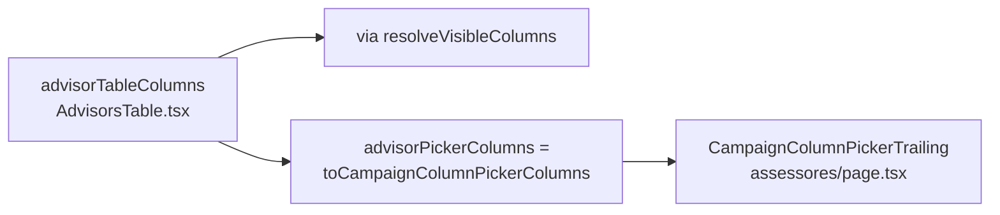

# Impl: Assessores — menu do picker de colunas derivado da mesma fonte do AdvisorsTable

Status: concluído (executado 2026-08-11)
Atualizado em: 2026-08-11
Issue: #642
Intenção: docs/plans/escala-dry-pos-b197.md
Appetite restante: ~0,5 dia (herdado)

## Leitura da intenção

- **Outcome:** o menu do picker de colunas de assessores nasce da mesma fonte
  que os `<th>` da tabela — adicionar coluna num lugar atualiza o outro de
  graça. Zero mudança de comportamento.
- **O que NÃO negociar:** mesmos ids (`name` mandatory, `email`, `phone`,
  `municipalities`, `actions` — contrato do cookie `campaign_columns`), mesmos
  labels pt-BR, mesma ordem, exceção do draft intacta (input de e-mail na
  linha-draft mesmo com a coluna oculta), e o não-escopo travado de não portar
  o `AdvisorsTable` para `CampaignTable`.
- **O que reavaliar:** o plano de intenção já recomenda a Opção A (fonte única
  no módulo da tabela); a reavaliação aqui é de engenharia fina — onde a
  constante vive, como o `<th>` consome, como o `emailHidden` deriva.

## Abordagem recomendada

**Opções consideradas:** A | B | C | D
**Recomendação:** A — porque segue o precedente em produção
(`supporterColumns`/`supporterPickerColumns` em `SupporterList.tsx` — o RSC de
`apoiadores` importa a constante serializável do módulo do componente),
reusa os helpers B17 (`toCampaignColumnPickerColumns`, `resolveVisibleColumns`)
e mantém o diff em 2 arquivos.
**Rejeitadas:**

- **B — lib nova (`src/lib/advisorTableColumns.ts`):** só há dois consumidores
  e um é o mesmo módulo que renderiza; módulo lib com 1 call site real é
  camada sem volatilidade (depth check — pass-through).
- **C — status quo (comentário):** o achado que originou a Issue é exatamente
  que o comentário é insuficiente; rejeitada pela intenção.
- **D — extrair só id/label/mandatory e manter widths/sr-only no JSX:** deixa
  dois lugares para tocar ao adicionar coluna (layout do header) e obrigaria
  exceção manual no map para o caso `Ações`; a classe de header é propriedade
  da coluna, declarada junto.

### Decisões de engenharia

1. **Fonte única em `AdvisorsTable.tsx` (client).** Novo tipo local
   `AdvisorTableColumn { id, label, mandatory?, headerClassName?,
visuallyHiddenLabel? }` e constante `advisorTableColumns` com as 5 colunas
   atuais (incluindo `w-[20%]`/`w-[24%]`/`w-[14%]`/`w-28 text-right` e
   `visuallyHiddenLabel: true` em `Ações`, que preserva o ``).
2. **`<th>` consomem `resolveVisibleColumns(advisorTableColumns,
columnVisibility.hiddenColumnIds)`** — o mesmo helper B17 das outras listas:
   filtra por cookie respeitando `mandatory`, e `emailHidden` passa a derivar
   de `visibleColumns.some(id === 'email')`. **Descoberta do /simplify (fix
   incorporado):** o corpo renderiza as células incondicionalmente (só `email`
   tem `<td>` condicional + exceção do draft), então `phone`/`municipalities`/
   `actions` são `mandatory: true` — um id escondido por cookie velho derruba
   o `<th>` sobre um corpo de 5 células (table-fixed) se não for; o checkbox
   do picker vira "sempre visível" (honesto em vez do toggle inerte do B197).
   O corpo (células + exceção do draft) fica intocado.
3. \*\*`export const advisorPickerColumns = toCampaignColumnPickerColumns(advisorTableColumns)`
   no módulo da tabela — mesma forma de `supporterPickerColumns`.
4. **`assessores/page.tsx` importa `advisorPickerColumns`** e passa direto ao
   `CampaignColumnPickerTrailing`; removidos o array local, o comentário do
   espelho e os imports órfãos (`toCampaignColumnPickerColumns`,
   `CampaignColumnPickerColumn`).
5. **e2e `campaignColumnPicker` (assessores):** asserts novos pinando o
   contrato mandatory — `Nome`/`Celular` "sempre visível" (checked + disabled).

### Componentes / mudanças

- **`AdvisorsTable.tsx`** (`src/components/campaign/advisor/`): declara a
  fonte única, exporta `advisorPickerColumns`, header por map; corpo intacto.
- **`assessores/page.tsx`** (`src/app/(campaign)/campanha/(app)/assessores/`):
  consome a fonte exportada.
- **Migration:** sem migration.
- **Access / Consent:** sem mudança (acesso já gateado no page).
- **UI:** Impeccable A — sem superfície nova; refactor estrutura que preserva
  DOM/aria (sr-only de `Ações` mantido).

### Dados → forma

- Forma escolhida: colunas como dados serializáveis no módulo do componente,
  convertidas na fonte via helper B17. Alternativas rejeitadas: lib separada
  (sem call site extra) e manutenção do espelho (o próprio defeito).

## Fases verificáveis

1. **Fonte única + header** — `AdvisorsTable.tsx`: tipo + constante + export +
   map do header com `resolveVisibleColumns`; `emailHidden` derivado.
2. **Consumo no page** — `assessores/page.tsx`: import + remoção do array
   local e imports órfãos.
3. **Gates** — `pnpm exec tsc --noEmit`, `pnpm lint`, `pnpm format:check`,
   `pnpm test` (unit: `campaignColumnVisibility` — lib intacta), e2e
   `campaignColumnPicker` (spec de assessores cobre exatamente os comportamentos
   preservados: default oculto, draft com input, religar, persistência);
   `pnpm exec knip` (removidos imports órfãos), `pnpm check:cycles`.
4. **Fechamento** — status do plano de intenção → concluído; entrada curta em
   `docs/CHANGELOG-AGENTS.md`.

## Rabbit holes / Não escopo (engenharia)

- Não portar `AdvisorsTable` para `CampaignTable` (decisão travada do B197).
- Não mexer em labels/ordem/ids — contrato do cookie `campaign_columns`.
- Não criar coluna nova, não tocar células do corpo além de `emailHidden`
  derivado.
- Sem novo unit test: o comportamento é idêntico e coberto pelo e2e existente;
  testar a constante exigiria importar o módulo client inteiro (lucide/next/
  sonner) — custo sem retorno para um espelho que deixou de existir.

## Riscos e mitigação

- **Import de client module em RSC:** precedente em produção
  (`supporterPickerColumns` em `apoiadores/page.tsx`); valor serializável
  (array de `{id,label,mandatory}`).
- **Layout `table-fixed`:** classes de largura movem para o mesmo `<th>`, na
  mesma ordem — DOM e classes idênticos, só que gerados por map com `key`.
- **`emailHidden` divergente do header:** eliminado por construção — deriva do
  mesmo `visibleColumns` que renderiza o header.

## Aceite de engenharia

- [x] Aceite de produto da intenção ainda coberto (mesma fonte, zero mudança)
- [x] Invariantes AGENTS/engineering-standards (edit the owner: a tabela já
      possui o concern do menu; reusa lib B17)
- [x] Testes de domínio: sem mudança de access/write path; e2e existente é o
      guard do comportamento
