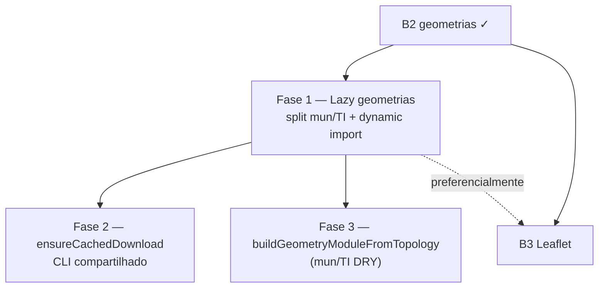

# Escala e DRY pós-B2 (geometrias + scripts CLI)

Status: Fase 1 entregue com B3 (2026-07-19); Fases 2–3 pendentes
Atualizado em: 2026-07-27 (`capture-review-debts` pós-B8+: `scripts/lib/topology.mjs` resolve por precedente onde o helper da F2 vive — `scripts/lib/`, não `src/lib/`; 2026-07-26 pós-B8 F2: 5º call site; 2026-07-20 pós-A8: `build-bahia-demographics.mjs` reforça o gatilho da F2 como 4º call site)
Item do roadmap: [docs/roadmap.md](../roadmap.md) (Trilha B, item B5)
Responsável: —

## Contexto

O B2 ([mapa-bahia-geometrias.md](mapa-bahia-geometrias.md) Fase 1) entregou a fundação estática do mapa: `*.topo.json` de municípios e Territórios de Identidade, `bahiaMunicipalityCodes`, helpers em `bahiaGeometries.ts`, script `pnpm build:geometries`. A passagem `/simplify` de 2026-07-18 limpou dead code e churns baratos no script/codegen, mas **deixou de fora** dois follow-ups que os revisores (performance / reuse) marcaram como importantes e maiores que cleanup pontual:

1. **Carregamento eager de geometrias no cliente.** `src/lib/bahiaGeometries.ts` importa os dois TopoJSON, roda `topojson-client` `feature()` em 417+27 polígonos e monta índices no load do módulo — custo de bundle/memória antes de qualquer superfície Leaflet (B3).
2. **Cache de download duplicado nos CLIs.** `ensureCachedJson` em `scripts/build-bahia-geometries.mjs` é estruturalmente o mesmo que `ensureCachedZip` em `scripts/seed-tse-results.mjs` (mkdir → hit → `downloadToBuffer` → SHA-256 → write), só muda extensão/parse. **Pós-A7 F2:** `scripts/build-bahia-tse-city-codes.mjs` (`pnpm build:tse-city-codes`) clona o mesmo padrão `ensureCachedZip` — terceiro call site. **Pós-A8 (`capture-review-debts` 2026-07-20):** `scripts/build-bahia-demographics.mjs` (`pnpm build:demographics`) clona `ensureCachedJson` — quarto call site; reforça prioridade da Fase 2 sem novo ID de roadmap. **Pós-B8 F2 (`capture-review-debts` 2026-07-26):** `scripts/build-municipality-zone-geometries.mjs` clona o padrão como `ensureCachedBinary` (devolve o buffer cru, porque a entrada é um SHP e não um JSON) — **quinto** call site, e o primeiro que valida a decisão de `cacheDir` por chamada com um segundo consumidor real da **mesma** pasta (`GEOMETRIES_CACHE_DIR`, default `data/geometries/`). O bloco todo (`die`/`log`/`sha256`/`cacheDir`/`writeJson`) veio junto, então a Fase 2 tem hoje 5 cópias a colapsar, não 4.
3. **Factory duplicada mun/TI pós-B3 F1.** `bahiaMunicipalityGeometries.ts` e `bahiaTerritoryGeometries.ts` repetem o mesmo pipeline `topojson.feature` → array → `Map` por chave → export do módulo indexado — só mudam topology object, propriedade de chave (`codarea` vs `code`) e getter.

Este plano é o registro canônico desses follow-ups. Sem ele, o B3 pode embarcar o mapa com payload desnecessário no path default, e o próximo script de dado aberto volta a clonar o cache.

**Explicitamente fora (revisores pediram skip):** helpers genéricos de `localeCompare('pt-BR')` e de checksum/evidence nos testes int — a duplicação com `bahiaTseZones.int.spec.ts` é intencional e legível por domínio.

## Objetivos

- Superfícies de mapa (B3) carregam geometria só sob demanda: município e território podem ser importados em separado; nenhum path de `/campanha` que não mostre mapa paga o decode TopoJSON→GeoJSON.
- Scripts CLI de dado aberto (`build:geometries`, `db:seed:tse`, futuros) compartilham um helper de cache em disco + download, sem mudar proveniência/SHA nem guards de banco.
- Guardrails: sem migration, sem collection, sem Consent, sem server action de produto; B2 permanece a fonte dos artefatos estáticos versionados.

## Decisões travadas

- **Um item B5, três fases ordenadas.** Mesmo racional do C6/C7/A7: um ID de roadmap, PRs por fase. Ordem: lazy load (impacta B3) → helper de cache CLI (barato, sem UI) → factory geometrias mun/TI (DRY pós-split B3).
- **Dependência dura de B2.** Este item só faz sentido com os `*.topo.json` e `bahiaGeometries` já commitados; não reabre o escopo de geração/simplificação das malhas.
- **2026-07-19 (Fase 1 entregue com B3):** lazy load split mun/TI via `loadMunicipalityGeometryModule` / `loadTerritoryGeometryModule`; map islands `dynamic(..., { ssr: false })`.
- **Cortável se o mapa permanecer fora do caminho crítico.** B3 já é corte seguro no roadmap; B5 F2 (cache CLI) é ainda mais cortável — a duplicação atual é ~20 linhas. F1 só é “não cortável” no sentido de qualidade do B3 (bundle), não de calendário eleitoral.
- **Não extrair helpers de sort pt-BR nem de evidence SHA nos testes.** Decisão dos revisores do simplify (2026-07-18): indirection sem ganho.
- **i18n e naming** (AGENTS.md): identificadores em inglês (`loadMunicipalityFeatures`, `loadTerritoryFeatures`, `ensureCachedDownload`), strings visíveis em pt-BR só se algum log de CLI for user-facing (hoje são logs de build).

## Questões em aberto

- **API pública pós-lazy: manter `getMunicipalityFeature` sync após warm, ou só async loaders?** **Recomendação:** loaders async (`loadMunicipalityGeometryModule()` / `loadTerritoryGeometryModule()`) que resolvem o módulo já indexado; os getters sync atuais viram métodos do módulo carregado (ou ficam em submodule lazy). Evitar Promise em cada hover do mapa.
- ~~**Onde vive o helper de cache CLI?**~~ **RESOLVIDO POR PRECEDENTE (`capture-review-debts` pós-B8+, 2026-07-27):** `scripts/lib/`. O B8+ precisou compartilhar a política de escala de chão entre os dois scripts de geometria e criou **`scripts/lib/topology.mjs`** — o primeiro módulo da pasta. A F2 **pousa nele** (`scripts/lib/cached-download.mjs`) em vez de abrir um segundo endereço: dois lares para código de CLI é exatamente a duplicação que esta fase existe para remover. A recomendação anterior (`src/lib/cliCachedDownload.ts`) fica **rejeitada** — `src/lib/` é client-safe por contrato (`.cursor/rules/codebase-map.mdc`) e um helper que faz `mkdir`/`fetch`/`writeFile` não pertence a uma pasta que o bundle do browser pode alcançar, mesmo que hoje ninguém o importe de lá.
- **Unificar env `TSE_CACHE_DIR` / `GEOMETRIES_CACHE_DIR`?** **Recomendação:** não — um parâmetro `cacheDir` por chamada; cada script mantém sua env e pasta sob `data/`.

## Abordagem proposta

### Fase 1 — Lazy load de geometrias (antes ou com B3)

- Partir `src/lib/bahiaGeometries.ts`: deixar de avaliar `feature()` + Maps no top-level do entry que o app importa por padrão.
- Submódulos ou dynamic `import()` separados para municípios vs territórios (dashboard só TI; overview pode precisar dos dois sob toggle).
- `BahiaMap` / superfícies B3: `dynamic(() => import(...), { ssr: false })` já previsto no plano do mapa; o import interno deve apontar para o loader lazy, não para um barrel que decoda tudo.
- Testes int: importar o submodule (ou await loader) — ambiente node, sem regressão de cobertura 417/27.
- Critério de verificação: nenhum import estático de página `/campanha` (exceto a ilha do mapa) puxa os `*.topo.json` no grafo de módulo (inspecionar bundle / `pnpm build` + analysis leve).

### Fase 2 — Helper de cache CLI

- Extrair `ensureCachedDownload({ cacheDir, key, url, ext?, logPrefix })` a partir de `ensureCachedJson` / `ensureCachedZip`.
- Retorno: `{ url, buffer, hash }` (parse JSON/ZIP fica no caller — `build-bahia-geometries` já faz `JSON.parse`; seed TSE usa `readZipEntry`).
- Continuar usando `downloadToBuffer` (`src/lib/electionResultsZip.ts`).
- Migrar `scripts/build-bahia-geometries.mjs`, `scripts/seed-tse-results.mjs`, `scripts/build-bahia-tse-city-codes.mjs` e `scripts/build-bahia-demographics.mjs`; sem mudança de comportamento nem de pastas `data/geometries/` / `data/tse/` / `data/demographics/`.

### Fase 3 — Factory compartilhada mun/TI

- Extrair `buildGeometryModuleFromTopology<TProps, TKey>({ topology, objectName, keyProperty, getFeature })` em `src/lib/bahiaGeometryModuleFactory.ts` (ou ao lado de `bahiaGeometriesTypes.ts`).
- `bahiaMunicipalityGeometries.ts` / `bahiaTerritoryGeometries.ts` ficam como thin wrappers: import JSON + chamada à factory com `codarea` / `code`.
- Testes int existentes (`bahiaGeometries.int.spec.ts`) permanecem verdes — sem mudança de API pública dos loaders async.
- **Não** fundir os dois JSON num único bundle (mantém split lazy B5 F1).

**Migration:** nenhuma nas três fases. Sem collection, sem Consent, sem server action de produto.

## Dependências

- **Dura:** B2 Mapa Fase 1 (geometrias) — já entregue.
- **Suave:** B3 Leaflet — consome a Fase 1; se B3 implementar o lazy load, fecha F1 neste plano.
- Reusa: `downloadToBuffer` (`src/lib/electionResultsZip.ts`), artefatos em `src/lib/geometries/`, padrões de script de `scripts/seed-tse-results.mjs`.

## Não escopo

- Implementação Leaflet / componentes de mapa → **B3** ([mapa-bahia-geometrias.md](mapa-bahia-geometrias.md) Fase 2).
- Camada de zonas TSE no mapa → **B4**.
- Helper genérico de `localeCompare('pt-BR')` ou de evidence SHA nos testes int — rejeitado no simplify.
- `BahiaMap` `setStyle` incremental → **B6** ([escala-dry-pos-b3.md](escala-dry-pos-b3.md)).
- Query duplicada lista+coroplético 2022 → **A7 F4** ([escala-dry-pos-a4.md](escala-dry-pos-a4.md)).
- Mudança de qualidade/simplificação das malhas IBGE ou re-download obrigatório — só se a F2 tocar proveniência (não deve).

## Referências

- `docs/roadmap.md` (Trilha B, item B5; B2/B3)
- `docs/plans/mapa-bahia-geometrias.md` — plano pai; B3 deve preferir a F1 deste item
- `docs/plans/escala-dry-pos-c2.md` / `escala-dry-pos-c3.md` — precedente de registro pós-`/simplify`
- `src/lib/bahiaGeometries.ts` — lazy loaders async
- `src/lib/bahiaMunicipalityGeometries.ts` / `bahiaTerritoryGeometries.ts` — near-duplicate pós-F1
- `src/lib/bahiaGeometriesTypes.ts` — tipos `*GeometryModule`
- `scripts/build-bahia-geometries.mjs` — `ensureCachedJson`
- `scripts/build-bahia-demographics.mjs` — `ensureCachedJson` (4º call site; A8)
- `scripts/seed-tse-results.mjs` — `ensureCachedZip`
- `src/lib/electionResultsZip.ts` — `downloadToBuffer`
- AGENTS.md — naming inglês; Bahia implícita; dado estático versionado
