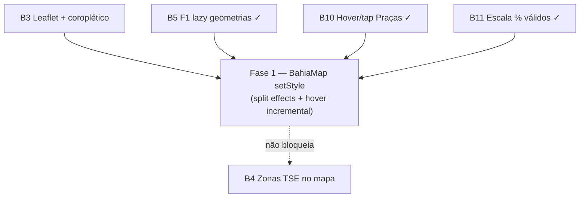

# Escala e DRY pós-B3 (Leaflet / coroplético)

Status: registrado no roadmap (fases pendentes)
Atualizado em: 2026-07-21 (`capture-review-debts` pós-B11 `/simplify`: troca `scaleMode` absorvida em Fase 1; pós-B10: hover/select)
Item do roadmap: [docs/roadmap.md](../roadmap.md) (Trilha B, item B6)
Impeccable: A — N/A (sem superfície UI nova; otimização do renderer Leaflet existente)
Appetite: ~1–1,5 dia eng (Fase 1 única: métrica/ano + hover/select incremental; PR único)
Responsável: —

## Contexto

O B3 ([mapa-bahia-geometrias.md](mapa-bahia-geometrias.md) Fase 2) entrega `BahiaMap` + embeds (`NucleusOverviewMap`, `NucleusDetailMap`, `DashboardMap`), agregação servidor em `nucleusChoropleth.ts` / `nucleusChoroplethPageData.ts`, e lazy load de geometrias (B5 F1 ✓). Duas passagens `/simplify` no mesmo branch já limparam o que cabia em cleanup: `createCampaignClientDynamic`, `resolveChoroplethNuclei` / single-pass bundle, remoção de `geographyForCityNames` duplicado, `toNucleusElectionGeographyInput` no dashboard, highlight O(k) via `getMunicipalityFeature` / `getTerritoryFeature`, `NucleusDetailMap` `useMemo`, alinhamento de tipos com `NucleusElectionGeographyInput`.

Os revisores (performance) marcaram como **importante e maior que simplify** os follow-ups abaixo. Sem registro, cada troca de métrica no coroplético (overview/dashboard) refaz decode + `L.geoJSON` completo em 417 ou 27 polígonos; e, desde **B10** ([hover-mapa-pracas.md](hover-mapa-pracas.md)), cada hover/select no mapa de Praças chama `applyLayerStyles` com `eachLayer` em ~417 municípios. Desde **B11** ([escala-percentual-mapa-pracas.md](escala-percentual-mapa-pracas.md)), trocar `scaleMode` (`absolute` ↔ `% dos válidos`) também altera `displayValues` e dispara o mesmo rebuild — mesmo com `scaleMax` corrigindo legenda vs fill.

1. **`BahiaMap` rebuild completo do layer GeoJSON** quando só `values` (métrica/escala), `scaleMax` ou `highlightKeys` mudam. O effect em `BahiaMap.tsx` depende de `[highlightKey, mode, scaleMax, values]` e, a cada mudança, remove o layer, recria `L.geoJSON` com todas as features e reaplica estilos — mesmo que `mode` e o módulo de geometria já estejam carregados. O caminho correto para troca de métrica/escala é `layer.setStyle(...)` (e `fitBounds` só quando o highlight muda).

2. **Hover/select no mapa de Praças (B10) ainda faz full-scan de estilo.** `mouseover` / `selectedKey` disparam `refreshLayerStyles` → `applyLayerStyles` → `eachLayer` + `setStyle` em todos os polígonos. O simplify pós-B10 já deduplica hover repetido e evita double-refresh quando hover “possui” o estilo, mas o hot path continua O(n) por movimento do cursor. O caminho correto é restyle **incremental** (2-path: anterior + atual, ou `Map<featureKey, PathLayer>`) — mesma refatoração estrutural da Fase 1.

**Já resolvido no simplify/critique (não reabrir):** B5 F1 lazy split mun/TI + `dynamic(..., { ssr: false })`; `createCampaignClientDynamic`; choropleth single-resolve (`resolveChoroplethNuclei`); DRY `geographyForCityNames` → `resolveNucleusElectionGeography`; dashboard `toNucleusElectionGeographyInput`; `ChoroplethMapPanel` passa `max`; detail map `useMemo`; highlight bounds O(k); type alignment `NucleusChoroplethNucleus`. **Pós-B10 simplify:** dedup de hover (`styleContextRef.hoveredKey` único); merge dos effects de callback-ref; `emphasizeFeature` compartilhado; skip de refresh quando hover inalterado ou hover possui estilo; `formatElectionNumber` na zone breakdown de `PlazaMapPanel`; `useMemo` de `selectedNavigation`.

**Explicitamente fora (revisores pediram skip ou triage descartou):** colapsar shells finos `DashboardMap` / `NucleusOverviewMap`; `CAMPAIGN_BRAND_PRIMARY` para `#c51414`; `codeForIdentityTerritory` em `bahiaTerritories.ts`; `catch` vazio no `BahiaMap` (logging opcional); flake int `campaignNucleusListOverview` (`totalFiltered` — isolamento de DB pré-existente); métricas E1/E2 no coroplético v1 (decisão de produto B3); critique Impeccable formal nas três superfícies (polish leve sem P0–P3). **Triage `capture-review-debts` 2026-07-21 pós-B10:** extrair `DivergingChoroplethLegend` (1 consumer — polish opcional em **R6**); helper `scrollIntoView` (1 call site em `#plaza-zone-breakdown`); throttle/defer do `setState` do readout no hover (trade-off produto; sem evidência de perf); mudar contrato activate/select para remover `selectedKeyRef` (intencional para 2º tap mobile — gatilho: 3º consumidor do mapa precisar API diferente); migração campanha-wide `Intl` → `formatElectionNumber` (B10 zone list já corrigida; gatilho: **E6** F4 em núcleos ou 3ª superfície Praça com formatter local).

## Objetivos

- Trocar métrica (núcleos / estimativa / baseline 2022), **escala** (`absolute` ↔ `% dos válidos` no mapa de Praças pós-B11) ou modo município/TI no coroplético **não** recria o layer GeoJSON inteiro — apenas atualiza `fillColor` / borda via `setStyle` quando a geometria já está montada.
- Hover/select no mapa de Praças (B10) restyla só o polígono anterior + o ativo — não `eachLayer` em ~417 paths por `mouseover`.
- `fitBounds` roda só quando `highlightKeys` ou `mode` mudam, não a cada alteração de `values`.
- Guardrails: sem migration, sem collection, sem Consent, sem server action. Client-only; manter acessibilidade (`role="img"`, `aria-busy`, `aria-label`, `aria-live` do readout B10 inalterado).

## Decisões travadas

- **Um item B6, uma fase.** Mesmo racional de débitos pontuais pós-entrega (VR+, RS+): um ID, PR único.
- **Dependência suave de B3.** Só faz sentido com `BahiaMap` no produto; não reabre escopo de coroplético, tiles ou agregação servidor.
- **Query duplicada de votos 2022 na lista de núcleos** (`loadNucleusListElectionOverview` + `loadNucleusChoroplethBundle`) **não** entra neste plano — absorvida como **A7 Fase 4** em [escala-dry-pos-a4.md](escala-dry-pos-a4.md) (mesmo módulo `nucleusElectoralBaseline.ts`).
- **Factory mun/TI** near-duplicate → **B5 Fase 3** em [escala-dry-pos-b2.md](escala-dry-pos-b2.md).
- **Cortável** se o mapa for raramente usado ou se troca de métrica permanecer aceitável em campo; vira não-cortável quando coordenadores alternarem métricas com frequência no overview filtrado **ou** hover denso no mapa de Praças (B10 entregue).
- **Dependência suave de B10.** Hover/select já existe em `PlazaMapPanel` + `BahiaMap`; Fase 1 unifica o caminho de estilo incremental — não reabre escopo de navegação/readout do B10.
- **Dependência suave de B11.** Seletor `scaleMode` em `PlazaMapPanel` já altera `displayValues`/`scaleMax`; Fase 1 deve cobrir essa troca sem rebuild — não reabre escopo de % válidos nem `validVotesByYear`.
- **i18n e naming** (AGENTS.md): identificadores em inglês; strings visíveis em pt-BR inalteradas.

## Questões em aberto

- **Split em dois effects ou ref de layer estável?** **Recomendação:** effect 1 monta mapa + tiles + carrega geometria por `mode` (deps `[mode]`); effect 2 aplica estilo quando `[values, highlightKey]` mudam — se `layerRef.current` existe, `setStyle` + `fitBounds` condicional; senão aguarda effect 1.
- **Manter `values` como objeto novo a cada render do parent?** **Recomendação:** não bloquear Fase 1 — `ChoroplethMapPanel` já deriva `values` estáveis por métrica; se profiling mostrar churn, memoizar no parent num follow-up micro (fora de escopo).
- **Índice `Map<featureKey, layer>` vs 2-path hover?** **Opções:** (A) mapa estável no mount do GeoJSON; (B) guardar `previousHoveredKey` / `previousSelectedKey` e restylar só dois layers. **Recomendação:** (A) se o refactor já toca `onEachFeature` — simplifica métrica + hover + highlight programático; (B) como fallback se o mapa de layers for inviável nos embeds de núcleo.

## Abordagem proposta

### Fase 1 — `setStyle` incremental no `BahiaMap`

- `src/components/campaign/BahiaMap.tsx`:
  - Separar mount do mapa/OSM (`useEffect` once) do load de geometria por `mode`.
  - Guardar `geometryModule` em ref após primeiro load; recriar layer só quando `mode` muda.
  - Manter `Map<featureKey, PathLayer>` (ou equivalente) no mount do GeoJSON para restyle O(1) por chave.
  - Em updates de `values` / `highlightKey`: `setStyle` por layer afetado — **não** `eachLayer` full-scan salvo fallback de migração.
  - Hover/select (B10): restylar só polígono anterior + ativo (`hoveredKey`, `selectedKey`); unificar callback `style` inicial com o caminho de `applyLayerStyles` / `getFeatureStyle`.
  - `fitBounds`: highlight quando `highlightSet` não vazio; senão `BAHIA_BOUNDS` — só quando highlight ou `mode` mudam.
- Testes: unit leve com mock de `L.geoJSON` / spy em `setStyle` se viável; senão checklist manual (trocar métrica 3× no overview **e** hover 10× no mapa de Praças sem flicker perceptível).
- Critério: DevTools Performance — troca de métrica não dispara novo `import()` de topojson nem aloca 400+ layers; hover não dispara >2 `setStyle` por evento.

**Migration:** nenhuma.

## Dependências

- **Suave:** B3 Mapa Fase 2 (Leaflet) — implementado no branch; merge pendente.
- **Suave:** B5 F1 lazy geometrias — entregue com B3.
- **Suave:** B10 hover/tap no mapa de Praças — entregue 2026-07-21; Fase 1 consolida o hot path de estilo sem alterar navegação/readout.
- **Suave:** B11 escala % válidos — entregue 2026-07-21; troca `scaleMode` é mais um gatilho de rebuild a eliminar via `setStyle`.
- Reusa: `choroplethFillColor` / `choroplethMaxValue` (`src/lib/choroplethColorScale.ts`), loaders `loadMunicipalityGeometryModule` / `loadTerritoryGeometryModule`, tipos `ChoroplethValues`, `emphasizeFeature` / `getFeatureStyle` (B10).

## Não escopo

- Query duplicada overview + coroplético na lista → **A7 F4** ([escala-dry-pos-a4.md](escala-dry-pos-a4.md)).
- Factory TopoJSON mun/TI → **B5 F3** ([escala-dry-pos-b2.md](escala-dry-pos-b2.md)).
- Camada de zonas TSE, rota `/mapa`, métricas tendência/prioridade no coroplético → **B3/B4/E1/E2**.
- `react-leaflet` — manter `leaflet` direto conforme B3.
- Navegação/readout/2º tap do B10 — permanecem em [hover-mapa-pracas.md](hover-mapa-pracas.md).

## Rabbit holes

- **Refatorar todos os embeds de uma vez.** `NucleusOverviewMap`, `DashboardMap` e `PlazaMapPanel` compartilham `BahiaMap` — mudança de API de estilo pode quebrar highlight programático. **Mitigação:** Fase 1 valida nos três embeds + mapa de Praças com hover; não introduzir `react-leaflet`.
- **Separar componente só para Praças.** Duplicar `BahiaMap` para otimizar hover fragmenta o coroplético. **Mitigação:** um renderer, índice de layers compartilhado.

## Adiado com gatilho

- **Contrato activate/select sem `selectedKeyRef`.** Revisitar quando um 3º consumidor do mapa precisar semântica diferente de 2º tap mobile (hoje intencional em B10).
- **`formatElectionNumber` campanha-wide.** Revisitar via **E6** F4 (núcleos) ou quando uma 3ª superfície Praça reintroduzir `Intl.NumberFormat` local.

## Referências

- `docs/roadmap.md` (Trilha B, item B6; B3/B5)
- `docs/plans/mapa-bahia-geometrias.md` — plano pai B3
- `docs/plans/escala-dry-pos-b2.md` — B5 F1/F3
- `docs/plans/escala-dry-pos-a4.md` — A7 F4 (query duplicada)
- `src/components/campaign/BahiaMap.tsx` — effect que rebuilda layer; `applyLayerStyles` / hover B10
- `src/components/campaign/PlazaMapPanel.tsx` — consumidor B10 com `selectedKey` + readout
- `src/components/campaign/ChoroplethMapPanel.tsx` — troca de métrica
- `docs/plans/hover-mapa-pracas.md` — plano pai B10 (navegação fora de escopo B6)
- `src/lib/bahiaGeometries.ts` — lazy loaders
- AGENTS.md — naming inglês; B3 sem migration
