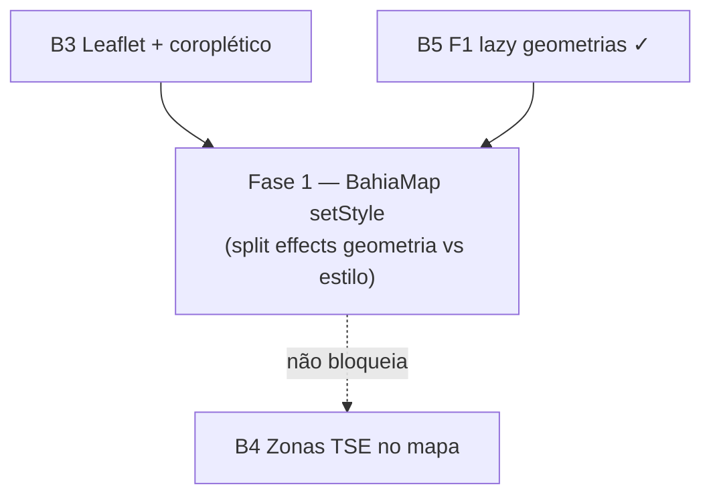

# Escala e DRY pós-B3 (Leaflet / coroplético)

Status: registrado no roadmap (fases pendentes)
Atualizado em: 2026-07-19 (`capture-review-debts` pós-B3 + 2× `/simplify`)
Item do roadmap: [docs/roadmap.md](../roadmap.md) (Trilha B, item B6)
Impeccable: A — N/A (sem superfície UI nova; otimização do renderer Leaflet existente)
Responsável: —

## Contexto

O B3 ([mapa-bahia-geometrias.md](mapa-bahia-geometrias.md) Fase 2) entrega `BahiaMap` + embeds (`NucleusOverviewMap`, `NucleusDetailMap`, `DashboardMap`), agregação servidor em `nucleusChoropleth.ts` / `nucleusChoroplethPageData.ts`, e lazy load de geometrias (B5 F1 ✓). Duas passagens `/simplify` no mesmo branch já limparam o que cabia em cleanup: `createCampaignClientDynamic`, `resolveChoroplethNuclei` / single-pass bundle, remoção de `geographyForCityNames` duplicado, `toNucleusElectionGeographyInput` no dashboard, highlight O(k) via `getMunicipalityFeature` / `getTerritoryFeature`, `NucleusDetailMap` `useMemo`, alinhamento de tipos com `NucleusElectionGeographyInput`.

Os revisores (performance) marcaram como **importante e maior que simplify** o follow-up abaixo. Sem registro, cada troca de métrica no coroplético (overview/dashboard) refaz decode + `L.geoJSON` completo em 417 ou 27 polígonos.

1. **`BahiaMap` rebuild completo do layer GeoJSON** quando só `values` (métrica) ou `highlightKeys` mudam. O effect em `BahiaMap.tsx` depende de `[highlightKey, mode, values]` e, a cada mudança, remove o layer, recria `L.geoJSON` com todas as features e reaplica estilos — mesmo que `mode` e o módulo de geometria já estejam carregados. O caminho correto para troca de métrica é `layer.setStyle(...)` (e `fitBounds` só quando o highlight muda).

**Já resolvido no simplify/critique (não reabrir):** B5 F1 lazy split mun/TI + `dynamic(..., { ssr: false })`; `createCampaignClientDynamic`; choropleth single-resolve (`resolveChoroplethNuclei`); DRY `geographyForCityNames` → `resolveNucleusElectionGeography`; dashboard `toNucleusElectionGeographyInput`; `ChoroplethMapPanel` passa `max`; detail map `useMemo`; highlight bounds O(k); type alignment `NucleusChoroplethNucleus`.

**Explicitamente fora (revisores pediram skip ou triage descartou):** colapsar shells finos `DashboardMap` / `NucleusOverviewMap`; `CAMPAIGN_BRAND_PRIMARY` para `#c51414`; `codeForIdentityTerritory` em `bahiaTerritories.ts`; `catch` vazio no `BahiaMap` (logging opcional); flake int `campaignNucleusListOverview` (`totalFiltered` — isolamento de DB pré-existente); métricas E1/E2 no coroplético v1 (decisão de produto B3); critique Impeccable formal nas três superfícies (polish leve sem P0–P3).

## Objetivos

- Trocar métrica (núcleos / estimativa / baseline 2022) ou modo município/TI no coroplético **não** recria o layer GeoJSON inteiro — apenas atualiza `fillColor` / borda via `setStyle` quando a geometria já está montada.
- `fitBounds` roda só quando `highlightKeys` ou `mode` mudam, não a cada alteração de `values`.
- Guardrails: sem migration, sem collection, sem Consent, sem server action. Client-only; manter acessibilidade (`role="img"`, `aria-busy`, `aria-label`).

## Decisões travadas

- **Um item B6, uma fase.** Mesmo racional de débitos pontuais pós-entrega (VR+, RS+): um ID, PR único.
- **Dependência suave de B3.** Só faz sentido com `BahiaMap` no produto; não reabre escopo de coroplético, tiles ou agregação servidor.
- **Query duplicada de votos 2022 na lista de núcleos** (`loadNucleusListElectionOverview` + `loadNucleusChoroplethBundle`) **não** entra neste plano — absorvida como **A7 Fase 4** em [escala-dry-pos-a4.md](escala-dry-pos-a4.md) (mesmo módulo `nucleusElectoralBaseline.ts`).
- **Factory mun/TI** near-duplicate → **B5 Fase 3** em [escala-dry-pos-b2.md](escala-dry-pos-b2.md).
- **Cortável** se o mapa for raramente usado ou se troca de métrica permanecer aceitável em campo; vira não-cortável quando coordenadores alternarem métricas com frequência no overview filtrado.
- **i18n e naming** (AGENTS.md): identificadores em inglês; strings visíveis em pt-BR inalteradas.

## Questões em aberto

- **Split em dois effects ou ref de layer estável?** **Recomendação:** effect 1 monta mapa + tiles + carrega geometria por `mode` (deps `[mode]`); effect 2 aplica estilo quando `[values, highlightKey]` mudam — se `layerRef.current` existe, `setStyle` + `fitBounds` condicional; senão aguarda effect 1.
- **Manter `values` como objeto novo a cada render do parent?** **Recomendação:** não bloquear Fase 1 — `ChoroplethMapPanel` já deriva `values` estáveis por métrica; se profiling mostrar churn, memoizar no parent num follow-up micro (fora de escopo).

## Abordagem proposta

### Fase 1 — `setStyle` incremental no `BahiaMap`

- `src/components/campaign/BahiaMap.tsx`:
  - Separar mount do mapa/OSM (`useEffect` once) do load de geometria por `mode`.
  - Guardar `geometryModule` em ref após primeiro load; recriar layer só quando `mode` muda.
  - Em updates de `values` / `highlightKey`: iterar `layerRef.current.eachLayer` ou manter `Map<featureKey, layer>` e chamar `setStyle` com `choroplethFillColor` / borda highlight.
  - `fitBounds`: highlight quando `highlightSet` não vazio; senão `BAHIA_BOUNDS` — só quando highlight ou `mode` mudam.
- Testes: unit leve com mock de `L.geoJSON` / spy em `setStyle` se viável; senão checklist manual (trocar métrica 3× no overview sem flicker perceptível).
- Critério: DevTools Performance — troca de métrica não dispara novo `import()` de topojson nem aloca 400+ layers.

**Migration:** nenhuma.

## Dependências

- **Suave:** B3 Mapa Fase 2 (Leaflet) — implementado no branch; merge pendente.
- **Suave:** B5 F1 lazy geometrias — entregue com B3.
- Reusa: `choroplethFillColor` / `choroplethMaxValue` (`src/lib/choroplethColorScale.ts`), loaders `loadMunicipalityGeometryModule` / `loadTerritoryGeometryModule`, tipos `ChoroplethValues`.

## Não escopo

- Query duplicada overview + coroplético na lista → **A7 F4** ([escala-dry-pos-a4.md](escala-dry-pos-a4.md)).
- Factory TopoJSON mun/TI → **B5 F3** ([escala-dry-pos-b2.md](escala-dry-pos-b2.md)).
- Camada de zonas TSE, rota `/mapa`, métricas tendência/prioridade no coroplético → **B3/B4/E1/E2**.
- `react-leaflet` — manter `leaflet` direto conforme B3.

## Referências

- `docs/roadmap.md` (Trilha B, item B6; B3/B5)
- `docs/plans/mapa-bahia-geometrias.md` — plano pai B3
- `docs/plans/escala-dry-pos-b2.md` — B5 F1/F3
- `docs/plans/escala-dry-pos-a4.md` — A7 F4 (query duplicada)
- `src/components/campaign/BahiaMap.tsx` — effect que rebuilda layer
- `src/components/campaign/ChoroplethMapPanel.tsx` — troca de métrica
- `src/lib/bahiaGeometries.ts` — lazy loaders
- AGENTS.md — naming inglês; B3 sem migration
