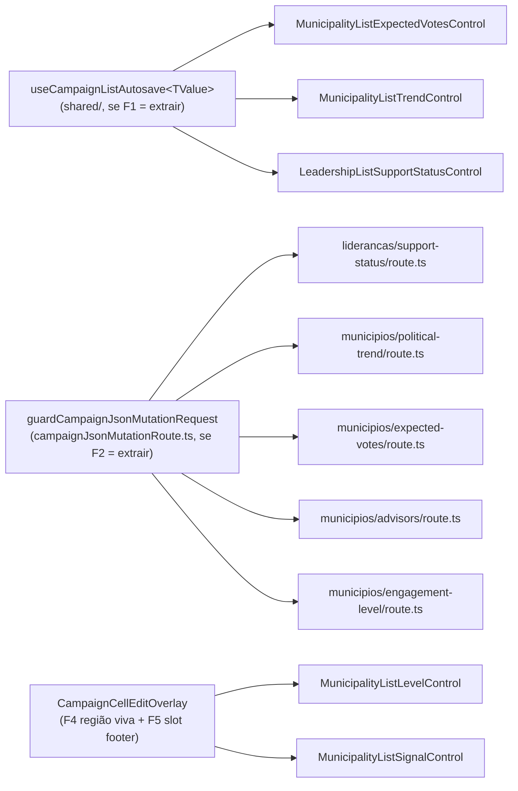

# Escala e DRY pós-B32 (editar Status de apoio na lista de lideranças)

Status: **entregue em código (2026-07-28)** — ver "As-built" no fim
Atualizado em: 2026-07-28
Item do roadmap: [docs/roadmap.md](../roadmap.md) (Fill-ins abertos, **B32+**, fill-in de engenharia)
Impeccable: A para F1/F2/F3 (sem superfície UI nova; extrai comportamento já entregue sem mudar contrato de rede nem markup visível); **B para F4/F5**, que mudam o que o usuário ouve e o que ele consegue tocar na casca compartilhada
Appetite: ~1,25–1,5 dia eng; F1 é uma auditoria com decisão binária (extrair ou registrar rejeição medida, mesmo formato do B33+); F2/F3 deixaram de ser condicionais quando o 5º call site chegou (E14 ✓); F4/F5 são fases da casca, independentes do resultado de F1
Responsável: —

## Dados → decisão → apresentação

- **Vou apresentar dados?** Não (N/A) — lote de manutenção de três controles de auto-save já entregues; nenhuma métrica, série ou escala nova.
- **Anti-goals de dado:** N/A.

## Contexto

O plano do **B32** ([autosave-status-lista-liderancas.md](autosave-status-lista-liderancas.md)) e os dois planos anteriores ([autosave-tendencia-lista-municipios.md](autosave-tendencia-lista-municipios.md) — B24, [combobox-assessores-lista-municipios.md](combobox-assessores-lista-municipios.md) — B27) registraram, cada um, o mesmo "Adiado com gatilho": **extração só no 3º call site**. Com o B32 entregue (2026-07-26), o gatilho disparou — três controles client-side compartilham a mesma máquina de auto-save por debounce:

- `src/components/campaign/municipality/MunicipalityListExpectedVotesControl.tsx` (B27, cenário de votos)
- `src/components/campaign/municipality/MunicipalityListTrendControl.tsx` (B24, status + justificativa)
- `src/components/campaign/leadership/LeadershipListSupportStatusControl.tsx` (B32, select único)

A comparação linha a linha dos três (feita nesta triage, `capture-review-debts` pós-B32) confirma o achado do `/simplify`/reuse: os três repetem, quase byte a byte —

- Estado: `open`, `isDirty`, `isPending`, `errorMessage`.
- Refs: `saveTimeoutRef` (debounce), `abortRef` (cancela o fetch em voo), `committed<X>Ref` (último valor confirmado pelo servidor), `lastProps<X>Ref` (detecta prop externa vs. eco do próprio save), `saveGenerationRef` (descarta resposta de um save superado por um mais recente).
- Efeito de adoção de props externas (navegação/RSC refresh) que só reage quando o valor muda de fora, comparado por uma função `xEqual`/`===` própria de domínio.
- Efeito de cleanup (`clearTimeout` + `abortRef.current?.abort()`) no unmount.
- `save<X>` assíncrono: gera geração, aborta o anterior, `fetch(ENDPOINT, { method: 'POST', headers, credentials: 'same-origin', signal, body })`, faz `cast` da resposta, reverte para o valor confirmado em erro/exceção, atualiza `committed<X>Ref` em sucesso — sempre guardado por `generation !== saveGenerationRef.current`.
- `scheduleSave`/`handleXChange`: marca `isDirty`, atualiza o rascunho local, reagenda o `setTimeout`.
- `handleOpenChange`: ao abrir, limpa erro/dirty; ao fechar com um save pendente, faz _flush_ (chama o save direto em vez de deixar o cleanup do unmount descartá-lo) — o **B32** só ganhou esse flush no `/simplify` da própria entrega, espelhando o `flushDraft` que o B24 já tinha.
- `statusMessage` calculado igual nos três (`errorMessage` → "Salvando…" → "Alterações serão salvas automaticamente." → vazio), num `
`.

**Atualização (2026-07-27, pós-B42 ✓):** o **container** dos três já saiu — `shared/CampaignCellEditOverlay.tsx` (Popover `md+` / Drawer mobile) absorveu Popover/Drawer/trigger/tooltip e `LeadershipListSupportStatusControl` foi migrado como 4º call site. Isso **não** consome o F1 (a casca não toca estado, refs, debounce nem `fetch` — foi o corte deliberado do B42, "só o container"), mas muda duas coisas para a auditoria: os três controles ficaram ~25–40 linhas menores, então a máquina de auto-save é agora a **maior** coisa duplicada neles; e o `/simplify` do B42 acrescentou à lista de peças idênticas um **13º item**, `reportFailure` — `setErrorMessage` + `toast.error` **só quando o overlay já fechou**, porque fechar desmonta o `Alert`/`aria-live` que carregariam o erro. Ele nasceu copiado nos quatro controles (os três do debounce + assessores) no mesmo passe, o que o torna a peça mais recente e mais óbvia do hook, se F1 concluir "extrair".

**Atualização (2026-07-27, pós-E14 ✓ — a triage do fechamento do E14):** o **gatilho de 5º call site** que a "Questão em aberto" abaixo guardava para F2/F3 **disparou**. `MunicipalityListLevelControl` (movimento de nível de envolvimento) e `POST /campanha/municipios/engagement-level` são o quinto controle e a quinta rota da família, e chegaram sem tocar em F1: o controle é de **submit explícito**, não de auto-save por debounce, então ele não é um 4º corpo da máquina do F1 — mas repete o preâmbulo dos dois lados como qualquer outro. F2 também mudou de natureza nessa contagem: `isSameOriginRequest` documenta-se como dona da política de CSRF, e a política está copiada em cinco `route.ts`, então **a rota que esquecer a linha falha aberta** — é uma verificação de origem que depende de disciplina de cópia, não do tipo. Isso põe F2 no piso de expensive_lock e a tira da condicionalidade a F1. Do lado do cliente, F3 fica igualmente com cinco call sites, e continua valendo só para o transporte (o controle do E14 não tem estado de auto-save para compartilhar).

As diferenças reais, que é o que torna a extração não trivial (achado do `/simplify` reuse review do B32, 2026-07-26): o **shape do valor** diverge (`VoteEstimateScenarioViewModel` objeto com 3 cenários × `MunicipalityListSavedPoliticalTrend` `{status, note}` × `SupportStatus` escalar), **display vs. draft** existe em dois dos três (o B32 colapsou os dois porque só tem um campo — ver "Decisões travadas" do próprio plano B32) e o **B24** tem um guard extra (`inFlightTrendRef`) para não abortar+reenviar o mesmo payload quando blur e fechamento do popover disparam o mesmo flush.

Um quarto controle, `MunicipalityListAdvisorsControl.tsx` (B27, chips + `Command`), **não** compartilha essa máquina — é delta multi-seleção com `requestSeqRef`/`latestConfirmedRef` (fora de escopo, mecânica genuinamente diferente) — mas compartilha com os cinco (incluindo ele e o do E14) o **preâmbulo do `fetch`** (`credentials: 'same-origin'`, `Content-Type`/`Accept` JSON, `cast` da resposta) e, do lado do servidor, os cinco `route.ts` (`liderancas/support-status`, `municipios/political-trend`, `municipios/expected-votes`, `municipios/advisors`, `municipios/engagement-level`) repetem o mesmo preâmbulo de rota: `isSameOriginRequest(request)` → 403 → `parseCampaignJsonRequestBody` → `bodySchema.parse` → `try/catch` com `campaignJsonMutationErrorResponse`.

## Objetivos

- **F1 (dominante):** decidir, com auditoria de código (não de intenção), se um hook `useCampaignListAutosave<TValue>` genérico compensa nos três call sites do debounce — e, se sim, extraí-lo; se não, registrar a rejeição medida (precedente B33+: a auditoria pode derrubar a premissa do plano).
- **F2 (não é mais condicional; gatilho de 5º call site disparado pelo E14 ✓):** extrair o helper de preâmbulo de rota (`guardCampaignJsonMutationRequest` ou nome equivalente) que combina `isSameOriginRequest` + `parseCampaignJsonRequestBody` nos 5 `route.ts`. A motivação subiu de boilerplate para **política**: a verificação de origem só vale se toda rota da família a escrever, e hoje escrevê-la é opcional por construção — a que esquecer aceita POST cross-origin em silêncio. Fase mais importante do lote junto com F5, e a primeira a rodar.
- **F3 (não é mais condicional; mesmo gatilho, menor prioridade que F2):** wrapper fino de `fetch` cliente (`postCampaignJson<TResponse>`) para os 5 controles, cobrindo só o preâmbulo comum (`credentials`/headers/`cast`), nunca a máquina de estado.
- **F4 (a11y, entrou pela triage do B42 ✓ em 2026-07-27; independente de F1 "extrair ou não"):** a região viva de cada controle é um `
` **dentro** do overlay, e fechar é justamente o que faz o flush da gravação — então "Salvando…" é anunciado numa região que acabou de desmontar, e o leitor de tela não recebe nada. É o mesmo furo que o `toast.error` do B42 tapou para o **erro**, mas o sucesso e o "salvando" continuam mudos. A casca (`CampaignCellEditOverlay`) é o lugar natural de uma região que sobrevive à superfície — o que muda o scaffold, e é por isso que é fase deste plano e não do B42. **Guardrail:** uma região por controle, não uma global por página; `escala-dry-pos-b33.md` já corrigiu uma página com **três** regiões vivas competindo, e a cura não pode reintroduzir isso.
- **F5 (slot `footer` + `formId` na casca; gatilho registrado pelo B42 ✓ e disparado pela triage do E14 ✓ em 2026-07-27; independente de F1):** o B42 adiou o slot com o gatilho "um 2º controle precisar de submit explícito num Drawer". `MunicipalityListLevelControl` é esse controle, e a falta do slot é pior do que o adiado previa — não é só o Sinal (B26) que fica sem migrar. Na folha, `CampaignCellEditOverlay` fixa um `DrawerFooter` com **"Fechar"**, enquanto "Registrar movimento" fica no fim de um corpo rolável com select, duas textareas e até dois checkboxes: **a ação que descarta está pinada e a que constrói está abaixo da dobra**, e "Fechar" joga fora uma justificativa digitada sem perguntar. O precedente de forma é o `MunicipalityListSignalControl`, que mantém container próprio justamente para pôr o submit no `DrawerFooter` com "Cancelar" ao lado. Escopo: slot opcional `footer` (mais `formId`, para o submit viver fora do `<form>` por HTML padrão), o controle do E14 e o Sinal como call sites, e um caso em `campaignCellEditOverlay.unit.spec.ts` pinando que a folha com `footer` **não** renderiza o "Fechar" default. Só o `variant="sheet"` muda: no Popover o submit já é visível sem rolagem.
- Guardrail comum às três fases: **zero mudança de contrato de URL/rede e zero mudança de comportamento visível** — é refactor puro, testável pelos specs/e2e já existentes (`campaignLeaderships.e2e.spec.ts`, `campaignMunicipalities.e2e.spec.ts`).

## Decisões travadas

- **Nenhuma travada ainda — este item começa pela auditoria, não pela extração.** O precedente imediato (**B33+**, `escala-dry-pos-b33.md`) mostrou a mesma armadilha duas vezes na família de hooks de lista: o plano supôs "os domínios divergem" e a auditoria achou que dois terços da divergência eram cópia acidental, não necessidade. Este plano recusa-se a pré-decidir a forma do hook antes de olhar o código (que já foi feito no "Contexto" acima, mas a decisão de **assinatura** do hook — genérico por `TValue` vs. par de callbacks `equals`/`buildRequest`/`parseResponse` — fica para a implementação, com o mesmo filtro que o B33+ aplicou ao `toHref`).
- **i18n e naming** seguem o AGENTS.md: identificadores em inglês (`useCampaignListAutosave` é o nome de trabalho; pode mudar na auditoria), sem strings visíveis novas.

## Questões em aberto

- **O hook deve cobrir também o `inFlightTrendRef` do B24 (dedup de blur+close) ou deixar esse guard como responsabilidade do chamador?** **Opções:** (a) o hook expõe um `flush()` idempotente que já resolve isso internamente (um único caminho de save, chamado por blur ou por close); (b) o hook fica "burro" sobre isso e cada chamador decide se precisa do guard. **Recomendação:** (a) — o guard existe porque hoje há _dois_ caminhos de código para chegar ao mesmo save (o `onBlur` do textarea e o `handleOpenChange`); um hook com `flush()` único elimina a duplicidade na raiz em vez de generalizar o sintoma.
- ~~**Vale a pena F2/F3 se F1 concluir "não compensa"?**~~ **Resolvida em 2026-07-27 pela ressalva da própria pergunta.** A recomendação era (b), não fazer nada se F1 rejeitasse, _"com uma ressalva — reavaliar F2/F3 isoladamente só se um 5º `route.ts`/controle chegar antes de alguém revisitar este plano"_. Chegou: o E14 ✓ entregou o quinto de cada um antes de qualquer auditoria de F1. F2/F3 passam a valer por conta própria, e F2 ganhou um motivo que não existia quando a pergunta foi escrita (falha aberta por omissão, ver Contexto).

## Abordagem proposta

Componentes (condicionais à decisão de cada fase):

- **F1 — auditoria primeiro, código depois.** Antes de escrever o hook, mapear célula a célula (como o "Contexto" já fez) quais das ~12 peças de estado/ref são **idênticas**, quais são **paramétricas** (mudam só de tipo, não de lógica) e quais são **genuinamente divergentes** (o `inFlightTrendRef`, o par display/draft). Só extrair as duas primeiras categorias; a terceira fica exposta como parâmetro do hook (`equals(a, b)`, `buildRequestBody(value)`, `parseResponse(json)`) ou como responsabilidade do chamador, seguindo a "Questão em aberto" acima. **Depth check:** o hook não deve importar nada de `@/app/(campaign)/campanha/(app)/**/types` (os três tipos de resposta são por domínio) — ele recebe `parseResponse` como callback, mesmo padrão de `useCampaignListFilterNavigation` (recebe `toHref`, nunca importa os módulos de URL por domínio).
- **F2 — `guardCampaignJsonMutationRequest(request, schema)`** (se aprovado): retorna `{ ok: true, body } | { ok: false, response }`, combinando `isSameOriginRequest` + `parseCampaignJsonRequestBody` + `bodySchema.parse` num só call site por rota. Vive ao lado de `campaignJsonMutationErrorResponse` em `src/utilities/campaignJsonMutationRoute.ts`.
- **F3 — `postCampaignJson<TResponse>(url, body, signal)`** (se aprovado): `fetch` com o preâmbulo comum + `cast`, sem decidir revert/retry (isso fica no hook do F1 ou no chamador).
- **Migration**: sem migration, sem collection, sem server action — puro refactor client + route handler.

## Dependências

- Nenhuma de outro plano aberto. Depende só do **B32** já entregue (é o item que fecha o gatilho de 3 call sites).

## Não escopo

- **`MunicipalityListAdvisorsControl.tsx`** — mecânica de delta multi-seleção com `requestSeqRef`/`latestConfirmedRef`, genuinamente diferente do debounce single-value; participa só de F2/F3 (preâmbulo de rota/fetch), nunca de F1.
- **Migrar `SupporterFilters`/`ActivityFilters` ou qualquer filtro de lista** — família de hook diferente (`useCampaignListFilterNavigation`, débito do **B33+**), não deste plano.
- **Mudar o comportamento de qualquer um dos três controles** (timings de debounce, mensagens, contrato de rede) — puro refactor interno.

## Rabbit holes

- **"Já que estou generalizando, faço o hook aceitar `TValue` totalmente genérico com `deepEqual` embutido."** Um `deepEqual` genérico reabre a discussão que `voteEstimatesEqual`/`trendsEqual`/`===` já resolveram por domínio (cada um sabe o que "igual" significa para o seu shape — ex. `trendsEqual` normaliza a nota antes de comparar). **Mitigação neste item:** `equals` continua um callback do chamador, nunca uma função genérica no hook.
- **"Enquanto mexo nisso, unifico também o botão/Popover/Field ao redor."** O JSX diverge de propósito (número vs. select vs. select+textarea vs. badge de trigger) — um shell visual genérico é o mesmo anti-padrão que `escala-dry-pos-b33.md` já rejeitou para o `<form>` dos filtros. **Mitigação:** só a máquina de estado/efeitos sai do componente; o JSX fica onde está.

## Adiado com gatilho

- ~~**F2/F3 se F1 rejeitar a extração do hook principal.**~~ **Gatilho disparado em 2026-07-27** pelo E14 ✓ (5ª rota e 5º controle). F2/F3 são fases incondicionais deste plano.
- **`MunicipalityListAdvisorsControl` adotar o preâmbulo de fetch do F3** (se F3 for feito) — hoje ele tem uma política de erro diferente (`pendingCountRef`/sequência, sem revert único), então adotar herdaria só o `fetch`+`cast`, não a lógica de estado; barato, mas não é o call site que motivou o item. Gatilho: F3 concluído e aprovado.
- **Convergir o _corpo_ de multi-seleção (chips + `Command`), não só o container.** Contagem as-built, medida na triage do B42 ✓ (2026-07-27), para o próximo leitor não re-derivar: `shared/LeadershipStateDeputyRelationCell.tsx` (B36 ✓, já em `shared/` e já parametrizada por um record de `COPY`, servindo as duas direções da relação) e `MunicipalityListAdvisorsControl.tsx` (B27 ✓) repetem o mesmo corpo **string por string** — `w-80 p-0`, header `relative flex flex-col gap-2 p-3 pb-0`, Spinner, linha de chips `flex flex-wrap gap-1.5 px-3 pt-2`, o `Badge` de remover (`max-w-full cursor-pointer gap-1 pr-1 font-normal hover:bg-destructive/15`), `Command shouldFilter={false}` e a linha vazia `px-3 py-6 text-center`. `AdvisorMunicipalityCell` é uma terceira grafia, mas **inline** (sem overlay), então não conta como 3º call site do mesmo corpo. **Gatilho:** um 3º corpo em overlay (B34/B37 são os candidatos nomeados) — e aí a peça de destino é a que já mora em `shared/`, não uma quarta. Os planos B31/B34 registram este mesmo adiado do lado do widget; esta é a contagem do lado do markup.

## As-built (2026-07-28)

Saldo do lote: **+564 / −802 linhas** em 15 arquivos, mais quatro novos (`useCampaignCellAutosave.ts` 212, `campaignJsonRequest.ts` 25, e os dois specs). Nenhuma migration, collection, action, rota ou string visível nova.

**A auditoria mudou três coisas antes de qualquer código** (é o motivo de o item começar por ela):

1. **`display` vs `draft` não divergiam.** O plano tratava o par como a dificuldade central do F1. No código, `setDraft` e `setDisplay*` eram chamados juntos em **todos** os caminhos dos dois controles que os tinham — um valor com dois nomes. O hook tem **um** valor. O que é genuinamente separado é o `noteDraft` do Trend (texto cru vs. nota normalizada), e ele **ficou no chamador**, com um `useEffect` que só o re-sincroniza quando o valor normalizado do servidor diverge — preservar o que o usuário digitou, espaços inclusive, é o ponto.
2. **`reportFailure` não nascera nos quatro controles**, como o plano afirmava: `MunicipalityListAdvisorsControl` não importava `sonner`, então uma falha depois do fechamento era **muda** ali. Furo pré-existente do B42, não regressão; F4 o fechou.
3. **O helper do F2, como desenhado, não resolvia o motivo do F2.** `guardCampaignJsonMutationRequest(request, schema)` continuaria sendo uma linha que se pode esquecer — e a fase existe porque esquecê-la aceita POST cross-origin em silêncio. Virou **wrapper de rota**.

**F2 — `campaignJsonMutationRoute(config, handler)`.** O `POST` exportado por cada rota já sai com origem verificada, corpo parseado e `catch` mapeado; a rota fica só com schema, ação e payload de sucesso. O `bodySchema.parse` roda **dentro do mesmo `try`** do handler de propósito: é o que preserva a mensagem de hoje para corpo inválido (o erro do zod cai no `catch` e vira o `genericMessage` da rota) — mover o parse para fora teria trocado o texto sem ninguém pedir. `parseCampaignJsonRequestBody` e `campaignJsonMutationErrorResponse` **deixaram de ser exportados**: com um único consumidor, expô-los era manter viva a porta que a fase veio fechar. `engagement-level` mantém o seu 409 **dentro** do handler (o `EngagementLevelBlockedError` vira resposta antes de o wrapper ver erro nenhum), então o wrapper não cresceu um conceito de "blocked". O tipo do `bodySchema` é estrutural (`{ parse(input: unknown): T }`), não `ZodType`, para o utilitário não passar a depender do zod.
**O wrapper sozinho não impede a 6ª rota de nascer fora**, então veio com um guard de convenção em `codebaseConventions.unit.spec.ts` (mesmo molde do `campaign formActions convention`): todo `route.ts` sob `src/app/(campaign)` que exporte `POST` precisa chamar `campaignJsonMutationRoute(`. Verificado **vermelho** com um `route.ts` probe antes de ser aceito. Spec novo `campaignJsonMutationRoute.unit.spec.ts`: origem estrangeira → 403, corpo malformado → 400, violação de schema → 400 com a mensagem de hoje, `safeMessages` preservadas, sessão expirada → 401, e resposta de sucesso do handler devolvida intacta.

**F3 — `postCampaignJson`.** 25 linhas em `src/lib/campaignJsonRequest.ts`: `credentials: 'same-origin'`, headers, `cast` e `{ ok, payload }`. Nada de revert/retry — isso é do hook ou do chamador. Adotado pelos cinco controles.

**F1 — `useCampaignCellAutosave`.** Devolve `{ open, onOpenChange, value, change, flush, isPending, errorMessage, statusMessage }` e recebe `equals`/`endpoint`/`buildBody`/`readSaved`/`errorMessage`/`pendingMessage` (callbacks, nunca módulos de domínio — precedente `toHref` do B33+). Três decisões que valem mais que o número de linhas:

- **O hook é dono do `open`**, porque fechar **é** o commit: um chamador capaz de fechar sem dar flush é exatamente o bug que a extração remove.
- **`flush()` é o único caminho de save e é idempotente** — o `inFlightRef` do B24 (blur e fechamento disparando o mesmo payload) entrou no hook e agora protege os três, em vez de ser contorno de dois caminhos de código no chamador. Resolve a "Questão em aberto" pela opção (a).
- **`valueRef` avança sincronamente** em `change`, não no efeito: duas alterações no mesmo tick, ou um flush disparado pelo mesmo evento que mudou o valor, leriam o render que as agendou — o bug que B33+ e B34 já pagaram. As opções também viajam num `optionsRef`, para um save iniciado três renders atrás não reportar por um callback velho.

**Convergência aceita e documentada:** digitar de volta o valor original passou a limpar o `statusMessage` no Votos estimados (antes ficava preso em "Alterações serão salvas automaticamente."). É texto `sr-only`, e a alternativa era parametrizar um bug. Spec novo `campaignCellAutosave.unit.spec.ts` (jsdom + fake timers + `fetch` mockado): debounce, coalescência, cancelamento de save pendente, flush no fechamento, resposta superada ignorada, revert com toast **só** depois de fechado, adoção de valor externo. Essa máquina só tinha rede e2e antes — o spec é pré-requisito do refactor, não enfeite.

**F4 — a região viva sobrevive ao fechamento.** `CampaignCellEditOverlay` ganhou `statusMessage?: string` e renderiza o `
` **fora** do Popover/Drawer, ao lado do trigger, que permanece montado. Os cinco controles pararam de renderizar a própria região (uma por controle, sem região global — guardrail do B33+), e o Advisors ganhou o `toast.error` pós-fechamento do achado 2.

**F5 — slot `footer`, e o `formId` que a casca não precisou ter.** `footer?: ReactNode` substitui o "Fechar" default no `variant="sheet"`. `MunicipalityListLevelControl` passou "Registrar movimento" + "Cancelar" para o footer (antes o submit ficava no fim de um corpo rolável, com a ação que descarta pinada e a que constrói abaixo da dobra). **A migração condicional do Sinal foi feita e passou:** o plano previa um prop `formId` na casca; medindo, ele é desnecessário — o `id` vive no `<form>` do chamador e o `<button form={id}>` no footer é HTML padrão, com a action do React rodando porque o evento de submit acontece no form de qualquer jeito. Com isso o `MunicipalityListSignalControl` deixou de ter Popover/Drawer próprios (o único motivo de tê-los era o footer) e `campaignCellEditTriggerClassName` deixou de ser exportada: sem ninguém redigitando o trigger, virou privada do módulo. Os casos do spec da casca foram parametrizados pelo rótulo esperado no footer, com o Sinal como 5º caso, e há um pin de que a folha com `footer` **não** renderiza o "Fechar" default. **Detalhe de jsdom para o próximo:** `form={id}` submete lá, mas a validação nativa de `required` também roda — o caso do Sinal precisa preencher tipo e fonte antes de clicar, ou o clique não vira submit e o teste mente por um motivo que não é o do teste.

**Gate:** `tsc --noEmit`, `lint --max-warnings=0`, `format:check`, `knip` (só o erro pré-existente de `payload.config.ts`, P3), `check:cycles`, **661 unit / 444 int**, `build` local e Aikido sem achados. **E2e sob contenção pesada** — duas outras worktrees rodando `next dev` no mesmo host —, o que produziu falhas de compilação a frio e não de código: o prewarm do `setup` estourou 90 s, vários `page.goto`/login estouraram 30 s, e o Sinal falhou num `expect` de 5 s enquanto o snapshot de erro mostrava o botão já `disabled` com "Registrando sinal…" (ou seja, o submit **tinha** funcionado e a server action ainda compilava). Reexecutados isoladamente com o cache quente, `coordinator sets trend status and justification with auto-save (B24)` e `coordinator registers a typed signal from the list freshness cell` passam — este último é a verificação em navegador real do `<button form={id}>` do F5. Mesmo padrão de ambiente já fichado em B27 ✓/B32 ✓/B42 ✓.

**Fora do que mudou:** `MunicipalityListAdvisorsControl` continua com a sua máquina de delta (participou só de F2/F3/F4), e o corpo de multi-seleção segue adiado com o gatilho "3º corpo em overlay".

### `/simplify` — o que a revisão de reuso encontrou depois do gate

- **O guard de convenção varria só `src/app/(campaign)`**, ou seja, deixava aberto justamente o caso que ele existe para fechar: uma rota JSON autenticada por cookie escrita em `src/app/api/…` seria invisível à varredura e o esquecimento do `isSameOriginRequest` falha **aberto**. Agora varre `src/app` inteiro, com as três exceções declaradas com o motivo ao lado (dois re-exports dos handlers do próprio Payload; o `revalidate`, que é server-to-server autenticado por header secreto e cross-origin de propósito). O positivo também apertou de "menciona o wrapper em algum lugar" para `export const POST = campaignJsonMutationRoute(` — antes um arquivo podia parear um handler embrulhado com um segundo escrito à mão e passar.
- **`'Autenticação necessária.'` era literal em cinco lugares**, um deles ao lado do `CAMPAIGN_SESSION_EXPIRED_MESSAGE` importado. Aqui isso pesa mais que o normal porque `safeMessages` casa por **string exata**: um `throw` reescrito derrubaria silenciosamente um 401 na mensagem genérica. Virou `CAMPAIGN_AUTH_REQUIRED_MESSAGE` em `campaignFormActionError.ts`.
- **A região viva estava escrita em dois lugares fora da casca.** `LeadershipStateDeputyRelationCell` (B31) ainda a renderizava **dentro** do `PopoverContent` — o bug exato que o F4 corrigiu nos outros quatro —, então nada era anunciado depois que o popover fechava, que é quando o commit acontece; foi içada para fora do `<Popover>` (a migração completa para a casca continua sendo o gatilho de extração do B31). E `MunicipalityPortfolioCell` mantinha a sua, correta mas duplicando o que a casca passou a possuir: adotou `statusMessage`. A casca ganhou o `role="status"` que a portfolio já tinha — o `aria-atomic` implícito faz a frase ser anunciada inteira, que é o que essas mensagens são.
- **`reportFailure` estava escrito três vezes, comentário incluído** (hook + assessores + nível), sempre com o `openRef` que só existe para ele. Três call sites e uma política com nome — _fechar desmonta o Alert, então a falha precisa trocar de canal_ — viraram `useCampaignCellFailureChannel`. Deliberadamente **só** o canal de falha: a composição do `statusMessage` fica em cada controle, porque assessores e nível não têm estado sujo e os seus ternários são genuinamente diferentes.
- **Dois P1 que só a extração tornou visíveis, ambos verificados vermelhos contra o código anterior.** (a) **Um desfazer feito com outra requisição no ar era descartado em silêncio.** "Nada a fazer" comparava com `committedRef` — a última confirmação —, então com `B` no ar voltar para `A` parecia assentado: nada era enviado, e o sucesso de `B` repintava a célula como `B`. Assentado agora significa igual ao que o **servidor vai terminar com** (`isSettled`: o payload em voo quando há um, a última confirmação quando não há). Realista com os 600 ms da justificativa numa conexão ruim. (b) **`change()` não limpava o `errorMessage`**, que fica acima de `isPending`/`isDirty` no `statusMessage` — depois de uma falha, tudo o que o usuário digitasse na janela seguinte era anunciado como o erro velho, com o Alert destrutivo em pé sob o campo que ele estava consertando. O `MunicipalityListAdvisorsControl` já limpava; a extração perdeu isso.
- **`change` passou a aceitar um updater** (`change((current) => …)`), e a tendência usa: `value.status` no handler da justificativa é o render que agendou a tecla, então um select batched no mesmo tick era sobrescrito pelo antecessor — exatamente a classe de bug que o `valueRef` existe para fechar, e que de fora do hook não dava para consertar.
- **A região viva agora monta a partir da primeira abertura**, e essa é a única divergência real entre os dois revisores. Sempre montada, ela custava ~250 regions polite registradas numa página de 25 municípios (5 controles × as duas árvores irmãs, card e tabela) — carga sobre leitor de tela que nada aqui precisa. Montar a partir do primeiro `open` chega cedo o bastante para o "Salvando…" (uma live region precisa existir **antes** do texto mudar) e ela nunca desmonta depois, que é o caso do F4. **Consequência:** a adoção do `statusMessage` pelo `MunicipalityPortfolioCell` foi desfeita — no ponteiro fino o editor dele **é** a célula e o Drawer nunca abre, então a region ficaria muda; ele mantém a sua, sempre montada, com o motivo escrito ao lado.
- **`engagement-level` fazia o que o próprio comentário proíbe:** o comentário diz "ecoa o documento, nunca a requisição", e a linha seguinte era `updated.engagementLevel ?? movement.level` — num município nascido sem nível, uma escrita derrubada ecoaria o nível pedido como salvo. Um movimento sempre define um nível, então documento sem nível **é** a escrita derrubada: agora falha (com o `genericMessage` da rota) em vez de mentir.
- **Miudezas do mesmo passe:** `CampaignJsonErrorBody` era exportado sem consumidor externo (knip trata export morto como ERROR); o docblock de `sameOriginRequest` ainda descrevia a topologia antiga ("compartilhado por todo endpoint"), quando o compartilhamento agora é o wrapper; o pré-filtro do guard casava a palavra `POST` em qualquer lugar, o que faria de uma rota GET com "POST" num comentário um falso ofensor; e o `statusMessage` deixou de ser lido pelo `optionsRef` durante o render (o ref existe para o trabalho assíncrono).
- **Recusado com motivo:** reusar `useCampaignCellAutosave` nos três editores de conjunto (assessores, portfolio, dobradinhas) seria errado. Eles disparam uma requisição **por delta, sem debounce**, com várias em voo, e revertem só o delta que falhou — reconciliando por número de sequência, que o abort de geração única do hook não sabe expressar (ele **aborta** a requisição superada, o que para deltas independentes descarta um save). Generalizar exigiria parametrizar baseline, unidade de reversão, política de abort e transporte, e o hook deixaria de ser a máquina que ele documenta. `AdvisorDebouncedTextCell` é o quarto auto-save com debounce e o alvo mais forte que sobrou, mas ele salva por server action e não tem overlay: adotá-lo pediria transporte injetável e `open`/`onOpenChange` opcionais — fica recusado explicitamente aqui em vez de virar dívida silenciosa. **Gatilho:** quando aparecer um 2º auto-save com debounce que grave por server action, o transporte injetável passa a ter dois clientes e a recusa cai.

- **Onde o hook para, medido pelo B17 ✓ no rebase (2026-07-28).** `CampaignColumnPicker` é o 6º lugar com o esqueleto de temporizador (`schedule`/`cancel`/flush-ao-fechar + limpeza no unmount), e **não** adota `useCampaignCellAutosave`: ele não tem endpoint — escreve `document.cookie` e chama `router.refresh()` —, então `endpoint`/`buildBody`/`readSaved`/abort/revert não teriam o que fazer, e herdar rede que não se usa é o serviço genérico que `campanha-edit-where-you-see` proíbe. Ou seja, o corte deste item ficou no lugar certo: quem fala com rota ganhou a máquina inteira; quem não fala mantém ~15 linhas de temporizador. Um `useDebouncedCommit` só de mecânica ainda seria defensável (6º call site), mas é 3ª camada num item já entregue — **gatilho:** um 7º chamador sem rota. As duas entregas convergiram sozinhas no mesmo invariante, o que é o argumento mais forte a favor dele: **fechar é o commit**.
- **A política de adoção de props ficou decidida — nos dois sentidos, e a diferença tem causa.** O hook adota num efeito guardado por `equals` contra `lastPropsRef`, **sem** gate de pendência, porque `committedRef`/`inFlightRef` já sabem "com o que o servidor vai terminar". O picker do B17 ✓ mantém o gate no render (`commitTimer.current === null`), porque não existe requisição em voo para comparar: entre a marcação e o commit não há nada escrito, e um payload RSC vindo de outro controle da mesma página desfaria a marcação e commitaria o conjunto sem ela. Regra derivável: **gate de pendência quando não há request em voo para servir de referência; `committedRef` quando há.**

## Referências

- `docs/roadmap.md` (Fill-ins abertos — **B32+**)
- [autosave-status-lista-liderancas.md](autosave-status-lista-liderancas.md) — o pai do lote (B32 ✓), onde o gatilho "3º call site" foi fechado
- [autosave-tendencia-lista-municipios.md](autosave-tendencia-lista-municipios.md) (B24) e [combobox-assessores-lista-municipios.md](combobox-assessores-lista-municipios.md) (B27) — os outros dois planos que registraram o mesmo "Adiado com gatilho"
- [polimento-mobile-lista-municipios.md](polimento-mobile-lista-municipios.md) (B42 ✓) — extraiu o **container** dos mesmos três controles (`CampaignCellEditOverlay`) e introduziu `reportFailure` nos quatro; leia o "As-built" antes de auditar o F1
- [escala-dry-pos-b33.md](escala-dry-pos-b33.md) — precedente direto de forma: hook via callbacks (não módulos de domínio), auditoria derrubando a premissa do plano antes de escrever código
- `src/components/campaign/municipality/MunicipalityListExpectedVotesControl.tsx`, `MunicipalityListTrendControl.tsx`, `src/components/campaign/leadership/LeadershipListSupportStatusControl.tsx` — os três call sites de F1
- `src/app/(campaign)/campanha/(app)/liderancas/support-status/route.ts`, `municipios/{political-trend,expected-votes,advisors,engagement-level}/route.ts` — os cinco call sites de F2
- `src/utilities/campaignJsonMutationRoute.ts`, `src/utilities/sameOriginRequest.ts` — onde F2 pousaria
- [niveis-de-envolvimento.md](niveis-de-envolvimento.md) (E14 ✓) — o 5º controle/rota, que disparou F2/F3 e F5; `src/components/campaign/municipality/MunicipalityListLevelControl.tsx` é o call site de submit explícito na folha
- `src/components/campaign/shared/CampaignCellEditOverlay.tsx` e `src/components/campaign/municipality/MunicipalityListSignalControl.tsx` — a casca de F4/F5 e o precedente de footer que ela ainda não expressa
- AGENTS.md — abstrações precisam de 3+ call sites (aqui há exatamente 3 para F1, 5 para F2/F3)
