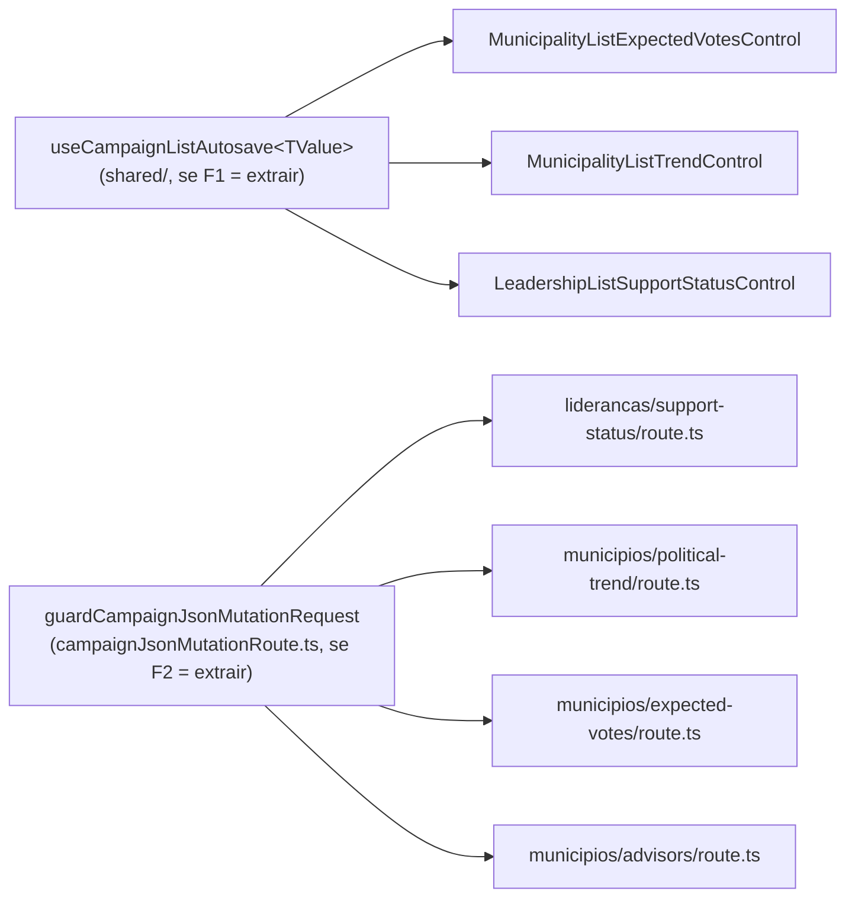

# Escala e DRY pós-B32 (editar Status de apoio na lista de lideranças)

Status: rascunho
Atualizado em: 2026-07-27
Item do roadmap: [docs/roadmap.md](../roadmap.md) (Fill-ins abertos, **B32+**, fill-in de engenharia)
Impeccable: A — N/A (sem superfície UI nova; extrai comportamento já entregue sem mudar contrato de rede nem markup visível)
Appetite: ~1–1,25 dia eng; F1 é uma auditoria com decisão binária (extrair ou registrar rejeição medida, mesmo formato do B33+); F2/F3 são baratas e só valem a pena se F1 concluir "extrair"
Responsável: —

## Dados → decisão → apresentação

- **Vou apresentar dados?** Não (N/A) — lote de manutenção de três controles de auto-save já entregues; nenhuma métrica, série ou escala nova.
- **Anti-goals de dado:** N/A.

## Contexto

O plano do **B32** ([autosave-status-lista-liderancas.md](autosave-status-lista-liderancas.md)) e os dois planos anteriores ([autosave-tendencia-lista-municipios.md](autosave-tendencia-lista-municipios.md) — B24, [combobox-assessores-lista-municipios.md](combobox-assessores-lista-municipios.md) — B27) registraram, cada um, o mesmo "Adiado com gatilho": **extração só no 3º call site**. Com o B32 entregue (2026-07-26), o gatilho disparou — três controles client-side compartilham a mesma máquina de auto-save por debounce:

- `src/components/campaign/municipality/MunicipalityListExpectedVotesControl.tsx` (B27, cenário de votos)
- `src/components/campaign/municipality/MunicipalityListTrendControl.tsx` (B24, status + justificativa)
- `src/components/campaign/leadership/LeadershipListSupportStatusControl.tsx` (B32, select único)

A comparação linha a linha dos três (feita nesta triage, `capture-review-debts` pós-B32) confirma o achado do `/simplify`/reuse: os três repetem, quase byte a byte —

- Estado: `open`, `isDirty`, `isPending`, `errorMessage`.
- Refs: `saveTimeoutRef` (debounce), `abortRef` (cancela o fetch em voo), `committed<X>Ref` (último valor confirmado pelo servidor), `lastProps<X>Ref` (detecta prop externa vs. eco do próprio save), `saveGenerationRef` (descarta resposta de um save superado por um mais recente).
- Efeito de adoção de props externas (navegação/RSC refresh) que só reage quando o valor muda de fora, comparado por uma função `xEqual`/`===` própria de domínio.
- Efeito de cleanup (`clearTimeout` + `abortRef.current?.abort()`) no unmount.
- `save<X>` assíncrono: gera geração, aborta o anterior, `fetch(ENDPOINT, { method: 'POST', headers, credentials: 'same-origin', signal, body })`, faz `cast` da resposta, reverte para o valor confirmado em erro/exceção, atualiza `committed<X>Ref` em sucesso — sempre guardado por `generation !== saveGenerationRef.current`.
- `scheduleSave`/`handleXChange`: marca `isDirty`, atualiza o rascunho local, reagenda o `setTimeout`.
- `handleOpenChange`: ao abrir, limpa erro/dirty; ao fechar com um save pendente, faz _flush_ (chama o save direto em vez de deixar o cleanup do unmount descartá-lo) — o **B32** só ganhou esse flush no `/simplify` da própria entrega, espelhando o `flushDraft` que o B24 já tinha.
- `statusMessage` calculado igual nos três (`errorMessage` → "Salvando…" → "Alterações serão salvas automaticamente." → vazio), num `
`.

**Atualização (2026-07-27, pós-B42 ✓):** o **container** dos três já saiu — `shared/CampaignCellEditOverlay.tsx` (Popover `md+` / Drawer mobile) absorveu Popover/Drawer/trigger/tooltip e `LeadershipListSupportStatusControl` foi migrado como 4º call site. Isso **não** consome o F1 (a casca não toca estado, refs, debounce nem `fetch` — foi o corte deliberado do B42, "só o container"), mas muda duas coisas para a auditoria: os três controles ficaram ~25–40 linhas menores, então a máquina de auto-save é agora a **maior** coisa duplicada neles; e o `/simplify` do B42 acrescentou à lista de peças idênticas um **13º item**, `reportFailure` — `setErrorMessage` + `toast.error` **só quando o overlay já fechou**, porque fechar desmonta o `Alert`/`aria-live` que carregariam o erro. Ele nasceu copiado nos quatro controles (os três do debounce + assessores) no mesmo passe, o que o torna a peça mais recente e mais óbvia do hook, se F1 concluir "extrair".

As diferenças reais, que é o que torna a extração não trivial (achado do `/simplify` reuse review do B32, 2026-07-26): o **shape do valor** diverge (`VoteEstimateScenarioViewModel` objeto com 3 cenários × `MunicipalityListSavedPoliticalTrend` `{status, note}` × `SupportStatus` escalar), **display vs. draft** existe em dois dos três (o B32 colapsou os dois porque só tem um campo — ver "Decisões travadas" do próprio plano B32) e o **B24** tem um guard extra (`inFlightTrendRef`) para não abortar+reenviar o mesmo payload quando blur e fechamento do popover disparam o mesmo flush.

Um quarto controle, `MunicipalityListAdvisorsControl.tsx` (B27, chips + `Command`), **não** compartilha essa máquina — é delta multi-seleção com `requestSeqRef`/`latestConfirmedRef` (fora de escopo, mecânica genuinamente diferente) — mas compartilha com os quatro (incluindo ele) o **preâmbulo do `fetch`** (`credentials: 'same-origin'`, `Content-Type`/`Accept` JSON, `cast` da resposta) e, do lado do servidor, os quatro `route.ts` (`liderancas/support-status`, `municipios/political-trend`, `municipios/expected-votes`, `municipios/advisors`) repetem o mesmo preâmbulo de rota: `isSameOriginRequest(request)` → 403 → `parseCampaignJsonRequestBody` → `bodySchema.parse` → `try/catch` com `campaignJsonMutationErrorResponse`.

## Objetivos

- **F1 (dominante):** decidir, com auditoria de código (não de intenção), se um hook `useCampaignListAutosave<TValue>` genérico compensa nos três call sites do debounce — e, se sim, extraí-lo; se não, registrar a rejeição medida (precedente B33+: a auditoria pode derrubar a premissa do plano).
- **F2 (condicional a F1 ter concluído "vale a pena mexer aqui"):** avaliar um helper de preâmbulo de rota (`guardCampaignJsonMutationRequest` ou nome equivalente) que combine `isSameOriginRequest` + `parseCampaignJsonRequestBody`, reduzindo o boilerplate dos 4 `route.ts`.
- **F3 (condicional, menor prioridade que F2):** avaliar um wrapper fino de `fetch` cliente (`postCampaignJson<TResponse>`) para os 4 controles, cobrindo só o preâmbulo comum (`credentials`/headers/`cast`), não a máquina de estado.
- **F4 (a11y, entrou pela triage do B42 ✓ em 2026-07-27; independente de F1 "extrair ou não"):** a região viva de cada controle é um `
` **dentro** do overlay, e fechar é justamente o que faz o flush da gravação — então "Salvando…" é anunciado numa região que acabou de desmontar, e o leitor de tela não recebe nada. É o mesmo furo que o `toast.error` do B42 tapou para o **erro**, mas o sucesso e o "salvando" continuam mudos. A casca (`CampaignCellEditOverlay`) é o lugar natural de uma região que sobrevive à superfície — o que muda o scaffold, e é por isso que é fase deste plano e não do B42. **Guardrail:** uma região por controle, não uma global por página; `escala-dry-pos-b33.md` já corrigiu uma página com **três** regiões vivas competindo, e a cura não pode reintroduzir isso.
- Guardrail comum às três fases: **zero mudança de contrato de URL/rede e zero mudança de comportamento visível** — é refactor puro, testável pelos specs/e2e já existentes (`campaignLeaderships.e2e.spec.ts`, `campaignMunicipalities.e2e.spec.ts`).

## Decisões travadas

- **Nenhuma travada ainda — este item começa pela auditoria, não pela extração.** O precedente imediato (**B33+**, `escala-dry-pos-b33.md`) mostrou a mesma armadilha duas vezes na família de hooks de lista: o plano supôs "os domínios divergem" e a auditoria achou que dois terços da divergência eram cópia acidental, não necessidade. Este plano recusa-se a pré-decidir a forma do hook antes de olhar o código (que já foi feito no "Contexto" acima, mas a decisão de **assinatura** do hook — genérico por `TValue` vs. par de callbacks `equals`/`buildRequest`/`parseResponse` — fica para a implementação, com o mesmo filtro que o B33+ aplicou ao `toHref`).
- **i18n e naming** seguem o AGENTS.md: identificadores em inglês (`useCampaignListAutosave` é o nome de trabalho; pode mudar na auditoria), sem strings visíveis novas.

## Questões em aberto

- **O hook deve cobrir também o `inFlightTrendRef` do B24 (dedup de blur+close) ou deixar esse guard como responsabilidade do chamador?** **Opções:** (a) o hook expõe um `flush()` idempotente que já resolve isso internamente (um único caminho de save, chamado por blur ou por close); (b) o hook fica "burro" sobre isso e cada chamador decide se precisa do guard. **Recomendação:** (a) — o guard existe porque hoje há _dois_ caminhos de código para chegar ao mesmo save (o `onBlur` do textarea e o `handleOpenChange`); um hook com `flush()` único elimina a duplicidade na raiz em vez de generalizar o sintoma.
- **Vale a pena F2/F3 se F1 concluir "não compensa"?** **Opções:** (a) fazer F2/F3 de qualquer forma, são baratas e independentes de F1; (b) não fazer nenhuma se F1 rejeitar, porque a motivação de fundo (essa família de controles é jovem e ainda pode crescer/divergir) provavelmente também derruba F2/F3. **Recomendação:** (b) com uma ressalva — reavaliar F2/F3 isoladamente **só** se um 5º `route.ts`/controle chegar antes de alguém revisitar este plano (mesma lógica de "3º call site" aplicada à sub-dívida).

## Abordagem proposta

Componentes (condicionais à decisão de cada fase):

- **F1 — auditoria primeiro, código depois.** Antes de escrever o hook, mapear célula a célula (como o "Contexto" já fez) quais das ~12 peças de estado/ref são **idênticas**, quais são **paramétricas** (mudam só de tipo, não de lógica) e quais são **genuinamente divergentes** (o `inFlightTrendRef`, o par display/draft). Só extrair as duas primeiras categorias; a terceira fica exposta como parâmetro do hook (`equals(a, b)`, `buildRequestBody(value)`, `parseResponse(json)`) ou como responsabilidade do chamador, seguindo a "Questão em aberto" acima. **Depth check:** o hook não deve importar nada de `@/app/(campaign)/campanha/(app)/**/types` (os três tipos de resposta são por domínio) — ele recebe `parseResponse` como callback, mesmo padrão de `useCampaignListFilterNavigation` (recebe `toHref`, nunca importa os módulos de URL por domínio).
- **F2 — `guardCampaignJsonMutationRequest(request, schema)`** (se aprovado): retorna `{ ok: true, body } | { ok: false, response }`, combinando `isSameOriginRequest` + `parseCampaignJsonRequestBody` + `bodySchema.parse` num só call site por rota. Vive ao lado de `campaignJsonMutationErrorResponse` em `src/utilities/campaignJsonMutationRoute.ts`.
- **F3 — `postCampaignJson<TResponse>(url, body, signal)`** (se aprovado): `fetch` com o preâmbulo comum + `cast`, sem decidir revert/retry (isso fica no hook do F1 ou no chamador).
- **Migration**: sem migration, sem collection, sem server action — puro refactor client + route handler.

## Dependências

- Nenhuma de outro plano aberto. Depende só do **B32** já entregue (é o item que fecha o gatilho de 3 call sites).

## Não escopo

- **`MunicipalityListAdvisorsControl.tsx`** — mecânica de delta multi-seleção com `requestSeqRef`/`latestConfirmedRef`, genuinamente diferente do debounce single-value; participa só de F2/F3 (preâmbulo de rota/fetch), nunca de F1.
- **Migrar `SupporterFilters`/`ActivityFilters` ou qualquer filtro de lista** — família de hook diferente (`useCampaignListFilterNavigation`, débito do **B33+**), não deste plano.
- **Mudar o comportamento de qualquer um dos três controles** (timings de debounce, mensagens, contrato de rede) — puro refactor interno.

## Rabbit holes

- **"Já que estou generalizando, faço o hook aceitar `TValue` totalmente genérico com `deepEqual` embutido."** Um `deepEqual` genérico reabre a discussão que `voteEstimatesEqual`/`trendsEqual`/`===` já resolveram por domínio (cada um sabe o que "igual" significa para o seu shape — ex. `trendsEqual` normaliza a nota antes de comparar). **Mitigação neste item:** `equals` continua um callback do chamador, nunca uma função genérica no hook.
- **"Enquanto mexo nisso, unifico também o botão/Popover/Field ao redor."** O JSX diverge de propósito (número vs. select vs. select+textarea vs. badge de trigger) — um shell visual genérico é o mesmo anti-padrão que `escala-dry-pos-b33.md` já rejeitou para o `<form>` dos filtros. **Mitigação:** só a máquina de estado/efeitos sai do componente; o JSX fica onde está.

## Adiado com gatilho

- **F2/F3 se F1 rejeitar a extração do hook principal.** Ver "Questões em aberto" — reavaliar isoladamente só com um 5º call site (rota ou controle).
- **`MunicipalityListAdvisorsControl` adotar o preâmbulo de fetch do F3** (se F3 for feito) — hoje ele tem uma política de erro diferente (`pendingCountRef`/sequência, sem revert único), então adotar herdaria só o `fetch`+`cast`, não a lógica de estado; barato, mas não é o call site que motivou o item. Gatilho: F3 concluído e aprovado.
- **Convergir o _corpo_ de multi-seleção (chips + `Command`), não só o container.** Contagem as-built, medida na triage do B42 ✓ (2026-07-27), para o próximo leitor não re-derivar: `shared/LeadershipStateDeputyRelationCell.tsx` (B36 ✓, já em `shared/` e já parametrizada por um record de `COPY`, servindo as duas direções da relação) e `MunicipalityListAdvisorsControl.tsx` (B27 ✓) repetem o mesmo corpo **string por string** — `w-80 p-0`, header `relative flex flex-col gap-2 p-3 pb-0`, Spinner, linha de chips `flex flex-wrap gap-1.5 px-3 pt-2`, o `Badge` de remover (`max-w-full cursor-pointer gap-1 pr-1 font-normal hover:bg-destructive/15`), `Command shouldFilter={false}` e a linha vazia `px-3 py-6 text-center`. `AdvisorMunicipalityCell` é uma terceira grafia, mas **inline** (sem overlay), então não conta como 3º call site do mesmo corpo. **Gatilho:** um 3º corpo em overlay (B34/B37 são os candidatos nomeados) — e aí a peça de destino é a que já mora em `shared/`, não uma quarta. Os planos B31/B34 registram este mesmo adiado do lado do widget; esta é a contagem do lado do markup.

## Referências

- `docs/roadmap.md` (Fill-ins abertos — **B32+**)
- [autosave-status-lista-liderancas.md](autosave-status-lista-liderancas.md) — o pai do lote (B32 ✓), onde o gatilho "3º call site" foi fechado
- [autosave-tendencia-lista-municipios.md](autosave-tendencia-lista-municipios.md) (B24) e [combobox-assessores-lista-municipios.md](combobox-assessores-lista-municipios.md) (B27) — os outros dois planos que registraram o mesmo "Adiado com gatilho"
- [polimento-mobile-lista-municipios.md](polimento-mobile-lista-municipios.md) (B42 ✓) — extraiu o **container** dos mesmos três controles (`CampaignCellEditOverlay`) e introduziu `reportFailure` nos quatro; leia o "As-built" antes de auditar o F1
- [escala-dry-pos-b33.md](escala-dry-pos-b33.md) — precedente direto de forma: hook via callbacks (não módulos de domínio), auditoria derrubando a premissa do plano antes de escrever código
- `src/components/campaign/municipality/MunicipalityListExpectedVotesControl.tsx`, `MunicipalityListTrendControl.tsx`, `src/components/campaign/leadership/LeadershipListSupportStatusControl.tsx` — os três call sites de F1
- `src/app/(campaign)/campanha/(app)/liderancas/support-status/route.ts`, `municipios/{political-trend,expected-votes,advisors}/route.ts` — os quatro call sites de F2
- `src/utilities/campaignJsonMutationRoute.ts`, `src/utilities/sameOriginRequest.ts` — onde F2 pousaria
- AGENTS.md — abstrações precisam de 3+ call sites (aqui há exatamente 3 para F1, 4 para F2/F3)
