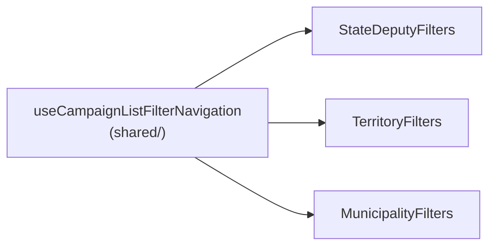

# Escala e DRY pós-B33 (ordenação e filtros de dobradinhas)

Status: rascunho
Atualizado em: 2026-07-26
Item do roadmap: [docs/roadmap.md](../roadmap.md) (Fill-ins abertos, **B33+**, fill-in de engenharia)
Impeccable: A — N/A (sem superfície UI nova; extrai comportamento já entregue sem mudar contrato de URL nem markup visível)
Appetite: ~0,5 dia eng; fase única, sem migration, sem collection, sem `Consent`
Responsável: —

## Dados → decisão → apresentação

- **Vou apresentar dados?** Não (N/A) — o lote é custo de manutenção de um hook de navegação já entregue três vezes; nenhuma métrica, série ou escala nova.
- **Anti-goals de dado:** N/A.

## Contexto

**B33** ([ordenacao-filtros-lista-dobradinhas.md](ordenacao-filtros-lista-dobradinhas.md), entregue 2026-07-26) adicionou paridade mobile (`StateDeputyFilters`) espelhando `TerritoryFilters` (B21 ✓) e `MunicipalityFilters` (B16 ✓). A 2ª passagem `/simplify` da entrega (revisor reuse, 2026-07-26) confirmou que as três já são o **3º call site** do mesmo scaffold de navegação: `SEARCH_DEBOUNCE_MS = 1000`, `useState` de busca, fallback `useCampaignListPending() ?? useTransition()` local, `debounceRef` com cleanup no `useEffect`, `clearDebounce`, `navigateTo` (compara o href canônico com o atual e só navega se mudou) e `scheduleSearch` (debounce que reusa `navigateTo`) — ~35–50 linhas idênticas ou quase idênticas em cada um dos três arquivos:

- `src/components/campaign/stateDeputy/StateDeputyFilters.tsx:31–90`
- `src/components/campaign/municipality/TerritoryFilters.tsx:31–84`
- `src/components/campaign/municipality/MunicipalityFilters.tsx:35–96`

A diferença entre os três está só em **como** o `next: State` vira `State` canônico e `href` — `StateDeputyFilters`/`TerritoryFilters` chamam `parseXListParams(xListStateToRawParams(...))` seguido de `buildXListHref`; `MunicipalityFilters` compara por `buildMunicipalityFiltersKey` em vez de recomputar o href duas vezes. O corpo do `<form>` (busca + resumo de filtros + botão "Limpar" + bloco mobile com `Field`/`NativeSelect` de ordenação) também se repete, mas os filtros do meio do bloco mobile (Partido/Território+Assessoria/4 multi-filtros) divergem por domínio — não faz parte deste lote.

O E10 já havia identificado esse padrão previamente (ver "Adiado com gatilho" de [escala-dry-pos-e10.md](escala-dry-pos-e10.md)) para os multi-filtros do **bloco mobile interno**; este lote é sobre o **scaffold de navegação/debounce** ao redor deles, que é outro pedaço do mesmo arquivo.

## Objetivos

- Um único hook (`useCampaignListFilterNavigation`) concentra `search`/`setSearch`, `isPending`, `navigateTo` e `scheduleSearch`; os três componentes de filtro passam a chamá-lo em vez de reimplementar `debounceRef`/`useEffect`/`clearDebounce`.
- Comportamento visível idêntico: mesmo debounce de 1000ms, mesmo dimming via `useCampaignListPending`, mesmas URLs geradas — sem migration, sem mudança de contrato de URL.
- Guardrail: o hook não decide **o que** é canônico (isso continua em `campaignListUrl.ts` + módulo por domínio); ele só orquestra o ciclo debounce → canonicalizar → comparar → `router.replace` dentro de uma transition.

## Decisões travadas

- **O hook recebe callbacks (`toCanonical`, `toHref`), não os módulos de URL por domínio.** Assim ele não importa `stateDeputyListUrl`/`territoryListUrl`/`municipalityListUrl` e continua em `shared/` sem inverter a direção de dependência (`components/campaign/<domínio>` → hook genérico, nunca o contrário). Fonte: `/simplify` B33 rodada 2 (2026-07-26), reuse review. **Rejeitado:** o hook aceitar o `State` genérico e um único `resolveListUrl` importado de `campaignListUrl.ts` — os três domínios já têm assinaturas de canonicalização levemente diferentes (`MunicipalityFilters` compara por `buildMunicipalityFiltersKey`, os outros dois recomputam href duas vezes), então forçar uma assinatura comum agora exigiria mudar `buildXListHref`/`parseXListParams` dos três módulos só para caber no hook — inverte o custo (a duplicação é mais barata que a unificação de assinatura).
- **Só o scaffold de navegação sai; o `<form>`/JSX permanece por componente.** O corpo visual diverge o bastante (Partido vs Território+Assessoria vs 4 multi-filtros) que um componente de shell genérico viraria um `children`-render-prop só para economizar ~15 linhas de JSX repetido (input de busca + resumo + botão Limpar), o que é o tipo de abstração prematura que o `engineering-standards.mdc` pede para evitar. **Rejeitado:** `CampaignListFilterBar` com slot para os filtros do meio — analisado e descartado por esticar a interface para 3 usos ainda divergentes.
- **i18n e naming** seguem o AGENTS.md: identificador em inglês (`useCampaignListFilterNavigation`), sem strings visíveis novas.

## Questões em aberto

- **O hook expõe `scheduleSearch` só para o campo de busca, ou também um `commitNow` para os outros controles (select/popover) chamarem `navigateTo` direto?** **Opções:** (a) expor `navigateTo` cru + `scheduleSearch` (debounce) como duas funções separadas do hook; (b) só `scheduleSearch`, com os outros controles chamando `navigateTo` importado à parte. **Recomendação:** (a) — é exatamente o que os três componentes já fazem hoje (search usa `scheduleSearch`, sort/filtros usam `navigateTo` direto), então o hook só precisa expor os dois nomes que já existem, sem inventar terceiro.

## Abordagem proposta

Componentes:

- **`useCampaignListFilterNavigation`** (novo, `src/components/campaign/shared/useCampaignListFilterNavigation.ts`): recebe `{ initialQuery, toCanonicalHref(next), isDebounced }`, devolve `{ search, setSearch, isPending, navigateTo(next), scheduleSearch(value, buildNext) }`. Internamente reusa `useCampaignListPending()` com fallback a `useTransition()` local (mesmo padrão dos três arquivos hoje) e o `debounceRef`/cleanup.
- **`StateDeputyFilters.tsx`** / **`TerritoryFilters.tsx`** / **`MunicipalityFilters.tsx`**: substituem os blocos duplicados (linhas citadas acima) pela chamada ao hook, passando o `toCanonicalHref` específico do domínio (que já existe: `parseXListParams` + `buildXListHref`, ou `buildMunicipalityFiltersKey`). JSX inalterado.
- **Migration**: sem migration, sem collection, sem server action.

## Dependências

- Nenhuma de outro plano aberto. Reusa `useCampaignListPending` (`shared/CampaignListPending.tsx`) já compartilhado pelos três.

## Não escopo

- **Unificar o `<form>`/JSX dos três filtros** — analisado e rejeitado acima; cada domínio mantém seu próprio corpo mobile.
- **Multi-filtros do bloco mobile saindo de `*ListFilters.ts` definitions** — já é o F4 de [escala-dry-pos-e10.md](escala-dry-pos-e10.md); este lote não duplica esse escopo.
- **Extrair o par head/filtro do header desktop (`CampaignSortableHead`/`CampaignHeaderFilterPopover`)** — já compartilhado desde B21 ✓; fora deste lote, que é só o scaffold de busca/debounce.

## Rabbit holes

- **"Já que estou extraindo, generalizo `State` com um único módulo de URL parametrizado."** Se alguém "só completar": os três contratos de URL (`stateDeputyListUrl.ts`/`territoryListUrl.ts`/`municipalityListUrl.ts`) colapsam num DSL genérico, exatamente o anti-padrão que "Decisões travadas" de B33/B21/B29 já rejeitaram por acoplar três contratos independentes num só ponto de mudança. **Mitigação neste item:** o hook recebe callbacks, nunca importa os módulos de URL por domínio.

## Adiado com gatilho

Nenhum neste item.

## Referências

- `docs/roadmap.md` (Fill-ins abertos — **B33+**)
- [ordenacao-filtros-lista-dobradinhas.md](ordenacao-filtros-lista-dobradinhas.md) — o pai do lote (B33 ✓)
- [escala-dry-pos-e10.md](escala-dry-pos-e10.md) — F4, o débito irmão do bloco mobile interno (não sobreposto por este lote)
- `src/components/campaign/stateDeputy/StateDeputyFilters.tsx` (`:31`–`:90`)
- `src/components/campaign/municipality/TerritoryFilters.tsx` (`:31`–`:84`)
- `src/components/campaign/municipality/MunicipalityFilters.tsx` (`:35`–`:96`)
- `src/components/campaign/shared/CampaignListPending.tsx` — `useCampaignListPending`, reusado pelo hook novo
- AGENTS.md — módulo de dependência `lib/`→`utilities/`→`components/`; abstrações precisam de 3+ call sites (aqui há exatamente 3, o piso do próprio AGENTS.md)
