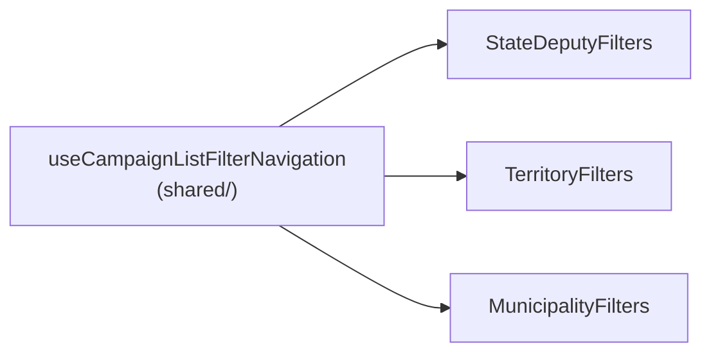

# Escala e DRY pós-B33 (ordenação e filtros de dobradinhas)

Status: entregue (2026-07-27)
Atualizado em: 2026-07-27
Item do roadmap: [docs/roadmap.md](../roadmap.md) (Fill-ins abertos, **B33+**, fill-in de engenharia)
Impeccable: A — N/A (sem superfície UI nova; extrai comportamento já entregue sem mudar contrato de URL nem markup visível)
Appetite: ~0,5 dia eng; fase única, sem migration, sem collection, sem `Consent`
Responsável: —

## Como ficou (2026-07-27)

Entregue como planejado no essencial — um hook em `shared/`, três call sites, JSX intocado — com quatro correções que a auditoria pré-implementação impôs sobre o texto abaixo. Ele fica preservado como registro do raciocínio; o que vale é esta seção.

1. **O racional da "Decisão travada" caiu: um único `toHref` cobre os três.** O plano supunha que os domínios tinham assinaturas de canonicalização diferentes e que unificá-las custaria mudar `buildXListHref`/`parseXListParams`. Falso: `buildStateDeputyListHref`, `buildTerritoryListHref` e `buildMunicipalityListHref` **já canonicalizam internamente** (`parseXListParams(xListStateToRawParams(...))` dentro de `buildXListSearchParams` / `serializeTerritoryListSearchParams`), e `buildMunicipalityFiltersKey` é literalmente `buildMunicipalityListSearchParams(state).toString()` — a query string canônica, equivalente a comparar hrefs sob o mesmo basePath. Logo o `parse(...)` explícito em dobradinhas e territórios era **trabalho redundante**, não diferença de domínio, e o hook recebe um só callback `toHref`, não o par `toCanonical`/`toHref`. A decisão de fundo (o hook recebe callback e nunca importa os módulos de URL por domínio) permanece intacta.
2. **Achado novo — divergência de comportamento, corrigida.** Em `/campanha/municipios` cada filtro/sort carregava a busca digitada e não commitada; em dobradinhas e territórios `navigateTo` chamava `clearDebounce()` primeiro, então tocar um filtro no meio da digitação **descartava** a busca pendente enquanto o input seguia exibindo o texto. O hook unifica na semântica de municípios via `navigateWithSearch`, que é por isso a **terceira** função exposta — a "Questão em aberto" fecha com três nomes (`navigateTo`, `navigateWithSearch`, `scheduleSearch`), não dois — dos quais só `navigateWithSearch` sobreviveu à segunda rodada de `/simplify` (ponto 10a). `clearDebounce` não é exposto: `navigateTo` limpa antes de qualquer guarda, então os três "Limpar" só precisam de `setSearch('') + navigateTo(clearXListFilters(state))` — o que também eliminou o `router.replace` solto de municípios.
3. **Export orfanado, deletado.** `shouldUpdateMunicipalitySearchUrl` (`municipalityListUrl.ts`) era `normalizedText(input) !== currentQ` com dois consumidores: `MunicipalityFilters` e o próprio spec. Com a guarda genérica dentro do hook, morreu junto com seu `describe` em `municipalityList.unit.spec.ts` — knip trata `exports` como ERROR no CI.
4. **Rede de segurança onde não havia nenhuma:** `tests/unit/campaignListFilterNavigation.unit.spec.ts` renderiza os três filtros em jsdom com `next/navigation` mockado e timers falsos (`toFake: ['setTimeout','clearTimeout']` — o scheduler do React precisa de microtasks reais). Cinco casos × três listas na primeira volta (oito depois do ponto 9): debounce de 1000ms num único `replace` canônico, reinício da janela ao continuar digitando, dedup de no-op, cancelamento no unmount e o carregamento do rascunho de busca. Escrito antes da migração, o quinto caso nasceu **vermelho em dobradinhas e territórios** e verde em municípios, que é exatamente o achado 2.

5. **A extração tinha reimplantado o fallback de transition que já existia em quatro lugares (`/simplify`, reuse review).** O bloco `useCampaignListPending() ?? useTransition()` estava copiado em `CampaignSearchForm`, `CampaignFilterChips`, `SupporterFilters`, `ActivityFilters` e `CampaignTransitionAnchor` — o hook novo foi a sexta cópia, num item cuja tese é justamente extrair um padrão de 3 call sites. Virou `useCampaignListTransition()` em `CampaignListPending.tsx`, consumido pelos seis; `useCampaignListPending` deixou de ser exportado (o contexto agora se lê por um caminho só).
6. **`normalizedText(search) || state.q` também era a mesma expressão nos três** — o hook passou a devolvê-la como `draftQ`, o que tirou o último import de `campaignListUrl` dos três componentes e dá **um** lugar para resolver a assimetria que sobrou (o resumo cai no `q` commitado quando a caixa esvazia; `navigateWithSearch` limpa). Semântica preservada como estava.
7. **Uma correção de a11y que a comparação linha a linha revelou:** só `MunicipalityFilters` tinha `aria-live="polite"` no parágrafo **visível** de resumo, sobre um `md:block` — era a terceira região viva da mesma página (com o `sr-only` do próprio form e o de `CampaignListResults`), anunciando o resumo de filtros a cada tecla. Removida, junto com um `div` de um filho só herdado de quando a linha tinha dois botões. Isto **quebra** a promessa de "zero markup" do saldo abaixo, deliberadamente: era bug, não estilo. O `md:whitespace-normal` ficou (o resumo de municípios é o mais longo dos três).

8. **Bug latente que a extração passou a possuir, corrigido (`/simplify`, code-quality review).** O `setTimeout` do debounce capturava o `state` do render que o agendou, e os controles que navegam **de fora** da casca (`CampaignSortableHead`, paginação do `CampaignListFooter`, a âncora "Limpar" do estado vazio) mudam `state` sem tocar no timer. Em territórios e dobradinhas isso significava: digite, clique num sort dentro de 1s, e um segundo depois a navegação pendente **revertia o sort**. Municípios escapava por acidente — o `key=` da página remonta o componente e o cleanup mata o timer. Agora `stateRef` dá ao timer e à guarda de dedup o estado commitado mais recente, então a navegação pendente **soma-se** ao sort em vez de atropelá-lo, nos três. O caso novo do spec (`não reverte uma navegação feita de fora da casca`) foi verificado vermelho nas três listas com o `stateRef` revertido.
9. **Outros achados da mesma revisão, todos baratos:** `navigateWithSearch` passava a busca crua e dependia de um invariante que só existia num JSDoc — agora normaliza no próprio hook (href idêntico, invariante local); `{ ...next, page: 1 }` em dois call sites era morto (`buildXListHref(state, page)` já ignora `state.page` quando recebe o argumento) e saiu junto com um terceiro em `MunicipalityFilters`; a guarda `normalizedText(value) === state.q` de `scheduleSearch` era uma **segunda** fonte de verdade para "isto muda a URL?" — exatamente o que o `shouldUpdateMunicipalitySearchUrl` deletado era — e foi removida, deixando a dedup só em `navigateTo`; e o spec passou a montar dentro de `CampaignListPendingBoundary`, porque as três páginas renderizam sob uma e o fallback local de `useTransition` é o ramo que **nunca** roda em produção (antes, todas as asserções corriam pelo ramo morto). Somaram-se casos para "Limpar", para esvaziar uma busca commitada e para provar que o timer morreu após o sort: 5 → 8 casos × 3 listas.

10. **Segunda rodada de `/simplify` (reuse + performance), depois do rebase.** Cinco correções, todas de reuso ou de superfície: (a) `setSearch` + `scheduleSearch` eram sempre chamados em par nos três `onChange` (em duas grafias diferentes) — viraram um `onSearchChange(value)`, o que tirou **os dois** da superfície exportada; com `navigateTo` já privado atrás de `clearSearchAndNavigate`, o hook devolve 6 nomes em vez de 8, e não existe mais forma de ligar metade do par. (b) `MunicipalityFilters` reimplementava inline o `buildMunicipalityFilterHref` que `municipalityListFilters.ts` **já exporta** com quatro consumidores; passou a recebê-lo, e o pin de página 1 volta a morar num lugar por domínio. (c) O mesmo helper faltava em dobradinhas, onde `buildStateDeputyListHref(next, 1)` estava escrito à mão em quatro sítios — nasceu `buildStateDeputyFilterHref`, e a assimetria de aridade do prop `toHref` (dois unários e uma lambda) desapareceu. (d) Só `MunicipalityFilters` **não** mostrava o resumo de filtros ativos no bloco `md:hidden`: no telemóvel, onde esse bloco é o ponto todo, o utilizador de municípios não tinha indicação nenhuma de quais filtros estavam ligados. Adicionado o parágrafo que os outros dois já tinham. (e) A normalização que o ponto 9 tinha metido dentro de `navigateWithSearch` foi **revertida**: `scheduleSearch` sempre entregou a tecla crua ao `toHref`, então normalizar num caminho e não no outro era a segunda política que o ponto 9 dizia estar a remover — agora os dois entregam cru e o serializador decide, documentado no cabeçalho do hook. Fora do saldo: `stripTrailingSlash` (`utilities/seo.ts`) era um export sem consumidor **pré-existente** em `main` que fazia o knip do CI falhar; deixou de ser exportado.

Duas revisões da mesma rodada foram deferidas com gatilho em vez de aplicadas, e estão registadas no roadmap: extrair o `<Field>` de "Ordenar" (idêntico nos três, já com deriva de altura do select) e o par `serialize`/`parseXSortValue` triplicado verbatim nos três módulos de URL. A revisão de performance mediu a entrega como neutra (mesmo número de `router.replace`, mesma cadência de RSC) e o seu único achado real é anterior a este item: `/campanha/municipios` embarca ~10 kB gzip do catálogo no cliente por causa de um `isMunicipalitySlug`, também no roadmap.

Saldo medido no fim (incluindo as duas rodadas de `/simplify`): **278 linhas removidas contra 48 adicionadas nos três filtros**, 325 contra 228 em todo o `src` — e as 138 linhas do hook novo (metade comentário) estão dentro desse "adicionadas", ou seja ~97 linhas líquidas a menos, sem nenhuma mudança de contrato de URL. O markup só se moveu no ponto 7. `CampaignSearchForm` (lideranças/assessores/organizações) segue fora de escopo, mas **pelo motivo durável, não pelo que este plano registrava antes**: não é "sem debounce" (adicionar um debounce reabriria a questão) — é que ele monta o href como `${basePath}?q=…`, **descartando todos os outros params**, porque esses três domínios não têm módulo de URL nem `parseXListParams`. Entregá-lo a um hook cujo contrato é "canonicalizar, comparar, deduplicar" tornaria o contrato falso naquele call site. B29 provavelmente o substitui por um `LeadershipFilters` real.

**Verificação:** gate do AGENTS.md verde e bare (`tsc --noEmit`, `pnpm lint`, `format:check`, `knip`, `check:cycles`, 562 unit + 413 int, `pnpm build` local); Aikido sem findings. O e2e não pôde ser usado como veredito nesta sessão: a máquina estava com load average ~58 (dois outros worktrees com dev server ativo), e `campaignMunicipalities.e2e.spec.ts` falhou de forma instável tanto na árvore nova quanto na árvore limpa em stash — o flake pré-existente registrado no AGENTS.md, amplificado por timeout. `campaignTerritories.e2e.spec.ts` passou em todas as rodadas, e nenhum teste de municípios exercita o formulário de filtros (eles navegam direto por `?q=`), então o e2e não cobria esta superfície de qualquer forma. É o ponto fraco conhecido da entrega: a hidratação real segue sem pin.

## Dados → decisão → apresentação

- **Vou apresentar dados?** Não (N/A) — o lote é custo de manutenção de um hook de navegação já entregue três vezes; nenhuma métrica, série ou escala nova.
- **Anti-goals de dado:** N/A.

## Contexto

**B33** ([ordenacao-filtros-lista-dobradinhas.md](ordenacao-filtros-lista-dobradinhas.md), entregue 2026-07-26) adicionou paridade mobile (`StateDeputyFilters`) espelhando `TerritoryFilters` (B21 ✓) e `MunicipalityFilters` (B16 ✓). A 2ª passagem `/simplify` da entrega (revisor reuse, 2026-07-26) confirmou que as três já são o **3º call site** do mesmo scaffold de navegação: `SEARCH_DEBOUNCE_MS = 1000`, `useState` de busca, fallback `useCampaignListPending() ?? useTransition()` local, `debounceRef` com cleanup no `useEffect`, `clearDebounce`, `navigateTo` (compara o href canônico com o atual e só navega se mudou) e `scheduleSearch` (debounce que reusa `navigateTo`) — ~35–50 linhas idênticas ou quase idênticas em cada um dos três arquivos:

- `src/components/campaign/stateDeputy/StateDeputyFilters.tsx:31–90`
- `src/components/campaign/municipality/TerritoryFilters.tsx:31–84`
- `src/components/campaign/municipality/MunicipalityFilters.tsx:35–96`

A diferença entre os três está só em **como** o `next: State` vira `State` canônico e `href` — `StateDeputyFilters`/`TerritoryFilters` chamam `parseXListParams(xListStateToRawParams(...))` seguido de `buildXListHref`; `MunicipalityFilters` compara por `buildMunicipalityFiltersKey` em vez de recomputar o href duas vezes. O corpo do `<form>` (busca + resumo de filtros + botão "Limpar" + bloco mobile com `Field`/`NativeSelect` de ordenação) também se repete, mas os filtros do meio do bloco mobile (Partido/Território+Assessoria/4 multi-filtros) divergem por domínio — não faz parte deste lote.

O E10 já havia identificado esse padrão previamente (ver "Adiado com gatilho" de [escala-dry-pos-e10.md](escala-dry-pos-e10.md)) para os multi-filtros do **bloco mobile interno**; este lote é sobre o **scaffold de navegação/debounce** ao redor deles, que é outro pedaço do mesmo arquivo.

## Objetivos

- Um único hook (`useCampaignListFilterNavigation`) concentra `search`/`setSearch`, `isPending`, `navigateTo` e `scheduleSearch`; os três componentes de filtro passam a chamá-lo em vez de reimplementar `debounceRef`/`useEffect`/`clearDebounce`.
- Comportamento visível idêntico: mesmo debounce de 1000ms, mesmo dimming via `useCampaignListPending`, mesmas URLs geradas — sem migration, sem mudança de contrato de URL.
- Guardrail: o hook não decide **o que** é canônico (isso continua em `campaignListUrl.ts` + módulo por domínio); ele só orquestra o ciclo debounce → canonicalizar → comparar → `router.replace` dentro de uma transition.

## Decisões travadas

- **O hook recebe callbacks (`toCanonical`, `toHref`), não os módulos de URL por domínio.** Assim ele não importa `stateDeputyListUrl`/`territoryListUrl`/`municipalityListUrl` e continua em `shared/` sem inverter a direção de dependência (`components/campaign/<domínio>` → hook genérico, nunca o contrário). Fonte: `/simplify` B33 rodada 2 (2026-07-26), reuse review. **Rejeitado:** o hook aceitar o `State` genérico e um único `resolveListUrl` importado de `campaignListUrl.ts` — os três domínios já têm assinaturas de canonicalização levemente diferentes (`MunicipalityFilters` compara por `buildMunicipalityFiltersKey`, os outros dois recomputam href duas vezes), então forçar uma assinatura comum agora exigiria mudar `buildXListHref`/`parseXListParams` dos três módulos só para caber no hook — inverte o custo (a duplicação é mais barata que a unificação de assinatura).
- **Só o scaffold de navegação sai; o `<form>`/JSX permanece por componente.** O corpo visual diverge o bastante (Partido vs Território+Assessoria vs 4 multi-filtros) que um componente de shell genérico viraria um `children`-render-prop só para economizar ~15 linhas de JSX repetido (input de busca + resumo + botão Limpar), o que é o tipo de abstração prematura que o `engineering-standards.mdc` pede para evitar. **Rejeitado:** `CampaignListFilterBar` com slot para os filtros do meio — analisado e descartado por esticar a interface para 3 usos ainda divergentes.
- **i18n e naming** seguem o AGENTS.md: identificador em inglês (`useCampaignListFilterNavigation`), sem strings visíveis novas.

## Questões em aberto

- **O hook expõe `scheduleSearch` só para o campo de busca, ou também um `commitNow` para os outros controles (select/popover) chamarem `navigateTo` direto?** **Opções:** (a) expor `navigateTo` cru + `scheduleSearch` (debounce) como duas funções separadas do hook; (b) só `scheduleSearch`, com os outros controles chamando `navigateTo` importado à parte. **Recomendação:** (a) — é exatamente o que os três componentes já fazem hoje (search usa `scheduleSearch`, sort/filtros usam `navigateTo` direto), então o hook só precisa expor os dois nomes que já existem, sem inventar terceiro.

## Abordagem proposta

Componentes:

- **`useCampaignListFilterNavigation`** (novo, `src/components/campaign/shared/useCampaignListFilterNavigation.ts`): recebe `{ initialQuery, toCanonicalHref(next), isDebounced }`, devolve `{ search, setSearch, isPending, navigateTo(next), scheduleSearch(value, buildNext) }`. Internamente reusa `useCampaignListPending()` com fallback a `useTransition()` local (mesmo padrão dos três arquivos hoje) e o `debounceRef`/cleanup.
- **`StateDeputyFilters.tsx`** / **`TerritoryFilters.tsx`** / **`MunicipalityFilters.tsx`**: substituem os blocos duplicados (linhas citadas acima) pela chamada ao hook, passando o `toCanonicalHref` específico do domínio (que já existe: `parseXListParams` + `buildXListHref`, ou `buildMunicipalityFiltersKey`). JSX inalterado.
- **Migration**: sem migration, sem collection, sem server action.

## Dependências

- Nenhuma de outro plano aberto. Reusa `useCampaignListPending` (`shared/CampaignListPending.tsx`) já compartilhado pelos três.

## Não escopo

- **Unificar o `<form>`/JSX dos três filtros** — analisado e rejeitado acima; cada domínio mantém seu próprio corpo mobile.
- **Multi-filtros do bloco mobile saindo de `*ListFilters.ts` definitions** — já é o F4 de [escala-dry-pos-e10.md](escala-dry-pos-e10.md); este lote não duplica esse escopo.
- **Extrair o par head/filtro do header desktop (`CampaignSortableHead`/`CampaignHeaderFilterPopover`)** — já compartilhado desde B21 ✓; fora deste lote, que é só o scaffold de busca/debounce.

## Rabbit holes

- **"Já que estou extraindo, generalizo `State` com um único módulo de URL parametrizado."** Se alguém "só completar": os três contratos de URL (`stateDeputyListUrl.ts`/`territoryListUrl.ts`/`municipalityListUrl.ts`) colapsam num DSL genérico, exatamente o anti-padrão que "Decisões travadas" de B33/B21/B29 já rejeitaram por acoplar três contratos independentes num só ponto de mudança. **Mitigação neste item:** o hook recebe callbacks, nunca importa os módulos de URL por domínio.

## Adiado com gatilho

Achados do `/simplify` (2026-07-27) que são maiores que limpeza:

- **Shell de `<form>` compartilhado — a evidência registrada em "Decisões travadas" é mensuravelmente falsa e fica corrigida aqui.** Normalizando os substantivos de domínio, `TerritoryFilters` e `StateDeputyFilters` são **110 de 147 linhas byte-idênticas**, e o par `<form role="search">` + parágrafo `sr-only` (13 linhas) é byte-idêntico nos **três**. O plano tratou "o meio diverge" como prova de "a casca diverge", e são afirmações diferentes: a casca sai por `children` (o idioma que `CampaignListResults`/`LeaderContactsPanel`/`mapSlot` já usam), sem o render-prop que foi rejeitado. **Gatilho:** o 4º filtro de lista (o `LeadershipFilters` de B29). Quem reabrir não deve reusar o argumento antigo.
- ~~**Ressincronizar a busca com `state.q`**~~ — **decidido e feito na 2ª rodada de `/simplify`**, pelo terceiro caminho: o hook segue a URL quando o `q` commitado muda **e não há debounce pendente** (`committedQ`), então Back/Forward e a âncora "Limpar busca e filtros" atualizam a caixa, mas o texto de quem está a digitar nunca é atropelado — que era o custo com que os dois revisores se cobravam mutuamente. Com isso o `key={buildMunicipalityFiltersKey(state)}` de `/campanha/municipios` **saiu** (era a única razão para as três páginas divergirem, e remontar a cada navegação committed matava o timer, tornando a guarda de dedup do ponto 8 código morto justamente num dos três call sites); `buildMunicipalityFiltersKey` orfanou e foi deletado. Sobra a política de montagem de `/campanha/apoiadores` e `/campanha/atividades`, que continuam com `key=` — não são consumidores do hook, então nada quebra; unificar quando adotarem a navegação compartilhada.
- **`<Field>` de "Ordenar" extraído (`CampaignListSortSelect`).** Os três blocos de 21 linhas diferem só nos identificadores de domínio — e **já divergiram**: `MunicipalityFilters` usa `className="min-h-11 w-full"` onde os outros dois usam `"w-full [&_select]:h-11"`, duas alturas para o mesmo controlo na mesma família de listas. O precedente de extração está na mesma pasta e tem os mesmos três call sites (`CampaignMobileMultiFilterField`). Não foi feito aqui por não haver decisão de qual altura é a correta — é escolha de design, não de código. **Gatilho:** a decisão de altura, ou o shell acima (que engole este bloco).
- **`serializeXSortValue` / `parseXSortValue` triplicados verbatim** (`municipalityListUrl.ts`, `territoryListUrl.ts`, `stateDeputyListUrl.ts`): `` `${key}|${dir}` `` e um `split('|')` com dois `Set.has`. `campaignListUrl.ts` é a casa desse tipo de parsing partilhado (já tem `normalizedText`, `allParamValues`, `parseExhaustiveEnumParam`) e não tem nenhum helper de sort. Genérico lá remove as três cópias sem tocar em contrato de URL. **Gatilho:** o 4º módulo de URL com sort (B29), ou o primeiro bug de deriva entre as cópias.
- **`SupporterFilters` / `ActivityFilters` adotarem o hook.** Ganharam `useCampaignListTransition`, mas não a navegação. **A razão registada aqui antes era factualmente falsa** e fica corrigida (reuse review, 2ª rodada): não é "montam o href sem passo de parse" — `buildSupporterListSearchParams` e `buildActivityListSearchParams` chamam `parseXListParams(...)` na primeira linha, exatamente a propriedade que justificou colapsar os outros três num só `toHref`. O impedimento real é o `valuesRef`/`useOptimistic` espelhando todos os filtros, para o qual o hook não tem equivalente; e migrar lhes **daria** dedup de no-op, mudança de comportamento em duas superfícies vivas. **Gatilho:** quando um deles precisar de dedup ou de busca com debounce. Independente disso, os dois reconstroem o href à mão a partir de `usePathname()` embora `buildSupporterListHref`/`buildActivityListHref` já existam e estejam pinados — dívida separada, no roadmap.
- **`/campanha/municipios` embarca ~10 kB gzip do catálogo dos 435 municípios no bundle do cliente** — achado da performance review, **anterior a este item** e a única coisa que ela encontrou: um `isMunicipalitySlug` num componente cliente arrasta `municipalityCatalog` inteiro, exatamente a violação de fronteira que o B14 pagou 21 kB para aprender ("client components não importam módulos de dados do servidor para valores"). Fora de escopo aqui porque a correção é no lado que consome o predicado, não no hook. **Gatilho:** próximo trabalho de bundle em `/campanha/municipios` (o B41/B42 tocam a mesma rota). **Atualização 2026-07-27: o gatilho disparou duas vezes e ninguém pagou** — **B41 ✓** e **B42 ✓** entregaram na rota sem tocar nisto, e a performance review do B42 reconfirmou o achado no mesmo endereço (`municipalityListUrl.ts` importa `isMunicipalitySlug`; os clientes que o arrastam são `MunicipalityFilters`, `MunicipalitySortableHead` e `MunicipalityHeaderFilter`). Ou seja: já não é condicional a um futuro — é a dívida de bundle **corrente** da rota, e o próximo item que abrir estes arquivos deveria pagá-la em vez de re-registrar o gatilho. Escopo real da correção: mover o predicado para um módulo client-safe (ou fazer o servidor validar o slug antes de serializar o href), não tocar no hook.
- **Terceiro idioma de mock de router nos testes.** `campaignListFilterNavigation.unit.spec.ts` usa `vi.hoisted` + `vi.mock('next/navigation')` com spread do módulo real; a casa já tem `stub<AppRouterInstance>` dentro de `AppRouterContext.Provider` (`campaignComponents.unit.spec.ts`), que dá as mesmas asserções sem mock de módulo. Não convertido por ser troca de harness num spec de 10 casos × 3 listas que está verde. **Gatilho:** o 4º spec que precise de router, ou o primeiro sintoma de deriva do spread.

## Referências

- `docs/roadmap.md` (Fill-ins abertos — **B33+**)
- [ordenacao-filtros-lista-dobradinhas.md](ordenacao-filtros-lista-dobradinhas.md) — o pai do lote (B33 ✓)
- [escala-dry-pos-e10.md](escala-dry-pos-e10.md) — F4, o débito irmão do bloco mobile interno (não sobreposto por este lote)
- `src/components/campaign/stateDeputy/StateDeputyFilters.tsx` (`:31`–`:90`)
- `src/components/campaign/municipality/TerritoryFilters.tsx` (`:31`–`:84`)
- `src/components/campaign/municipality/MunicipalityFilters.tsx` (`:35`–`:96`)
- `src/components/campaign/shared/CampaignListPending.tsx` — `useCampaignListPending`, reusado pelo hook novo
- AGENTS.md — módulo de dependência `lib/`→`utilities/`→`components/`; abstrações precisam de 3+ call sites (aqui há exatamente 3, o piso do próprio AGENTS.md)
