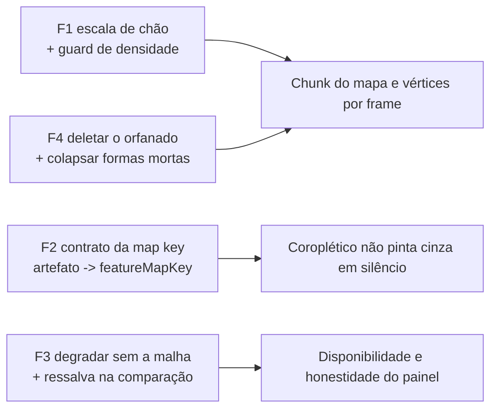

# Escala e DRY pós-B8 F2 (polígonos das ZE de Salvador)

Status: rascunho
Atualizado em: 2026-07-26
Item do roadmap: [docs/roadmap.md](../roadmap.md) (Fill-ins abertos, **B8+**, fill-in de engenharia)
Impeccable: A — N/A (nenhuma superfície nova; F3 muda um parágrafo de copy e um estado de falha, o resto preserva o comportamento visível do B8 F2)
Appetite: ~0,75–1 dia eng; quatro fases independentes, nenhuma com migration, collection ou `Consent`; só F1 reescreve o artefato commitado
Responsável: —

## Dados → decisão → apresentação

- **Vou apresentar dados?** Não (N/A) — o lote é custo, coerência e honestidade de dados já entregues pelo B8 F2. F3 muda **um parágrafo** (a ressalva de aproximação, que hoje desaparece no modo comparação enquanto a malha aproximada continua pintada), não a métrica nem a forma.
- **Anti-goals de dado:** nenhuma escala nova, nenhuma métrica nova, nenhum rank por ZE (esse tem gatilho próprio no [plano do B8](poligonos-pracas-zona.md)). Se uma fase começar a propor métrica, ela virou outro item.

## Contexto

**B8 F2** ([poligonos-pracas-zona.md](poligonos-pracas-zona.md), entregue 2026-07-26) deu polígono próprio às 19 ZE de Salvador e re-keyed o coroplético por **map key** (`municipalitySlug` na zona, `ibgeCode` no resto). O `/simplify` da entrega (três revisores em paralelo — quality / performance / reuse) devolveu relatório **depois** do merge; o cleanup barato entrou antes (`id` no re-index do script, comentário obsoleto, asserções tautológicas), e os achados maiores que cleanup estão aqui.

O lote abre com custo porque o achado de performance é o único **medido e já commitado**: o artefato novo tem quase exatamente a mesma contagem de vértices que a malha de **todos** os 417 municípios da Bahia, gasta em 3,8% da largura do mapa. Verificado nos artefatos deste repo, não estimado:

| artefato                       | features | pontos de arco | pontos/feature | bbox            | passo da grade     |
| ------------------------------ | -------- | -------------- | -------------- | --------------- | ------------------ |
| `bahia-municipalities`         | 417      | 9.139          | 21,9           | 9,236° × 9,804° | ~103 m × 108 m     |
| `bahia-identity-territories`   | 27       | 1.210          | 44,8           | 9,227° × 9,804° | ~103 m × 108 m     |
| **`bahia-municipality-zones`** | **19**   | **9.120**      | **480,0**      | 0,353° × 0,275° | **~3,9 m × 3,0 m** |

A comparação que fecha o caso: **Salvador é um `Polygon` de 35 pontos na malha municipal e 9.120 pontos na malha de zonas.** A causa não é a malha de bairros ser detalhada — é que `QUANTIZE_DIGITS = 1e4` e `SIMPLIFY_QUANTILE = 0.35` foram copiados verbatim do script irmão, e **os dois são relativos à própria topologia**: a quantização é uma grade sobre o bbox do arquivo (o de Salvador é ~26× mais estreito que o da Bahia, daí 30× mais resolução no chão) e o quantil de `topojson-simplify` é um percentil dos pesos de triângulo **daquele** arquivo (manter 65% num mosaico de bairros corta um limiar de área absoluta muito menor que num mosaico municipal estadual). O detalhe só se torna visível por volta do zoom 15; `fitMapToHighlights` para em `maxZoom: 10`.

**Já resolvido no simplify (não reabrir):** o re-index das geometrias simplificadas passou de `properties.name` para um `id` único (um nome repetido em malha futura colapsaria dois polígonos em silêncio dentro de um artefato commitado — o irmão usa `codarea`, único por construção), com rebuild byte-idêntico como prova; o comentário de `zoneCity` que afirmava não existirem polígonos de zona; e as duas asserções que a hidratação da Fase 0 tornou tautológicas (comparavam `city`/`zoneNumber` com o catálogo de onde foram copiados). Os revisores também confirmaram que o commit **acertou** três coisas que não devem regredir: `fitMapToHighlights` ficou mais rápido que antes (lê o `_bounds` já cacheado dos paths desenhados em vez de construir um `L.geoJSON` descartável sobre os 417 features), o desenho do B6 sobreviveu intacto (efeito de geometria só em `[mode]`, `restyleFeature` O(2), `featureMapKey` roda 2× por feature na construção e nunca por frame), e o re-keying deixou o servidor **mais barato** (`computeMunicipalityTerritorialClass` é memoizado, `computeAggregateTerritorialClass` não era e re-somava as 19 baselines de Salvador por request).

## Objetivos

- As duas malhas commitadas da Bahia são simplificadas na **mesma escala de chão**, e um teste falha se uma delas voltar a ser cortada na sua própria escala relativa.
- A regra da chave do mapa é exercida ponta a ponta pelo menos uma vez fora do e2e: artefato → `featureMapKey` → `mapKeyForMunicipality`.
- Uma falha de chunk nas 19 zonas de Salvador não derruba o mapa inteiro da sessão.
- Nenhum número/rótulo aproximado aparece sem a ressalva, em nenhum modo do painel.
- O que a entrega orfanou está deletado (regra "dead code dies immediately" do `engineering-standards.mdc`), inclusive o que o knip não vê.
- Guardrails: sem migration, sem collection, sem `Consent`, sem server action; contrato de URL, escalas e o catálogo TRE **inalterados**; `overrideAccess: false` preservado em toda leitura com `user`.

## Decisões travadas

- **F1 calibra por resolução de chão, e é isso que fica compartilhado entre os dois scripts — não a contagem de dígitos.** O revisor de reuse pediu extrair `simplifyTopology` + as duas constantes (hoje byte-idênticas nos dois scripts) para um módulo comum; a medição acima mostra que compartilhar **os dígitos** é exatamente o defeito, porque `quantize(1e4)` significa 103 m na Bahia e 3,9 m em Salvador. O que merece nome é a política — "as duas malhas commitadas da Bahia são cortadas na mesma escala de chão" —, então o módulo compartilhado expõe um alvo em metros (ou um `minWeight` absoluto em graus²) e cada script deriva seus dígitos do próprio bbox. Fonte: `/simplify` B8 F2 (2026-07-26), medido nos artefatos. **Rejeitado:** extrair as constantes como estão (cimenta o bug e dá a ele a autoridade de uma política); baixar só o `QUANTIZE_DIGITS` das zonas e deixar os dois scripts divergindo em silêncio (a próxima pessoa "conserta" de volta para o valor do irmão por simetria); manter como está porque "só aparece no zoom 15" (o custo não é visual, é vértice reprojetado a cada `zoomend`/pan e +19 KB gzip no chunk do mapa).
- **F1 troca o tripwire de bytes por um de densidade.** `MAX_TOPO_BYTES = 600 * 1024` foi calibrado para pegar uma malha **estadual** sem simplificação; uma malha de 19 features a 3,8 KB/feature passa folgada. O guard que teria pego isso é pontos-por-feature (ou bytes-por-feature), que é a grandeza que a política de F1 controla. **Rejeitado:** apertar o teto de bytes (um número global não distingue "19 features densas" de "435 features magras"); confiar na revisão humana (foi ela que deixou passar).
- **F2 pina o contrato com duas asserções no laço que já existe, não com uma abstração.** A regra da chave está escrita em três formas — `mapKeyForMunicipality` (registro do catálogo), `featureMapKey`/`MAP_KEY_PROPERTIES` (saco de propriedades GeoJSON) e o `baseKeys = zones.map(z => z.properties.ibgeCode)` do `BahiaMap` (a identidade entre as duas). As três precisam concordar ou o coroplético pinta cinza **sem erro em lugar nenhum**. Cada ponta já está pinada contra o `municipalityCatalog`, mas nada roda `featureMapKey` sobre um feature **real**: o unit novo alimenta literais escritos à mão, então o artefato pode deixar de casar com o literal e os dois testes continuam verdes. Só o e2e fecha o laço, e ele pede dev server + banco. **Rejeitado:** unificar as três num helper (o server lê Payload/catálogo e o cliente lê GeoJSON — um helper que aceite os dois é um wrapper raso, reprovado pelo depth check); confiar no e2e (a suíte mais lenta e mais flaky do repo como única rede de um modo de falha silencioso).
- **F3 degrada, não esconde.** `loadLayerFeatures` exige as duas malhas num `Promise.all`, e `loadMunicipalityZoneGeometryModule` memoiza a **rejeição** (comportamento deliberado, documentado no B14). Somados, um ChunkLoadError nos 19 polígonos de Salvador mata o mapa inteiro pelo resto da sessão — antes do B8 F2 a malha municipal sozinha bastava. Isto é um ponto único de falha **novo**, introduzido pela entrega. **Rejeitado:** remover a memoização da rejeição (é ela que dá ao B14 um estado de falha acionável em vez de um spinner eterno); deixar como está porque chunk raramente falha (a regressão é de disponibilidade e o custo do `.catch` é três linhas).
- **A ressalva de aproximação pertence à malha, não à lista.** O parágrafo "é aproximado, não é o limite oficial do TSE" está dentro do gate `bundle.zoneBreakdown.length > 0 && !comparisonActive`, mas o mapa divergente da comparação pinta Salvador zona por zona a partir da **mesma** malha aproximada. A ressalva foi pendurada na condição de render da lista em vez de na presença da malha na tela — e o rabbit hole que o próprio plano do B8 nomeia é "tratar polígono derivado como limite oficial". **Rejeitado:** duplicar a frase nos dois braços (duas cópias da mesma afirmação jurídica divergem na primeira revisão de copy).
- **i18n e naming** seguem o AGENTS.md: identificadores em inglês, strings visíveis em pt-BR.

## Questões em aberto

- **Qual resolução de chão para as duas malhas?** **Opções:** (a) ~100 m nas duas, igualando a malha municipal de hoje (`QUANTIZE_DIGITS ≈ 380` nas zonas); (b) ~25 m nas zonas, aceitando nitidez até ~zoom 14 (`≈ 1500`), e 100 m no estado; (c) ~25 m nas duas (encarece a malha estadual, que é a que todo mundo baixa). **Recomendação:** (b) — o zoom útil de uma ZE é maior que o de um município do interior, e mesmo assim corta a densidade atual várias vezes; (a) é o corte máximo e vale se a medição pós-mudança mostrar que 1500 ainda dobra a camada.
- **Deletar os dois acessores órfãos ou declará-los contrato do módulo?** **Opções:** (a) deletar `getMunicipalityZoneFeature` e `getTerritoryFeature`, com os specs montando o índice em uma linha; (b) manter e documentar como contrato uniforme dos três módulos de malha. **Recomendação:** (a) — o `getTerritoryFeature` perdeu o último consumidor de produção **neste commit** (quando `fitMapToHighlights` parou de consultar os módulos de geometria) e o knip não vê nenhum dos dois porque specs são entry points; a regra do repo é deletar o que a mudança orfanou. Se o produto quiser o contrato uniforme, ele volta de graça no 4º mesh.

## Abordagem proposta

Componentes:

- **F1 — escala de chão + guard de densidade.** Novo `scripts/lib/topology.mjs` (ou nome irmão) expondo o alvo de resolução e um `simplifyTopology`/`quantizeToGroundScale` que derivam os dígitos do bbox da topologia recebida; `scripts/build-municipality-zone-geometries.mjs:52-55,139-145` e `scripts/build-bahia-geometries.mjs:53-57,96-101` passam a consumi-lo. Rebuild de `bahia-municipality-zones.topo.json` (o dissolve e o `quantize` final rodam em espaço de topologia com arcos compartilhados, então o snap move os dois lados de uma fronteira igualmente e **não** abre sliver entre zonas vizinhas). `tests/int/bahiaGeometries.int.spec.ts:29` ganha a asserção de pontos-por-feature ao lado de `MAX_TOPO_BYTES`; a janela de 280–360 km² e o centróide-dentro-da-cidade têm folga para o novo corte. Como F1 já reescreve o artefato, remove no mesmo passe a propriedade `zoneNumber` (script `:382`), que ninguém consome e é a terceira cópia de um valor derivável do slug.
- **F2 — contrato da map key.** Duas asserções dentro do laço que já existe em `tests/int/bahiaGeometries.int.spec.ts:149`: `featureMapKey(zoneFeature.properties) === entry.slug` e `featureMapKey(municipalFeature.properties) === entry.ibgeCode`. Resolve junto a contradição entre o comentário de `bahiaMapStyle.ts:15` ("as três nunca coexistem num feature") e o unit de precedência em `tests/unit/bahiaMapStyle.unit.spec.ts:51-55`, que pina uma forma `{ municipalitySlug, codarea }` que nenhuma malha produz: se o invariante vale, cai o teste de precedência e o comentário de ordenação; se não vale, o comentário do invariante é que está errado.
- **F3 — degradar + ressalva.** `BahiaMap.tsx:81` passa a `.catch()` a metade das zonas e seguir com a malha municipal (Salvador volta a ser um polígono agregado, o que é pior que zonas e muito melhor que mapa nenhum); `MunicipalityMapPanel.tsx:594-601` tira o parágrafo da ressalva de dentro do braço `!comparisonActive`, mantendo-o atrelado à presença da malha de zonas.
- **F4 — deletar e colapsar.** `MunicipalityMapNavigation` (`municipalityMapNavigation.ts:18,64-70`) virou `{kind:'none'} | {kind:'navigate';slug}`, três estados para um `string | undefined`: colapsa em `municipalitiesByMapKey[key]?.slug` nos dois call sites (`MunicipalityMapPanel.tsx:680-683,696-702`), deletando o tipo, o helper, o `useMemo` que só existe porque o helper aloca objeto por chamada, o widening a `| null` em `MapFeatureReadout.tsx:24,108` e três unit tests. `MunicipalityMapSlugEntry.name` não é lido no índice 1:1 (o rótulo do readout vem de `feature.name`), então `MunicipalitiesByMapKey` vira `Record<string, string>` — são 435 strings mortas no payload RSC de toda visita ao Início. Deleta os dois acessores órfãos (ver Questões em aberto) e, com eles, `city`/`zoneNumber` de `MunicipalityZoneNeighborhoodEntry` (verificado: nem o card nem o script os leem — o script só usa `municipalitySlug` e `neighborhoods`), o que também apaga o filtro `entry.city === 'Salvador'` provavelmente-sempre-verdadeiro no int. Exporta `polygonRingsOf` de `municipalityProximity.ts:109` (3º call site: o spec novo e `tests/helpers/featureBounds.ts:16` reescrevem o mesmo branch Polygon/MultiPolygon) e alinha `featureBounds.ts` ao `BahiaGeometryFeature` — hoje é o único ainda tipado em `BahiaMunicipalityFeature`. Troca `BahiaGeometryFeature` (que carrega `GeoJsonProperties`, ou seja `any`) por um `type PolygonalFeature = { geometry: Polygon | MultiPolygon }` que declara o requisito real dos três helpers, e introduz `BahiaFeature
` para as 4 grafias de `Feature<Polygon | MultiPolygon, P>` em `bahiaGeometriesTypes.ts`. No script: a chave resolvida por alias é calculada duas vezes com o mesmo fallback (`:329-330` e `:355-360`) e o `die` do guard é construído sobre a **segunda** — uma divergência faria o guard passar sobre um artefato que o primeiro passe montou errado; calcular uma vez num `Map` acima do passe 1. Fecha com `polygonCount` (`:156`, dois branches inalcançáveis depois do `die`), `[await shp(buffer)].flat()` (`:248`, lê como erro), o `url` que `ensureCachedBinary` devolve e ninguém desestrutura, e a referência morta ao branch `none|navigate|zones` em `docs/plans/municipio-mais-proximo.md:141`.
- **Migration**: sem migration, sem collection, sem server action. F1 reescreve um artefato commitado (esperado e revisável no diff); F2–F4 não tocam dado.

## Dependências

- Nenhuma dura de outro item aberto. F1 é dependência **suave** de **B5 F2** (cache/factory dos scripts de geometria): quem fizer F1 cria o primeiro módulo compartilhado em `scripts/lib/`, e o B5 F2 deve pousar nele em vez de abrir um segundo.
- Reusa: `scripts/build-bahia-geometries.mjs` (o irmão que define o padrão), `bahiaGeometriesTypes.ts`, `municipalityProximity.ts`, `municipalityCatalog.ts`, o laço de contrato de `tests/int/bahiaGeometries.int.spec.ts`.

## Não escopo

- **Rank competitivo por ZE** e **resolver a ZE exata no card "Onde estou"** — os dois débitos de produto do B8 F2, com gatilho no [plano do B8](poligonos-pracas-zona.md). Este lote é custo e coerência, não capacidade nova.
- **Bloco de helpers de CLI dos scripts** (`die`, `sha256`, `cacheDir`, `ensureCached*`, `writeJson` — hoje na 4ª–6ª cópia) — **B5 F2** ([escala-dry-pos-b2.md](escala-dry-pos-b2.md)), cujo contador de call sites já foi atualizado com este script (5º de `ensureCached*`, e o primeiro segundo consumidor real de `GEOMETRIES_CACHE_DIR`, o que valida a decisão de `cacheDir` por chamada que aquele plano tomou). O `ensureCachedBinary` daqui devolve o buffer cru em vez de `JSON.parse` — a variante que faltava para `ensureCachedDownload` ser superconjunto das quatro.
- **Genérico para o trio `*GeometryModule`** — adiado com gatilho abaixo; renomear um acessor público a três malhas não paga.
- **`normalizeNeighborhood` e `IBGE_TO_TRE_NEIGHBORHOOD` no script** — ficam locais de propósito: a regra do parêntese é o que transforma `"Periperi (parte ao norte da Rua das Pedrinhas)"` em `PERIPERI`, e `normalizeMunicipalityKey` não faz isso. É chave de bairro, não de município, e o script é o único consumidor.

## Rabbit holes

- **"Já que estou mexendo na simplificação, melhoro a qualidade das duas malhas."** Se alguém "só completar": os três artefatos são rebuildados, o diff fica ilegível e a malha estadual (que todo mundo baixa) engorda. **Mitigação:** F1 tem critério binário — pontos/feature das zonas cai para a ordem do irmão, e `bahia-municipalities.topo.json` sai **byte-idêntico** ou com mudança justificada no plano.
- **"Já que a chave está em três lugares, crio um resolvedor único."** Se alguém "só completar": o resolvedor precisa aceitar registro de catálogo **e** saco de propriedades GeoJSON, e vira wrapper raso sobre um `??`. **Mitigação:** F2 é só teste; mudança de runtime aqui exige evidência nova.
- **"Já que estou no `loadLayerFeatures`, limpo o modo `territory` morto."** O branch não tem consumidor de produção (`MunicipalityMapPanel` fixa `mode="municipality"` e o B21 tirou o painel de TI do Início), mas o corte v1 do **E12** nomeia "sem modo de mapa TI" como adiado, ou seja, o artefato tem consumidor futuro nomeado. **Mitigação:** F4 deleta os **acessores** órfãos, não a malha nem o modo; a decisão sobre o modo `territory` pertence ao E12.

## Adiado com gatilho

- **`rankZonesBySharedBoundary` é O(U × N)** — reconstrói `arcIndexes(other.arcs)` para cada vizinho candidato de cada polígono não atribuído. Medido como irrelevante: centenas de milhares de inserts em `Set`, milissegundos, ofuscados pelo download e pelo `shp()` da malha estadual. Revisitar quando: uma segunda cidade entrar no dissolve (o `U × N` cresce com o mosaico, não com as zonas). Hoje, mexer nisso é queimar entrega em ganho zero.
- **Helper `createCampaignUser` para os e2e** — a criação inline de `campaignUser` está na 19ª cópia (`campaignZoneMap.e2e.spec.ts:1618-1629` é a mais nova), e o int já tem o helper (`tests/helpers/campaignFixtures.ts:542-559`). Pré-existente em `main` e inerte, portanto fora deste lote. Revisitar quando: o próximo spec e2e nascer — ele paga o helper em `campaignE2EFixtures.ts` e migra os vizinhos que tocar.
- **Genérico para `MunicipalityZoneGeometryModule`/`MunicipalityGeometryModule`/`TerritoryGeometryModule`** com `getFeature(key)` uniforme. Revisitar quando: **a 4ª malha** entrar — a três, o rename atravessa `municipalityProximity.ts`, dois int specs e um e2e por ganho estético.
- **Um único laço sobre `municipalities` em `municipalityMapData.ts`** (hoje quatro, cada um chamando `mapKeyForMunicipality`). Revisitar quando: o bundle ganhar um 5º campo por município — abaixo disso, juntar o laço histórico com o de cenários custa legibilidade e economiza microssegundos.

## Explicitamente fora (descartes deste triage)

- **`geometriesByZone.set(slug, [...anterior, geometry])` copia o array a cada insert** (`:375`, O(K²) com K ≈ 30) — `push` tem o mesmo tamanho e não é quadrático, mas o custo é indistinguível de zero; entra de graça se alguém já estiver naquela linha.
- **O laço de rank olhando Salvador 19 vezes** (`municipalityMapData.ts:144`, ~54 lookups extra por request) e **`mapKeyForMunicipality` chamado 2× por município por ano** — os próprios revisores concluíram que não vale tocar.
- **`@types/shpjs`** — `tsconfig.json` só inclui `**/*.ts(x)`, então `scripts/*.mjs` nunca é type-checked e o pacote compra hover no editor. Há precedente idêntico (`@types/topojson-server`); é consistência, não defeito.
- **`as unknown as MunicipalityZoneTopology`** em `bahiaMunicipalityZoneGeometries.ts:10` — byte a byte o padrão dos dois módulos irmãos (import de JSON que o TS não estreita).
- **`baseKeys` ser cinto-e-suspensório com `interactiveKeys`** — hoje `scopedKeys` nunca contém `2927408`, então o polígono-base já seria não-interativo pelo caminho antigo. Mantido de propósito: `baseKeys` codifica um invariante que o **componente** possui ("polígono de malha-base nunca é endereçável") em vez de um que o chamador por acaso fornece, e é o que mantém a base fora de `pathByKeyRef`, que o `fitMapToHighlights` novo lê. O que falta é uma asserção dizendo **qual** dos dois mecanismos é load-bearing; se F2 sobrar tempo, é uma linha no e2e (`total: 436, interactive: 435` passa sob qualquer um dos dois).
- **`tests/int/municipalityMapData.int.spec.ts:73` reescrevendo a regra da chave à mão** em vez de chamar `mapKeyForMunicipality` — é o trabalho do teste: expectativa independente.
- **Shoelace duplicado no int spec** (`bahiaGeometries.int.spec.ts:45-66`) — `featureCentroid` precisa da área **assinada** e dos momentos no mesmo passe, então compartilhar custaria um segundo passe ou uma forma de retorno estranha. F4 compartilha só o `polygonRingsOf`; a soma de áreas fica duplicada de propósito.

## Referências

- `docs/roadmap.md` (Fill-ins abertos — **B8+**)
- [poligonos-pracas-zona.md](poligonos-pracas-zona.md) — o pai do lote (B8 F2 ✓), incl. os dois débitos de produto com gatilho
- [escala-dry-pos-b2.md](escala-dry-pos-b2.md) — B5 F2, dono do bloco de helpers de CLI que F1 encosta
- [mapa-bahia-geometrias.md](mapa-bahia-geometrias.md) — B2, dono do padrão de artefato estático
- [municipio-mais-proximo.md](municipio-mais-proximo.md) — B14 ✓, dono da memoização de rejeição que F3 preserva (e da referência morta que F4 corrige)
- `scripts/build-municipality-zone-geometries.mjs` + `scripts/build-bahia-geometries.mjs` — F1, F4
- `tests/int/bahiaGeometries.int.spec.ts` (`:29` budget, `:149` laço de contrato) — F1, F2
- `src/lib/bahiaMapStyle.ts` (`:15`, `:95-109`) + `tests/unit/bahiaMapStyle.unit.spec.ts` — F2
- `src/components/campaign/map/BahiaMap.tsx` (`:73-90` duas malhas) + `MunicipalityMapPanel.tsx` (`:594-601` ressalva) — F3
- `src/utilities/municipalityMapNavigation.ts` + `src/lib/municipalityProximity.ts` + `src/lib/bahiaGeometriesTypes.ts` + `tests/helpers/featureBounds.ts` — F4
- AGENTS.md — geometrias B2/B8 F2, gate por entrega, `overrideAccess: false` com `user`
- `.cursor/rules/engineering-standards.mdc` — "dead code dies immediately" (F4), depth check (F1/F2)
