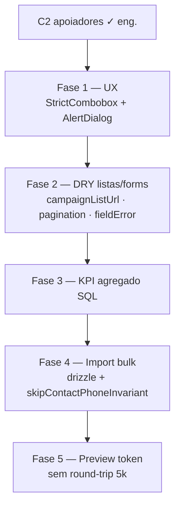

# Escala e DRY pós-C2 (apoiadores + listas)

Status: rascunho
Atualizado em: 2026-07-18
Item do roadmap: [docs/roadmap.md](../roadmap.md) (Trilha C, item C6)
Responsável: —

## Contexto

O C2 ([cadastro-nominal-apoiadores.md](cadastro-nominal-apoiadores.md)) entregou a engenharia do cadastro nominal: collection `supporter`, actions de create/intenção/import/remover, UI em `/campanha/apoiadores`. A terceira passagem de `/simplify` (2026-07-18) limpou dead code e churns baratos, mas **deixou de fora** refactors e ganhos de escala que os revisores marcaram como importantes e fora do escopo de “cleanup pontual”:

1. Extrair shells compartilhados com a lista de núcleos (`nucleusUi` / `NucleusFilters` / `NucleusPagination`).
2. Unificar `fieldError` / mapeador de erro de form actions (hoje clone de leadership).
3. Import CSV em massa com insert via drizzle + bypass do invariante de telefone quando o caller já segura os locks.
4. Preview/confirm sem round-trip de até 5k linhas na action.
5. KPIs da lista com um único agregado SQL em vez de 3× `count`.
6. UX alinhada: `StrictCombobox` no município do create e `AlertDialog` no “Remover dados”.

Este plano é o registro canônico desses follow-ups. Sem ele, a base nominal funciona para volume baixo, mas o import de 5k linhas e o DRY com núcleos ficam como dívida implícita.

## Objetivos

- Listas de núcleos e apoiadores compartilham primitivos de URL/paginação/filtro e helpers de form error, sem regressão nas rotas já entregues.
- Import CSV de até `MAX_IMPORT_ROWS` (5000) completa dentro do timeout Vercel/DB, com locks de telefone corretos e sem N× hooks redundantes em `Contact`.
- Preview/confirm não serializam o conjunto completo `ok` duas vezes pela fronteira da Server Action.
- Overview de apoiadores: um round-trip de agregação (ou reuso de `totalDocs` + um agregado) em vez de três `count` paralelos sem `req` compartilhado.
- Create de apoiador usa o mesmo `StrictCombobox` de município dos filtros/núcleos; remoção destrutiva usa `AlertDialog` (padrão `ArchiveNucleusDialog`).
- Guardrails: `overrideAccess: false` quando houver `user`; escrita multi-collection continua transacional; qualquer bypass de `enforceUniqueContactPhone` só sob locks já adquiridos na mesma txn; sem novo `Consent` / sem collection nova (salvo staging efêmero de import, se a Fase 4 exigir).

## Decisões travadas

- **Um item C6, cinco fases ordenadas.** Não criar seis itens de roadmap; o custo de coordenação supera o benefício. Fases podem ser PRs separados, mas a ordem abaixo é a recomendada (UX barata → DRY → KPI → import pesado → preview token).
- **Dependência dura de C2.** Este item só faz sentido com o código C2 mesclado; não reabre o escopo de v1 do cadastro nominal.
- **Cortável se a base permanecer pequena.** Se a campanha não importar milhares de linhas antes de 16/08, as fases 3–5 podem escorregar; as fases 1–2 (UX + DRY) continuam baratas e valem a pena cedo.
- **Bypass do invariante de telefone é opt-in por `context`, nunca global.** Precedente: locks em `contactPhoneInvariant.ts` / hook `enforceUniqueContactPhone` em `Contact.ts`. Caller que já rodou `acquireContactPhoneLocks` na mesma txn pode passar `context: { skipContactPhoneInvariant: true }`; o hook só respeita se a txn já segura os locks (falha fechado caso contrário — validar na implementação).
- **Bulk insert segue o padrão TSE seed.** `payload.db.drizzle` em txn (como `pnpm db:seed:tse` / `scripts/seed-tse-results.mjs`), com `ON CONFLICT` / tratamento de unique `supporter_contact_nucleus`, não milhares de `payload.create` sob um único `acquireContactPhoneLocks` de 5k phones.
- **Preview token: sem Redis novo no v1 do C6.** Preferir blob assinado curto (HMAC + expiry) ou staging em memória/`unstable_cache` com TTL curto no processo; se insuficiente na Vercel, staging em tabela efêmera com TTL + job de limpeza. Decisão final na Fase 4 com medição.
- **i18n e naming** (AGENTS.md): identificadores em inglês (`campaignListUrl`, `CampaignListPagination`, `mapCampaignFormActionError`, `skipContactPhoneInvariant`, `importToken`), strings visíveis em pt-BR.

## Questões em aberto

- **Onde vive o staging do preview?** Blob assinado vs tabela `supporterImportBatch` vs cache em processo. **Recomendação:** começar com blob assinado (sem migration); só promover a tabela se o payload + HMAC estourar limites práticos da action.
- **Chunk size do bulk import.** **Recomendação:** 200–500 rows por commit interno, com progresso retornado ao wizard; calibrar com teste de carga local contra `teqo_test`.
- **KPI: drizzle raw vs Payload `count` + group.** **Recomendação:** um `SELECT … COUNT(*) FILTER` (ou `GROUP BY vote_intention`) via drizzle com o mesmo `where` de acesso que `buildSupporterListWhere` + constraint de `canReadSupporter`; reusar `result.totalDocs` da listagem para o total quando a página já carregou o find.
- **Extrair filter shell agora ou só URL + pagination?** **Recomendação:** extrair URL helpers + pagination no primeiro PR; filter shell (`valuesRef` + `useTransition` + disclosure) no segundo — o shell é o mais arriscado para regressão de núcleos.
- **Migrar leadership forms para o mapper compartilhado no mesmo PR?** **Recomendação:** sim para o mapper/`fieldError` (poucas linhas); não obrigar leadership a mudar copy de mensagens.

## Abordagem proposta

### Fase 1 — UX alinhada (barata)

- **`SupporterForm`**: município via `StrictCombobox` + `municipalityComboboxOptions()` (já usado em `SupporterFilters` / `NucleusFilters`); validação continua em `resolveBahiaMunicipality` / `optionalBahiaCity`.
- **`RemoveSupporterDataButton`**: trocar `window.confirm` por `AlertDialog` no padrão de `ArchiveNucleusDialog.tsx`.

### Fase 2 — DRY com núcleos / leadership

- **`src/utilities/campaignListUrl.ts`** (novo): `firstValue`, `normalizedText`, `strictDecimalInteger`, `inspectRaw*ListParams`, shape de `resolve*ListUrl` — hoje clonados em `nucleusUi.ts` e `supporterUi.ts`. Domínio (`parse*ListParams`, `build*ListWhere`) permanece nos módulos de domínio.
- **`CampaignListPagination`**: `SupporterPagination` já reusa `getNucleusPaginationPages`; extrair o markup Pagination compartilhado com `hrefForPage`.
- **`fieldError` / `errorProps`**: módulo pequeno (ex. `src/utilities/campaignFormFields.ts`) usado por `LeadershipForm` e `SupporterForm`.
- **`mapCampaignFormActionError`**: consolidar o catch FormDataBoundaryError → Zod → safelist → genérico de `novo/formActions.ts`, `[id]/formActions.ts` e `leadershipFormActions.ts`.
- **Filter shell** (opcional neste PR ou PR seguinte): `CampaignListFiltersShell` a partir de `NucleusFilters` / `SupporterFilters`.

### Fase 3 — KPI da lista

- **`loadSupporterListOverviewData`**: substituir 3× `payload.count` por um agregado SQL (drizzle) com o mesmo escopo de acesso; alinhar total com `totalDocs` da listagem quando possível.
- Opcional: `createLocalReq` uma vez e passar `req` aos loaders da página para reutilizar cache de access em `req.context`.

### Fase 4 — Import em escala

- **`confirmSupporterImportRecord`**: após locks + lookup em batch, insert de contacts/supporters via `payload.db.drizzle` (espelhar seed TSE), com tratamento de conflito unique.
- **`Contact` hook**: honrar `context.skipContactPhoneInvariant` somente quando seguro.
- Chunking / `maxDuration` se um único txn de 5k ainda estourar timeout.

### Fase 5 — Preview sem round-trip

- **`previewSupporterImport`**: retorna `{ counts, sampleRows, importToken }` (amostra para UI; hoje `slice(0, 100)`).
- **`confirmSupporterImport`**: aceita token (ou id de batch) em vez do array completo de rows `ok`.
- **`SupporterImportWizard`**: para de guardar/reenviar todas as rows.

**Migration:** só se a Fase 5 escolher tabela de staging — `pnpm migrate:create add_supporter_import_batch` (TTL + cleanup). Fases 1–4: sem migration de schema de produto.

## Dependências

- **Dura:** C2 cadastro nominal (código em `supporter*` / `/campanha/apoiadores`).
- **Suave:** nenhuma. Produção com dados reais ainda espera Onda 0 (Consent keys) — C6 não cria chave nova.
- Reusa: `nucleusUi.ts`, `NucleusFilters.tsx`, `NucleusPagination.tsx`, `LeadershipForm.tsx`, `ArchiveNucleusDialog.tsx`, `contactPhoneInvariant.ts`, `Contact.ts`, padrão drizzle do seed TSE, `territoryComboboxOptions.ts`.

## Não escopo

- Reabrir decisões de v1 do C2 (telefone obrigatório, kit mínimo, import só `geral`, etc.) — [cadastro-nominal-apoiadores.md](cadastro-nominal-apoiadores.md).
- Agregado de apoiadores no overview de núcleos — follow-up de B1.
- GOTV / dia D — C5.
- Push/notificações — D2 / [notifications.md](notifications.md).
- Índices `pg_trgm` / FTS em `contact` (mencionado na review de perf; só se busca ILIKE virar gargalo medido).

## Referências

- `docs/roadmap.md` — Trilha C, item C6; sequência Janela 2
- [cadastro-nominal-apoiadores.md](cadastro-nominal-apoiadores.md) — C2 v1
- Review `/simplify` 2026-07-18 (quality / reuse / performance) — origem da lista de fases
- `src/app/(campaign)/campanha/actions/supporter.ts` — preview/confirm import
- `src/utilities/supporterUi.ts` / `supporterPageData.ts` — lista + KPIs
- `src/utilities/nucleusUi.ts` / `src/components/campaign/NucleusFilters.tsx` / `NucleusPagination.tsx` — padrões a extrair
- `src/components/campaign/LeadershipForm.tsx` / `ArchiveNucleusDialog.tsx` — fieldError / AlertDialog
- `src/collections/Contact.ts` — `enforceUniqueContactPhone`
- `scripts/seed-tse-results.mjs` — bulk drizzle em txn
- AGENTS.md — `overrideAccess: false`, transações, Contact + locks, naming
