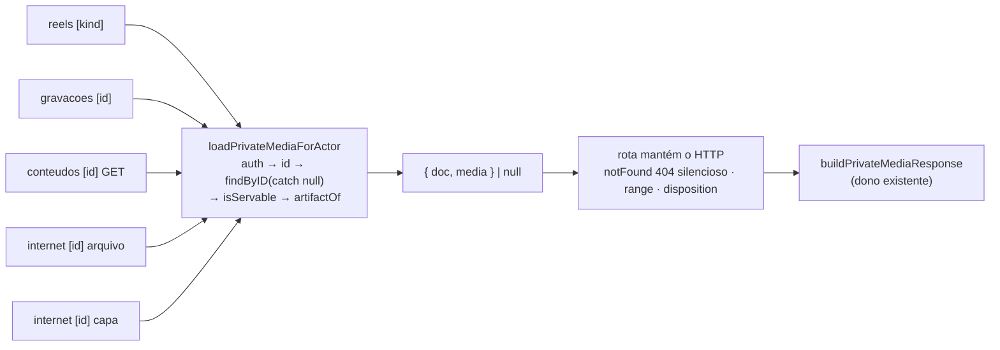

# Impl: Escala/DRY pós-C216 — débitos do simplify da terceira fonte do acervo

Status: aprovado
Atualizado em: 2026-09-24
Issue: #1325
Intenção: docs/plans/escala-dry-pos-c216.md
Appetite restante: herdado (~1 dia eng fill-in)

## Leitura da intenção

- **Outcome:** os três débitos do `/simplify` do C216 saem numa trilha ordenada (lock primeiro): (F1) o gate fail-closed replicado nas rotas de mídia privada vira um dono único em `utilities/privateMedia/`, com as rotas mantendo só o HTTP (range/disposition/404); (F2) o heading de resultados dos três ramos da página do acervo vira scaffold parametrizado por copy, sem mudar byte de copy/DOM; (F3) o excerpt truncado e os chips dos dois cards de fala viram componentes do dono do highlight — o gatilho declarado ("um terceiro card de fala") já está vencido com os 2 consumidores.
- **O que NÃO negociar:**
  - 404 silencioso e `overrideAccess: false` no gate de mídia — nenhuma resposta HTTP muda (bytes/206/attachment/404 pinados por int/e2e).
  - F2 byte-idêntico nos três ramos (`CampaignListEmptyState` com ternários, guard do footer, right-side divergente Câmara × web/gravações); pin = e2e `campaignSpeechAcervo`.
  - Sem migration, sem Consent, sem tocar contrato de URL pública, sem superfície visual nova (Impeccable A).
  - Identificadores em inglês; copy pt-BR intocada.
- **O que reavaliar (hipóteses do explorer vs. código lido):**
  - O helper da intenção (`loadPrivateMediaForActors`) não existe; a intenção deixou o predicado a cargo do helper. A forma final (D1) delibera onde cada predicado mora e confirma que gravações exigem DOIS predicados em runtime: `isRecordingStatus` não é só narrowing — uma string fora do vocabulário no DB passaria por `canServeRecordingMedia` (`!== 'uploading'`) e a rota serviria. O helper não pode esconder essa conjunção.
  - `loadWebSpeechMediaForActor` só tem os 2 call sites das rotas web (`grep` confirma). Migrar as duas para o helper o deixa sem consumidor e knip (`exports: error`) quebra — ele SAI junto; os pins e2e das duas rotas continuam valendo porque as respostas são idênticas.
  - A duplicação real de F2 é a copy (2 ternários × 3 ramos); list/empty/footer divergem de verdade por ramo. A extração pode ser só o heading, não um shell pass-through (D2).
  - O `quoted` do `SpeechThemeProvenance` cobre o 3º site do excerpt sem mudar bytes (D3), mas o caminho tema não é pinado por e2e (DeepSeek blanked no Playwright) — o pin virá de unit novo.

## Abordagem recomendada

**Opções consideradas:** A) helper único com `isServable` + `artifactOf` (dois callbacks nomeados; o ramo sem kill switch declara `isServable: () => true`) | B) helper único com `servableArtifactOf` (predicado embutido no picker) | C) helper só com gate+read+shape e predicados nas rotas | D) factory de rota `createPrivateMediaRoute`.
**Recomendação:** A — porque o gate é fail-closed e o compilador passa a exigir que TODO call site declare sua elegibilidade (`isServable` obrigatório): esquecer o kill switch vira erro de tipo, não um `doc.media` silenciosamente servido. Os predicados de domínio continuam funções nomeadas do dono (`canServeReelMedia`, `isRecordingStatus && canServeRecordingMedia`, `origin === 'web'`) em vez de ternários enterrados no picker.
**Rejeitadas:** B porque um call site novo pode passar um picker puro (`(doc) => doc.media`) sem nenhum sinal de compilação — fail open por omissão, com o contrato só no nome/JSDoc. C porque mantém o kill switch re-escrito nas 5 rotas — exatamente o débito que F1 nomeia. D porque esconde o HTTP (range/disposition/404) que a intenção quer explícito nas rotas e acoplaria 5 rotas a um template de resposta único.

### Decisões de engenharia

**D1 (F1) — O gate vira `loadPrivateMediaForActor`; `isServable` e `artifactOf` são dois callbacks obrigatórios.**
`Decisão: novo src/utilities/privateMedia/privateMediaGate.ts exportando loadPrivateMediaForActor({ payload, collection, id, select?, isServable, artifactOf }) → Promise<{ doc, media } | null>. O helper faz, nesta ordem: getCampaignUser + canReadCommunicationCatalog → null; Number(id) inteiro > 0 → null; findByID({ collection, id, depth: 1, select, user, overrideAccess: false }).catch(() => null) → null; isServable(doc) → null; artifactOf(doc) com typeof === 'object' → null; devolve { doc, media }. Tipagem: TSlug extends CollectionSlug; doc: DataFromCollectionSlug<TSlug>; select?: SelectType; media: PrivateMediaFile (tipo do dono privateMediaResponse.ts); sem cast — verificado por probe de compilação: select: SelectType satisfaz o generic do findByID e o doc chega ao callback como DataFromCollectionSlug<TSlug>. Tipos auxiliares ficam internos (sem export).`
`Por quê: as 5 rotas compartilham auth+id+read+shape+silêncio; cada domínio injeta só o que é dele. isServable obrigatório mata a omissão fail-open no compilador; artifactOf mantém o mapa campo-por-kind (reel) e campo-por-rota (web) no call site; os predicados ficam como funções nomeadas dos donos.`
`Rejeitadas: isServable opcional (omissão silenciosa); predicado embutido no artifactOf (sem sinal de compilação, contrato só no nome — variante B); predicado depois do shape-check (mesmo 404, mas o kill switch deve ser a primeira barreira lógica); manter loadWebSpeechMediaForActor (export sem consumidor ⇒ knip erro, e o gate seguiria re-escrito em 2 rotas).`

Ajustes de rota que acompanham D1 (comportamento idêntico, mesmos 404s):

- **`.../comunicacao/reels/[id]/media/[kind]/route.ts:33-69` (GET):** `const { id, kind } = await params` + `isReelMediaKind(kind)` ficam (linha 42; o guard é o narrowing de `reelMediaFieldByKind[kind]`); helper com `isServable: (reel) => canServeReelMedia(reel.status)` e `artifactOf: (reel) => reel[reelMediaFieldByKind[kind]]`; `select` omitido (como hoje). `staticDir` passa a `resolvePrivateMediaStaticDir(payload, REEL_MEDIA_SLUG)` (as linhas 59-61 hand-rollam o mesmo read já exportado pelo dono).
- **`.../comunicacao/acervo/gravacoes/[id]/arquivo/route.ts:28-68` (GET):** `select: { status: true, media: true }`; `isServable: (doc) => isRecordingStatus(doc.status) && canServeRecordingMedia(doc.status)` (a conjunção é runtime, não narrowing); `artifactOf: (doc) => doc.media`; `staticDir` via `resolvePrivateMediaStaticDir(payload, RECORDING_MEDIA_SLUG)`.
- **`.../comunicacao/conteudos/[id]/arquivo/route.ts:54-83` (GET; POST 85-178 intocado):** `select: { media: true }`; `isServable: () => true` (o domínio não tem kill switch de mídia — declaração explícita); `artifactOf: (doc) => doc.media`. `pieceIdFrom` (48-52) fica (o POST usa).
- **`.../comunicacao/acervo/internet/[id]/arquivo/route.ts:32-57` (GET):** `select: { origin: true, title: true, mirroredMedia: true }`; `isServable: (doc) => doc.origin === 'web'`; `artifactOf: (doc) => doc.mirroredMedia`; disposition segue com `webSpeechDownloadFilename({ title: found.doc.title, storedFilename: found.media.filename })`.
- **`.../comunicacao/acervo/internet/[id]/capa/route.ts:30-51` (GET):** `select: { origin: true, thumbnail: true }`; `isServable: (doc) => doc.origin === 'web'`; `artifactOf: (doc) => doc.thumbnail`; `download: false` fica.
- As 5 rotas perdem os imports de `getCampaignUser`/`canReadCommunicationCatalog` e **mantêm** `notFound` (404 silencioso com `PRIVATE_MEDIA_CACHE_CONTROL`), `buildPrivateMediaResponse` e o HTTP; os docblocks passam a apontar o gate como `loadPrivateMediaForActor`.
- **`src/utilities/speech/speechPageData.ts:440-471`:** removem-se `WebSpeechMediaField` e `loadWebSpeechMediaForActor` (sem consumidor após a migração) e o import de `InternetSpeechMedia` (linha 7, só usado ali); `canReadCommunicationCatalog` (linha 5) fica (uso na linha 152). `import 'server-only'` no arquivo novo (gate acoplado à auth).

**D2 (F2) — O scaffold é só o heading; list/empty/footer ficam no ramo.**
`Decisão: componente LOCAL (não exportado) AcervoResultsHeading em acervo/page.tsx (junto do AcervoHeader, 60-90) com props { themeMode, themeActive, themeUnavailable, idleTitle, subject, controls }. Ele possui o flex row + bloco esquerdo + os DOIS ternários de copy: título (themeUnavailable → 'Resultados por termo exato'; themeActive → 'Resultados por tema'; senão idleTitle) e parágrafo (só quando themeMode: 'Comportamento atual do acervo.' | 'Confira o indício em cada ${subject} antes de abrir.' | 'Nenhum termo relacionado foi acrescentado; mostramos a busca literal.'), com subject: 'fala' | 'gravação'. controls recebe o right-side já montado: Câmara passa o retry solto (ou null), web/gravações passam o wrapper flex flex-wrap items-end gap-2 com retry + AcervoSortSelect (hint próprio). Câmara chama sob {themeMode ? … : null} (idleTitle="Resultados"); web/gravações sempre (idleTitle='Resultados encontrados'/'Gravações encontradas').`
`Por quê: a duplicação real é a copy (2 ternários × 3 ramos com o substantivo divergindo); o resto difere de verdade (filtros, notices, refresher, list/empty com icons/classNames/CTAs/links próprios, footer com props próprias). ReactNode no right-side reproduz os DOIS layouts sem flag de layout e sem ternário de copy nos ramos; bytes idênticos (JSX não emite whitespace entre elementos em linhas separadas).`
`Rejeitadas: shell completo (heading+list+empty+footer, ~8 props) — pass-through raso que esconde a estrutura específica de cada ramo e não remove a duplicação de copy; componente em shared/ exportado — consumidores só neste arquivo, sem 3º consumidor fora dele (o gatilho de extração), e knip exige consumidor para export; unificar o wrapper do right-side — mudaria bytes da Câmara (retry ganharia wrapper/gap); unificar os empty states — copy/CTAs/classes são genuinamente por ramo.`

**D3 (F3) — `SpeechExcerpt` com `className` por site e `quoted`; chips por grupos.**
`Decisão: SpeechExcerpt({ excerpt, className, quoted? }) em novo src/components/campaign/speech/SpeechExcerpt.tsx: null sem parts; '… '/' …' conforme truncatedStart/End; com quoted envolve em “ … ”. className fica por call site (Câmara 'text-sm leading-relaxed text-foreground/90'; web 'mt-2 text-sm leading-6 text-foreground/90'; provenance 'mt-1 text-sm leading-6 text-foreground/90'). SpeechResultChips({ groups: { key, items, max, variant?, className? }[] }) em novo SpeechResultChips.tsx: renderiza até max por grupo, soma o +N de todos os grupos e usa Badge (secondary com className 'font-normal'; +N outline com 'font-normal text-muted-foreground'); container e guard de vazio continuam no call site. Câmara passa 3 grupos (topics/3, scopes/2, keywords/3 outline muted — keywords mapeadas de string para { value, label }); web passa 2.`
`Por quê: são 3 sites do MESMO truncamento (os dois cards + o provenance C192, no mesmo arquivo do card) e 2 sites de chips com caps 3/2 (+ 3 keywords na Câmara); o +N somando grupos é a única forma de manter a semântica da Câmara sem duplicar a soma. className explícito evita mudança de pixel (Impeccable A) e é honesto — as classes divergem de propósito.`
`Rejeitadas: unificar className/line-height (muda pixel sem design review; o e2e não pina line-height, mas a intenção é A); incluir RecordingResultCard.tsx:57-62 (terceiro excerpt é de OUTRO card — fora do gatilho "3º card de fala"); API de chips por props fixas (não permitiria 3 grupos × 2); exportar os tipos dos grupos (knip types: error sem consumidor externo — os call sites usam literais contextuais).`

### Componentes / mudanças

- **`loadPrivateMediaForActor`** (novo `src/utilities/privateMedia/privateMediaGate.ts`): gate fail-closed + read + shape; `import 'server-only'`; sem barrel.
- **5 rotas GET** de mídia privada: passam ao helper e mantêm o HTTP (detalhado em D1).
- **`speechPageData.ts`**: remoção de `WebSpeechMediaField` + `loadWebSpeechMediaForActor` (440-471) e do import órfão (linha 7).
- **`AcervoResultsHeading`** (local em `src/app/(campaign)/campanha/(app)/comunicacao/acervo/page.tsx`): substitui os blocos 116-143 (RecordingsSource), 238-265 (WebSpeechesSource) e 344-365 (CamaraSource).
- **`SpeechExcerpt`** (novo `src/components/campaign/speech/SpeechExcerpt.tsx`): usado em `SpeechResultCard.tsx` (excerpt local 23-33; `SpeechThemeProvenance` 40-55 com `quoted`) e `WebSpeechResultCard.tsx:68-74`.
- **`SpeechResultChips`** (novo `src/components/campaign/speech/SpeechResultChips.tsx`): usado em `SpeechResultCard.tsx:213-257` (3 grupos) e `WebSpeechResultCard.tsx:11-13,24-28,76-94` (2 grupos).
- **Migration:** sem migration (nenhum schema/collection/global tocado).
- **Access / Consent:** inalterados — o helper reusa `getCampaignUser` + `canReadCommunicationCatalog` fail-closed; nenhum Consent novo, nenhum ID hardcoded, nenhum PII novo.
- **UI:** Impeccable A — sem superfície visual nova; F2/F3 são refactor byte-idêntico (classes preservadas por call site).
- **Testes:** novo `tests/unit/speechResultCards.unit.spec.ts` com `renderToStaticMarkup` (padrão de `campaignComponents.unit.spec.ts`): pin do excerpt (ellipses, `mark`, `quoted`, vazio) e do `+N` somando grupos (Câmara 3+2+3 com caps → +3; web 2 grupos → +1).

## Fases verificáveis

1. **F1 (tracer, expensive_lock) — helper + 5 rotas.** Implementa `privateMediaGate.ts`, migra os 5 GETs, remove `loadWebSpeechMediaForActor`/`WebSpeechMediaField`. Verificação: `pnpm typecheck`, `pnpm knip`, `pnpm check:cycles`; int `tests/int/reel.int.spec.ts`, `recording.int.spec.ts`, `contentPiece.int.spec.ts`, `webSpeechAcervo.int.spec.ts`; e2e `campaignReel` (kill switch/anonymous/attachment) e os testes de mídia do `campaignSpeechAcervo` (gravações 686-721, internet arquivo+capa 1288-1358, conteúdos 1609-1649). Nenhum byte de resposta muda.
2. **F2 (scaffold) — heading dos três ramos.** Cria `AcervoResultsHeading` e substitui os 3 blocos. Verificação: e2e `campaignSpeechAcervo` inteiro (ternários de tema/fallback, vazios, footer, sort) — bytes idênticos.
3. **F3 (excerpt/chips) — unit + cards.** Cria os 2 componentes, migra os 3 sites de excerpt e os 2 de chips, adiciona o unit novo. Verificação: `pnpm test:unit` + e2e `campaignSpeechAcervo` (listas Câmara/web/gravações).
4. **Gates — `pnpm gate:fast`; `pnpm push`** (o CI do PR roda a cascata completa, incl. os e2e da vertical). Commits pequenos por fase, F1 primeiro.

## Rabbit holes / Não escopo (engenharia)

- Rota `poster` (`acervo/[id]/poster/route.ts`) e demais rotas de mídia fora das 5 — o gate delas não está neste lote.
- POST de upload/anexo (`conteudos/[id]/arquivo` POST, `conteudos/enviar`, `gravacoes/enviar`) — auth própria por envelope de erro (401/403), não é o 404 silencioso do gate de leitura.
- Central de Conteúdos público (`(frontend)/conteudos/[slug]/midia`) — contrato público, outro gate.
- `RecordingResultCard.tsx:57-62` (terceiro excerpt, de outro card) — o gatilho do F3 é um 3º card de FALA.
- `speechCoverage`/Sollinha/C217.
- Unificar `speechHasActiveFilters` × `recordingHasActiveFilters` (shapes `phases` × `people`) — defer com gatilho no impl do C216.
- Centralizar fixtures de bytes MP4/MP3 dos int specs (2 sites) — defer.
- Unificar line-height/aspas do excerpt ou o wrapper do right-side — mudaria pixel.
- Não criar `src/lib/privateMediaGate` (o dono é `utilities/privateMedia/`) nem `index.ts`/barrel.

## Riscos e mitigação

- **F1 — 404 silencioso/`overrideAccess:false`:** o helper é o único que lê; `isServable` obrigatório no tipo; ints cobrem advisor/anônimo → 404 e conteúdo → 200; qualquer desvio de bytes é regressão pinada.
- **F1 — guard de status das gravações:** manter `isRecordingStatus && canServeRecordingMedia` (não só narrowing): string desconhecida no DB hoje 404; sem o guard, `!== 'uploading'` serviria.
- **F1 — knip/cycles:** remover o export órfão no mesmo commit (`types` error pega `WebSpeechMediaField`; `exports` pega `loadWebSpeechMediaForActor`); `check:cycles` garante 0 ciclos (gate→response só em tipo, uma direção).
- **F1 — mocks dos int specs:** `vi.mock('@/utilities/campaignAuth', () => ({ getCampaignUser }))` — o helper importa só `getCampaignUser` desse módulo, então o mock segue completo.
- **F2 — bytes de copy/DOM:** o componente reproduz exatamente as duas estruturas de right-side via `controls` e preserva a ordem dos ternários (título: unavailable → active → idle; parágrafo só em `themeMode`); o e2e inteiro é o pin.
- **F3 — bytes do excerpt:** concatenação `… `/` …` e aspas `“ ”` reproduzidas char a char; como o caminho tema não é e2e-pinado (DeepSeek blanked), o unit novo é o pin desse site.
- **F3 — chips:** caps por grupo preservam a soma (Câmara soma keywords; web não); keys novas não renderizam bytes.
- **Impeccable A:** nenhuma classe nova/unificada; mudança visual não pretendida quebra o e2e da vertical (C154/C199/C211/C216).

## Aceite de engenharia

- [ ] Aceite de produto da intenção coberto: 5 rotas com o MESMO contrato HTTP (bytes/206/attachment/404), página dos 3 ramos byte-idêntica, cards de fala byte-idênticos.
- [ ] Invariantes AGENTS/engineering-standards: sem migration, sem Consent, sem URL pública; gate fail-closed preservado; arquivo novo em subpasta de `src/utilities` com `server-only`; sem barrel; identificadores em inglês/copy pt-BR.
- [ ] Testes: unit novo verde; int reel/recording/contentPiece/webSpeechAcervo verdes; e2e `campaignSpeechAcervo` + `campaignReel` verdes; `pnpm knip`, `pnpm check:cycles`, `pnpm gate:fast` verdes.
- [ ] Entrega: commits pequenos por fase (F1 lock primeiro) num PR único; entrada curta em `docs/changelog/<data>-<id>.md`.

## Self-score de decision-quality

Nota: 5/5.

1. **Decisões caras têm rejeitadas?** Sim: D1 (lock de gate fail-closed) tem variantes A/B/C/D com 4 rejeitadas nomeadas; D2 rejeita shell pass-through, `shared/` e unificação do wrapper; D3 rejeita unificação de line-height e a expansão ao `RecordingResultCard`. As baratas (nomes, ordem) ficaram fora.
2. **Cabe no appetite (~1 dia fill-in)?** Sim: 3 arquivos novos pequenos + 7 editados + 1 unit, sem migration/schema; o lock (F1) usa os specs existentes como prova, e F2/F3 são mecânicos com pin pronto.
3. **Rabbit holes nomeados?** Sim: secção dedicada (poster, POSTs, Central pública, RecordingResultCard, speechCoverage/C217, filtros gêmeos, fixtures, line-height, barrel).
4. **Depth check:** Sim — reusa `buildPrivateMediaResponse`/`resolvePrivateMediaStaticDir` e o dono `utilities/privateMedia/`; reusa `Badge`/`SpeechHighlightParts`; não cria adapter/factory raso; o helper tem profundidade real (5 call sites, invariante fail-closed verificado no compilador).
5. **Intenção permanece satisfeita?** Sim — F1/F2/F3 são exatamente os 3 débitos, na ordem "lock primeiro"; nenhuma resposta, copy ou URL muda; o outcome de produto não foi reescrito pela engenharia.
