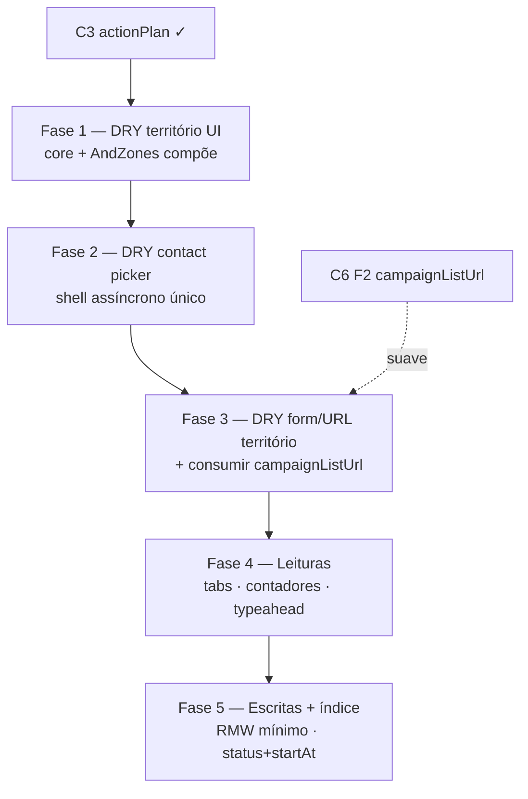

# Escala e DRY pós-C3 (planos de ação)

Status: entregue (2026-07-19)
Atualizado em: 2026-07-19
Item do roadmap: [docs/roadmap.md](../roadmap.md) (Trilha C, item C7)
Responsável: —

## Contexto

O C3 ([eventos-agenda-mobilizacao.md](eventos-agenda-mobilizacao.md)) entregou a vertical `/campanha/planos` (`actionPlan`, lista/detalhe/forms, blocos "Próximos eventos"). A passagem `/simplify` de 2026-07-18 aplicou limpezas pontuais (alias de access, labels a partir do schema, paginação via `getNucleusPaginationPages`, snapshot de campos staff para liderança, loaders/overview em paralelo), mas **deixou de fora** débitos que os revisores (quality / reuse / performance) marcaram como importantes e maiores que cleanup:

1. Compor território: `NucleusTerritoryAndZonesFields` forcou um fork quase completo em `NucleusTerritoryFields` (~319 linhas).
2. Unificar o picker assíncrono de contato (`ContactCombobox` vs `PrimaryContactCombobox`).
3. Extrair `validateTerritoryFormData` / parse de território FormData (hoje clone núcleo ↔ plano).
4. Consumir (ou espelhar) helpers de URL de lista — C6 Fase 2 já prevê `campaignListUrl`; `actionPlanUi` ainda clona o maquinário de `nucleusUi`.
5. Leituras caras: detalhe/edit sempre carregam `tasks`+`updates` em `depth: 1`; lista hidrata todas as tasks só para progresso; form prefetcha até 200 lideranças.
6. Escritas amplificadas: toggle de tarefa / append de update fazem read-modify-write do documento inteiro.
7. Índice composto ausente para a query quente `status IN (…) AND startAt >= now ORDER BY startAt`.

Este plano é o registro canônico desses follow-ups. Sem ele, a agenda funciona em volume baixo, mas o DRY com núcleos e o custo por plano crescem com o feed de atualizações e a lista de "Próximos".

**Entregue (2026-07-19):** Fases 1–5 completas — composição territorial (`useCampaignTerritoryFieldsState` + `CampaignTerritoryCoreFields`), shell `AsyncSearchCombobox` (Contact + Primary + liderança), helpers FormData/URL, leituras por aba + `taskProgress` no detalhe + typeahead de liderança, short-circuit de hooks em toggle/append. Feed O(n) / collection `actionPlanUpdate` permanece condicional (fora de escopo).

**Primeira fatia (2026-07-19):** FormData território, contadores lista + migration `20260719_014906_action_plan_list_perf`, locks advisory, `contactSearchQuery`, rename `CampaignTerritoryFields`.

## Objetivos

- Território Bahia (sem ZE) é um único componente/core; o formulário de núcleo só adiciona `TseZoneInput` + chips de ZE.
- Contatos remotos usam um shell assíncrono; `PrimaryContactCombobox` adapta a API legada `{ current, options }`.
- Validação/parse de território FormData e (quando C6 F2 existir) URL de lista deixam de ser triplicados entre núcleo / apoiador / plano.
- Detalhe de plano carrega arrays por aba; lista não faz join de todas as tasks para contar progresso; liderança no form é typeahead (não prefetch 200×`depth: 1`).
- Toggle/append não reescrevem o documento inteiro; query "Próximos" tem índice adequado.
- Guardrails: `overrideAccess: false` com `user`; escritas multi-step continuam em `withPayloadTransaction`; liderança continua restrita a `tasks.done` + append `updates`; sem novo `Consent`.

## Decisões travadas

- **Um item C7, cinco fases ordenadas.** Mesmo racional do C6: um ID de roadmap, PRs por fase. Ordem: DRY barato → DRY helpers → leituras → escritas/índice.
- **Dependência dura de C3.** Não reabre o escopo de v1 do `actionPlan` (território próprio, arrays embutidos no MVP, access por `coordinators`/`leadership`).
- **Dependência suave de C6 Fase 2** para `campaignListUrl` / pagination shell. Se C6 F2 ainda não existir, C7 Fase 3 extrai só o necessário para `actionPlanUi` **ou** espera o helper do C6 — não inventar um terceiro `*ListUrl`.
- **Cortável se a agenda permanecer pequena.** Fases 4–5 (leituras pesadas, RMW, índice) podem escorregar se houver poucos planos/updates; Fases 1–2 (composição de UI) continuam baratas e reduzem risco de drift com A2.
- **Arrays embutidos no MVP; collection `actionPlanUpdate` só se a Fase 5 medir necessidade.** Preferir patch de linha em `action_plan_tasks` / `action_plan_updates` (drizzle ou Local API alvo) antes de nova collection.
- **Contadores de progresso na lista:** preferir campos derivados `taskDoneCount` / `taskTotal` mantidos no `beforeChange` (migration pequena) a hidratar `tasks: { done: true }` em toda página.
- **i18n e naming** (AGENTS.md): identificadores em inglês (`CampaignTerritoryFields`, `AsyncContactCombobox`, `validateCampaignTerritoryFormData`, `taskDoneCount`, `searchActionPlanLeadershipOptions`), strings visíveis em pt-BR.

## Questões em aberto

- **Renomear `NucleusTerritoryFields` → `CampaignTerritoryFields` neste item?** **Decisão (2026-07-19):** feito; alias deprecated removido no simplify por ausência de importadores.
- **Patch de array via drizzle vs Local API?** **Recomendação:** locks + `select` mínimo já entregues; próximo passo é short-circuit de hooks (`context.mutationKind: 'taskToggle' | 'appendUpdate'`) antes de SQL direto.
- **Índice `(status, start_at)` na mesma migration dos contadores?** **Decisão (2026-07-19):** feito — `20260719_014906_action_plan_list_perf` com índice parcial `action_plan_upcoming_start_at_idx`.
- **Typeahead de liderança reusa `ContactCombobox` ou `NativeSelect` + search?** **Recomendação:** Server Action `searchActionPlanLeadershipOptions(query)` + combobox (mesmo shell da Fase 2), `depth: 0`, label a partir do contact id/nome já resolvido.
- **Migrar timestamps de núcleos para `formatBahiaDateTimeLabel`?** **Recomendação:** fill-in separado (não bloqueia C7); o helper date-only foi removido no simplify e só volta se a UI precisar.

## Abordagem proposta

### Fase 1 — Território UI composto _(entregue)_

- Extrair o bloco regions/cities/neighborhoods/locality/notes (+ chips) para um core compartilhado (hoje duplicado em `NucleusTerritoryFields.tsx` ≈ `NucleusTerritoryAndZonesFields.tsx`).
- **`NucleusTerritoryAndZonesFields`**: compõe o core + `TseZoneInput` + sugestões de ZE (`buildTerritorySuggestions` / `outsideZones`).
- **`ActionPlanForm`**: continua importando só o core (sem ZE).
- **Entregue:** rename `CampaignTerritoryFields` + consumo no form de plano; core `useCampaignTerritoryFieldsState` + `CampaignTerritoryCoreFields`.

### Fase 2 — Contact picker único _(entregue)_

- Shell assíncrono (debounce, `requestId`, CommandDialog, loading/erro) a partir de `ContactCombobox.tsx`.
- **`PrimaryContactCombobox`**: adapta `{ current, options }` / search de inteligência de núcleo para o shell (sem segundo Dialog).
- Estado controlado (`value` + `onChange`); eliminar espelho pai/filho que o simplify apontou.
- **Entregue:** `AsyncSearchCombobox` + adaptadores; helper `contactSearchQuery` (mín. 2 chars).

### Fase 3 — Helpers FormData / URL _(entregue)_

- **`validateCampaignTerritoryFormData` / `parseCampaignTerritoryFields`**: ✅ extraído para `campaignTerritoryFormData.ts`; `nucleusFormData.ts` e `actionPlanFormData.ts` consomem.
- **URL de lista:** ✅ `actionPlanUi.ts` já consome `campaignListUrl.ts` (C6 F2).
- Opcional: `actionPlanDetailTabUi` parametrizado com o helper genérico de tabs do detalhe de núcleo (só se o PR já tocar URL).

### Fase 4 — Leituras _(entregue)_

- **`[slug]/page.tsx`**: selects por aba via `getActionPlanDetailSelect` + `getActionPlanDetailPageData` (overview sem arrays; tarefas com `depth: 1`; atualizações com `depth: 0` + batch de autores).
- **Lista:** ✅ `taskDoneCount` / `taskTotal` + `actionPlanListSelect` sem `tasks`.
- **`getActionPlanLeadershipOptions` → search:** ✅ `searchActionPlanLeadershipOptions` + `AsyncSearchCombobox` no form.
- **`ContactCombobox`:** ✅ não fetch com query &lt; 2 chars (`contactSearchQuery.ts`).
- **Detalhe:** ✅ `taskProgress` no view model da overview (contadores, não filtro inline de `tasks`).

### Fase 5 — Escritas + índice _(entregue; feed O(n) condicional)_

- **`toggleActionPlanTaskRecord` / `appendActionPlanUpdateRecord`:** ✅ locks advisory + `select` mínimo no `findByID`.
- **Short-circuit de hooks:** ✅ `context.mutationKind: 'taskToggle' | 'appendUpdate'` nas actions; hooks `beforeValidate` retornam cedo.
- **Migration** `action_plan_list_perf`: ✅ contadores + índice parcial `action_plan_upcoming_start_at_idx` (`20260719_014906_action_plan_list_perf`).
- **Feed O(n):** monitorar tamanho de `updates`; só então collection `actionPlanUpdate` append-only. _(condicional — não implementado)_

**Migration:** Fases 1–3 sem schema. Migration `20260719_014906_action_plan_list_perf` ✅ entregue (contadores + índice parcial). Sem Consent novo.

## Dependências

- **Dura:** C3 Planos de Ação (código em `actionPlan*` / `/campanha/planos`).
- **Suave:** C6 Fase 2 (`campaignListUrl`) — evita terceiro clone de URL helpers.
- Reusa: `NucleusTerritoryAndZonesFields.tsx`, `NucleusTerritoryFields.tsx`, `PrimaryContactCombobox.tsx`, `ContactCombobox.tsx`, `nucleusFormData.ts`, `actionPlanFormData.ts`, `actionPlanUi.ts`, `actionPlanPageData.ts`, `actionPlanViewModels.ts`, `campanha/actions/actionPlan.ts`, padrão de loaders por aba do detalhe de núcleo, C6 plano [escala-dry-pos-c2.md](escala-dry-pos-c2.md).

## Não escopo

- Reabrir decisões de v1 do C3 (`startAt` só obrigatório fora de rascunho, território sem link a núcleo, updates embutidos no MVP) — [eventos-agenda-mobilizacao.md](eventos-agenda-mobilizacao.md).
- Escala/DRY de apoiadores (import bulk, KPI SQL, preview token) — C6 / [escala-dry-pos-c2.md](escala-dry-pos-c2.md).
- Demandas / relação opcional `actionPlan` — C4.
- Notificações de agenda — D2 / [notifications.md](notifications.md).
- Calendário visual / mapa de eventos / recorrência — fora do horizonte pré-16/08.
- Migrar todos os `Intl.DateTimeFormat` de núcleos para Bahia — fill-in.
- Unificar `validateCampaignTerritoryFormData` com `createCampaignTerritoryValidationHook` num core único — tipos de erro diferentes (FormData vs Payload); refactor transversal; reavaliar após C7 Fases 1–2.
- Índice `pg_trgm` em `contact` — C8 / [escala-dry-pos-c6.md](escala-dry-pos-c6.md).

## Referências

- `docs/roadmap.md` — Trilha C, item C7; sequência Janela 2
- [eventos-agenda-mobilizacao.md](eventos-agenda-mobilizacao.md) — C3 v1 entregue
- [escala-dry-pos-c2.md](escala-dry-pos-c2.md) — precedente C6 + `campaignListUrl`
- Review `/simplify` 2026-07-18 (quality / reuse / performance) — origem das fases
- Review `/simplify` 2026-07-19 — débitos registrados nas fases pendentes acima
- Review `/simplify` 2026-07-19 (pós-entrega C7) — débitos maiores → **C11** / [escala-dry-pos-c7.md](escala-dry-pos-c7.md)
- `src/lib/contactSearchQuery.ts` — guard compartilhado client/server (entregue)
- `src/migrations/20260719_014906_action_plan_list_perf.ts` — contadores + índice parcial (entregue)
- `src/components/campaign/AsyncSearchCombobox.tsx` — shell assíncrono compartilhado (entregue)
- `src/components/campaign/useCampaignTerritoryFieldsState.ts` / `CampaignTerritoryCoreFields.tsx` — core territorial (entregue)
- `src/utilities/actionPlanFormData.ts` / `nucleusFormData.ts` / `actionPlanUi.ts`
- `src/utilities/actionPlanPageData.ts` / `actionPlanViewModels.ts` / `actionPlanLeadershipOptions.ts`
- `src/app/(campaign)/campanha/actions/actionPlan.ts` — toggle/append RMW
- `src/migrations/20260718_222832_add_action_plan.ts` — índices atuais `status` / `start_at` separados
- AGENTS.md — `overrideAccess: false`, transações, naming, território Bahia

## Simplify (2026-07-19)

Passagens `/simplify` sobre o diff do C7 (incl. pós-rebase com C8–C9/Onda 0) aplicaram limpezas pontuais (`fieldError`, `LeadershipCombobox`, `searchRef`, depth overview, exports mortos, skip `buildTerritorySuggestions` com override). Débitos maiores registrados no item **C11** do roadmap — [escala-dry-pos-c7.md](escala-dry-pos-c7.md).
