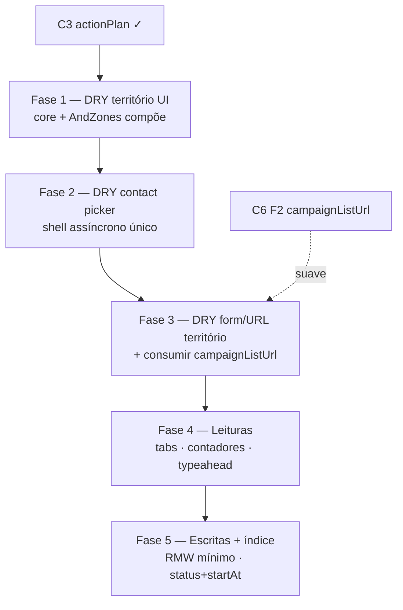

# Escala e DRY pós-C3 (planos de ação)

Status: rascunho
Atualizado em: 2026-07-18
Item do roadmap: [docs/roadmap.md](../roadmap.md) (Trilha C, item C7)
Responsável: —

## Contexto

O C3 ([eventos-agenda-mobilizacao.md](eventos-agenda-mobilizacao.md)) entregou a vertical `/campanha/planos` (`actionPlan`, lista/detalhe/forms, blocos "Próximos eventos"). A passagem `/simplify` de 2026-07-18 aplicou limpezas pontuais (alias de access, labels a partir do schema, paginação via `getNucleusPaginationPages`, snapshot de campos staff para liderança, loaders/overview em paralelo), mas **deixou de fora** débitos que os revisores (quality / reuse / performance) marcaram como importantes e maiores que cleanup:

1. Compor território: `NucleusTerritoryAndZonesFields` forcou um fork quase completo em `NucleusTerritoryFields` (~319 linhas).
2. Unificar o picker assíncrono de contato (`ContactCombobox` vs `PrimaryContactCombobox`).
3. Extrair `validateTerritoryFormData` / parse de território FormData (hoje clone núcleo ↔ plano).
4. Consumir (ou espelhar) helpers de URL de lista — C6 Fase 2 já prevê `campaignListUrl`; `actionPlanUi` ainda clona o maquinário de `nucleusUi`.
5. Leituras caras: detalhe/edit sempre carregam `tasks`+`updates` em `depth: 1`; lista hidrata todas as tasks só para progresso; form prefetcha até 200 lideranças.
6. Escritas amplificadas: toggle de tarefa / append de update fazem read-modify-write do documento inteiro.
7. Índice composto ausente para a query quente `status IN (…) AND startAt >= now ORDER BY startAt`.

Este plano é o registro canônico desses follow-ups. Sem ele, a agenda funciona em volume baixo, mas o DRY com núcleos e o custo por plano crescem com o feed de atualizações e a lista de "Próximos".

## Objetivos

- Território Bahia (sem ZE) é um único componente/core; o formulário de núcleo só adiciona `TseZoneInput` + chips de ZE.
- Contatos remotos usam um shell assíncrono; `PrimaryContactCombobox` adapta a API legada `{ current, options }`.
- Validação/parse de território FormData e (quando C6 F2 existir) URL de lista deixam de ser triplicados entre núcleo / apoiador / plano.
- Detalhe de plano carrega arrays por aba; lista não faz join de todas as tasks para contar progresso; liderança no form é typeahead (não prefetch 200×`depth: 1`).
- Toggle/append não reescrevem o documento inteiro; query "Próximos" tem índice adequado.
- Guardrails: `overrideAccess: false` com `user`; escritas multi-step continuam em `withPayloadTransaction`; liderança continua restrita a `tasks.done` + append `updates`; sem novo `Consent`.

## Decisões travadas

- **Um item C7, cinco fases ordenadas.** Mesmo racional do C6: um ID de roadmap, PRs por fase. Ordem: DRY barato → DRY helpers → leituras → escritas/índice.
- **Dependência dura de C3.** Não reabre o escopo de v1 do `actionPlan` (território próprio, arrays embutidos no MVP, access por `coordinators`/`leadership`).
- **Dependência suave de C6 Fase 2** para `campaignListUrl` / pagination shell. Se C6 F2 ainda não existir, C7 Fase 3 extrai só o necessário para `actionPlanUi` **ou** espera o helper do C6 — não inventar um terceiro `*ListUrl`.
- **Cortável se a agenda permanecer pequena.** Fases 4–5 (leituras pesadas, RMW, índice) podem escorregar se houver poucos planos/updates; Fases 1–2 (composição de UI) continuam baratas e reduzem risco de drift com A2.
- **Arrays embutidos no MVP; collection `actionPlanUpdate` só se a Fase 5 medir necessidade.** Preferir patch de linha em `action_plan_tasks` / `action_plan_updates` (drizzle ou Local API alvo) antes de nova collection.
- **Contadores de progresso na lista:** preferir campos derivados `taskDoneCount` / `taskTotal` mantidos no `beforeChange` (migration pequena) a hidratar `tasks: { done: true }` em toda página.
- **i18n e naming** (AGENTS.md): identificadores em inglês (`CampaignTerritoryFields`, `AsyncContactCombobox`, `validateCampaignTerritoryFormData`, `taskDoneCount`, `searchActionPlanLeadershipOptions`), strings visíveis em pt-BR.

## Questões em aberto

- **Renomear `NucleusTerritoryFields` → `CampaignTerritoryFields` neste item?** **Recomendação:** sim no PR da Fase 1 (nome deixa de mentir); manter re-export temporário `NucleusTerritoryFields` se algum import externo ainda existir.
- **Patch de array via drizzle vs Local API?** **Recomendação:** começar com update Local API que envia só `{ tasks: nextTasks }` (já é o caso) + select mínimo no `findByID` (`tasks` only / `updates` only); só cair para SQL direto se o `beforeChange` continuar varrendo arrays grandes.
- **Índice `(status, start_at)` na mesma migration dos contadores?** **Recomendação:** sim — uma `pnpm migrate:create action_plan_list_perf` com colunas derivadas + índice; evita duas deploys de schema.
- **Typeahead de liderança reusa `ContactCombobox` ou `NativeSelect` + search?** **Recomendação:** Server Action `searchActionPlanLeadershipOptions(query)` + combobox (mesmo shell da Fase 2), `depth: 0`, label a partir do contact id/nome já resolvido.
- **Migrar timestamps de núcleos para `formatBahiaDateTimeLabel`?** **Recomendação:** fill-in separado (não bloqueia C7); o helper date-only foi removido no simplify e só volta se a UI precisar.

## Abordagem proposta

### Fase 1 — Território UI composto

- Extrair o bloco regions/cities/neighborhoods/locality/notes (+ chips) para um core compartilhado (hoje duplicado em `NucleusTerritoryFields.tsx` ≈ `NucleusTerritoryAndZonesFields.tsx`).
- **`NucleusTerritoryAndZonesFields`**: compõe o core + `TseZoneInput` + sugestões de ZE (`buildTerritorySuggestions` / `outsideZones`).
- **`ActionPlanForm`**: continua importando só o core (sem ZE).

### Fase 2 — Contact picker único

- Shell assíncrono (debounce, `requestId`, CommandDialog, loading/erro) a partir de `ContactCombobox.tsx`.
- **`PrimaryContactCombobox`**: adapta `{ current, options }` / search de inteligência de núcleo para o shell (sem segundo Dialog).
- Estado controlado (`value` + `onChange`); eliminar espelho pai/filho que o simplify apontou.

### Fase 3 — Helpers FormData / URL

- **`validateCampaignTerritoryFormData` / `parseCampaignTerritoryFields`**: extrair de `nucleusFormData.ts` e `actionPlanFormData.ts` (entityLabel `núcleo` | `plano`).
- **URL de lista:** se C6 F2 já tiver `campaignListUrl.ts`, migrar `actionPlanUi.ts` para consumi-lo; senão, extrair o mínimo compartilhado **no módulo do C6** (não criar `actionPlanListUrl.ts` paralelo) ou adiar esta fatia até C6 F2.
- Opcional: `actionPlanDetailTabUi` parametrizado com o helper genérico de tabs do detalhe de núcleo (só se o PR já tocar URL).

### Fase 4 — Leituras

- **`[slug]/page.tsx`**: selects por aba (overview sem arrays; tarefas sem `updates`; atualizações com `depth: 0` + batch de autores) — espelhar o padrão de loaders por aba do detalhe de núcleo.
- **Lista:** `taskDoneCount` / `taskTotal` (hook) + `depth: 0` para `responsible` com batch de nomes; dropar `tasks: { done: true }` de `actionPlanListSelect`.
- **`getActionPlanLeadershipOptions` → search:** lazy no open do campo; `limit` baixo; sem `depth: 1` em massa.
- **`ContactCombobox`:** não fetch com query vazia (mín. 2 chars ou dígitos), alinhado ao custo de N comboboxes no form de tarefas.

### Fase 5 — Escritas + índice

- **`toggleActionPlanTaskRecord` / `appendActionPlanUpdateRecord`:** `findByID` com `select` só do array tocado; evitar rewalk desnecessário; avaliar patch de linha se ainda houver amplificação.
- **Migration** `action_plan_list_perf`: índice `(status, start_at)` (+ colunas de contador da Fase 4 se ainda não migradas).
- Só então considerar collection `actionPlanUpdate` append-only (fora do MVP C3; só com evidência de corrida/tamanho).

**Migration:** Fases 1–3 sem schema. Fase 4/5: `pnpm migrate:create action_plan_list_perf` (contadores + índice). Sem Consent novo.

## Dependências

- **Dura:** C3 Planos de Ação (código em `actionPlan*` / `/campanha/planos`).
- **Suave:** C6 Fase 2 (`campaignListUrl`) — evita terceiro clone de URL helpers.
- Reusa: `NucleusTerritoryAndZonesFields.tsx`, `NucleusTerritoryFields.tsx`, `PrimaryContactCombobox.tsx`, `ContactCombobox.tsx`, `nucleusFormData.ts`, `actionPlanFormData.ts`, `actionPlanUi.ts`, `actionPlanPageData.ts`, `actionPlanViewModels.ts`, `campanha/actions/actionPlan.ts`, padrão de loaders por aba do detalhe de núcleo, C6 plano [escala-dry-pos-c2.md](escala-dry-pos-c2.md).

## Não escopo

- Reabrir decisões de v1 do C3 (`startAt` só obrigatório fora de rascunho, território sem link a núcleo, updates embutidos no MVP) — [eventos-agenda-mobilizacao.md](eventos-agenda-mobilizacao.md).
- Escala/DRY de apoiadores (import bulk, KPI SQL, preview token) — C6 / [escala-dry-pos-c2.md](escala-dry-pos-c2.md).
- Demandas / relação opcional `actionPlan` — C4.
- Notificações de agenda — D2 / [notifications.md](notifications.md).
- Calendário visual / mapa de eventos / recorrência — fora do horizonte pré-16/08.
- Migrar todos os `Intl.DateTimeFormat` de núcleos para Bahia — fill-in.

## Referências

- `docs/roadmap.md` — Trilha C, item C7; sequência Janela 2
- [eventos-agenda-mobilizacao.md](eventos-agenda-mobilizacao.md) — C3 v1 entregue
- [escala-dry-pos-c2.md](escala-dry-pos-c2.md) — precedente C6 + `campaignListUrl`
- Review `/simplify` 2026-07-18 (quality / reuse / performance) — origem das fases
- `src/components/campaign/NucleusTerritoryFields.tsx` / `NucleusTerritoryAndZonesFields.tsx`
- `src/components/campaign/ContactCombobox.tsx` / `PrimaryContactCombobox.tsx`
- `src/utilities/actionPlanFormData.ts` / `nucleusFormData.ts` / `actionPlanUi.ts`
- `src/utilities/actionPlanPageData.ts` / `actionPlanViewModels.ts` / `actionPlanLeadershipOptions.ts`
- `src/app/(campaign)/campanha/actions/actionPlan.ts` — toggle/append RMW
- `src/migrations/20260718_222832_add_action_plan.ts` — índices atuais `status` / `start_at` separados
- AGENTS.md — `overrideAccess: false`, transações, naming, território Bahia
