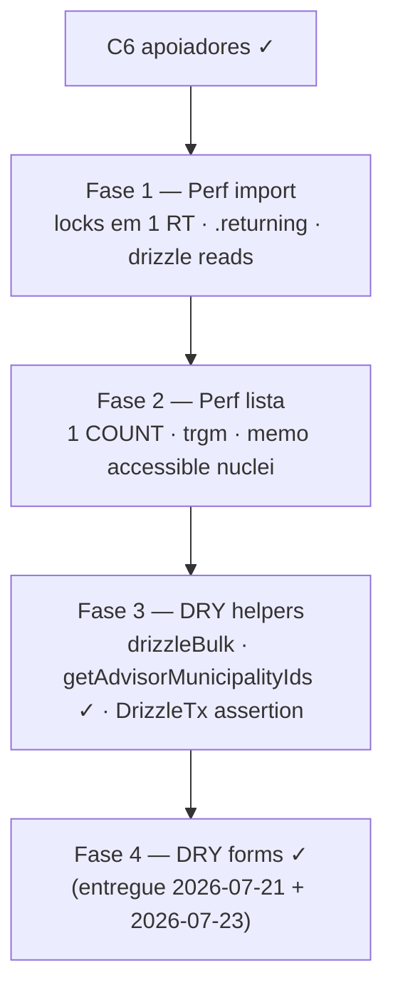

# Escala e DRY pós-C6 (apoiadores / import / listas)

Status: F4 (DRY de forms) **entregue** — twin praça 2026-07-21 + hardening 2026-07-23; **o resto do F4 (10 escadas hand-rolled escritas depois) fechou em 2026-07-25 no Pass 2 W4d** (`runCampaignFormAction`, exceções documentadas em comentário); **F3 (parsers das listas de entidade) fechou no Pass 2 W1-D2**; F1–F2 abertos com gatilho (volume real de import/base nominal pós-Onda 0)
Atualizado em: 2026-07-24 (refs sincronizadas pós-remodelagem Municípios + hardening)
Item do roadmap: [docs/roadmap.md](../roadmap.md) (Fill-ins abertos, item C8)
Responsável: —

> **Revisão 2026-07-24:** a remodelagem M1 renomeou `plaza*`/`nucleus*` → `municipality*` (paths `pracas/` → `municipios/`), e o hardening 2026-07-23 (Fase 5) completou a **Fase 4**: os 4 ladders `*/nova` migraram para `runCampaignRedirectFormAction`, os demais `formActions` já usam `mapCampaignFormActionError` + `campaignFormFields` (única exceção: `planos/[slug]/lifecycleFormActions.ts`, que só retorna safe-messages fixas — sem ladder para migrar), e `CampaignInviteForm` já importa `fieldError`/`errorProps` de `campaignFormFields`. O split de access também entregou parte da F3: `getAdvisorMunicipalityIds` (`src/utilities/access/municipalities.ts`) é a variante sem `PayloadRequest`, com cache request-scoped por contexto, e `supporterListOverviewAggregate` recebe os IDs pré-carregados. Restam F1 (perf do import) e o restante de F2/F3 — verificar contra o código no PR.

## Contexto

O C6 ([escala-dry-pos-c2.md](escala-dry-pos-c2.md)) entregou a escala do cadastro nominal de apoiadores: import bulk via drizzle na txn Payload, KPI agregado em SQL, token HMAC de import single-use, e shells compartilhados (`campaignListUrl`, `CampaignListPagination`, `campaignFormFields`, `mapCampaignFormActionError`). A passagem `/simplify` de 2026-07-19 aplicou limpezas pontuais (identity maps, dead branches, `relationshipId`, base64url nativo, `rowCount ?? 0`, reuso de `canManageCampaignUsers`) mas **deixou de fora** débitos que os revisores (quality / reuse / performance) marcaram como importantes e maiores que cleanup. Este plano é o registro canônico desses follow-ups — precedente direto de B5 (pós-B2) e C7 (pós-C3).

Sem este item, a importação funciona em volume baixo, mas: (a) o gargalo de import em escala volta a ser a aquisição de locks advisory (um round-trip por telefone), não o insert bulk; (b) a página de lista de apoiadores faz dois COUNTs filtrados por navegação; (c) a busca por nome/cidade é `ILIKE '%q%'` não-sargable; (d) o scaffold de tipos drizzle do bulk apaga a tipagem de colunas (já causou um bug `contactId` → `contact`); (e) o helper de erro de form adotado só por 2 forms permanece duplicado em ~6 `formActions` legados.

## Objetivos

- Import bulk de 5k apoiadores adquire todos os locks advisory de telefone em **um** round-trip (hoje até 5k round-trips sequenciais).
- O insert bulk de contacts recupera IDs via `.returning()` (hoje re-`payload.find` por chunk).
- Leituras de existência (contacts/supporters existentes) no bulk usam drizzle direto na mesma txn, sem o scaffolding do Local API.
- A página de lista de apoiadores não faz dois COUNTs filtrados por navegação; o `total` do overview vem do `totalDocs` da lista, ou o overview é cacheado por `(user, filterState)` com TTL curto.
- Busca por `q` em nome/cidade usa índice `pg_trgm` GIN (ou restringe a prefix/telefone) — deixa de ser seq scan por página.
- ~~O lookup de municípios acessíveis é memoizado por request~~ — absorvido pelo cache por contexto de `getAccessibleMunicipalityIds` (hardening 2026-07-23); conferir compartilhamento lista+overview no PR.
- `chunk` / `requireTable` / `INSERT_CHUNK_SIZE` / scaffold de tipos drizzle vivem num helper compartilhado, reusado por `supporterImportBulk.ts` e `electionResultsImport.ts` (import TSE).
- O scaffold de tipos drizzle não apaga a tipagem de colunas: assertion runtime dos nomes de coluna em `payload.db.tables.supporter` ao init **ou** `PostgresTransactionDatabase` expõe um `insert` tipado.
- ~~Variante de `getAccessibleNucleusIds` sem `PayloadRequest`~~ — entregue como `getAdvisorMunicipalityIds` (`src/utilities/access/municipalities.ts`).
- ~~Todos os `formActions.ts` restantes migram para os helpers compartilhados~~ — entregue (F4 completa; ver Fase 4).
- Guardrails: `overrideAccess: false` com `user`; escritas multi-step continuam em `withPayloadTransaction`; locks advisory continuam xact-level; sem novo `Consent`; sem mudança de comportamento visível.

## Decisões travadas

- **Um item C8, fases ordenadas.** Mesmo racional do C6/C7: um ID de roadmap, PRs por fase. Ordem: perf do caminho quente (import) → perf de leitura (lista) → DRY de helpers → DRY de forms.
- **Dependência dura de C6 (merge).** O código que C8 otimiza é o código do C6; não reabre o escopo de v1 do `supporter`/`supporterImportBatch`.
- **Cortável se a base nominal permanecer pequena.** Fases 1–2 (perf de import/lista) só rendem com base real em volume; se a base ficar pequena até 16/08, adiar para Janela 3. Fases 3–4 (DRY) são baratas e reduzem drift — manter se houver folga.
- **Sem migration de schema em Fases 1–3.** Fase 2 pode exigir uma migration pequena (`pg_trgm` GIN em `contact.name`/`contact.city`) — única migration do item.
- **`postgresTransactionLocks.ts` é pré-existente e compartilhado** com o path single-create (`upsertContactByPhone`, `enforceUniqueContactPhone`). A Fase 1 troca o loop de locks por uma query única sem mudar o contrato `acquireContactPhoneLocks(payload, req, phones[])` — callers não mudam.
- **i18n e naming** (AGENTS.md): identificadores em inglês (`acquireContactPhoneLocks` mantido, `drizzleBulk.ts`, `getAdvisorMunicipalityIds`, etc.), strings visíveis em pt-BR.

## Questões em aberto

- **`pg_trgm` vs prefix-only para busca de nome?** `ILIKE '%q%'` precisa de trigram para ser sargable; prefix-only (`ILIKE 'q%'`) usa btree mas perde busca infix. **Recomendação:** `pg_trgm` GIN (a busca infix é o comportamento esperado pela UI hoje); migration pequena `add_contact_trgm_index`.
- **Overview `total` derivado do `totalDocs` da lista vs cache?** Derivar elimina um COUNT mas acopla overview ao carregamento da lista (overview some se lista não carrega). **Recomendação:** derivar `total` de `result.totalDocs` (já computado pela lista) e rodar só os dois `FILTER` no overview; cache só se houver reclamação de latency.
- **Assertion runtime de colunas vs widen `PostgresTransactionDatabase`?** Assertion é barata e pega o bug na inicialização; widen é mais limpo mas toca `postgresTransactionLocks.ts` (pré-existente). **Recomendação:** assertion runtime em `supporterImportBulk.ts` (escopo do item); widen fica como follow-up de plataforma.
- **Migrar formActions de planos aqui (C8) ou em C7?** O plano do C6 anotou "mapper de form actions de planos ficou para C7". **Recomendação:** consolidar TODOS os formActions restantes em C8 Fase 4 (C8 é o "DRY pós-C6" e C6 introduziu os helpers); C7 Fase 3 continua dono dos helpers FormData/URL de território do actionPlan. Atualizar a nota cruzada no plano do C6 na hora do PR.

## Abordagem proposta

### Fase 1 — Perf do caminho quente de import

- **`acquireContactPhoneLocks`** (`src/utilities/contactPhoneInvariant.ts` / `postgresTransactionLocks.ts`): trocar o loop `for (const key of sortedKeys) await database.execute(...)` por uma query única `SELECT pg_advisory_xact_lock(hashtextextended(k, 0)) FROM unnest(ARRAY[...]) AS k` (ordenar para evitar deadlock). Contrato `acquireContactPhoneLocks(payload, req, phones[])` inalterado — callers (bulk, single-create, hook) não mudam.
- **`bulkInsertSupporterImport`** (`src/utilities/supporterImportBulk.ts`): `tx.insert(contactTable).values(...).returning({ id: true, phone: true })` em vez do re-`payload.find` por chunk para recuperar IDs (elimina ~10 round-trips no cap de 5k). Widen o tipo `DrizzleTx` local para tipar `.returning()`.
- Substituir os dois `payload.find` de existência (contacts por phone, supporters por contact_id) por `SELECT ... FROM contact WHERE phone = ANY($)` / `SELECT contact_id FROM supporter WHERE contact_id = ANY($) AND municipality_id IS NULL` na mesma sessão drizzle da txn.

### Fase 2 — Perf de leitura da lista

- **`loadSupporterListOverviewData`** (`src/utilities/supporterPageData.ts`): derivar `total` do `result.totalDocs` da lista (já computado por Payload); o overview roda só os dois `COUNT(*) FILTER` (certo+tende, indeciso). Elimina um COUNT filtrado completo por navegação.
- **`computeSupporterListOverviewAggregate`** (`src/utilities/supporterListOverviewAggregate.ts`): ~~memoizar o lookup de municípios acessíveis por request~~ — **largamente absorvido** (2026-07-23): `getAccessibleMunicipalityIds` tem cache request-scoped por contexto e o aggregate recebe `advisorMunicipalityIds` pré-carregados; conferir no PR se lista e overview compartilham de fato uma única query `municipality`.
- **Migration** `add_contact_trgm_index`: `CREATE EXTENSION IF NOT EXISTS pg_trgm` + `CREATE INDEX ... USING gin (name gin_trgm_ops)` e `(city gin_trgm_ops)` em `contact`. Torna `ILIKE '%q%'` sargable. Única migration do item.
- Avaliar restringir `q` a mínimo 2–3 chars no cliente (reduz seq scans inúteis) — opcional, sem migration.

### Fase 3 — DRY de helpers

- **`src/utilities/drizzleBulk.ts`** (novo): extrair `chunk`, `requireTable`, `INSERT_CHUNK_SIZE`, e o scaffold de tipos `DrizzleTx`/`PayloadDb` de `supporterImportBulk.ts` e `electionResultsImport.ts` (hoje byte-idênticos). Importar de ambos.
- ~~Variante de `getAccessibleNucleusIds` sem `PayloadRequest`~~ — **entregue** no split de access (hardening 2026-07-23): `getAdvisorMunicipalityIds` (`src/utilities/access/municipalities.ts`) é a implementação canônica do lookup `advisors contains user.id` sem `PayloadRequest`, reusada por `getAccessibleMunicipalityIds` (cache por contexto) e pelo aggregate.
- **`CampaignListEmptyState`** (novo, `src/components/campaign/`): o bloco `Empty*` com `SearchXIcon` + "Ajuste a busca ou os filtros…" + CTA de limpar está copiado em sete superfícies — `apoiadores`, `liderancas`, `demandas`, `organizacoes`, `dobradinhas`, `planos` e `MunicipalityList` (que em B16, 2026-07-25, ganhou a melhor versão do CTA: `CampaignTransitionAnchor` preservando `sort`/`dir`, hoje ilhada numa das sete). Extrair `({ title, description, action })` e adotar pelo menos no par idêntico (apoiadores + municípios) antes de converter o resto. _(fonte: revisão de reuso pós-B16, 2026-07-25)_
- **`firstValue` local em quatro parsers:** `campaignDemandData.ts`, `organizationData.ts`, `leadershipData.ts` e `municipalityUpdatePageData.ts` redeclaram byte a byte o `firstValue` já exportado por `campaignListUrl.ts` — trocar pelos imports (migrar essas listas para `resolveListUrl`/`buildListHref` continua fora deste plano). _(mesma fonte)_
- **Type safety do bulk:** assertion runtime em `supporterImportBulk.ts` que `Object.keys(payload.db.tables.supporter)` contém as colunas esperadas (`contact`, `municipality`, `consent`, `createdBy`, …) no init do módulo — pega o bug `contactId` vs `contact` antes do runtime. (Widen de `PostgresTransactionDatabase` fica como follow-up de plataforma.)

### Fase 4 — DRY de forms — **ENTREGUE** (2026-07-21 + hardening 2026-07-23)

- ~~Migrar os `formActions.ts` restantes para `mapCampaignFormActionError` + `campaignFormFields`~~ — **completo**:
  - Twin lista↔`/editar`: `municipalityStaffFormActions.ts` (entregue 2026-07-21 como `plazaStaffFormActions.ts` em `pracas/`; renomeado na M1); `editar/formActions.ts` mantém só `updateMunicipalityStrategyFormAction`.
  - 4 ladders `*/nova` (demandas, dobradinhas, lideranças, organizações): migrados para `runCampaignRedirectFormAction` no hardening 2026-07-23 (Fase 5).
  - Todos os demais `formActions` (`convite/[token]`, `apoiadores/*`, `planos/*`, `municipios/[slug]/*`, `demandas/[slug]`, `dobradinhas/[slug]`, `liderancas/[id]`, `organizacoes/[slug]`) já usam `mapCampaignFormActionError`; `planos/[slug]/lifecycleFormActions.ts` retorna só safe-messages fixas (sem ladder — nada a migrar).
- ~~Migrar `fieldError`/`firstError` local em forms legados~~ — `CampaignInviteForm.tsx` já importa de `campaignFormFields.ts`.
- **Nota pós-remodel:** paths `nucleos/*`/`pracas/*` foram superseded; não reabrir.

**Migration:** Fases 1, 3, 4 sem schema. Fase 2: `pnpm migrate:create add_contact_trgm_index` (extensão + 2 GIN indexes). Sem Consent novo.

## Dependências

- **Dura:** C6 Escala e DRY pós-C2 (código em `supporterImportBulk.ts` / `supporterListOverviewAggregate.ts` / `supporterPageData.ts` / `campaignFormActionError.ts`).
- Reusa: `src/utilities/contactPhoneInvariant.ts`, `postgresTransactionLocks.ts`, `getPostgresTransactionDatabase`, `relationshipId`, `src/utilities/access/municipalities.ts` (`getAccessibleMunicipalityIds`, `getAdvisorMunicipalityIds`), `electionResultsImport.ts` (para `drizzleBulk.ts`), C6 plano [escala-dry-pos-c2.md](escala-dry-pos-c2.md).

## Não escopo

- Reabrir decisões de v1 do C6 (token HMAC vs opaque, `supporterImportBatch` como staging, `skipContactPhoneInvariant` fail-closed) — [escala-dry-pos-c2.md](escala-dry-pos-c2.md).
- Helpers FormData/URL de território do actionPlan — C7 Fase 3 / [escala-dry-pos-c3.md](escala-dry-pos-c3.md).
- Camada de zonas no mapa, coroplético — B3/B4.
- Widen de `PostgresTransactionDatabase` para expor `insert` tipado — follow-up de plataforma (a assertion runtime da Fase 3 cobre o bug).
- Notificações / push — D2.

## Referências

- `docs/roadmap.md` — Trilha C, item C8; sequência Janela 2
- [escala-dry-pos-c2.md](escala-dry-pos-c2.md) — C6 entregue; precedente do formato
- [escala-dry-pos-b2.md](escala-dry-pos-b2.md) — precedente B5 (pós-B2 simplify)
- [escala-dry-pos-c3.md](escala-dry-pos-c3.md) — precedente C7 (pós-C3 simplify)
- Review `/simplify` 2026-07-19 (quality / reuse / performance) — origem das fases
- `src/utilities/supporterImportBulk.ts` — bulk insert (locks, .returning, drizzle reads)
- `src/utilities/postgresTransactionLocks.ts` — `acquireContactPhoneLocks` (loop por telefone)
- `src/utilities/supporterListOverviewAggregate.ts` — aggregate SQL + `resolveAccessConstraint`
- `src/utilities/supporterPageData.ts` — `loadSupporterListOverviewData` (duplo COUNT)
- `src/utilities/electionResultsImport.ts` — `chunk`/`requireTable`/`INSERT_CHUNK_SIZE` duplicados
- `src/utilities/access/municipalities.ts` — `getAccessibleMunicipalityIds` / `getAdvisorMunicipalityIds`
- `src/utilities/campaignFormActionError.ts` / `campaignFormFields.ts` — helpers adotados por 2 forms
- AGENTS.md — `overrideAccess: false`, transações, locks advisory xact-level, naming

## Simplify (2026-07-19)

Duas passagens `/simplify` sobre o diff do C8 (pré- e pós-rebase em `main` com C7) aplicaram limpezas pontuais sem mudar comportamento: `safeMessages` opcional em `mapCampaignFormActionError`, `drizzleResultRows` reutilizado em `campaignInviteRepository`, chunk de `IN` nas leituras drizzle do bulk import, `select: { id: true }` via `DynamicFind` em `getCoordinatorNucleusIds`, prefetch de núcleos do coordenador para o overview, `errorProps` no `CampaignInviteForm`/`NucleusUpdateForm`, e hoisting de erros de campo. Validado com `tsc --noEmit`, `pnpm lint`, `pnpm test:int`, `pnpm build` e scan Aikido.

Os débitos que os revisores marcaram como importantes e maiores que cleanup foram registrados como item **C9** — [escala-dry-pos-c8.md](escala-dry-pos-c8.md):

1. **Filtros duplicados** — `buildSupporterListWhere` (Payload) vs `buildAggregateSql` (SQL cru); risco de drift entre KPIs e lista.
2. **`contactSearchQuery` não wireado no aggregate** — overview ainda dispara `ILIKE` para `q` de 1 caractere apesar do `pg_trgm` e do guard de C7.
3. **Lookup de núcleos do coordenador repetido** — até 3× por navegação em `/campanha/apoiadores` (list access + options + overview prefetch).
4. **`apoiadores/[id]/formActions.ts` fora do mapper** — contrato `message` vs `fieldErrors` exige desenho antes de migrar.
5. **Componentes de form com `fieldError` local** — `NucleusForm`, `ActionPlanForm`, `NucleusTerritoryFields`, `VoteEstimateDialog`, etc.

**Explicitamente fora (tradeoffs aceitos no C8):** waterfall lista→overview (precisa de `totalDocs`); unificar lista+aggregate numa query; widen de `PostgresTransactionDatabase`.

## Simplify (2026-07-21 pós-B9)

~~`/simplify` da entrega **B9** marcou como **maior que cleanup** o twin `listFormActions.ts` ↔ `editar/formActions.ts`~~ — **entregue 2026-07-21 (C8 F4):** `municipalityStaffFormActions.ts` (à época `plazaStaffFormActions.ts`) unifica os 3 wrappers compartilhados; `editar/formActions.ts` mantém só `updateMunicipalityStrategyFormAction`.

**Explicitamente fora (triage `capture-review-debts` 2026-07-21 pós-B9):** hook `useMunicipalityListPopoverForm` (gatilho: 4º inline editor); `MunicipalityAdvisorCheckboxList` (gatilho: 3º uso ou refactor do form `/editar`); layout responsivo único mobile+desktop na lista (gatilho: page size >25 ou profiling de hydration); lazy-load de `getEligibleAdvisorOptions` (staff set pequeno); `PopoverAnchor` export não usado (scaffold shadcn); ~~helper `parsePoliticalTrendStatus`~~ → entregue como `parsePoliticalTrendStatusFormValue` no prep A9+; unit tests dos `MunicipalityList*Control` (int access cobre domínio); E2E save inline (gatilho: smoke pós-merge B9).

## Simplify (2026-07-21 pós-A9+)

~~Débito restante na Fase 4: unificar os wrappers de server action duplicados~~ — **entregue 2026-07-21 (C8 F4):** ver seção Simplify pós-B9.

## Simplify (2026-07-21 pós-C8 F4)

Passagem `/simplify` + `capture-review-debts` após fill-in **C8 F4** (twin praça→município DRY).

**Já resolvido (não reabrir):** `municipalityStaffFormActions.ts (à época plazaStaffFormActions)`; `municipalityStaffEditSafeMessages (à época plazaStaffEditSafeMessages)`; tipo `MunicipalityStaffFormAction` em `MunicipalityList.tsx`; import direto em `editar/page.tsx` (Next.js não permite re-export em `'use server'`); hygiene de refs em planos-pai A9/B9/estimativa.

**Explicitamente fora (triage `capture-review-debts` 2026-07-21 pós-C8 F4):**

- **Runner genérico `runCampaignFormAction`** — gatilho: 5+ wrappers idênticos ou 4º cluster de forms na mesma superfície (hoje ~18 arquivos com try/catch inline).
- **`revalidateMunicipalityListPaths` com `scope` por tipo de save** — gatilho: N saves inline + profiling de rerender inaceitável (ver [escala-dry-pos-a9.md](escala-dry-pos-a9.md) Adiado com gatilho).
- **`pledgeFormActions` / `updateFormActions` → `revalidateMunicipalityListPaths`** — gatilho: forms ganham `municipalitySlug` ou unificação de revalidate no detalhe do município.
- **`reloadCampaignActor` por submit em `actions/municipality.ts`** — gatilho: profiling mostra latência dominante em saves staff inline.
- **Fundir `updateMunicipalityStrategyFormAction` em `municipalityStaffFormActions.ts`** — parse/`safeMessages` distintos; superfície só `/editar`.
