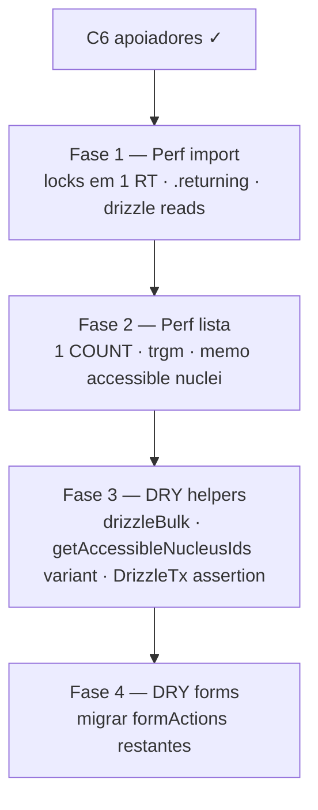

# Escala e DRY pós-C6 (apoiadores / import / listas)

Status: rascunho
Atualizado em: 2026-07-19
Item do roadmap: [docs/roadmap.md](../roadmap.md) (Trilha C, item C8)
Responsável: —

## Contexto

O C6 ([escala-dry-pos-c2.md](escala-dry-pos-c2.md)) entregou a escala do cadastro nominal de apoiadores: import bulk via drizzle na txn Payload, KPI agregado em SQL, token HMAC de import single-use, e shells compartilhados (`campaignListUrl`, `CampaignListPagination`, `campaignFormFields`, `mapCampaignFormActionError`). A passagem `/simplify` de 2026-07-19 aplicou limpezas pontuais (identity maps, dead branches, `relationshipId`, base64url nativo, `rowCount ?? 0`, reuso de `canManageCampaignUsers`) mas **deixou de fora** débitos que os revisores (quality / reuse / performance) marcaram como importantes e maiores que cleanup. Este plano é o registro canônico desses follow-ups — precedente direto de B5 (pós-B2) e C7 (pós-C3).

Sem este item, a importação funciona em volume baixo, mas: (a) o gargalo de import em escala volta a ser a aquisição de locks advisory (um round-trip por telefone), não o insert bulk; (b) a página de lista de apoiadores faz dois COUNTs filtrados por navegação; (c) a busca por nome/cidade é `ILIKE '%q%'` não-sargable; (d) o scaffold de tipos drizzle do bulk apaga a tipagem de colunas (já causou um bug `contactId` → `contact`); (e) o helper de erro de form adotado só por 2 forms permanece duplicado em ~6 `formActions` legados.

## Objetivos

- Import bulk de 5k apoiadores adquire todos os locks advisory de telefone em **um** round-trip (hoje até 5k round-trips sequenciais).
- O insert bulk de contacts recupera IDs via `.returning()` (hoje re-`payload.find` por chunk).
- Leituras de existência (contacts/supporters existentes) no bulk usam drizzle direto na mesma txn, sem o scaffolding do Local API.
- A página de lista de apoiadores não faz dois COUNTs filtrados por navegação; o `total` do overview vem do `totalDocs` da lista, ou o overview é cacheado por `(user, filterState)` com TTL curto.
- Busca por `q` em nome/cidade usa índice `pg_trgm` GIN (ou restringe a prefix/telefone) — deixa de ser seq scan por página.
- O lookup de núcleos acessíveis do coordenador é memoizado por request (lista + overview compartilham uma query).
- `chunk` / `requireTable` / `INSERT_CHUNK_SIZE` / scaffold de tipos drizzle vivem num helper compartilhado, reusado por `supporterImportBulk.ts` e `electionResultsImport.ts` (import TSE).
- O scaffold de tipos drizzle não apaga a tipagem de colunas: assertion runtime dos nomes de coluna em `payload.db.tables.supporter` ao init **ou** `PostgresTransactionDatabase` expõe um `insert` tipado.
- `getAccessibleNucleusIds` ganha uma variante sem `PayloadRequest` (ou `supporterListOverviewAggregate` reusa a existente), eliminando o lookup duplicado de escopo coordenador.
- Todos os `formActions.ts` de `/campanha` restantes migram para `mapCampaignFormActionError` + `campaignFormFields` (hoje duplicados em ~6 arquivos).
- Guardrails: `overrideAccess: false` com `user`; escritas multi-step continuam em `withPayloadTransaction`; locks advisory continuam xact-level; sem novo `Consent`; sem mudança de comportamento visível.

## Decisões travadas

- **Um item C8, fases ordenadas.** Mesmo racional do C6/C7: um ID de roadmap, PRs por fase. Ordem: perf do caminho quente (import) → perf de leitura (lista) → DRY de helpers → DRY de forms.
- **Dependência dura de C6 (merge).** O código que C8 otimiza é o código do C6; não reabre o escopo de v1 do `supporter`/`supporterImportBatch`.
- **Cortável se a base nominal permanecer pequena.** Fases 1–2 (perf de import/lista) só rendem com base real em volume; se a base ficar pequena até 16/08, adiar para Janela 3. Fases 3–4 (DRY) são baratas e reduzem drift — manter se houver folga.
- **Sem migration de schema em Fases 1–3.** Fase 2 pode exigir uma migration pequena (`pg_trgm` GIN em `contact.name`/`contact.city`) — única migration do item.
- **`postgresTransactionLocks.ts` é pré-existente e compartilhado** com o path single-create (`upsertContactByPhone`, `enforceUniqueContactPhone`). A Fase 1 troca o loop de locks por uma query única sem mudar o contrato `acquireContactPhoneLocks(payload, req, phones[])` — callers não mudam.
- **i18n e naming** (AGENTS.md): identificadores em inglês (`acquireContactPhoneLocks` mantido, `drizzleBulk.ts`, `getAccessibleNucleusIds` variant, etc.), strings visíveis em pt-BR.

## Questões em aberto

- **`pg_trgm` vs prefix-only para busca de nome?** `ILIKE '%q%'` precisa de trigram para ser sargable; prefix-only (`ILIKE 'q%'`) usa btree mas perde busca infix. **Recomendação:** `pg_trgm` GIN (a busca infix é o comportamento esperado pela UI hoje); migration pequena `add_contact_trgm_index`.
- **Overview `total` derivado do `totalDocs` da lista vs cache?** Derivar elimina um COUNT mas acopla overview ao carregamento da lista (overview some se lista não carrega). **Recomendação:** derivar `total` de `result.totalDocs` (já computado pela lista) e rodar só os dois `FILTER` no overview; cache só se houver reclamação de latency.
- **Assertion runtime de colunas vs widen `PostgresTransactionDatabase`?** Assertion é barata e pega o bug na inicialização; widen é mais limpo mas toca `postgresTransactionLocks.ts` (pré-existente). **Recomendação:** assertion runtime em `supporterImportBulk.ts` (escopo do item); widen fica como follow-up de plataforma.
- **Migrar formActions de planos aqui (C8) ou em C7?** O plano do C6 anotou "mapper de form actions de planos ficou para C7". **Recomendação:** consolidar TODOS os formActions restantes em C8 Fase 4 (C8 é o "DRY pós-C6" e C6 introduziu os helpers); C7 Fase 3 continua dono dos helpers FormData/URL de território do actionPlan. Atualizar a nota cruzada no plano do C6 na hora do PR.

## Abordagem proposta

### Fase 1 — Perf do caminho quente de import

- **`acquireContactPhoneLocks`** (`src/utilities/contactPhoneInvariant.ts` / `postgresTransactionLocks.ts`): trocar o loop `for (const key of sortedKeys) await database.execute(...)` por uma query única `SELECT pg_advisory_xact_lock(hashtextextended(k, 0)) FROM unnest(ARRAY[...]) AS k` (ordenar para evitar deadlock). Contrato `acquireContactPhoneLocks(payload, req, phones[])` inalterado — callers (bulk, single-create, hook) não mudam.
- **`bulkInsertSupporterImport`** (`src/utilities/supporterImportBulk.ts`): `tx.insert(contactTable).values(...).returning({ id: true, phone: true })` em vez do re-`payload.find` por chunk para recuperar IDs (elimina ~10 round-trips no cap de 5k). Widen o tipo `DrizzleTx` local para tipar `.returning()`.
- Substituir os dois `payload.find` de existência (contacts por phone, supporters por contact_id) por `SELECT ... FROM contact WHERE phone = ANY($)` / `SELECT contact_id FROM supporter WHERE contact_id = ANY($) AND nucleus_id IS NULL` na mesma sessão drizzle da txn.

### Fase 2 — Perf de leitura da lista

- **`loadSupporterListOverviewData`** (`src/utilities/supporterPageData.ts`): derivar `total` do `result.totalDocs` da lista (já computado por Payload); o overview roda só os dois `COUNT(*) FILTER` (certo+tende, indeciso). Elimina um COUNT filtrado completo por navegação.
- **`computeSupporterListOverviewAggregate`** (`src/utilities/supporterListOverviewAggregate.ts`): memoizar o `resolveAccessConstraint` (lookup de núcleos acessíveis do coordenador) por request — lista e overview compartilham a mesma query `electoralNucleus`.
- **Migration** `add_contact_trgm_index`: `CREATE EXTENSION IF NOT EXISTS pg_trgm` + `CREATE INDEX ... USING gin (name gin_trgm_ops)` e `(city gin_trgm_ops)` em `contact`. Torna `ILIKE '%q%'` sargable. Única migration do item.
- Avaliar restringir `q` a mínimo 2–3 chars no cliente (reduz seq scans inúteis) — opcional, sem migration.

### Fase 3 — DRY de helpers

- **`src/utilities/drizzleBulk.ts`** (novo): extrair `chunk`, `requireTable`, `INSERT_CHUNK_SIZE`, e o scaffold de tipos `DrizzleTx`/`PayloadDb` de `supporterImportBulk.ts` e `electionResultsImport.ts` (hoje byte-idênticos). Importar de ambos.
- **`getAccessibleNucleusIds`** (`src/utilities/campaignAccess.ts`): adicionar variante sem `PayloadRequest` (ou parametrizar a existente com cache opcional) para que `supporterListOverviewAggregate` reuse em vez de re-implementar o lookup `coordinators contains user.id`.
- **Type safety do bulk:** assertion runtime em `supporterImportBulk.ts` que `Object.keys(payload.db.tables.supporter)` contém as colunas esperadas (`contact`, `nucleus`, `consent`, `createdBy`, …) no init do módulo — pega o bug `contactId` vs `contact` antes do runtime. (Widen de `PostgresTransactionDatabase` fica como follow-up de plataforma.)

### Fase 4 — DRY de forms

- Migrar os `formActions.ts` restantes para `mapCampaignFormActionError` + `campaignFormFields` (hoje o ladder `FormDataBoundaryError` → `ZodError` → `validationFieldErrors` → safe-message está inlined em ~6 arquivos):
  - `src/app/(campaign)/campanha/(app)/nucleos/formActions.ts`
  - `src/app/(campaign)/campanha/(app)/nucleos/[slug]/voteEstimateFormActions.ts`
  - `src/app/(campaign)/campanha/(app)/nucleos/[slug]/nucleusIntelligenceFormActions.ts`
  - `src/app/(campaign)/campanha/(app)/nucleos/[slug]/nucleusUpdateFormActions.ts`
  - `src/app/(campaign)/campanha/(app)/nucleos/[slug]/coordinatorAssignmentFormActions.ts`
  - `src/app/(campaign)/campanha/convite/[token]/formActions.ts`
  - `src/app/(campaign)/campanha/(app)/apoiadores/[id]/formActions.ts`
  - `src/app/(campaign)/campanha/(app)/planos/formActions.ts` e `planos/[slug]/updateFormActions.ts`
- Migrar `fieldError`/`firstError` local em `src/components/campaign/NucleusUpdateForm.tsx` e `CampaignInviteForm.tsx` para importar de `campaignFormFields.ts`.

**Migration:** Fases 1, 3, 4 sem schema. Fase 2: `pnpm migrate:create add_contact_trgm_index` (extensão + 2 GIN indexes). Sem Consent novo.

## Dependências

- **Dura:** C6 Escala e DRY pós-C2 (código em `supporterImportBulk.ts` / `supporterListOverviewAggregate.ts` / `supporterPageData.ts` / `campaignFormActionError.ts`).
- Reusa: `src/utilities/contactPhoneInvariant.ts`, `postgresTransactionLocks.ts`, `getPostgresTransactionDatabase`, `relationshipId`, `campaignAccess.ts` (`getAccessibleNucleusIds`, `canManageCampaignUsers`), `electionResultsImport.ts` (para `drizzleBulk.ts`), C6 plano [escala-dry-pos-c2.md](escala-dry-pos-c2.md).

## Não escopo

- Reabrir decisões de v1 do C6 (token HMAC vs opaque, `supporterImportBatch` como staging, `skipContactPhoneInvariant` fail-closed) — [escala-dry-pos-c2.md](escala-dry-pos-c2.md).
- Helpers FormData/URL de território do actionPlan — C7 Fase 3 / [escala-dry-pos-c3.md](escala-dry-pos-c3.md).
- Camada de zonas no mapa, coroplético — B3/B4.
- Widen de `PostgresTransactionDatabase` para expor `insert` tipado — follow-up de plataforma (a assertion runtime da Fase 3 cobre o bug).
- Notificações / push — D2.

## Referências

- `docs/roadmap.md` — Trilha C, item C8; sequência Janela 2
- [escala-dry-pos-c2.md](escala-dry-pos-c2.md) — C6 entregue; precedente do formato
- [escala-dry-pos-b2.md](escala-dry-pos-b2.md) — precedente B5 (pós-B2 simplify)
- [escala-dry-pos-c3.md](escala-dry-pos-c3.md) — precedente C7 (pós-C3 simplify)
- Review `/simplify` 2026-07-19 (quality / reuse / performance) — origem das fases
- `src/utilities/supporterImportBulk.ts` — bulk insert (locks, .returning, drizzle reads)
- `src/utilities/postgresTransactionLocks.ts` — `acquireContactPhoneLocks` (loop por telefone)
- `src/utilities/supporterListOverviewAggregate.ts` — aggregate SQL + `resolveAccessConstraint`
- `src/utilities/supporterPageData.ts` — `loadSupporterListOverviewData` (duplo COUNT)
- `src/utilities/electionResultsImport.ts` — `chunk`/`requireTable`/`INSERT_CHUNK_SIZE` duplicados
- `src/utilities/campaignAccess.ts` — `getAccessibleNucleusIds`
- `src/utilities/campaignFormActionError.ts` / `campaignFormFields.ts` — helpers adotados por 2 forms
- AGENTS.md — `overrideAccess: false`, transações, locks advisory xact-level, naming
