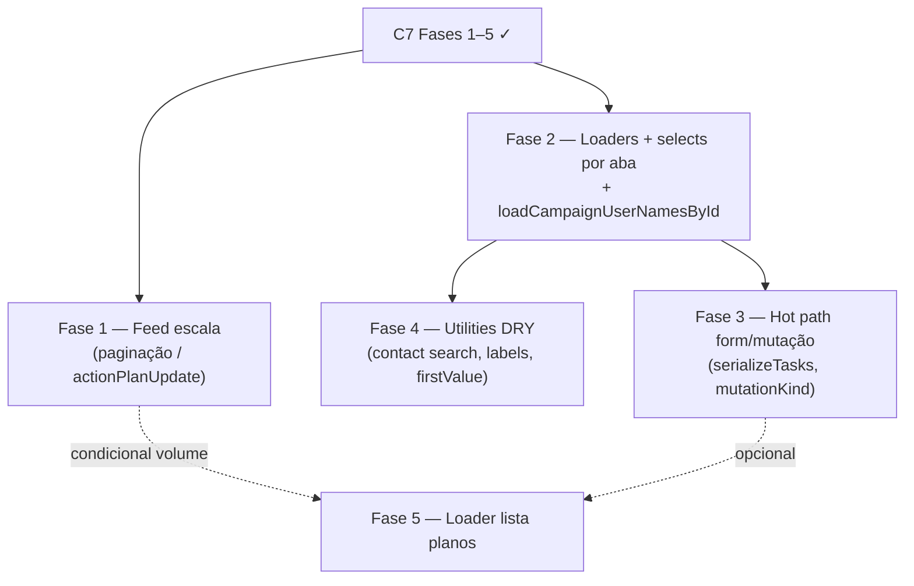

# Escala e DRY pós-C7 (planos de ação / agenda)

Status: registrado no roadmap (fases pendentes)
Atualizado em: 2026-07-19
Item do roadmap: [docs/roadmap.md](../roadmap.md) (Trilha C, item C11)
Responsável: —

## Contexto

O C7 ([escala-dry-pos-c3.md](escala-dry-pos-c3.md)) entregou composição territorial (`useCampaignTerritoryFieldsState` + `CampaignTerritoryCoreFields`), shell `AsyncSearchCombobox` (+ `ContactCombobox` / `PrimaryContactCombobox` / `LeadershipCombobox`), leituras por aba no detalhe (`getActionPlanDetailSelect` + `taskProgress` + batch de autores na aba Atualizações), typeahead de liderança (`searchActionPlanLeadershipOptions`), short-circuit de hooks em toggle/append (`context.mutationKind`) e cleanup do `/simplify` (depth overview/tasks, `searchRef`, `fieldError`, remoção de exports mortos).

Duas passagens `/simplify` (pré- e pós-rebase com `main`/C8–C9) marcaram como **importantes e maiores que cleanup** os follow-ups abaixo. Sem registro, planos com feed longo degradam leitura/append; loaders do detalhe ficam fragmentados em relação ao padrão de núcleos; e hot paths de edição continuam O(n) no array embutido.

1. **Feed de atualizações O(n) (leitura + escrita).** A aba Atualizações carrega o array `updates` inteiro (corpos até 4 000 chars) sem limite/cursor; `appendActionPlanUpdateRecord` faz read-modify-write do array completo. Escala linear com o tamanho do feed — principal cliff de performance da vertical de agenda.
2. **Toggle de tarefa O(n).** `toggleActionPlanTaskRecord` ainda faz `findByID` + `update` com o array `tasks` inteiro (locks + short-circuit de hooks ajudam, mas o RMW permanece).
3. **Selects do detalhe over-fetch em tasks/updates.** `actionPlanDetailContextSelect` inclui `coordinators`, `responsible`, `createdBy`, `description`, etc. nas abas que só precisam de header + conteúdo da aba — hidratação extra em `depth: 1`.
4. **Loader do detalhe fragmentado.** `planos/[slug]/page.tsx` encadeia `resolveAccessibleActionPlanContext` + `getActionPlanDetailPageData`; núcleos já usam orquestrador único (`loadNucleusDetailPageData` / `loadNucleusActiveTabPageData`).
5. **Batch de nomes de autor duplicado.** `loadActionPlanUpdateAuthorNames` em `actionPlanDetailPageData.ts` repete o padrão de `nucleusUpdatePageData` / overview de núcleos (`campaignUser` `id in` → `Map<id, name>`).
6. **Form de edição hidrata todas as tarefas.** `getActionPlanEditPageData` usa `actionPlanFormSelect` + `depth: 1` sempre — latência cresce com contagem de tarefas/responsáveis.
7. **`serializeTasks` no hidden input a cada keystroke.** `ActionPlanTaskFields` chama `JSON.stringify` do array completo em todo render enquanto o usuário edita tarefas.
8. **Typeahead sem índice dedicado na busca de liderança.** `searchActionPlanLeadershipOptions` usa `contains` em `contact.*` aninhado; `pg_trgm` em `contact` já existe (C8) mas a query de liderança ainda não reutiliza o padrão otimizado de apoiadores.
9. **Lista de coordenadores sem paginação no form.** `getEligibleNucleusCoordinatorOptions` com `pagination: false` em novo/editar — O(staff) por page view (aceitável no MVP, débito se o time crescer).
10. **`mutationKind` sem tipo compartilhado.** Magic strings `'taskToggle' | 'appendUpdate'` em actions e `ActionPlan.ts` — risco de drift.
11. **DRY menor:** `searchContactComboboxOptions` ainda inline em `contactSearchActions.ts` (liderança já em `utilities/`); label de liderança duplicada entre `actionPlanLeadershipOptions` e `toActionPlanFormViewModel`; `firstValue` local em `actionPlanDetailTabUi.ts` (já existe em `campaignListUrl.ts`); loader combinado da lista `/campanha/planos` (precedente: `loadSupportersPageData` no C9).

**Explicitamente fora (revisores pediram skip no simplify / já coberto em outro item):**

- **`errorProps` nos forms** — C10 / [escala-dry-pos-c9.md](escala-dry-pos-c9.md) Fase 3 (inclui `ActionPlanForm`, `NucleusTerritoryFields`, `NucleusTerritoryAndZonesFields`).
- **`pg_trgm` em `contact` (migration)** — C8 entregue; este plano só cobre adoção do padrão de busca na query de liderança se necessário.
- **Unificar `validateCampaignTerritoryFormData` ↔ `createCampaignTerritoryValidationHook`** — tipos de erro diferentes; permanece em [escala-dry-pos-c3.md](escala-dry-pos-c3.md) §Não escopo.
- **Renomear `NucleusTerritoryFields.tsx` → `CampaignTerritoryFields.tsx`** — fricção de descoberta; fill-in, não bloqueia escala.
- **View-model dedup form ↔ detalhe** — refactor grande; só se surgir terceiro consumidor.
- **Testes E2E da vertical** — fora do escopo deste item de escala/DRY.

## Objetivos

- Agenda (`/campanha/planos`) permanece responsiva com dezenas de atualizações e tarefas por plano — medir antes de migration; feed append-only só se o volume justificar.
- Detalhe e edição seguem o mesmo padrão de loaders que núcleos (orquestrador + tab data).
- Hot paths de mutação (toggle tarefa, append update) minimizam bytes lidos/escritos sem quebrar locks transacionais nem RBAC.
- Guardrails: `overrideAccess: false` com `user`; sem novo `Consent`; migrations só na Fase 1 condicional (`actionPlanUpdate`).

## Decisões travadas

- **Um item C11, cinco fases ordenadas.** Mesmo racional de A7/B5/C8–C10: um ID de roadmap, PRs por fase. Ordem: feed condicional (maior cliff) → loaders/selects (I/O) → mutações/form hot path → utilities DRY → fill-ins.
- **Dependência dura de C7** mergeado em `main` (código de abas, combobox, hooks). Não reabre Fases 1–5 do C7.
- **Fase 1 (feed) é condicional.** Só migration + collection `actionPlanUpdate` após evidência (ex.: planos com >N updates ou latência medida em produção/staging). Até lá: documentar limite soft e monitorar.
- **Fase 1 condicional respeita congelamento ~20/09** — se entrar perto da reta final, adiar para pós-eleição; Fases 2–4 não exigem migration.
- **Cortável** se a agenda permanecer pequena (poucos planos, feeds curtos). Fase 1 é a mais cortável (e a única com migration). Fases 2–3 são as mais valiosas se houver uso real da agenda antes de 16/08.
- **i18n e naming** (AGENTS.md): identificadores em inglês (`loadActionPlanDetailPageData`, `loadCampaignUserNamesById`, `ACTION_PLAN_MUTATION_KIND`), strings visíveis em pt-BR inalteradas.

## Questões em aberto

- **Fase 1: threshold para extrair `actionPlanUpdate`?** **Recomendação:** 50 updates por plano ou p95 de append >500 ms em staging; até lá manter array embutido e só paginar leitura (limit + cursor) sem nova collection se bastar.
- **Fase 1: paginação só na leitura vs collection append-only?** **Recomendação:** primeiro limitar/paginar leitura na aba Atualizações (sem migration); collection só se append RMW virar gargalo medido.
- **Fase 3: SQL direto no toggle de tarefa?** **Recomendação:** não na primeira iteração; manter Local API + locks; reavaliar com drizzle na txn só se profiling mostrar necessidade (mesmo trade-off do C8).
- **Fase 2: `loadActionPlanDetailPageData` retorna `{ context, view }` ou só `view`?** **Recomendação:** `{ context, view }` espelhando núcleos; página deixa de encadear dois awaits públicos.

## Abordagem proposta

### Fase 1 — Escala do feed de atualizações _(condicional)_

- **1a (sem migration):** limitar leitura na aba Atualizações (`limit` + ordenação por `createdAt` desc); UI “carregar mais”; `getActionPlanDetailSelect` pode omitir corpos antigos até expandir.
- **1b (com migration, se medido):** collection `actionPlanUpdate` append-only + relação `actionPlan` ↔ updates; migrar dados existentes; `appendActionPlanUpdateRecord` vira `create` na collection filha; manter snapshot/embed mínimo no pai se necessário para contadores.
- Teste int: append concorrente + leitura paginada; não regressar locks advisory.

### Fase 2 — Loaders, batching e selects por aba

- `loadCampaignUserNamesById(payload, user, ids)` em `src/utilities/` — reutilizar em `actionPlanDetailPageData.ts`, `nucleusUpdatePageData.ts` e overview de núcleos.
- `loadActionPlanDetailPageData(payload, user, slug, activeTab)` → `{ context, view }` unificando `resolveAccessibleActionPlanContext` + `getActionPlanDetailPageData`.
- Refinar `getActionPlanDetailSelect`: header mínimo compartilhado + campos por aba (tasks: `tasks` + responsáveis das tarefas; updates: `updates` apenas; overview: relações + `taskDoneCount`/`taskTotal`).
- Opcional: `getActionPlanEditPageData` com `select`/`depth` por seção (tarefas lazy) — só se edição ficar lenta em staging.

### Fase 3 — Hot paths de mutação e form de tarefas

- Constante tipada `ACTION_PLAN_MUTATION_KIND` compartilhada entre `actionPlan.ts` actions e `ActionPlan.ts` hooks.
- `ActionPlanTaskFields`: evitar `JSON.stringify` em todo render — atualizar hidden `tasksJson` só no submit ou com debounce/`useDeferredValue`.
- Documentar limite soft de tarefas por plano se toggle continuar RMW.

### Fase 4 — Utilities e DRY menor

- `searchContactComboboxOptions(payload, user, query)` em `utilities/`; `contactSearchActions.ts` fica auth wrapper (paridade com liderança).
- `actionPlanLeadershipLabel(leadership)` único para search + `toActionPlanFormViewModel`.
- `actionPlanDetailTabUi.ts` importa `firstValue` de `campaignListUrl.ts`.
- Avaliar índice/query de liderança alinhada ao padrão C8/C9 (`contactSearchQuery` + `pg_trgm` onde aplicável).

### Fase 5 (opcional) — Loader da lista de planos

- `loadActionPlansPageData` combinando canonical URL + list (precedente `loadSupportersPageData`).
- Entra só se a lista ganhar filtros/overview pesados; cortável.

**Migration:** somente Fase 1b (condicional). Demais fases sem schema.

## Dependências

- **Dura:** C7 Escala e DRY pós-C3 — entregue (merge em `main` pendente do PR atual).
- **Suave:** C8 `pg_trgm` em `contact` — já em `main`; acelera typeahead se Fase 4 adotar o padrão.
- **Suave:** C10 `errorProps` — paralelo; não bloqueia C11 (escopos distintos).
- Reuso: `src/utilities/actionPlanPageData.ts`, `actionPlanDetailPageData.ts`, `actionPlanViewModels.ts`, `src/app/(campaign)/campanha/actions/actionPlan.ts`, `src/collections/ActionPlan.ts`, padrão `loadNucleusDetailPageData`, `campaignListUrl.ts`, `contactSearchQuery.ts`.

## Não escopo

- **`errorProps` nos forms** — C10 / [escala-dry-pos-c9.md](escala-dry-pos-c9.md).
- **Demandas / relação `actionPlan` opcional** — C4.
- **Notificações de agenda** — D2.
- **Calendário visual / mapa de eventos** — fora do horizonte pré-16/08.
- **Unificação FormData ↔ hook de território Payload** — [escala-dry-pos-c3.md](escala-dry-pos-c3.md) §Não escopo.
- **Coordinator list paginada** — só entra se staff > ~50; até lá fill-in.

## Referências

- `docs/roadmap.md` — Trilha C, item C11; sequência Janela 2
- [escala-dry-pos-c3.md](escala-dry-pos-c3.md) — C7 entregue; feed O(n) registrado aqui
- [escala-dry-pos-c6.md](escala-dry-pos-c6.md) — precedente C8 (`pg_trgm`)
- [escala-dry-pos-c8.md](escala-dry-pos-c8.md) — precedente C9/C10
- `src/utilities/actionPlanDetailPageData.ts` — batch autores + view por aba
- `src/utilities/actionPlanPageData.ts` — depth/select por aba
- `src/app/(campaign)/campanha/actions/actionPlan.ts` — toggle/append RMW
- `src/components/campaign/ActionPlanTaskFields.tsx` — `serializeTasks`
- `src/utilities/actionPlanLeadershipOptions.ts` — typeahead
- `src/app/(campaign)/campanha/(app)/planos/contactSearchActions.ts` — server actions de busca
- AGENTS.md — transações, `overrideAccess: false`, naming

## Simplify (2026-07-19)

Passagens `/simplify` sobre o diff do C7 (incl. pós-rebase com C8–C9/Onda 0) aplicaram limpezas pontuais (`fieldError`, `LeadershipCombobox`, `searchRef`, depth overview, exports mortos, skip `buildTerritorySuggestions` com override). Débitos maiores registrados neste plano como item **C11** do roadmap.
