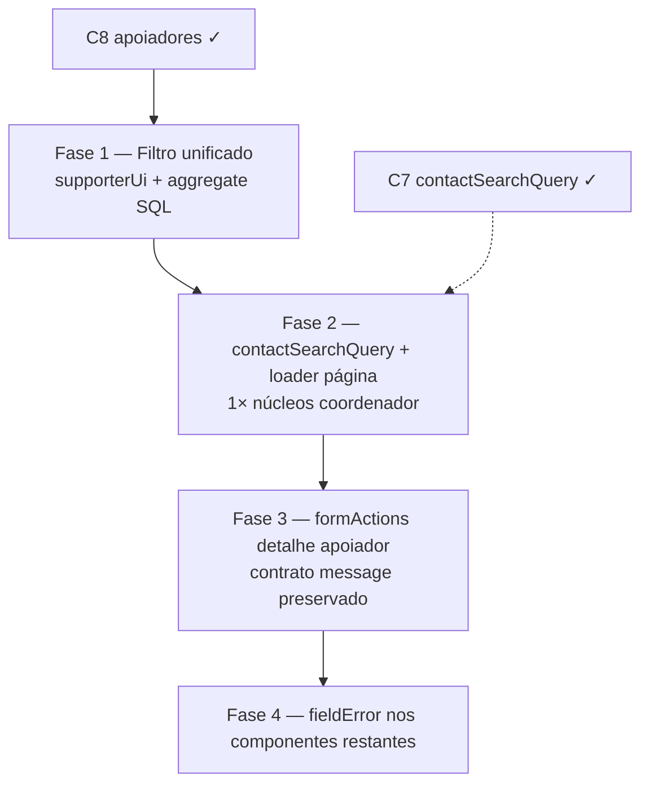

# Escala e DRY pós-C8 (apoiadores / filtros / forms)

Status: registrado no roadmap (fases pendentes)
Atualizado em: 2026-07-19
Item do roadmap: [docs/roadmap.md](../roadmap.md) (Trilha C, item C9)
Responsável: —

## Contexto

O C8 ([escala-dry-pos-c6.md](escala-dry-pos-c6.md)) entregou a segunda camada de escala/DRY do cadastro nominal: locks advisory em um round-trip, bulk import com `.returning()` e leituras drizzle na txn, overview sem `COUNT(*)` redundante, migration `pg_trgm` em `contact`, helper `drizzleBulk.ts`, variante `getCoordinatorNucleusIds`, e migração da maioria dos `formActions` para `mapCampaignFormActionError` + `campaignFormFields`. Duas passagens `/simplify` (pré- e pós-rebase em `main` com C7) aplicaram limpezas adicionais (`select: { id: true }` via `DynamicFind`, prefetch de núcleos do coordenador para o overview, chunk de `IN` no import, `drizzleResultRows` no `campaignInviteRepository`, `errorProps` no `CampaignInviteForm`, `safeMessages` opcional no mapper).

Os revisores (quality / reuse / performance) marcaram como **importantes e maiores que cleanup** os follow-ups abaixo. Sem registro, a lista de apoiadores pode divergir entre Payload e SQL agregado, o coordenador paga 2–3 lookups idênticos por navegação, e o DRY de forms fica incompleto na borda da vertical.

1. **Filtros de apoiadores duplicados.** `buildSupporterListWhere` (`src/utilities/supporterUi.ts`, Payload `Where`) e `buildAggregateSql` (`src/utilities/supporterListOverviewAggregate.ts`, SQL cru) reimplementam a mesma semântica (telefone normalizado, `q`, `voteIntention`, `city`, `nucleus`). O C8 derivou `total` da lista, mas os dois caminhos ainda podem divergir em qualquer mudança futura.
2. **`contactSearchQuery` não wireado no aggregate.** C7 entregou `isContactSearchQueryReady` / `CONTACT_SEARCH_MIN_LENGTH` em `src/lib/contactSearchQuery.ts` (mín. 2 chars) para comboboxes; o aggregate SQL do overview ainda aplica `ILIKE '%q%'` para `q` de 1 caractere — desperdiça o `pg_trgm` do C8.
3. **Lookup de núcleos do coordenador repetido na página de apoiadores.** `getCoordinatorNucleusIds` roda no prefetch do overview, mas `loadSupporterListPageData` e `loadAccessibleNucleusOptions` disparam access separado (`getAccessibleNucleusIds` → mesma query) sem `req.context` compartilhado em RSC — até 3× por navegação para `coordenador`.
4. **`apoiadores/[id]/formActions.ts` fora do mapper compartilhado.** C8 migrou ~8 `formActions`, mas o detalhe do apoiador mantém ladder inline com contrato de erro diferente (`message` em validação Zod, não `fieldErrors`) — drift e risco de regressão se migrado sem desenho.
5. **Componentes de form com `fieldError` local.** `NucleusForm`, `ActionPlanForm`, `NucleusTerritoryFields`, `VoteEstimateDialog`, `ActionPlanUpdateForm`, etc. ainda usam `errorFor` ou `fieldErrors?.[0]` em vez de `campaignFormFields.ts` — fora do escopo mínimo do C8 Fase 4 (só `NucleusUpdateForm` + `CampaignInviteForm`).

**Explicitamente fora (revisores pediram skip no simplify):** remover o waterfall lista→overview (tradeoff intencional para `totalDocs` correto); unificar lista+aggregate numa query só (só se latency reclamar); migrar `collectLockParams` do teste de locks; widen de `PostgresTransactionDatabase` (follow-up de plataforma, coberto parcialmente por `assertDrizzleColumns`).

## Objetivos

- Um único núcleo de intenção de filtro de apoiadores alimenta Payload (`Where`) e SQL agregado — sem drift entre KPIs e lista.
- Busca `q` no overview (e, se ainda faltar, na lista Payload) respeita `contactSearchQuery` (mín. 2 chars ou dígitos suficientes), alinhado ao C7.
- Página `/campanha/apoiadores` resolve escopo de núcleos do coordenador **uma vez** por render e repassa para list/overview/options.
- Forms restantes da campanha usam `mapCampaignFormActionError` / `fieldError` / `errorProps` sem quebrar contratos de UI existentes.
- Guardrails: sem novo `Consent`; sem migration salvo se unificar filtros exigir índice novo (improvável); `overrideAccess: false` com `user`; locks advisory xact-level inalterados.

## Decisões travadas

- **Um item C9, quatro fases ordenadas.** Mesmo racional do C6/C7/C8: um ID de roadmap, PRs por fase. Ordem: filtros (correção) → `contactSearchQuery` + loader da página → forms restantes (detalhe + componentes).
- **Dependência dura de C8 (merge).** O código otimizado é o do C8; não reabre decisões de v1 do C6 (token HMAC, `supporterImportBatch`, `skipContactPhoneInvariant`).
- **Dependência suave de C7** para `contactSearchQuery` — já em `main`; C9 só wireia nos paths de apoiadores que ainda ignoram o guard.
- **Cortável se a base nominal permanecer pequena.** Fases 1–2 só rendem com volume real ou coordenadores ativos; Fases 3–4 (DRY de forms) são baratas e reduzem drift — manter se houver folga.
- **`apoiadores/[id]/formActions`:** migrar só com `resolveBoundaryMessage` / branch pré-mapper que preserve `message` onde a UI espera texto global (não field error).
- **i18n e naming** (AGENTS.md): identificadores em inglês (`buildSupporterListFilterConditions`, `loadSupportersPageData`), strings visíveis em pt-BR.

## Questões em aberto

- **Filtro unificado: AST neutro vs helper de termos de busca?** **Recomendação:** extrair pelo menos `buildSupporterSearchTerms(q)` compartilhado (telefone, dígitos, ILIKE) na Fase 1; AST completo Payload↔SQL só se a Fase 1 ainda duplicar branches de `voteIntention`/`nucleus`.
- **Memo de núcleos: `React.cache(getCoordinatorNucleusIds)` vs `loadSupportersPageData`?** **Recomendação:** loader único `loadSupportersPageData` que retorna `{ list, overviewInputs, nucleusOptions, coordinatorNucleusIds }` — mais explícito que cache implícito e testável em int.
- **Migrar componentes de form fora do diff do C8?** **Recomendação:** sim na Fase 4 — são o mesmo débito DRY da vertical; escopo mecânico (`fieldError` / `errorProps`), sem mudar copy.

## Abordagem proposta

### Fase 1 — Núcleo de filtros de apoiadores

- Extrair condições compartilhadas de `buildSupporterListWhere` e `buildAggregateSql` para `src/utilities/supporterListFilters.ts` (ou equivalente): `q`, telefone, `voteIntention`, `city`, `nucleus`, mais adaptadores `toPayloadWhere(state)` / `toAggregateSqlConditions(state, access)`.
- Testes int: mesmo `SupporterListState` produz o mesmo conjunto filtrado na lista e no overview (fixture com `q`, cidade, núcleo, intenção).
- Critério: mudança futura de filtro exige editar um só lugar.

### Fase 2 — `contactSearchQuery` + loader da página

- Em `buildAggregateSql` (e `buildSupporterListWhere` se ainda aceitar `q` curto): ignorar `q` quando `!isContactSearchQueryReady(q)` — alinhado a `ContactCombobox` / C7.
- Criar `loadSupportersPageData` em `supporterPageData.ts`: uma chamada a `getCoordinatorNucleusIds` para `coordenador`, repassar IDs para list constraints (se viável) + overview + evitar prefetch duplicado na `page.tsx`.
- Avaliar `React.cache` só como otimização secundária se o loader único não bastar.

### Fase 3 — `apoiadores/[id]/formActions.ts`

- Migrar `setSupporterVoteIntentionFormAction` / `removeSupporterDataFormAction` para `mapCampaignFormActionError` com `resolveBoundaryMessage` ou branches que mantêm `message` (não `fieldErrors`) onde `SupporterDetail` espera banner global.
- Espelhar padrão de `apoiadores/novo/formActions.ts` (`getSupporterFormError`) onde aplicável.

### Fase 4 — Componentes de form restantes

- Substituir `errorFor` / `state.fieldErrors?.x?.[0]` por `fieldError` ou `errorProps` de `campaignFormFields.ts` em: `NucleusForm`, `ActionPlanForm`, `NucleusTerritoryFields`, `NucleusTerritoryAndZonesFields`, `VoteEstimateDialog`, `ActionPlanUpdateForm`, `LeadershipPrimaryContactAction`, `NucleusIntelligenceDialog` (lista do simplify 2026-07-19).
- Opcional baixa prioridade: `planos/formActions` regex de unique → pre-check de título como em `nucleos/formActions` (`existingActionPlanState`).

**Migration:** nenhuma prevista. Sem Consent novo.

## Dependências

- **Dura:** C8 Escala e DRY pós-C6 (merge) — código em `supporterListOverviewAggregate.ts`, `supporterPageData.ts`, `supporterUi.ts`, `campaignFormActionError.ts`.
- **Suave:** C7 `contactSearchQuery` — já em `main`; Fase 2 wireia.
- Reusa: `src/lib/contactSearchQuery.ts`, `getCoordinatorNucleusIds`, `campaignFormFields.ts`, padrão `loadSupporterListPageData`, plano C8 [escala-dry-pos-c6.md](escala-dry-pos-c6.md).

## Não escopo

- Reabrir C6/C8 (import bulk, token HMAC, `pg_trgm` migration, locks batch).
- Unificar lista+overview numa única query SQL (só se medição de latency justificar).
- Widen `PostgresTransactionDatabase` — follow-up de plataforma (assertion runtime do C8 cobre drift de colunas no bulk).
- Helpers FormData/URL de território do actionPlan — C7 Fase 3 / [escala-dry-pos-c3.md](escala-dry-pos-c3.md).
- GOTV / dia D — C5.

## Referências

- `docs/roadmap.md` — Trilha C, item C9; sequência Janela 2
- [escala-dry-pos-c6.md](escala-dry-pos-c6.md) — C8 entregue; precedente do formato
- [escala-dry-pos-c3.md](escala-dry-pos-c3.md) — `contactSearchQuery` (C7)
- [escala-dry-pos-c2.md](escala-dry-pos-c2.md) — cadastro nominal C2/C6
- `src/utilities/supporterUi.ts` — `buildSupporterListWhere`
- `src/utilities/supporterListOverviewAggregate.ts` — `buildAggregateSql`, `resolveAccessConstraint`
- `src/app/(campaign)/campanha/(app)/apoiadores/page.tsx` — prefetch / waterfall overview
- `src/lib/contactSearchQuery.ts` — `isContactSearchQueryReady`
- `src/app/(campaign)/campanha/(app)/apoiadores/[id]/formActions.ts` — ladder legado
- `src/utilities/campaignFormFields.ts` — `fieldError`, `errorProps`
- AGENTS.md — `Contact`, `overrideAccess: false`, naming inglês
