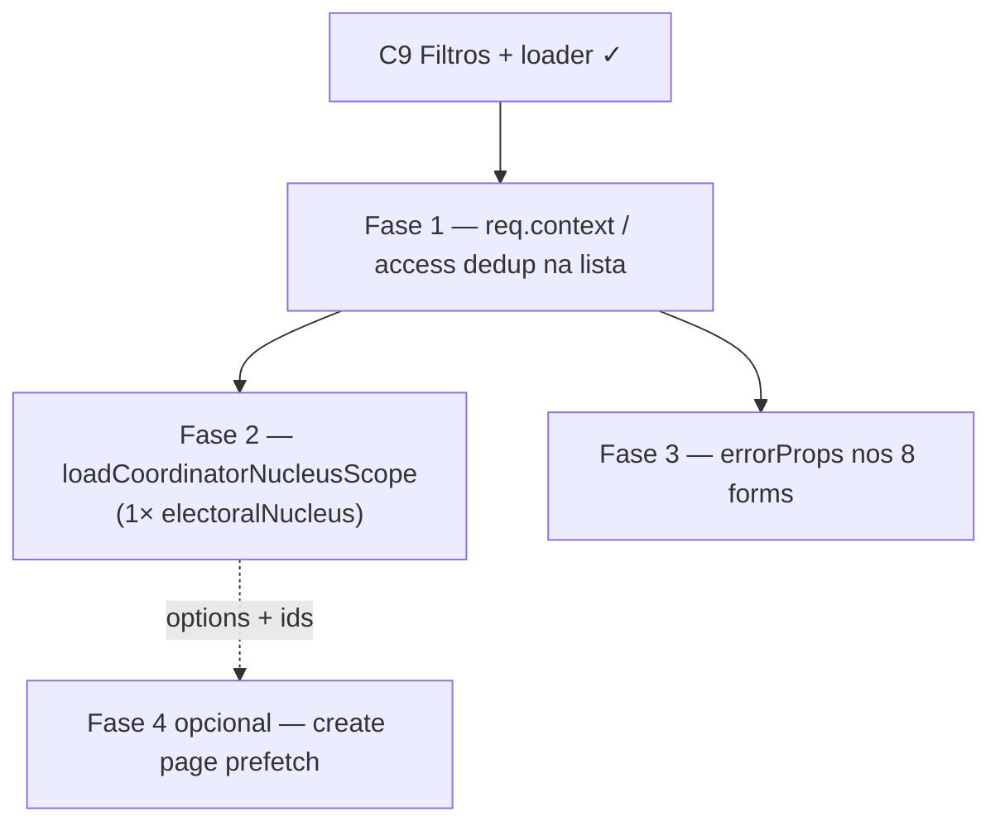

# Escala e DRY pós-C9 (apoiadores / access / forms)

Status: registrado no roadmap (fases pendentes)
Atualizado em: 2026-07-19
Item do roadmap: [docs/roadmap.md](../roadmap.md) (Trilha C, item C10)
Responsável: —

## Contexto

O C9 ([escala-dry-pos-c8.md](escala-dry-pos-c8.md)) entregou filtro unificado Payload↔SQL (`supporterListFilters.ts`), `contactSearchQuery` no aggregate/lista, `loadSupportersPageData` com prefetch de `getCoordinatorNucleusIds`, `apoiadores/[id]/formActions` no mapper compartilhado e `fieldError` nos componentes de form restantes. Uma passagem `/simplify` (2026-07-19) aplicou limpezas pontuais: `normalizeContactSearchQuery` nos termos de busca, paralelismo no loader, spy de teste corrigido, KPI aggregate isolado por `searchTag`, `aria-describedby` com `hasError` no `LeadershipPrimaryContactAction`.

Os revisores (quality / reuse / performance) marcaram como **importantes e maiores que cleanup** os follow-ups abaixo. Sem registro, o coordenador continua pagando lookups redundantes por navegação em `/campanha/apoiadores` e o DRY de acessibilidade nos forms grandes fica pela metade.

1. **Lista de apoiadores ainda re-dispara access do coordenador.** `loadSupportersPageData` prefetcha `getCoordinatorNucleusIds` para overview e options, mas `loadSupporterListPageData` chama `payload.find` com `overrideAccess: false` → `canReadSupporter` → `getAccessibleNucleusIds` → **segunda** chamada a `getCoordinatorNucleusIds` na mesma renderização (sem `req` compartilhado / contexto pré-populado).
2. **Dois round-trips de `electoralNucleus` para o coordenador.** `getCoordinatorNucleusIds` seleciona só `{ id: true }`; em seguida `loadAccessibleNucleusOptions` faz outro `find` com `name`/`slug` no mesmo conjunto de IDs — poderia ser uma query com `select: { id, name, slug }`.
3. **`errorProps` não migrado nos forms grandes.** C9 adotou `fieldError` + alias local `errorFor`, mas `NucleusForm`, `ActionPlanForm`, `NucleusTerritoryFields`, `NucleusTerritoryAndZonesFields`, `VoteEstimateDialog`, `ActionPlanUpdateForm`, `LeadershipPrimaryContactAction` e `NucleusIntelligenceDialog` ainda repetem manualmente `aria-invalid` / `aria-describedby` em vez de `errorProps` de `campaignFormFields.ts` (precedente: `CampaignInviteForm` / `NucleusUpdateForm` no C8).
4. **Prefetch de escopo não estende à página de criação.** `loadSupporterCreatePageData` ainda pode repetir o mesmo padrão de access/options sem o escopo pré-resolvido do coordenador.

**Explicitamente fora (revisores pediram skip no simplify / decisão C9):** remover o alias `errorFor` (reduz repetição em forms grandes); AST neutro único Payload↔SQL (adaptadores paralelos são o desenho do C9); waterfall lista→overview (precisa de `totalDocs` da lista); unificar lista+aggregate numa query SQL (só se latency reclamar); retirar `coordinatorNucleusIds` do retorno da página (útil para testes int); hoist de `toMessageOnlyState` para `campaignFormActionError.ts` (só quando houver segundo consumidor).

## Objetivos

- Navegação em `/campanha/apoiadores` como `coordenador` resolve escopo de núcleos **uma vez** por request — lista, overview e options compartilham o mesmo prefetch (via `req.context` ou constraint injetado), sem segunda ida a `getCoordinatorNucleusIds`.
- Opções de núcleo do coordenador saem de **uma** query `electoralNucleus` com `id`+`name`+`slug`.
- Forms grandes da campanha usam `errorProps` para wiring de `aria-*` consistente com `CampaignInviteForm`.
- Guardrails: sem novo `Consent`; sem migration; `overrideAccess: false` com `user` nas leituras de apoiador; não alterar semântica de filtros (`supporterListFilters`).

## Decisões travadas

- **Um item C10, três fases ordenadas.** Mesmo racional de A7/B5/C8/C9: um ID de roadmap, PRs por fase. Ordem: dedup de access na lista (ganho real por page view) → query única de núcleos (I/O) → `errorProps` nos forms (mecânico, UI).
- **Dependência dura de C9.** Só faz sentido com filtro unificado e `loadSupportersPageData` já no código; não reabre AST de filtros nem mapper do detalhe.
- **Fase 1 prefere `req.context` ao bypass de access.** `getAccessibleNucleusIds` já cacheia por `req` (`ACCESSIBLE_NUCLEUS_IDS_CONTEXT_KEY`); pré-popular o contexto no loader Local API é menos invasivo que `overrideAccess: true` na lista ou duplicar constraint de `canReadSupporter`.
- **Manter alias `errorFor`.** O `/simplify` concluiu que o wrapper local reduz ruído nos forms grandes; Fase 3 migra para `errorProps(fieldErrors, name, idPrefix)` **dentro** do `errorFor`, não remove o alias.
- **Cortável** se a base nominal permanecer pequena e poucos coordenadores usarem `/apoiadores` diariamente. Fase 3 é a mais cortável (só a11y/DRY); Fase 1 evita drift de perf sob carga.
- **i18n e naming** (AGENTS.md): identificadores em inglês (`loadCoordinatorNucleusScope`, `prefillAccessibleNucleusContext`), strings visíveis em pt-BR inalteradas.

## Questões em aberto

- **Fase 1: `getPayload` com `req` sintético vs `payload.find({ req })` do loader?** **Recomendação:** construir `req` mínimo reutilizável no `loadSupportersPageData` (com `user`, `payload`, `context` pré-preenchido) e passá-lo às três leituras (`list`, `overview` aggregate já bypassa access; `options` pode continuar `overrideAccess: true` com IDs pré-resolvidos). Teste int asserta contagem de `getCoordinatorNucleusIds` = 1 **e** de `getAccessibleNucleusIds` sem cache miss na lista.
- **Fase 2: generalizar `getCoordinatorNucleusIds` ou helper novo?** **Recomendação:** novo `loadCoordinatorNucleusScope(payload, coordinatorID, req?)` retornando `SupporterNucleusOption[]`; `getCoordinatorNucleusIds` permanece fino (`ids` derivados do scope) para não quebrar aggregate/access existentes.
- **Fase 3: prefixo de `id` por form?** **Recomendação:** um `idPrefix` estável por componente (`nucleus-form`, `action-plan-form`, …) espelhando o padrão do `CampaignInviteForm`; não unificar prefixos entre forms distintos na mesma página.

## Abordagem proposta

### Fase 1 — Dedup de access na lista de apoiadores

- Em `src/utilities/supporterPageData.ts`: ao montar `loadSupportersPageData`, após resolver `coordinatorNucleusIds`, pré-popular `req.context` com a chave usada por `getAccessibleNucleusIds` **ou** extrair helper `prefillAccessibleNucleusContext(req, user, ids)`.
- Passar esse `req` a `loadSupporterListPageData` → `payload.find({ ..., req, overrideAccess: false })`.
- Garantir que `canReadSupporter` / `getAccessibleNucleusIds` leem o cache e não chamam `getCoordinatorNucleusIds` de novo.
- Teste int: expandir o spy existente em `campaignSupporter.int.spec.ts` para cobrir também a lista (`payload.find` path), não só o loader agregado.

### Fase 2 — Query única de núcleos do coordenador

- Novo helper em `src/utilities/supporterPageData.ts` ou `campaignAccess.ts`: `loadCoordinatorNucleusScope` com `where: { coordinators: { contains } }`, `status: ativo`, `select: { id, name, slug }`.
- `loadSupportersPageData` usa o scope para `nucleusOptions` e deriva `coordinatorNucleusIds` via `.map(n => n.id)`.
- `getCoordinatorNucleusIds` pode delegar ao scope (só IDs) para manter uma fonte de query.
- Remover o segundo `find` de `loadAccessibleNucleusOptions` quando `coordinatorNucleusIds` vier do scope completo.

### Fase 3 — `errorProps` nos forms grandes

- Migrar os 8 componentes listados no Contexto: substituir pares manuais `errorFor` + `aria-*` por desestruturação de `errorProps(fieldErrors, field, idPrefix)`.
- Manter `const errorFor = (name) => fieldError(...)` onde simplificar `error` no JSX; ou `const field = (name) => errorProps(fieldErrors, name, idPrefix)` se reduzir linhas.
- Sem mudança de copy nem de contrato `formActions`.

### Fase 4 (opcional) — Prefetch na criação de apoiador

- `loadSupporterCreatePageData` reutiliza `loadCoordinatorNucleusScope` / context prefill do coordenador.
- Só entra se a Fase 1–2 já estiverem estáveis; pode ser cortada.

**Migration:** nenhuma. Sem collection, sem Consent, sem server action nova.

## Dependências

- **Dura:** C9 Escala e DRY pós-C8 — implementado (`supporterListFilters`, `loadSupportersPageData`, forms C9).
- **Suave:** C8 `getCoordinatorNucleusIds` + context cache em `getAccessibleNucleusIds` — já no código.
- Reuso: `src/utilities/campaignAccess.ts`, `src/utilities/supporterPageData.ts`, `src/utilities/campaignFormFields.ts` (`errorProps`), `src/app/(campaign)/campanha/(app)/apoiadores/page.tsx`.

## Não escopo

- AST neutro único para filtros Payload↔SQL — decisão fechada no C9; mudanças futuras continuam em `supporterListFilters.ts`.
- Unificar lista + overview KPI numa query — [escala-dry-pos-c8.md](escala-dry-pos-c8.md) / C8 explicitamente fora; reavaliar só com evidência de latency.
- Remover waterfall lista→overview — tradeoff intencional (`totalDocs` antes do aggregate).
- Migrar `formActions` restantes fora da vertical de apoiadores — coberto por C7/C8; não repetir aqui.
- Hoist de `toMessageOnlyState` — fill-in quando surgir segundo consumidor message-only.

## Referências

- `docs/roadmap.md` — Trilha C, item C10; sequência Janela 2
- [escala-dry-pos-c8.md](escala-dry-pos-c8.md) — C9 entregue; simplify 2026-07-19
- [escala-dry-pos-c6.md](escala-dry-pos-c6.md) — precedente C8→C9
- `src/utilities/supporterPageData.ts` — `loadSupportersPageData`, `loadAccessibleNucleusOptions`
- `src/utilities/campaignAccess.ts` — `getCoordinatorNucleusIds`, `getAccessibleNucleusIds`, context cache
- `src/collections/Supporter.ts` — `read: canReadSupporter`
- `src/utilities/campaignFormFields.ts` — `fieldError`, `errorProps`
- `tests/int/campaignSupporter.int.spec.ts` — spy de lookup único
- AGENTS.md — `overrideAccess: false`, naming inglês, campaign auth

## Simplify (2026-07-19)

Passagem `/simplify` sobre o diff do C9 aplicou limpezas pontuais sem mudar comportamento (ver Contexto). Débitos maiores registrados neste plano como item **C10** do roadmap.
