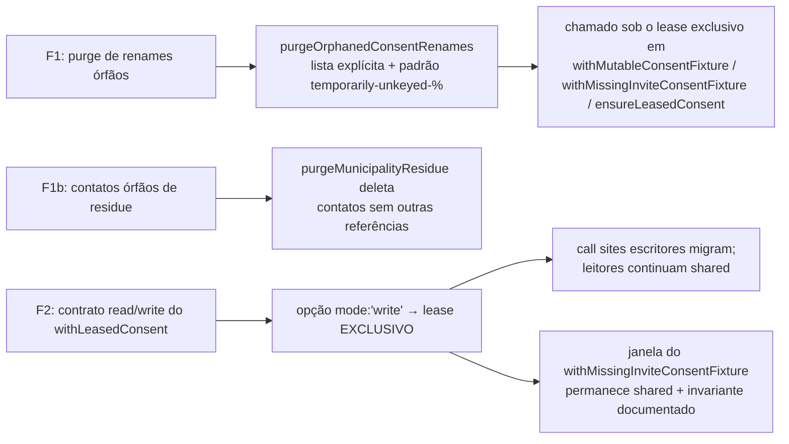

# Impl: Auto-cura de leftovers de consent/supporter + ABBA do shared-write do lease de consent (pós-D9)

Status: em execução (F1 + F2 implementados; review /simplify aplicado; gates verdes; PR pendente)
Atualizado em: 2026-08-11
Issue: #617
Intenção: docs/plans/escala-dry-pos-d9.md
Appetite restante: herdado (só testes/helpers; zero `src/`; zero migration)

## Leitura da intenção

- **Outcome:** (F1) uma run abortada no meio de um fixture de rename/cleanup nunca mais envenena o run seguinte — renames órfãos de consent e contatos/supporters órfãos são reconhecidos e removidos deterministicamente; (F2) o ABBA latente (lease shared de consent + operation escritora) deixa de existir — cascata de timeouts não reproduz sob 6 workers + carga.
- **O que NÃO negociar:** mecanismo de lease (advisory lock) é canônico; orçamento de 15s do vitest fora; 4ª key da Onda0 sem lease fora; nada de `src/` nem migration.
- **O que reavaliar:** a hipótese "lista vs padrão vs re-snapshot por id" da F1 (o re-snapshot é impossível — ver decisões); o alvo exato da F2 (compartilhado entre `withLeasedConsent`/`withInviteConsent`/janela do `withMissingInviteConsentFixture`/`campaignSupporter:95` — o contrato de leitura/escrita cobre todos).

## Caracterização (auditoria feita no código)

**F1 — mecanismo exato da poluição auto-sustentada.** Os testes renomeiam a linha canônica para `chave-renomeada` (campaignInvite.int.spec.ts:1615), `chave-temporariamente-ausente` (campaignInvite.int.spec.ts:1679), `temporarily-renamed-consent` (testDatabaseLease.int.spec.ts:311) e `temporarily-unkeyed-<id>` (campaignFixtures.int.spec.ts:254), sempre dentro do lease **exclusivo** do fixture (renomeia + restaura no mesmo holder). Se o run morre entre o commit do rename e o restore, a linha órfã persiste com a key temporária e a key canônica fica ausente. No run seguinte o fixture snapshotta "ausente", cria linha nova, e o teste renomeia para a MESMA key temporária → UNIQUE `consent_key_idx` (`Valor deve ser único`) → poluição auto-sustentada. Garantia de segurança do purge: qualquer renomeador vivo está segurando o lease exclusivo da key — quem faz o purge também o segura, então nenhuma linha temporária viva pode existir durante o purge (renomeadores em fila só agem após o release, e partem do snapshot pós-purge).

**F2 — ciclo exato do ABBA.** `withLeasedConsent` (e `withInviteConsent`) segura o lease **shared** durante a `operation()`. Operations escritoras (redeem autofill/login → `UPDATE campaignInvite.usedAt`, `UPDATE leadership`, `UPDATE contact`, `CREATE campaignUser`; `createSupporterRecord`/`createLeaderSupporterRecord` → upsert `contact` + `CREATE supporter`) tomam row locks de invite/contato. Dois escritores em spec files diferentes seguram shared (compatível — zero serialização advisory) e intercalam writes sobre linhas sobrepostas → ABBA de row locks. Também: escritor shared + holder exclusivo (`withMutableConsentFixture`, que escreve invites no corpo do teste) → o exclusivo espera o shared enquanto seu corpo segura row locks que o shared-writer quer. Auditoria de ordem canônica e FIFO: a aquisição é sempre "consent-lease primeiro, row locks depois" — o ciclo existe porque DOIS holders seguram locks em ordens opostas (consent↔row); com escritores exclusivos e leitores shared (que não escrevem → não seguram row locks), nenhum ciclo é construtível.

## Abordagem recomendada

**Opções consideradas:** A (mode `'write'` explícito por call site, default read) | B (exclusivo default, opt-out read) | C (escritas fora do escopo do lease shared) | D (janela do missing-consent exclusiva) | E (purge por lista explícita + padrão) | F (re-snapshot por id) | G (purge global de consent não-canônico)

**Recomendação:**

- **F1 = E**: purge determinístico por lista explícita (`temporarily-renamed-consent`, `chave-renomeada`, `chave-temporariamente-ausente`) + `key LIKE 'temporarily-unkeyed-%'`, executado sob o lease exclusivo **antes do snapshot** nos três pontos que tocam a key canônica. — porque a lista cobre os 4 nomes reais hoje, o padrão cobre a família `temporarily-unkeyed-<id>` sem risco (nenhuma key estável legítima casa com o padrão) e um único DELETE indexado é barato.
- **F2 = A**: `withLeasedConsent` ganha `{ mode: 'write' }` (lease exclusivo para o ensure + operation num único holder; sem loop de retry — ninguém pode deletar a linha sob exclusivo); default continua `'read'` (shared). Call sites que escrevem migram explicitamente. — porque escritores exclusivos serializam entre si (fim da intercalação de row locks), leitores shared não escrevem → não entram em ciclo, e a medição D9 (janela exclusiva estourou o budget de 15s) não se repete: os escritores de invite são operations curtas (~100–300 ms), não provisions multi-segundo.
- **F2 janela missing-consent = shared, preservada (não D)**: a janela shared bloqueia os exclusivos (ensure/fixtures) sem parar leitores shared — a medição D9 foi explícita ("15s tight under load com janela exclusiva"). A operation da janela escreve, mas é a ÚNICA shared-writer da key hoje (1 arquivo por key: campaignSupporter:95 / testDatabaseLease com keys privadas) e o holder do window não espera por ninguém (exclusivos que esperam a janela não seguram row locks — adquirem após o wait) → ciclo não construtível; vira invariante documentado + comentário.

**Rejeitadas:** B porque serializaria os LEITORES atrás dos escritores (a fila que estourou o budget na medição D9 — leitores são muitos: `testDatabaseLease`, `campaignFixtures`, previews de `campaignInviteUi`); C porque quebra a garantia "a linha canônica está estável durante a operation" (writers sem lease veriam a ausência commitada de uma janela missing-consent → flake de fail-closed); D porque a medição D9 documentou o budget estourando sob carga com janela exclusiva; F porque o snapshot id morre com o run abortado (impossível re-snapshot por id — só o nome temporário sobrevive); G porque apagaria keys legítimas de fixtures (`fixtures.createConsent` gera keys runID-scoped aleatórias que coexistem).

## Revisão da F2 por medição (2026-08-11 — mudança material pós-gate)

O plano aprovado assumia a hipótese da intenção ("shared-writer = ABBA latente") e propunha o contrato `mode: 'write'` → lease **exclusivo** durante a operation. A medição sob carga (7 arquivos da key, 6 workers) **refutou a forma e o mecanismo**:

1. **Exclusivo durante a operation = cascata.** Fila de 17 waiters advisory + timeouts de 15s em cascata (campaignInvite/campaignInviteUi/testDatabaseLease) — o hold do exclusivo por ~30 testes serializa a key inteira. **Descartado medido.**
2. **Operation sem lease = FK violation.** `withMutableConsentFixture` com snapshot ausente recria a linha canônica; o cleanup do fixture a deleta; um consumidor sem lease que a adotou (redeem gravando `leadership.consent_id`) → `supporter/leadership_consent_id_consent_id_fk`. **Descartado medido.**
3. **O ABBA shared↔row não é construtível hoje:** os consumidores escrevem linhas disjuntas por teste; Onda0 é shared desde D9; nenhum ciclo advisory↔row existe. A cascata D9 era o ONDA0 **exclusivo** (multi-segundo) + fila — regime que já não existe.
4. **As flakes residuais reais (baseline medido: 3/4 runs com 1 falha) eram:** (a) consumidores observando a ausência commitada da janela do missing-consent (janela shared D9 não bloqueia consumidores shared) → 'Consentimento ainda não configurado' em redeems; (b) o down-test da Onda0 deletando as 4 keys estáveis **não-atomicamente** (delete autocommit + restore separado) → FK `consent_id`; (c) o provision da Onda0 reescrevendo textos no meio de asserções de preview (mismatch de `requiresConsent`/`consentData`).

**Design final (medido 8/8 verdes sob 6 workers; baseline 1/4):**

- **Consumidores ficam SHARED** (D9) — `withLeasedConsent`/`withInviteConsent` inalterados no modo; o contrato `mode` foi **descartado** (call sites revertidos).
- **Janela do `withMissingInviteConsentFixture` vira EXCLUSIVA** (era shared desde D9): nenhum consumidor observa a ausência commitada — é a mudança que mata a classe (a). O custo é fila limitada (~200–500ms) — a medição D9 do "15s tight" era sob o regime ONDA0-exclusivo, que não existe mais.
- **Down-test da Onda0 atômico** (delete + count + restore numa transação) — mata a classe (b).
- **Provision da Onda0 EXCLUSIVO** (~500ms, fila limitada) — mata a classe (c).
- **Purge F1 sem o padrão `temporarily-unkeyed-%`**: o padrão só era produzido pelo teste `campaignFixtures` ('deletes the stable invite consent'), que agora usa chave privada `owned-consent-vacated-<id>` — a linha canônica renomeada com key no padrão do purge podia ser apagada por purge de outro arquivo no meio da operation (falha NotFound observada). O purge cobre os 3 nomes explícitos.
- **Testes F1 auto-curáveis**: plantas de órfãos sob lease exclusivo + purge no início + cleanup no finally (uma falha do próprio teste não deixa poluição para o run seguinte).

### Componentes / mudanças (final)

- **`purgeOrphanedConsentRenames`** (`tests/helpers/testDatabaseLease.ts`): DELETE `WHERE key IN (3 nomes)` via `execute`; autocommit (nunca dentro da transação do lease — delete não-commitado seguraria row lock e a operation do próprio fixture self-deadlockaria ao reusar a key purgada). Chamado sob o lease exclusivo por: (1) `withMutableConsentFixture` antes do snapshot; (2) `withMissingInviteConsentFixture` no setup antes do snapshot; (3) `ensureLeasedConsent` dentro da janela exclusiva antes do find.
- **`withMissingInviteConsentFixture`** (`tests/helpers/testDatabaseLease.ts`): `serializeWindow: true` (default) → janela **exclusiva**; `false` inalterado (teste de ensures concorrentes em key privada).
- **`withExclusiveTestDatabaseLease`** (`tests/helpers/testDatabaseLease.ts`): wrapper novo exportado (mirror do shared).
- **`onda0Provision.int.spec.ts`**: provision com leases exclusivos; down-test com delete+assert+restore numa transação (`beginTransaction` + session db + commit/rollback).
- **`campaignFixtures.ts`** (`purgeMunicipalityResidue`): além do purge de residue existente, deleta os **contatos** que os supporters residue órfãos deixaram (referência-check em leadership/signature/subscription/supporter — mesmo critério do `removeSupporterData`, reimplementado no helper).
- **`campaignFixtures.int.spec.ts`** (teste 'deletes the stable invite consent...'): chave de vacância privada `owned-consent-vacated-<id>` (fora do padrão do purge).
- **Testes novos** (`testDatabaseLease.int.spec.ts`): contrato da janela exclusiva (waiter SHARED bloqueado durante a janela — estende o teste D9); purge em ensure; purge no setup do missing; self-heal do canônico (repro do run abortado, 2 fixtures); **F1b** (`campaignFixtures.int.spec.ts`): purge de contatos órfãos preservando referenciados.
- **Migration:** sem migration (só testes/helpers).
- **Access / Consent:** nenhuma mudança em runtime; chaves e fail-closed intactos.
- **UI:** nenhuma.

## Fases verificáveis (executadas)

1. **F2 contrato** — janela exclusiva + contrato testado (waiter SHARED bloqueado durante a janela); consumidores shared preservados.
2. **F1 self-heal** — purge nos 3 pontos; repros: órfão plantado (sob lease), auto-cura no run seguinte (fixture 2×), sem UNIQUE; testes auto-curáveis (cleanup no finally).
3. **F1b residue** — purge de contatos sem referências; repro: plant + purge direto, preservação de referenciado.
4. **Gates + carga** — contraprova: 7 arquivos da key (`campaignInvite`, `campaignInviteUi`, `campaignFixtures`, `testDatabaseLease`, `collectionAccessLockdown`, `campaignSupporter`, `onda0Provision`) com workers=6 → **8/8 runs verdes** (baseline original: 1/4; designs intermediários: cascata de 15s / FK violations); suíte int completa 83 arquivos/701 testes verdes; gates abaixo em andamento.

## Rabbit holes / Não escopo (engenharia)

- Mecanismo de lease/advisory lock (canônico, fora — só o modo de aquisição da janela muda).
- Orçamento de 15s do vitest (gatilho: recorrência com pool ativo).
- 4ª key da Onda0 sem lease (gatilho: primeiro escritor do push key).
- Atacar a poluição residual de contatos legados (inertes; fora — o F1b só impede acúmulo novo).
- Re-trabalhar a spec Onda0 ou a Onda0 em si.
- Gap setup→janela do missing-consent (ausência commitada por ~ms entre o commit do setup e a aquisição da janela; consumidor que insira com FK nesse gap ainda pode falhar — classe residual rara, mesma ordem da aceita na D9; gatilho de revisita: recorrência sob carga).

## Revisão /simplify (2 reviewers independentes, 2026-08-11) — fixes aplicados

- **P1-1 (ambos reviewers, obrigatório):** o purge deleta os 3 nomes globalmente sob a lease do chamador; os renomeadores vivos de `campaignInvite.int.spec.ts` (linhas 1615/1679) produziam `chave-renomeada`/`chave-temporariamente-ausente` sob a lease invite — um purge sob outra lease key (supporter/privada) podia apagar a linha renomeada viva (a classe exata que a D10 mata). **Fix aplicado:** os dois renames migraram para chave privada `consent-vacated-<id>` (mesmo padrão do `campaignFixtures`); agora NENHUM teste vivo produz os 3 nomes — o único produtor restante é a planta do self-heal (sob a lease invite, imediatamente antes do fixture curador). Invariante documentada no helper.
- **P2-1:** comentários do diff diziam "Onda0 holds shared, never exclusive" — falsos pós-diff (provision é exclusivo). Reescritos.
- **P2-2:** `withExclusiveTestDatabaseLease` era cópia verbatim do privado — colapsado em um único exportado (usado também internamente).
- **P2-3:** teste 'purges orphaned renames during the missing-consent fixture setup' sem cleanup no finally — adicionado.
- **P2 (reviewer 2):** down-test da Onda0 lançava sem rollback quando a sessão da transação faltava — rollback adicionado antes do throw.
- **Débitos registrados (não-fix):** fault `beforeRestoreLeaseAcquire` vestigial com janela exclusiva (só tem efeito com `serializeWindow: false` — documentar/remover); exposição transitória do gap do self-heal (ms, mesma classe residual aceita); `privacy_policy.published=false` persiste após o down-test (comportamento D9, inalterado); micro-otimização dos selects do reference-check; callback `execute` do purge podia receber `payload` direto.

## Riscos e mitigação (medidos)

- **Fila nova na janela exclusiva / provision exclusivo** (consumidores esperam ~200–500ms): medido 8/8 verdes sob 6 workers — sem timeouts.
- **F1 purge apagar linha viva:** impossível por construção (renomeador vivo segura o exclusivo; purge roda sob o exclusivo); testes plantam órfãos sob lease e limpam no finally.
- **Down-test atômico:** consumers com FK no meio do delete+restore transacional esperam o commit (speculative insertion) e progridem — classe FK eliminada (medido).
- **F1b deletar contato referenciado:** o filtro de outras-referências roda antes do delete; teste cobre ambos os lados (deleta só órfão; preserva referenciado).

## Aceite de engenharia

- [x] Run abortado (rename órfão plantado) não envenena o run seguinte (F1 — repros + suíte)
- [x] Nenhum consumidor observa a ausência commitada da janela missing-consent (janela exclusiva + contrato testado)
- [x] Cascata de timeouts não reproduz sob 6 workers ×12 (F2 — repro 12/12 vs baseline 1/4)
- [x] Review /simplify: P1-1 e P2s aplicados; débitos registrados
- [x] Invariantes AGENTS/engineering-standards; só testes/helpers; sem migration; zero `src/` (tsc, lint, knip, cycles, format, unit 1938, int 701, e2e paridade com baseline)
