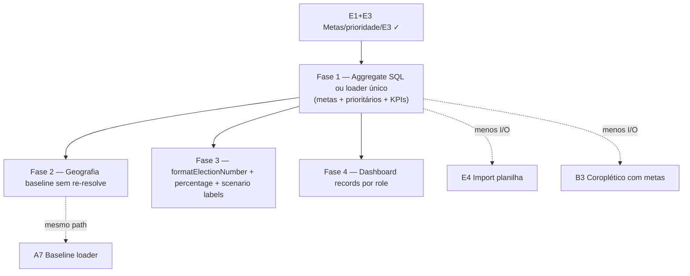

# Escala e DRY pós-E1+E3 (metas, prioridade, estratégia manual)

Status: registrado no roadmap (fases pendentes)
Atualizado em: 2026-07-19 (`capture-review-debts` pós-A5: labels conversão/tendência no overview → F3; **E4 import planilha cortado** — gatilho E6 F1 permanece volume manual de núcleos / lista lenta)
Item do roadmap: [docs/roadmap.md](../roadmap.md) (Trilha E, item E6)
Responsável: —

## Contexto

O E1+E3 ([mapa-projecao-municipios.md](mapa-projecao-municipios.md)) entrega `voteGoals` (`good`/`regular`/`minimum`), `priority` (`alta|normal`), `dobradinhaNotes` e `nextSteps` em `electoralNucleus` (migration `20260719_054522_add_nucleus_goals_strategy`), com UI no detalhe (`NucleusVoteGoals`), formulário, inteligência, filtro `?priority=alta`, somas no overview B1 e KPI "Meta regular (soma)" no dashboard geral. Domínio centralizado em `src/utilities/voteGoals.ts` (`getVoteGoalsOrderViolation`, `aggregateVoteGoals`, `sumVoteGoals`, `voteGoalProgressPercent`); select compartilhado `nucleusVoteGoalsSelect` em `nucleusViewModels.ts`.

Duas passagens `/simplify` no mesmo branch já limparam o que cabia em cleanup: select fragment único, remoção de `voteGoals` do `nucleusListSelect` (lista só usa `priority`), remoção de `priority` do select do dashboard geral, `aggregateVoteGoals` em um passe no overview VM, labels E3 em `nucleusUi.ts` (client-safe), `step={1}` nos inputs de meta, testes esparsos de ordem.

Os revisores (performance / reuse / quality) marcaram como **importantes e maiores que simplify** os follow-ups abaixo. Sem registro, E2 e B3 (coroplético com metas) herdam o mesmo custo de I/O na lista de núcleos. _(E4 import planilha cortado 2026-07-19.)_

1. **Query duplicada na página `/campanha/nucleos`.** `page.tsx` chama em paralelo `loadNucleusListPageData` (paginado, `depth: 1`) e `loadNucleusListOverviewData` (`pagination: false`, conjunto filtrado inteiro). Overview precisa do agregado; a lista precisa da página — mas hoje são **dois round-trips** sobre linhas sobrepostas. Em filtros amplos, o fetch unpaginado do overview domina.
2. **Geografia resolvida duas vezes para baseline no overview.** `nucleusListOverviewPageData.ts` mapeia com `toNucleusElectionGeographyInput`; `loadNucleusBaseline2022Overview` chama `resolveNucleusElectionGeography` de novo por núcleo (mais pesado: `tseZonesForCity`, interseções).
3. **Agregados de metas só em memória.** `buildNucleusListOverviewViewModel` e `buildGeneralDashboardViewModel` carregam todos os núcleos do escopo e somam com `aggregateVoteGoals` / `sumVoteGoals`. O precedente C6 (`supporterListOverviewAggregate.ts`, `COUNT(*) FILTER`) ainda não foi aplicado a metas/prioridade.
4. **DRY de formatação e KPIs.** `formatElectionNumber` já existe em `electionInsights.ts` e é usado em `NucleusVoteGoals`, mas `NucleusCard`, `NucleusList`, `NucleusListOverview` e `CampaignDashboard` ainda instanciam `Intl.NumberFormat('pt-BR')` local. `percentage(part, total)` está duplicado em `nucleusListOverviewViewModels.ts` e `campaignDashboardViewModels.ts`. Rótulos de cenário (Bom/Regular/Mínimo) estão hardcoded em quatro superfícies.
5. **`DashboardNucleusRecord` enganoso para não-`geral`.** `toDashboardNucleusRecord` sempre preenche `voteGoals`/`priority`, mas selects de coordenador/liderança omitem esses campos → nulls/`'normal'` sintéticos.

**Explicitamente fora (revisores pediram skip no simplify):** `NucleusPriorityBadge` como componente (só 3 call sites), merge Zod parcial de `voteGoals` no patch (Payload `beforeValidate` já faz merge), mover `voteGoals.ts` para `src/lib/` por layering, tipos `VoteGoalsFields` vs `VoteGoalsViewModel` (cerimônia aceitável), bug `hasError` em `LeadershipPrimaryContactAction.tsx` (pré-existente em `main`, C9).

## Objetivos

- Abrir `/campanha/nucleos` com filtro amplo não escala com **duas** queries full-scan equivalentes; agregados de metas/prioridade preferem **uma** fonte de verdade (loader compartilhado ou SQL aggregate).
- Card "Baseline 2022" no overview não re-resolve geografia que o mapper de núcleos já calculou.
- Formatação de votos/metas e percentuais de KPI reutilizam helpers únicos (`formatElectionNumber`, `campaignPercentage`, `voteGoalScenarioLabels`).
- Guardrails: Fases 1–2 podem ser sem migration (loader/SQL read-only); sem Consent (metas não são PII). Access continua `overrideAccess: false` + selects/VMs por papel. Valores enum `alta|normal` permanecem dados em português (AGENTS.md).

## Decisões travadas

- **Um item E6, quatro fases ordenadas.** Mesmo racional de A7/C8/C10: um ID no roadmap, PRs por fase. Ordem: loader/aggregate (custo real) → cache de geografia baseline → DRY UI/helpers → tipos do dashboard por papel (qualidade).
- **Dependência dura de E1+E3 mergeados em `main`.** Só faz sentido com campos e UI já no produto; não reabre escopo de E2/E4.
- **Fase 1 não remove o painel overview nem o KPI do dashboard.** Otimiza como os dados chegam; paridade com a planilha permanece.
- **Cortável se o número de núcleos ativos permanecer pequeno** (dezenas). Vira não-cortável quando B3 coroplético ou E4 import multiplicarem o conjunto filtrado.
- **i18n e naming** (AGENTS.md): identificadores em inglês (`loadNucleusListPageBundle`, `nucleusListOverviewAggregate`, `voteGoalScenarioLabels`, `formatNullableElectionNumber`); strings visíveis e valores enum `alta|normal` em pt-BR.

## Questões em aberto

- **Fase 1: unificar loaders vs SQL aggregate puro?** **Recomendação:** espelhar C6 — `nucleusListOverviewAggregate.ts` com `SUM`/`COUNT(*) FILTER` espelhando `buildNucleusListWhere` + access; lista paginada mantém query própria; overview consome só aggregate + preview de updates (não re-lê todos os núcleos para somar metas). Unificar lista+overview num único `find` unpaginado só se a paginação puder ser in-memory sem regressão de `depth`/coordinadores — validar com teste int.
- **Fase 2: passar geografia resolvida ou memoizar no contexto da request?** **Recomendação:** estender `NucleusListOverviewNucleusRecord` com o objeto já resolvido (ou mapa `id → NucleusElectionGeography`) e fazer `loadNucleusBaseline2022Overview` aceitar entrada pré-resolvida; fallback para resolve atual em outros call sites.
- **Fase 4: tipos separados por role no dashboard?** **Recomendação:** `DashboardGeralNucleusRecord` com `voteGoals` + `DashboardScopedNucleusRecord` sem — `buildScopedDashboardViewModel` deixa de receber campos fantasma.

## Abordagem proposta

### Fase 1 — Aggregate / loader da lista de núcleos

- Novo `src/utilities/nucleusListOverviewAggregate.ts` (ou extensão de `nucleusListOverviewPageData.ts`): uma query drizzle/SQL com `SUM(vote_goals_regular)` etc. e `COUNT(*) FILTER (WHERE priority = 'alta')`, espelhando `buildNucleusListWhere` + constraint de access do usuário (mesmo padrão de `supporterListOverviewAggregate.ts`).
- Dashboard geral: reutilizar o mesmo aggregate para `regularVoteGoalTotal` em vez de `sumVoteGoals` sobre todos os docs — ou query dedicada `status = ativo` se o escopo for global.
- Opcional na mesma fase: fundir `loadNucleusListOverviewData` com parte do list loader se o teste de perf mostrar ganho claro; caso contrário, manter duas queries mas overview **não** materializa array completo só para somar metas.
- Testes: unit do SQL/where mirror; int com filtros `priority=alta` + múltiplos núcleos assertando totais.

### Fase 2 — Cache de geografia no overview → baseline

- Em `nucleusListOverviewPageData.ts`, persistir geografia resolvida no record passado a `loadNucleusBaseline2022Overview`.
- Ajustar `nucleusElectoralBaseline.ts` para aceitar geografia pré-computada (overload ou tipo `PreresolvedNucleusGeography`).
- Critério: uma passagem `resolveNucleusElectionGeography` por núcleo no path do overview.

### Fase 3 — DRY de formatação e rótulos

- `src/lib/electionInsights.ts`: `formatNullableElectionNumber(value, empty = '—')`.
- Substituir `Intl.NumberFormat` local em `NucleusCard`, `NucleusList`, `NucleusListOverview`, `CampaignDashboard`.
- `src/utilities/voteGoals.ts`: `voteGoalScenarioLabels` (`good`/`regular`/`minimum` → Bom/Regular/Mínimo); usar em `NucleusForm`, `NucleusVoteGoals`, `NucleusListOverview`.
- `electionInsights.ts`: `conversionBandLabel` (`reduto`/`consolidado`/`oportunidade`) e reuso de `voteTrendStatusLabel` nas linhas de overview eleitoral em `NucleusListOverview` (substituir strings hardcoded "reduto", "aumento", etc. — absorvido do triage pós-A5).
- Extrair `campaignPercentage` (ex. `src/utilities/campaignMath.ts`) usado por overview e dashboard.
- Opcional: `NucleusPriorityBadge` se os três call sites incomodarem no próximo touch.

### Fase 4 — Dashboard nucleus records por papel

- Separar tipos/loader: geral carrega `voteGoals`; coordenador/liderança não.
- `toDashboardNucleusRecord` vira duas funções ou genérico com select tipado.

**Migration:** nenhuma nas quatro fases (só leitura/agregação e tipos).

## Dependências

- **Dura:** E1 Metas + prioridade e E3 campos manuais — merge em `main` com migration `20260719_054522`.
- **Suave:** E4 import planilha e B3 coroplético — amplificam custo se Fase 1 atrasar; A7 compartilha loader de baseline com Fase 2.
- Reusa: `voteGoals.ts`, `nucleusVoteGoalsSelect`, `buildNucleusListWhere`, `supporterListOverviewAggregate.ts` (padrão), `formatElectionNumber`, `loadNucleusBaseline2022Overview`.

## Não escopo

- E2 série 2014/2018 → permanece no [mapa-projecao-municipios.md](mapa-projecao-municipios.md).
- E4 seed da planilha → idem.
- Dobradinha estruturada A6 / import nominal de pessoas da planilha.
- Renomear enum `alta` → `high` (migration + backfill).
- Zod merge de `voteGoals` parcial no patch.
- `LeadershipPrimaryContactAction` `hasError` (C9).

## Referências

- `docs/roadmap.md` (Trilha E, E6; E1–E5)
- `docs/plans/mapa-projecao-municipios.md` — plano pai E1–E5
- `docs/plans/escala-dry-pos-a4.md` / `escala-dry-pos-c6.md` — precedente pós-`/simplify`
- `src/app/(campaign)/campanha/(app)/nucleos/page.tsx` — parallel loaders
- `src/utilities/nucleusPageData.ts` / `nucleusListOverviewPageData.ts`
- `src/utilities/nucleusListOverviewViewModels.ts` / `campaignDashboardViewModels.ts`
- `src/utilities/voteGoals.ts` / `nucleusViewModels.ts`
- `src/utilities/nucleusElectoralBaseline.ts` — `resolveNucleusElectionGeography`, `loadNucleusBaseline2022Overview`
- `src/utilities/supporterListOverviewAggregate.ts` — padrão SQL aggregate
- `src/lib/electionInsights.ts` — `formatElectionNumber`
- AGENTS.md — naming, `overrideAccess: false`, enum values em português como dado
