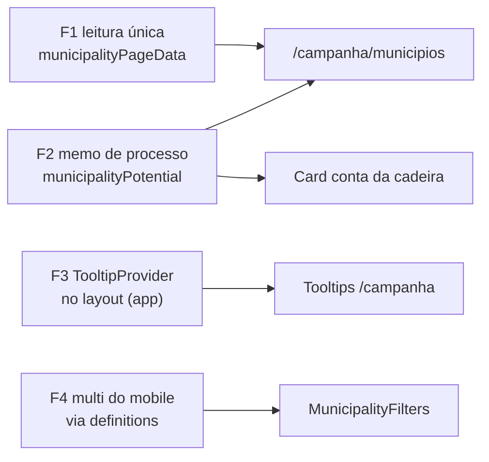

# Escala e DRY pós-E10 (classificação territorial relativa)

Status: rascunho
Atualizado em: 2026-07-25
Item do roadmap: [docs/roadmap.md](../roadmap.md) (Fill-ins abertos, **E10+**, fill-in de engenharia)
Impeccable: A — N/A (sem superfície UI nova; as quatro fases preservam o comportamento visível de E10)
Appetite: ~0,75–1 dia eng; quatro fases independentes, nenhuma com migration, collection ou `Consent`
Responsável: —

## Dados → decisão → apresentação

- **Vou apresentar dados?** Não (N/A) — o lote é custo de leitura/render de métricas já entregues (A11, E8, E9, E10); nenhuma métrica, série ou escala nova.
- **Anti-goals de dado:** N/A.

## Contexto

**E10** ([classificacao-territorial-relativa.md](classificacao-territorial-relativa.md), entregue 2026-07-25) classificou os 435 municípios em Reduto/Expansão/Manutenção/Marginal/Sem base sobre o artefato TSE commitado, com coluna+sort+filtro na lista, badge no card do E8 e na capa do dossiê, mais o seam genérico `cellTooltip` na `CampaignTable`. O `/simplify` da entrega (três revisores em paralelo — quality / performance / reuse, 2026-07-25) aplicou o cleanup barato na hora e deixou quatro achados **maiores que cleanup**, registrados aqui.

O achado mais importante não é novo: o A11 já havia registrado, em "Adiado com gatilho", a _hidratação única do sort derivado_ com o gatilho **"3º path derivado no loader"**. E10 é o **quarto** (`votos` A11, `deficit` e `frescor` E9, `classe` E10) — **o gatilho disparou**, e é por isso que este lote existe em vez de mais uma linha adiada.

**Já resolvido no simplify (não reabrir):** `campoVotes` (somado em todo rollup estadual, sem leitor) e `classification.fieldHeadroom` (duplicava o fator `field`) removidos; `formatTerritorialClassWhy` virou de fato a fonte única do `slice(0, 2)` **e** do fallback "sem série do TSE", eliminando o sentinela de string vazia (`why || TERRITORIAL_CLASS_NO_DATA`) nas duas superfícies de detalhe; a classe territorial virou um componente só com prop `layout: 'table' | 'card'`, como `VotePositionReadout`/`SignalAgeReadout` vizinhos; `parseExhaustiveEnumParam` em `campaignListUrl.ts` absorveu `trend` e `class` (o guard `includes` era morto — `allParamValues` já deduplica por `Set`); o bloco central passou a caminhar o `computeVoteRankByYear` memoizado do A11 em vez de reordenar os 435 slugs; o filtro de classe entrou no memo de `facetRows` (era aplicado 3× a arrays que costumam ser o mesmo objeto); `Intl.NumberFormat` hoisted; e dois comentários que **afirmavam o contrário do código** foram corrigidos (o de `CampaignCellTooltip` alegava que um elemento criado no servidor não sobreviveria ao clone de ref — `MunicipalityBaselineCard` o desmente desde o E8; e a regra do `sem_base`, que o `AGENTS.md` dava como "sempre travessão" enquanto card e dossiê entregam pílula).

## Objetivos

- Uma leitura da tabela `municipality` por request na lista de municípios, em vez de duas com o mesmo `where`.
- O que é puro sobre o artefato commitado é memoizado **por processo**, não recomputado por request.
- Um `TooltipProvider` por árvore `/campanha`, para o agrupamento de delay do Radix voltar a funcionar.
- Os quatro filtros multi do mobile saem da mesma definição de dado que os single-select vizinhos já usam.
- Guardrails: sem migration, sem collection, sem `Consent`, sem server action; contrato de URL da lista (`?sort=`/`?class=`/`?trend=`/…) e comportamento visível de E10/E9/A11 inalterados; `overrideAccess: false` preservado em toda leitura com `user`.

## Decisões travadas

- **F1 resolve o gatilho do A11 em vez de criar helper genérico de hidratação.** O A11 pediu "hidratação única do sort derivado"; o caminho barato é fazer `loadMunicipalityScope` aceitar docs já carregados quando `isPagedByPayload === false`, não desenhar uma camada de repositório. Fonte: `/simplify` E10 (2026-07-25) + gatilho do [ranking-votos-municipio.md](ranking-votos-municipio.md). **Rejeitado:** materializar a classe/deficit em coluna do Postgres (volta a ser schema e desfaz a pureza que é o ponto do E10); cache cross-request da lista (dado vivo de 2026 — proibido pela escada de cache do `engineering-standards.mdc`).
- **F2 separa o que é puro do que depende do banco.** `computeAllMunicipalityPotentials()` é puro sobre o artefato; só `deriveSuggestedGoalsByScenario` depende de `campaignGoals`. O memo de processo cobre o primeiro e o `cache()` de request continua cobrindo o segundo. **Rejeitado:** memoizar `computeStatewideSuggestedGoals` inteiro por processo (erraria na hora em que o CG editasse a meta estadual no admin).
- **F3 não muda o idioma de disclosure, só onde o Provider mora.** Hoist do `TooltipProvider` para o layout de `(app)`; `CampaignHoverTooltip` mantém estado controlado, o `onPointerUp` de toque e o dismiss por `pointerdown` conquistados no critique do E8 — nada disso vive no Provider. **Rejeitado:** trocar Tooltip por Popover nas células (muda o gesto em toda a lista; é decisão de produto do B22/B23, não deste lote).
- **i18n e naming** seguem o AGENTS.md: identificadores em inglês (`loadMunicipalityScopeFromDocs`, `municipalityPotentialBySlug`, `mobileMultiFilterDefinitions`), strings visíveis em pt-BR.

## Questões em aberto

- **F3 deve virar um `TooltipProvider` global ou um por superfície de lista?** **Opções:** (a) um no layout de `(app)`; (b) um por página de lista; (c) manter como está. **Recomendação:** (a) — é o padrão do Radix, e o `delayDuration={300}` atual já é uniforme em todos os call sites, então não há política por superfície a preservar.
- **F4 vale a pena com quatro cópias, ou espera a quinta?** **Opções:** (a) fazer agora; (b) adiar até B21/B33 trazerem outra lista com multi no mobile. **Recomendação:** (a) — os single-select do mesmo arquivo já saem de `municipalityFilterDefinitions` num `.map` (linha 220), então a assimetria é interna ao arquivo e barata de remover; não é abstração nova, é usar a que já existe.

## Abordagem proposta

Componentes:

- **`loadMunicipalityScope`** (`src/utilities/campaignMunicipalityScope.ts:77`): hoje sempre consulta. Ganha uma variante que recebe os docs já lidos (`municipalityListSelect` é **superset estrito** do select do escopo — `city`, `zoneNumber`, `lastUpdateAt`, `politicalTrend` a mais), mantendo o `cache()` por request e executando só a metade de `aggregatePledgesByMunicipality`. Consumido por `municipalityPageData.ts:342` quando `isPagedByPayload === false` (`:317`).
- **`computeAllMunicipalityPotentials`** (`src/utilities/municipalityPotential.ts:152`): passa a preencher um `Map<slug, MunicipalityPotential>` de módulo, no mesmo padrão de `statewideTotalsCache` (`bahiaElectionAggregates.ts:90`), `rankByYearCache` (`municipalityVoteRank.ts:18`) e `catalogContext` (`municipalityTerritorialClass.ts`). `computeStatewideSuggestedGoals` (`:296`) continua dentro do `cache()` de request porque lê `campaignGoals`.
- **`CampaignHoverTooltip`** (`src/components/campaign/shared/CampaignHoverTooltip.tsx:75`): remove o `<TooltipProvider delayDuration={300}>` interno; o provider passa a ser renderizado uma vez em `src/app/(campaign)/campanha/(app)/layout.tsx`. Hoje a lista monta ~30 (5 headers + 25 células de Classe via `CampaignCellTooltip`), e `skipDelayDuration` do Radix só agrupa dentro de um mesmo Provider.
- **`MunicipalityFilters`** (`src/components/campaign/municipality/MunicipalityFilters.tsx:203,261,279,297`): os quatro blocos `CampaignMobileMultiFilterField` (região, tendência, classe, assessor) viram um `.map` sobre as definitions multi, espelhando o `.map` dos single-select em `:220`. `municipalityFilterDefinitions` (`municipalityListFilters.ts:113`) já carrega `param`/`label`/`options`/`staffOnly`; o que falta é `selected` + `emptyLabel` por param.
- **Migration**: sem migration, sem collection, sem server action.

## Dependências

- Nenhuma dura de outro item aberto. F1 fecha o "Adiado com gatilho" de [ranking-votos-municipio.md](ranking-votos-municipio.md) e trata junto o full-scan de `expectedVotes`/`coverage` que o B15 documenta. F4 é suave com **B21**/**B33** (se a extração do head compartilhado chegar antes, herda a peça).
- Reusa: `campaignMunicipalityScope.ts`, `municipalityPageData.ts`, `municipalityPotential.ts`, `municipalityListFilters.ts`, `CampaignMobileMultiFilterField`, `CampaignHoverTooltip`, padrão de memo de `bahiaElectionAggregates.ts`.

## Não escopo

- **Seletor de colunas / filtros salvos** — **B17** / **B18**.
- **Tooltip por célula como feature de produto** (nomes de assessores, justificativa de tendência) — **B23**; este lote só move o Provider.
- **Coluna de rank, cenário na URL, símbolo proporcional** — A11 / "Cenário junto aos filtros" / **B13**.
- **`TerritoryListColumns` com formatador de percentual próprio** — descartado no triage: outra superfície, difere só no zero à direita, e unificar exige decisão de produto sobre a casa decimal.

## Rabbit holes

- **"Já que estou no loader, unifico todos os sorts derivados numa camada."** Se alguém "só completar": nasce um repositório de municípios e o `where` do Payload vira DSL própria. **Mitigação neste item:** F1 toca **um** branch (`isPagedByPayload === false`) e não muda assinatura pública de `loadMunicipalityScope`.
- **"Já que estou no Provider, revejo o disclosure do card."** Se alguém "só completar": cai no debate Tooltip×Popover que o critique do E8 deixou explicitamente adiado. **Mitigação:** F3 é hoist puro; qualquer mudança de gesto fica com o gatilho já registrado em [conta-da-cadeira.md](conta-da-cadeira.md).
- **"Memoizo tudo que é puro por processo."** Se alguém "só completar": memoiza algo que lê `campaignGoals`/pledges e a mesa vê número velho. **Mitigação:** F2 memoiza só o que não toca o banco; o teste do lote pina que editar `campaignGoals` muda a meta sugerida na hora.

## Adiado com gatilho

- **`TERRITORIAL_CLASSES` sem consumidor e as três derivações `Object.keys(...) as ...`.** Mover a tupla + tipos para módulo de contrato client-safe removeria o cast, mas `trend` usa o **mesmo** idioma no mesmo arquivo — corrigir só o novo deixa o arquivo menos consistente. Revisitar quando: 3º enum multi entrar na lista (o **B33** traz Partido em `/campanha/dobradinhas`), tratando trend+class+partido de uma vez.
- **`TerritorialClassRow` reimplementa o trigger do `GoalAccountMetric`.** Só o estilo do botão é duplicado — o comportamento de toque/dismiss vive no `CampaignHoverTooltip` compartilhado, então o risco de regressão assimétrica é menor do que parece. Revisitar sob o gatilho **já registrado** em [conta-da-cadeira.md](conta-da-cadeira.md): quando E9–E14 adicionarem uma 5ª métrica a essa `dl`/grid, decidir layout/idioma antes de replicar o componente de novo.
- **Três caches de módulo no classificador viram um só.** Legibilidade, não custo — o sort redundante já morreu no simplify. Revisitar quando **E15** recalibrar as âncoras (é quando alguém vai reler as três lifetimes de uma vez).

## Referências

- `docs/roadmap.md` (Fill-ins abertos — **E10+**)
- [classificacao-territorial-relativa.md](classificacao-territorial-relativa.md) — o pai do lote (E10 ✓)
- [ranking-votos-municipio.md](ranking-votos-municipio.md) — "Adiado com gatilho" que F1 fecha (3º path derivado)
- [conta-da-cadeira.md](conta-da-cadeira.md) — gatilho do disclosure do `GoalAccountMetric` (E8)
- `src/utilities/municipalityPageData.ts` (`:317` `isPagedByPayload`, `:319` `listQuery`, `:342` escopo) — F1
- `src/utilities/campaignMunicipalityScope.ts` (`:77`) — F1
- `src/utilities/municipalityPotential.ts` (`:152`, `:296`) — F2
- `src/components/campaign/shared/CampaignHoverTooltip.tsx` (`:75`) + `src/app/(campaign)/campanha/(app)/layout.tsx` — F3
- `src/components/campaign/municipality/MunicipalityFilters.tsx` (`:203`–`:313`) + `src/utilities/municipalityListFilters.ts` (`:113`) — F4
- AGENTS.md — `overrideAccess: false` com `user`, escada de cache (React `cache()` vs memo de processo vs artefato), gate por entrega
