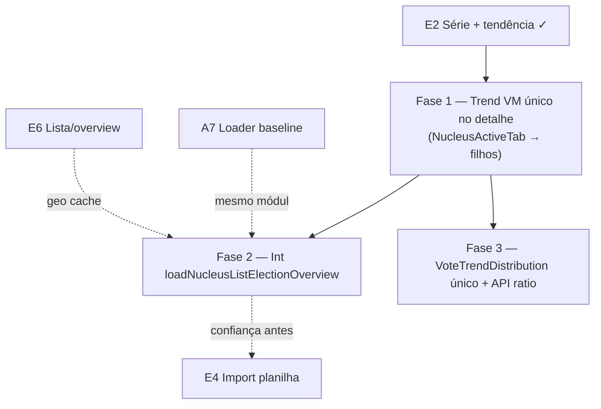

# Escala e DRY pós-E2 (série TSE 2014/2018 + tendência)

Status: registrado no roadmap (fases pendentes)
Atualizado em: 2026-07-19 (Fase 2 estendida pós-A5-1 / `capture-review-debts`)
Item do roadmap: [docs/roadmap.md](../roadmap.md) (Trilha E, item E7)
Responsável: —

## Contexto

O E2 ([mapa-projecao-municipios.md](mapa-projecao-municipios.md)) entrega seed `pnpm db:seed:tse -- --year=2014|2018|2022` (federal T1 BA nos anos históricos), `computeVoteTrend` ±10% (`increase|stable|decline|noBaseline`), série no card `NucleusElectoralBaseline`, alerta em `NucleusInsights` e card "Tendência histórica" no overview B1 — loader unificado `loadNucleusListElectionOverview` (gap + tendência numa query union) em `nucleusElectoralBaseline.ts`. O slice **A5-1 taxa de conversão** ([insight-taxa-conversao.md](insight-taxa-conversao.md), 2026-07-19) estende o mesmo loader com agregado `conversion` (`weightedRate` + `distribution` por faixa) e fetch condicional de `electionTally` — ver Fase 2.

Duas passagens `/simplify` no mesmo branch já limparam o que cabia em cleanup: `HISTORICAL_PRIOR_SERIES_YEARS`, `HISTORICAL_SERIES_YEARS`, `buildUnionGeography`, `aggregateVoteTrend` / `comparableTrendCount`, `formatVoteTrendSeries` / `formatVoteTrendSeriesCompact`, `voteTrendAlertVariant`, merge de labels, `FEDERAL_DEPUTY_OFFICE` no build, remoção de `seriesFromYearTotals` e alias `NucleusListOverviewBaseline2022`.

Os revisores (performance / reuse / quality) marcaram como **importantes e maiores que simplify** os follow-ups abaixo. Débitos que **já têm dono em outro item** ficam fora deste plano (ver Não escopo).

1. **Tendência calculada e exibida duas vezes na aba Visão geral do núcleo.** `NucleusActiveTab.tsx` renderiza `NucleusElectoralBaseline` e `NucleusInsights` em sequência; cada um chama `computeVoteTrend(baseline.series)` e ambos mostram a série 2014→2018→2022 (badge + mensagem no card; alerta + mensagem + série no insights). Duplicação de trabalho no cliente e de informação para o usuário.
2. **Sem testes de integração do loader combinado.** `loadNucleusListElectionOverview` substitui loaders separados de gap e tendência; só há cobertura unitária de `computeVoteTrend` / `aggregateVoteTrend`, `computeConversionRate` / `aggregateConversionBand` e unit pontual de electorate→conversão — não há int que exercite a união geográfica, o caso "só tendência sem estimativas comparáveis", o agregado gap+trend **e** conversão ponderada (`Σestimate / Σaptos` + distribuição por faixa) num único fetch.
3. **Tipos de distribuição duplicados.** `NucleusTrendOverviewAggregate` em `nucleusElectoralBaseline.ts` é `Record<VoteTrendStatus, number>` enquanto `electionInsights.ts` já expõe `VoteTrendDistribution` + `emptyVoteTrendDistribution` — mesmo shape, dois nomes.
4. **`VoteTrendResult.ratio` exposto na API pública** mas usado sobretudo em asserts de teste; o produto só consome `status` + `message` na UI.

**Já resolvido no simplify A5-1 / capture-review-debts (não reabrir):** tallies só quando há núcleos comparáveis; union de tallies restrita a `comparableIndexes`; `sumElectorateForGeography` indexado por `cityZoneKey` (mesmo padrão de `votes2022`); conversão desacoplada do gate `candidateVotes > 0`; gap no overview via `computeGapVs2022`; `isComparableConversionBand` / `formatElectionNumber` DRY no overview.

**Explicitamente fora (revisores pediram skip no simplify ou já têm item):** ranking federal completo no detalhe e filtro por `cityCode` → **A7**; query duplicada lista+overview e re-resolve de geografia no baseline do overview → **E6**; DRY de `formatElectionNumber` nos cards não-tendência do overview → **E6 F3**; remover a query TSE do overview quando não há estimativas comparáveis (o card de tendência exige distribuição mesmo sem gap — comportamento intencional de produto); chip de faixa no Alert de conversão (produto adia); DRY do stack de 3 `Alert`s em `NucleusInsights` até mais insights A5.

## Objetivos

- Abrir a aba Visão geral de um núcleo calcula a tendência **uma vez** e não repete a série histórica em dois blocos adjacentes.
- `loadNucleusListElectionOverview` tem pelo menos um teste int com fixture TSE que cobre gap agregado + distribuição de tendência + agregado de conversão (`weightedRate`, `distribution` reduto/consolidado/oportunidade) no mesmo path.
- Tipos de distribuição de tendência têm uma única fonte (`VoteTrendDistribution`); loaders e VMs importam de `electionInsights.ts`.
- Guardrails: sem migration, sem Consent (dado público TSE). Access continua `overrideAccess: false`. Identificadores em inglês; strings visíveis em pt-BR.

## Decisões travadas

- **Um item E7, três fases ordenadas.** Mesmo racional de A7/C8/E6: um ID no roadmap, PRs por fase. Ordem: UX do detalhe (duplicação visível) → testes int do loader → higiene de tipos/API.
- **Dependência dura de E2 mergeado.** Só faz sentido com seed multi-ano, `computeVoteTrend` e `loadNucleusListElectionOverview` já no código.
- **Fase 1 não remove o insight de tendência nem o badge no baseline** — apenas unifica o cálculo e evita repetir a série literal; o alerta pode mostrar só `trend.message` se o card acima já exibir `formatVoteTrendSeriesCompact`.
- **Cortável se poucos núcleos e time de campo não reclamar da duplicação visual** — Fase 2 (int) é a mais valiosa antes de E4 import em massa amplificar o conjunto filtrado.
- **i18n e naming** (AGENTS.md): `VoteTrendDistribution` canônico; `NucleusTrendOverviewAggregate` vira alias deprecado ou some na Fase 3.

## Questões em aberto

- **Fase 1: tendência só no Insights ou só no Baseline?** **Recomendação:** manter badge + série compacta no `NucleusElectoralBaseline` (paridade com design `Baseline-Eleitoral-2022`); `NucleusInsights` recebe `trend: VoteTrendResult` por prop e mostra só o alerta com `trend.message` (sem repetir a série). `computeVoteTrend` roda uma vez em `NucleusActiveTab`.
- **Fase 2: fixture int separada ou estender `tseFixtures.ts`?** **Recomendação:** estender `tests/helpers/tseFixtures.ts` com série 2014/2018/2022 mínima para dois núcleos sobrepostos na geografia union; reutilizar padrão de `electionResultsImport.int.spec.ts`.
- **Fase 3: remover `ratio` de `VoteTrendResult`?** **Recomendação:** sim, se nenhum caller de produção ler — ajustar testes para assertar só `status`/`message` ou testar `ratio` via função interna de par se ainda for útil para regressão.

## Abordagem proposta

### Fase 1 — Tendência única na aba Visão geral

- `src/components/campaign/NucleusActiveTab.tsx`: `const trend = baseline ? computeVoteTrend(baseline.series) : null`; passar `trend` opcional para `NucleusElectoralBaseline` e `NucleusInsights`.
- `NucleusElectoralBaseline`: aceitar `trend?: VoteTrendResult | null` — se presente, não chamar `computeVoteTrend` internamente.
- `NucleusInsights`: aceitar `trend` por prop; remover segunda cópia da série no `AlertDescription` (manter só mensagem classificada).
- Testes: ajustar `nucleusElectoralBaselineUi.unit.spec.ts` se asserts dependerem do texto duplicado da série.

### Fase 2 — Testes int do loader combinado

- Novo ou estendido `tests/int/nucleusListElectionOverview.int.spec.ts` (ou seção em spec existente de election baseline).
- Cenários mínimos: (a) dois núcleos com geografia + estimativas → `gapTotal` e contagem `above`/`below`; (b) núcleos com geografia mas sem estimativa confirmada → `gapTotal: null`, `trend` populado e `conversion: null`; (c) núcleo sem território resolvível → `baseline2022: null`, `trend: null`, `conversion: null`; (d) dois núcleos comparáveis com `electionTally` na union → `conversion.weightedRate` = `Σestimate / Σaptos` e `conversion.distribution` coerente com `computeConversionRate` por núcleo (inclui território novo com aptos + estimativa e sem votos 2022 do candidato).
- Usar `getPayload` + DB de teste (`teqo_test`); seed fixture TSE via helper, não Neon.

### Fase 3 — Tipos e API

- Substituir `NucleusTrendOverviewAggregate` por import de `VoteTrendDistribution` nos VMs (`nucleusListOverviewViewModels.ts`, `nucleusElectoralBaseline.ts` exports).
- Avaliar remoção de `VoteTrendResult.ratio` ou torná-lo `@internal` documentado; atualizar `electionInsights.unit.spec.ts`.

**Migration:** nenhuma nas três fases.

## Dependências

- **Dura:** E2 Série TSE 2014/2018 + tendência — implementado no branch (aguardando merge).
- **Suave:** E4 import planilha — amplifica valor da Fase 2; A7 F1 compartilha `nucleusElectoralBaseline.ts` (não misturar PRs sem necessidade); E6 F2 cache de geografia reduz custo do mesmo path do overview.
- Reusa: `electionInsights.ts`, `nucleusElectoralBaseline.ts`, `nucleusListOverviewPageData.ts`, `tests/helpers/tseFixtures.ts`, padrão int de `electionResultsImport.int.spec.ts`.

## Não escopo

- Agregar ranking federal no detalhe → [escala-dry-pos-a4.md](escala-dry-pos-a4.md) (A7 F1).
- Filtro geográfico por `cityCode` TSE → A7 F2.
- Query duplicada `/campanha/nucleos` lista + overview → [escala-dry-pos-e1.md](escala-dry-pos-e1.md) (E6 F1).
- Re-resolve de geografia no overview baseline → E6 F2.
- `formatElectionNumber` nos cards de estimativa/cobertura/metas do overview → E6 F3.
- Seed 2014 se formato TSE incompatível (spike já validou 2018; 2014 é risco separado no runbook do seed).
- Persistir tendência no banco (permanece derivada em leitura).

## Referências

- `docs/roadmap.md` (Trilha E, E7; E2 implementado)
- `docs/plans/mapa-projecao-municipios.md` — plano pai E2
- `docs/plans/escala-dry-pos-a4.md` / `escala-dry-pos-e1.md` — débitos adjacentes (A7 / E6)
- `src/components/campaign/NucleusActiveTab.tsx` — render duplo baseline + insights
- `src/components/campaign/NucleusElectoralBaseline.tsx` / `NucleusInsights.tsx`
- `docs/plans/insight-taxa-conversao.md` — slice A5-1 (conversão no loader/overview)
- `src/lib/electionInsights.ts` — `computeVoteTrend`, `computeConversionRate`, `aggregateConversionBand`, `VoteTrendDistribution`, `aggregateVoteTrend`
- `src/utilities/nucleusElectoralBaseline.ts` — `loadNucleusListElectionOverview`, `getNucleusElectoralBaseline`
- `src/utilities/nucleusListOverviewPageData.ts`
- `tests/unit/electionInsights.unit.spec.ts` / `tests/unit/nucleusElectoralBaselineUi.unit.spec.ts`
- `tests/helpers/tseFixtures.ts` / `tests/int/electionResultsImport.int.spec.ts`
- AGENTS.md — naming, `overrideAccess: false`, seed guards
