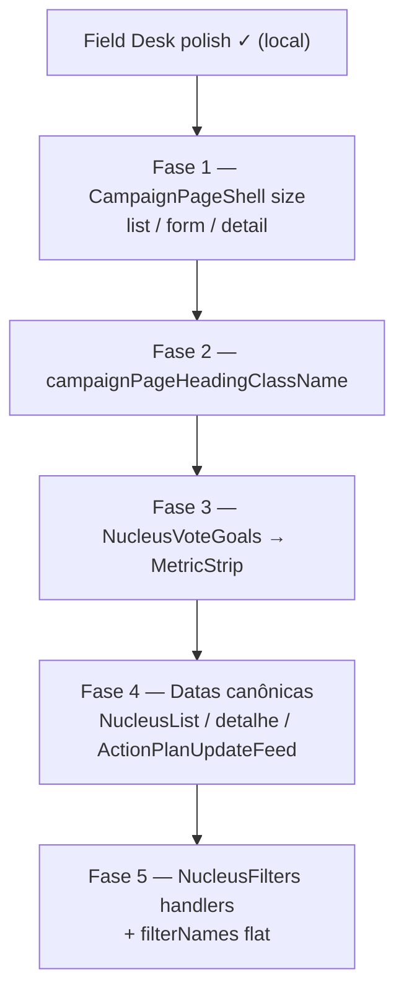

# Escala e DRY pós-Field Desk

Status: registrado no roadmap (fases pendentes)
Atualizado em: 2026-07-19
Item do roadmap: [docs/roadmap.md](../roadmap.md) (FD+, fill-in de engenharia pós-polish Impeccable `/campanha`)
Responsável: —

## Contexto

Em 2026-07-19 a vertical `/campanha` passou por um ciclo Impeccable (critique 28→32, quieter/layout/distill/clarify/harden/polish) alinhado ao North Star **Field Desk** (`PRODUCT.md` / `DESIGN.md`). Entregas locais incluem `CampaignPageShell`, `CampaignMetricStrip`, `CampaignDataFreshness`, filas-first no dashboard, `NucleusFilters` com “Mais filtros”, empties de liderança/coordenador esclarecidos, freshness request-time, tipografia `font-semibold` e loadings alinhados.

A passagem `/simplify` (2026-07-19) aplicou cleanup pontual (freshness sem ramo relativo morto, strip sem métricas duplicadas do card de prioridade, `hidden` único nos filtros avançados, wrappers de data inlined, Badge simplificado). Os revisores (quality / reuse / performance) deixaram débitos **maiores que cleanup** — registrados aqui.

**Já resolvido no simplify (não reabrir):** `formatCampaignDataFreshness` morto removido; `CampaignDataFreshness` só `asOf` + “Atualizado agora”; overview sem Gap/série no strip (ficam no card); MetricStrip sem `bg-card` interno em células quietas; `hidden={!advancedOpen}` sem `className` duplicado; `relativeDate*` inlined em overview/feed; comments de shell/strip.

**Overlap com VR+:** VR+ Fase 2 ainda cita migrar `lastUpdateLabel` / feed — o feed já usa `formatRelativeAge`; o restante de VR+ F2 (variante floor-dias no dashboard) permanece em [escala-dry-pos-visitados-recentemente.md](escala-dry-pos-visitados-recentemente.md), não aqui.

## Objetivos

- Um único shell de página (`CampaignPageShell` + variantes de largura) para listas, detalhe e forms de `/campanha`.
- Um token de tipografia de página (`campaignPageHeadingClassName`) sem repetir `text-2xl font-semibold tracking-tight` em ~15 h1s.
- Datas absolutas/relativas de superfície de campanha passam pelos helpers canônicos (`formatRelativeAge` / `formatBahiaDateTimeLabel`), não por `Intl` local.
- `NucleusVoteGoals` reutiliza `CampaignMetricStrip` onde o layout for equivalente.
- `NucleusFilters` deixa de carregar bag `handlers` + lista `primaryFilterNames` só para concatenar nomes.
- Guardrails: sem migration, sem collection, sem Consent; só DRY/composição UI.

## Decisões travadas

- **Um plano FD+, fases ordenadas.** Precedente VR+/RS+/O0+: um registro no roadmap, PRs por fase.
- **Dependência suave do polish Field Desk** (branch local / merge pendente). Não bloqueia uso da vertical.
- **Cortável:** Fases 3–5 (VoteGoals strip, filtros bag, datas em listagens fora do core polish) se o prazo apertar; Fases 1–2 (shell size + heading class) são as de maior ROI de consistência.
- **i18n e naming** (AGENTS.md): identificadores em inglês (`campaignPageHeadingClassName`, `size: 'form' | 'detail' | 'list'`), strings visíveis em pt-BR.

## Questões em aberto

- **`size` no shell vs `className` ad-hoc?** Forms usam `max-w-3xl`/`4xl`, detalhe `max-w-6xl`, listas `max-w-screen-2xl`. **Recomendação:** prop `size: 'list' | 'form' | 'detail'` mapeando para classes já usadas; permitir `className` só para exceções (ex. perfil `max-w-2xl`).
- **Heading class no shell ou export solto?** **Recomendação:** exportar `campaignPageHeadingClassName` ao lado de `campaignPageShellClassName` em `CampaignPageShell.tsx` — mesmo padrão de discovery.
- **VoteGoals → MetricStrip agora?** Só 3 métricas + Progress separado. **Recomendação:** Fase 3 só se o Progress “vs meta regular” couber no strip (`progress` na meta regular) sem perder o card de contexto do detalhe.

## Abordagem proposta

### Fase 1 — Shell com `size`

- Estender **`CampaignPageShell`** (`src/components/campaign/CampaignPageShell.tsx`) com `size?: 'list' | 'form' | 'detail'` (default `'list'` = `campaignPageShellClassName` atual).
- Migrar páginas que ainda usam `mx-auto flex w-full max-w-{3xl,4xl,6xl} flex-col gap-6`: `nucleos/novo`, `nucleos/[slug]`, `nucleos/[slug]/editar`, `apoiadores/novo|importar|[id]`, `planos/novo|[slug]|editar`, e alinhar `CampaignProfileSettings` (`max-w-2xl` via `className` ou size `form` + override).
- Loadings já no shell — sem mudança.

### Fase 2 — Heading class compartilhada

- Exportar **`campaignPageHeadingClassName = 'text-2xl font-semibold tracking-tight'`**.
- Aplicar nos h1 de páginas de campanha + títulos de dashboard (`CampaignDashboard`) + perfil.

### Fase 3 — `NucleusVoteGoals` → `CampaignMetricStrip`

- Refatorar **`NucleusVoteGoals`** para emitir as três metas via `CampaignMetricStrip`; manter Progress de “vs meta regular” abaixo ou como `progress` na métrica regular.
- Não alterar domínio/loaders de `voteGoals`.

### Fase 4 — Datas canônicas fora do core polish

- **`NucleusList.tsx`**: `lastUpdateAt` → `formatRelativeAge` (paridade com dashboard) ou `formatBahiaDateTimeLabel` se produto quiser absoluto — **Recomendação:** relativo, como dashboard.
- **`nucleos/[slug]/page.tsx`**: timestamps de estimativa → `formatBahiaDateTimeLabel`.
- **`ActionPlanUpdateFeed.tsx`**: alinhar a `formatRelativeAge` + `now` do servidor (paridade com `NucleusUpdateFeed`).

### Fase 5 — `NucleusFilters` bag

- Remover objeto `handlers: SharedFilterHandlers` e espalhar props; colapsar `primaryFilterNames` + `advancedFilterNames` numa única lista `filterNames` com marcação advanced se ainda precisar do count.

## Dependências

- Soft: polish Field Desk mergeado (shell/strip/freshness já no branch).
- Soft overlap: VR+ F2 (relative age no dashboard cards) — coordenar para não duplicar PRs.
- Sem migration, sem Consent.

## Não escopo

- Triagem em lote das filas, glossário/tooltips, outline h1→h2, empty de coordenador com CTA, motion do Sidebar — item **FD2** ([field-desk-ux-pos-critique.md](field-desk-ux-pos-critique.md)).
- Reabrir quieter/layout/distill já entregues (KPI strips, Mais filtros, side-tab).
- Saved filter views / bulk além da fila de prioridade — produto em FD2 Fase 1; escopo além disso fica para item futuro.

## Referências

- `docs/roadmap.md` (Fill-ins FD+)
- `.impeccable/critique/2026-07-19T11-03-23Z__src-app-campaign-campanha.md` — score 32; minor “detail/form max-w”
- `src/components/campaign/CampaignPageShell.tsx`, `CampaignMetricStrip.tsx`, `NucleusFilters.tsx`, `NucleusVoteGoals.tsx`, `NucleusList.tsx`, `ActionPlanUpdateFeed.tsx`
- [escala-dry-pos-visitados-recentemente.md](escala-dry-pos-visitados-recentemente.md) — VR+ (overlap tempo relativo)
- AGENTS.md — naming inglês; tema `campaign`
