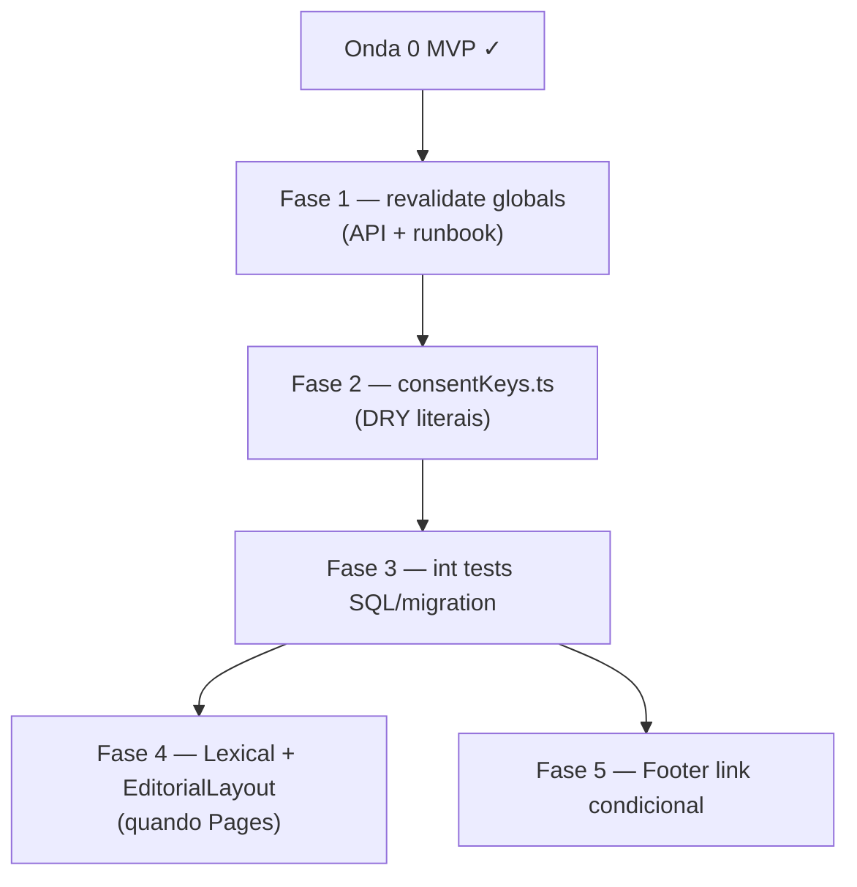

# Escala e DRY P2 — pós-Onda 0 + pós-B68 (consolidado)

Status: Fase 1 (Onda 0 revalidate) entregue; fases 2–5 O0 + F1–F2 B68 pendentes
Atualizado em: 2026-07-31
Issue: #35 (O0+) — absorveu **B68+** (#39) em 2026-07-31 (mesmo `model: kimi-k3-low`)
Priority: P2
Model: kimi-k3-low
Item do roadmap: [docs/roadmap.md](../roadmap.md) (Onda 0+ + Fill-in B68+)
Impeccable: A — perf/estrutura + DRY Consent/cache; sem pixel novo
Appetite: ~1–1,5 dia eng (fases O0 restantes + F1 B68; F2 B68 cortável)
Responsável: —

## Contexto

A Onda 0 ([onda-0.md](onda-0.md)) entregou textos provisórios de `Consent`, global `privacy-policy`, rota `/privacidade`, migrations `20260719_054706_*` / `20260719_054707_*`, CLI `pnpm db:seed:consent` e duas passagens `/simplify` (2026-07-19). O cleanup aplicado cobriu: migration de dados só via SQL, constantes `ONDA0_CONSENT_ENTRIES` / `ONDA0_PRIVACY_POLICY_BODY`, batch `find` no provision Payload, `DELETE … IN` no down SQL, memoização de `getCachedGlobal`, singleton em `/privacidade`, resolução de conflito no roadmap.

Os três revisores do `/simplify` (quality / performance / reuse) deixaram débitos **maiores que cleanup pontual**, registrados aqui para não se perderem entre deploy e revisão jurídica.

1. **Cache de globals após writes fora do runtime Payload.** `provisionOnda0ConsentAndPrivacyDb` (deploy) e `seed-consent.mjs` com `skipRevalidation` não disparam `revalidateTag('global_privacy-policy')`. `/privacidade` pode servir `published`/body stale até TTL ou até um edit no admin. O endpoint `POST /api/revalidate` só busta `posts`.
2. **Chaves de Consent duplicadas.** `lideranca-autopreenchimento` já vive em `campaignInvite.ts`; `apoiador-*` em `campaignConsent.ts` (`server-only`). `onda0ConsentTexts.ts` ainda repete literais (só a chave de liderança foi unificada). `campanha-notificacoes-push` só existe em Onda 0 até D2.
3. **Cobertura de testes incompleta no caminho de produção.** Int tests exercitam `provisionOnda0ConsentAndPrivacy` (Payload API); o deploy roda `provisionOnda0ConsentAndPrivacyDb`. Reconciliation chama o down do seed mas não asserta estado de `privacy_policy` / ausência das chaves.
4. **DRY de superfícies públicas Lexical.** `/privacidade` e artigos (`/[type]/[category]/[slug]`) convertem Lexical→HTML com padrões CSS distintos (`prose` vs `[&_…]`). Layout editorial (`SiteHeader` + `Footer`) duplica `(home)/layout.tsx` sem shell compartilhado.
5. **UX do link de privacidade.** `Footer` sempre mostra `/privacidade`; com `published: false` a rota 404a (mesmo padrão da ficha de apoiador antes do seed).
6. **Documentação redundante.** `scripts/consent-texts/README.md` só aponta para `onda0ConsentTexts.ts` e `onda-0.md`.

**Já resolvido no simplify (não reabrir):** tags em `unstable_cache` para globals; factory memoizada por `(slug, depth)`; duplicate fetch metadata+page em `/privacidade`; N+1 no provision Payload; batch DELETE no down SQL; migration schema sem `payload`/`req` mortos.

## Objetivos

- Deploy e `pnpm db:seed:consent` deixam `/privacidade` e globals cacheados consistentes sem exigir edit manual no admin.
- Uma fonte de verdade para literais de chave `Consent` testável em unit tests (sem `server-only` no módulo de chaves).
- Int tests cobrem o caminho SQL/migration que produção usa.
- Reduzir duplicação de layout e renderização Lexical no site público quando surgir a próxima página institucional (`Pages`).
- Guardrails: sem migration obrigatória; sem alterar textos jurídicos; hold de PII real permanece até assessoria.

## Decisões travadas

- **Um plano O0+, quatro fases ordenadas.** Mesmo racional de A7/B5/C10: um registro no roadmap, PRs por fase. Ordem: revalidate/cache (correção operacional) → chaves Consent (DRY) → testes SQL → DRY UI público (só quando `Pages` ou segunda página institucional justificar).
- **Dependência suave da Onda 0 engenharia ✓.** Não bloqueia lote jurídico nem smoke com dados fictícios; bloqueia confiança em cache pós-deploy e paridade de testes.
- **Módulo de chaves sem `server-only`.** `src/lib/consentKeys.ts` (ou equivalente) importável por `onda0ConsentTexts.ts` (unit) e re-exportado por `campaignConsent.ts` / `campaignInvite.ts` — não o inverso.
- **Revalidate de globals no mesmo espírito de `posts`.** Estender `src/app/(frontend)/api/revalidate/route.ts` com tag opcional ou lista fixa de globals públicos; documentar no runbook Onda 0.
- **Cortável:** Fase 4 (Lexical/layout shell) até existir `Pages` ou bio/propostas; Fase 5 (Footer condicional) é barata mas opcional se o seed sempre publica em prod.
- **i18n e naming** (AGENTS.md): identificadores em inglês (`consentKeys`, `revalidateGlobalTag`), strings visíveis em pt-BR inalteradas.

## Questões em aberto

- **Revalidate automático no fim da migration vs endpoint manual?** **Resolvido (F1):** endpoint allowlisted + curl no runbook; migration continua SQL-only.
- **Unificar seed CLI no caminho SQL?** **Recomendação:** manter Payload no CLI (valida hooks/admin); bust via curl documentado — `revalidateGlobal` no CLI é no-op (`seed-loader`).
- **Extrair `LexicalProse` agora ou com `Pages`?** **Recomendação:** adiar Fase 4 até o primeiro consumidor além de `/privacidade` + artigo — evitar abstração de uma página.

## Abordagem proposta

### Fase 1 — Cache de globals pós-migration/seed ✓

- `POST /api/revalidate` aceita `?tag=` ou body JSON `{ "tag": "..." }` com allowlist `posts` (default) e `global_privacy-policy`; query vence sobre body.
- `scripts/seed-consent.mjs` loga curl pós-sucesso (CLI não invalida cache do runtime deployado — `seed-loader` stubba `next/cache`).
- Checklist em [onda-0.md](onda-0.md) § Smoke produção: curl `global_privacy-policy` após migrate/seed sem edit admin.
- `getGlobalCacheTag` exportado de `src/utilities/globals.ts`; resolver testável em `src/utilities/revalidateRequest.ts`.

### Fase 2 — Chaves Consent únicas

- Novo `src/lib/consentKeys.ts` exportando `CAMPAIGN_INVITE_CONSENT_KEY`, `SUPPORTER_REGISTRATION_CONSENT_KEY`, `SUPPORTER_VOTE_INTENTION_CONSENT_KEY`, `CAMPAIGN_PUSH_CONSENT_KEY` (constantes literais).
- `campaignInvite.ts` / `campaignConsent.ts` importam e re-exportam (compatibilidade).
- `onda0ConsentTexts.ts` monta `ONDA0_CONSENT_KEYS` / `ONDA0_CONSENT_KEY_LIST` a partir do módulo.
- Quando D2 iniciar, `get/requireCampaignPushConsent` usa `CAMPAIGN_PUSH_CONSENT_KEY` do mesmo módulo.

### Fase 3 — Testes do caminho SQL

- Int spec: `provisionOnda0ConsentAndPrivacyDb` + `removeOnda0ConsentAndPrivacyDb` contra `teqo_test`, ou invocar migration `054707` up/down diretamente.
- Assertar: quatro chaves presentes após up; `privacy_policy.published === true`; após down chaves removidas e `published === false`.
- Em `campaignMigrationReconciliation.int.spec.ts`: após `onda0Seed.down`, assertar ausência das chaves Onda 0 (opcional: count `privacy_policy`).

### Fase 4 — DRY site público Lexical/layout _(adiar até `Pages`)_

- Componente `LexicalArticle` ou reutilizar classes do artigo de post em `/privacidade`.
- `EditorialPageLayout` extraindo `(home)/layout.tsx` e `privacidade/layout.tsx`.
- `unstable_cache` wrapper para HTML convertido keyed por `updatedAt` + tag global.

### Fase 5 — Footer e metadata _(opcional)_

- `Footer` server component: `getCachedGlobal('privacy-policy')` depth 0, `select`/campo `published` — esconder link se false.
- `generateMetadata` de `/privacidade`: sufixo `| ${metadata.title}` do global `metadata` (cosmético).

**Migration:** nenhuma nas fases 1–5.

## Dependências

- **Dura:** Onda 0 engenharia entregue (migrations + `/privacidade` + provision utilities).
- **Suave:** collection `Pages` (AGENTS Known Gap #3) para justificar Fase 4; D2 para `requireCampaignPushConsent`.
- Reusa: `getCachedGlobal` / `revalidateGlobal` (`src/utilities/globals.ts`), `provisionOnda0ConsentAndPrivacyDb` (`src/utilities/onda0Provision.ts`), padrão `POST /api/revalidate` de posts.

## Não escopo

- Substituir textos provisórios por versão jurídica final — continua no lote Onda 0 / assessoria.
- Migrar fluxos públicos legados (`consent: 2` em `submitWhatsapp.ts`) — AGENTS Known Gap #2; plano separado.
- RBAC admin `users` — Known Gap #1.
- Links Lexical clicáveis em `/privacidade` no corpo do consent footer (`/privacidade` como texto plano é aceitável no MVP).
- Unificar provision Payload e SQL num único caminho — dual path é intencional (migration sem hooks vs CLI com Payload).

## Referências

- `docs/roadmap.md` — § Onda 0, Fill-ins, Site público
- `docs/plans/onda-0.md` — runbook e provisionamento
- `src/lib/onda0ConsentTexts.ts` — textos canônicos
- `src/utilities/onda0Provision.ts` — SQL vs Payload
- `src/utilities/globals.ts` — cache de globals
- `src/app/(frontend)/api/revalidate/route.ts` — revalidate posts
- `src/app/(frontend)/privacidade/page.tsx` — página pública
- `src/components/Footer.tsx` — link privacidade
- `src/utilities/campaignConsent.ts` / `campaignInvite.ts` — chaves runtime
- `tests/int/onda0Provision.int.spec.ts` / `campaignMigrationReconciliation.int.spec.ts`
- AGENTS.md — Consent por chave estável, `revalidateGlobal`, naming

## Absorvido de B68+ (2026-07-31)

Plano original: [escala-dry-pos-b68.md](escala-dry-pos-b68.md) (Issue #39 fechada como absorvida). Mesma classe de tarefa (simplify/escala-dry → `kimi-k3-low`); domínio distinto (busca do Início) mas consolidado sob O0+ por decisão humana 2026-07-31.

### Fase B68-F1 — RSC embed do suggest (P1 perf)

- Estender `loadCampaignHomeSummary` ou extrair `loadHomeSearchSuggestHits` reutilizável no mesmo request da página (`page.tsx`).
- Passar `initialSuggest` para `CampaignHomeStaffChrome` → `useHomeSearchResultsState({ initialSuggest })`.
- Client: usar payload inicial quando `uiFocused && !query.isActive` e não houver stale/error; POST só para revalidação explícita ou após TTL (opcional v1: só primeiro paint).
- Sem mudar política de ranking (assessor = frescor; CG = déficit + frescor). Sem migration/collection/Consent.

### Fase B68-F2 — Comparator compartilhado de déficit (cortável)

- Extrair `compareNullableNumberDesc` + tiebreak hook para `lib/municipalitySort.ts` quando houver 3º call site com política diferente de tiebreak (hoje: B20 nome, B68 frescor, E9 lista).

**Já resolvido no simplify B68 (não reabrir):** `aria-busy` duplicado; shell de erro; `id` no ranker; factory `toHomeSearchMunicipalityHit`; bundle E8 só em `priority === 'alta'`.

## Revisões

- **2026-07-31:** Consolidação com B68+ (#39) — mesmo modelo `kimi-k3-low`; fases B68-F1/F2 absorvidas neste plano; Issue #39 fechada.
- **2026-07-19:** Fase 1 entregue — endpoint allowlisted (`posts`, `global_privacy-policy`), `getGlobalCacheTag` exportado, curl no runbook Onda 0 e lembrete no `seed:consent`.
