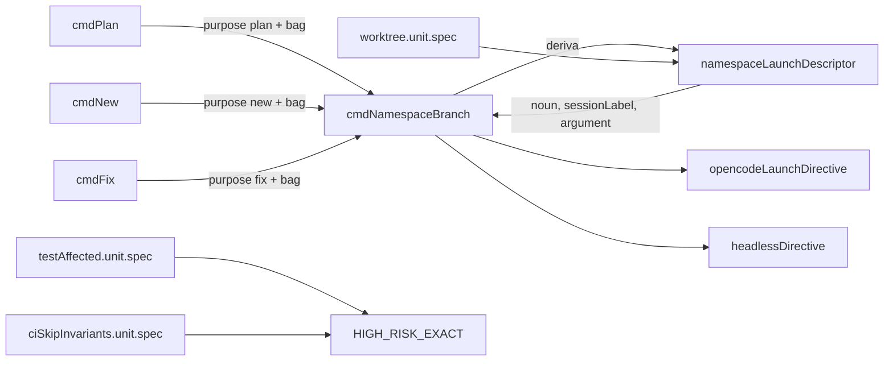

# Impl: OPS119+ — launch do worktree: risk map das libs + pin do wiring do `plan`

Status: em execução
Atualizado em: 2026-09-16
Issue: #1071
Intenção: docs/plans/escala-dry-pos-ops119.md
Appetite restante: herdado (~1h eng) — F1 ~30min + F2 ~30min, sem corte

## Leitura da intenção

- **Outcome:** fechar os dois achados de score 3 do `/simplify` da OPS119 na mesma superfície (launch do worktree ↔ agent-session). F1: um diff que toca só `scripts/lib/worktree.mjs`, `scripts/lib/agent-session.mjs` ou `scripts/agent-session.mjs` hoje classifica `none` (a unit não roda e o static scope também é `none`) — o risk map deve forçar `full`, fail-closed. F2: o repasse `argument: bag` de `cmdPlan` → `cmdNamespaceBranch` não pode mais ser dropado em silêncio — o wiring vira estrutura pinada por unit.
- **O que NÃO negociar:** o outcome é integridade de guard (blast radius fail-closed) e pin do wiring, não refactor de arquitetura; Impeccable A (CLI/shell, sem superfície de produto); appetite ~1h; S1/S2/S3 e o prefill upstream ficam fora; a alternativa rejeitada na intenção (prefixo `scripts/lib/` inteiro em `HIGH_RISK_EXACT`) não pode voltar; migration/Consent/UI não se aplicam.
- **O que reavaliar:** (1) “o F2 precisa tornar `cmdNamespaceBranch` testável” — não precisa: **derivar o descriptor dentro do runner elimina o parâmetro dropável por construção**, sem importar `scripts/worktree.mjs` (que hoje dispara o CLI no import — `:950`, `:1043-1062`); (2) “o descriptor deveria sanear o bag” — a sanitização já tem dois donos (`opencodeLaunchDirective:228`, `purposeInvocation:198`) e S2 é defer, então sanear de novo reintroduziria a duplicação; (3) “o descriptor pertence a `scripts/lib/agent-session.mjs`” — apesar de `SESSION_COMMAND_BY_PURPOSE` morar lá, `noun`/`sessionLabel` são vocabulário de branch/namespace do worktree (decisão abaixo).

## Abordagem recomendada

**Opções consideradas:** A | B | C
**Recomendação:** A — extrair `namespaceLaunchDescriptor({ purpose, bag })` para `scripts/lib/worktree.mjs` e fazer `cmdNamespaceBranch` **derivar o descriptor internamente** a partir de `{ purpose, bag }`, removendo `noun`/`sessionLabel`/`argument` da assinatura; os 3 callers passam só `purpose`+`bag` (+ `branchName`, `flags`, `headless`, `directivePath`). Porque a classe do S4 (parâmetro dropado no caller) deixa de existir estruturalmente: não há `argument` para dropar. O pin unitário cai na lib pura que o spec já importa (`tests/unit/worktree.unit.spec.ts:17-35`), sem exigir guard de importabilidade em `worktree.mjs`.
**Rejeitadas:** B — tornar `cmdNamespaceBranch` injetável/importável e testar as opções com mocks: exigiria adicionar guard `isMain` a `scripts/worktree.mjs` e costurar seams de `git`/`fs`/`provision` que hoje são `execFileSync`/`readFileSync` diretos (`:696-746`) — refactor grande para ~0 teste novo além do descriptor; C — manter os parâmetros e exportar só o mapa: o pin pegaria o descriptor, mas o caller continuaria podendo dropar `argument`, ou seja, a classe do bug sobrevive; o teste que cria worktree de verdade segue rejeitado (lento, side effects, colide no slot, já descartado na intenção).

### Componentes / mudanças

- **`namespaceLaunchDescriptor`** (`scripts/lib/worktree.mjs`, **novo**): mapa puro `purpose`+`bag` → `{ noun, sessionLabel, argument }`, absorvendo os literais hoje inline nos 3 callers (`noun` por purpose; `sessionLabel` = `lote "…"`/`bag "…"`/`bug "…"` com bag, senão `sequencial`; `argument` = bag para `plan`/`fix`, `null` para `new`). Não reimplementa regra de branch nem sanitização — reusa a convenção já existente no módulo (prefixos e `namespaceBranchName` ficam intocados).
- **`cmdNamespaceBranch`** (`scripts/worktree.mjs:679-747`): remove `noun`/`sessionLabel`/`argument` da assinatura, recebe `bag`, e chama `namespaceLaunchDescriptor({ purpose, bag })` uma vez; os usos em `:709` (erro), `:716` (sessão exibida), `:737` (`headlessDirective({ report })`) e `:744` (`printLaunchDirective({ argument })`) passam a ler o descriptor.
- **`cmdPlan`/`cmdNew`/`cmdFix`** (`scripts/worktree.mjs:759-769`, `:780-789`, `:806-818`): passam `purpose`+`bag`; `branchName`, `flags`, `headless`, `directivePath` seguem iguais.
- **`HIGH_RISK_EXACT`** (`scripts/lib/test-affected-core.mjs:25-53`): acrescentar `scripts/agent-session.mjs`, `scripts/lib/agent-session.mjs`, `scripts/lib/worktree.mjs`.
- **Pins de teste:** `tests/unit/testAffected.unit.spec.ts` (loop `:22-35`), `tests/unit/ciSkipInvariants.unit.spec.ts` (`:100-116`), `tests/unit/worktree.unit.spec.ts` (novo `describe` do descriptor).
- **Migration:** sem migration.
- **Access / Consent:** n/a.
- **UI:** Impeccable A — N/A.

### Decisões de engenharia

- **Dono do descriptor: `scripts/lib/worktree.mjs` vs `scripts/lib/agent-session.mjs`.** Opções: A) `worktree.mjs`; B) `agent-session.mjs` (junto de `SESSION_COMMAND_BY_PURPOSE`). Recomendação: A — `noun`/`sessionLabel` são vocabulário de branch/namespace do worktree (mesmo módulo de `planBranchName`/`workBranchName`/`fixBranchName` e do `opencodeLaunchDirective` que consome `argument`), e o spec que já importa o módulo (`worktree.unit.spec.ts:17-35`) pina sem import cruzado novo. Rejeitadas: B porque espalharia metade do contrato de launch (label de branch) para o dono do ciclo de vida de sessão, criando dependência invertida; o que é genuinamente compartilhado com `agent-session` é só o flag `--argument` na borda CLI, que os dois specs já pinam de cada lado.
- **Bag no descriptor: cru vs saneado.** Opções: A) cru (trim só para decidir o label); B) aplicar `replace(/["\\]/g,'')` no descriptor. Recomendação: A — a sanitização é dos donos (`opencodeLaunchDirective:228` no caminho terminal, `purposeInvocation:198` no caminho do driver) e S2 é defer explícito. Rejeitadas: B porque criaria o **terceiro** call site da sanitização — exatamente o gatilho de S2 — e faria o `report` do `headlessDirective` divergir do comportamento atual (que sanitiza só na montagem do argv).
- **`purpose` desconhecido: fail-high vs fail-safe.** Opções: A) `namespaceLaunchDescriptor` lança em purpose não mapeado; B) degradar para um descriptor neutro. Recomendação: A — os únicos callers são `plan`/`new`/`fix`; um purpose novo sem descriptor é erro de wiring e deve falhar alto (mesmo padrão de `resolveWorktreeModel`). Rejeitadas: B porque inventaria `noun`/label silenciosamente, que é a própria classe de bug que o pin fecha.
- **Corte do pin de F1: membership-only vs membership+existência em disco.** Opções: A) só `HIGH_RISK_EXACT.has(path)`; B) membership + `fs` confirmando que cada um dos 3 paths resolve. Recomendação: B, no `it` dedicado de `ciSkipInvariants` — um literal high-risk morto (typo/rename) é exatamente a integridade que o S6 protege e não existe invariante de existência hoje. Rejeitadas: A deixa o valor do F1 degradar em silêncio; o invariante de existência **repo-wide** sobre toda a lista (que revelaria entradas antigas mortas) fica como follow-up nomeado, fora do appetite.
- **Cross-pin `purposeInvocation` × descriptor (2ª perna).** Opções: A) pinar os dois juntos num spec; B) manter os dois pins independentes. Recomendação: B — o contrato entre worktree e agent-session é o flag `--argument`, já pinado nas duas pontas (`opencodeLaunchDirective` por purpose e `purposeInvocation` por argument); um teste combo só reafirmaria os dois. Rejeitadas: A por duplicação e por acoplar dois módulos puros num spec; gatilho de revisitação: se o flag mudar de transporte (env/stdin) ou se S2 consolidar a sanitização num único dono.

## Fases verificáveis

1. **F1 — risk map (~30min).** Adicionar os 3 arquivos a `HIGH_RISK_EXACT` (`scripts/lib/test-affected-core.mjs:25-53`); acrescentar os 3 ao loop de `tests/unit/testAffected.unit.spec.ts:22-35`; novo `it` em `tests/unit/ciSkipInvariants.unit.spec.ts` com nome de contrato (“launch/agent-session modules are high-risk — fail-closed blast radius”) pinando membership + presença em disco dos 3. Verificação: `classifyTestScope([{ path: 'scripts/lib/worktree.mjs', status: 'M' }]).mode === 'full'` para cada um dos 3 (coberto pelo loop) e `pnpm test:unit` verde.
2. **F2 — descriptor + wiring (~30min).** Extrair `namespaceLaunchDescriptor` para `scripts/lib/worktree.mjs`; fazer `cmdNamespaceBranch` derivar internamente e remover `noun`/`sessionLabel`/`argument` da assinatura; simplificar os 3 callers para `purpose`+`bag`. Adicionar `describe('namespaceLaunchDescriptor …')` em `tests/unit/worktree.unit.spec.ts` cobrindo plan com/sem bag (argument threaded + label `lote "…"` vs `sequencial`), new com/sem bag (argument sempre `null`), fix com/sem bag, e purpose desconhecido → throw. Verificação: `pnpm test:unit` verde e `tsc --noEmit` limpo (assinatura nova sem sobras).
3. **Gates.** `pnpm gate:fast` (lint + typecheck + unit); push via `pnpm push`. Sem migration e sem e2e novo (Impeccable A, sem superfície de produto).

## Rabbit holes / Não escopo (engenharia)

- Guard `isMain` em `scripts/worktree.mjs` (padrão de `scripts/check-test-locations.mjs:68-70`): só seria preciso na opção B; com o descriptor derivado internamente, não é necessário — se um dia `worktree.mjs` precisar de teste direto, é Issue própria.
- Prefixo `scripts/lib/` inteiro em `HIGH_RISK_EXACT`: rejeitado na intenção (engoliria as ~40 libs `scripts/lib/*.mjs` sem harness e forçaria `full` em diffs triviais). O resíduo “lib-only diff → unit `none`” para as demais libs fica nomeado como follow-up, não implementado.
- Invariante de existência em disco sobre a lista inteira de `HIGH_RISK_EXACT`/`HIGH_RISK_PREFIXES`: escopo maior que os 3 alvos; follow-up.
- S1 (fallback fail-safe de `purposeInvocation:202`), S2 (sanitização duplicada, gatilho 3º call site), S3 (política driverless), prefill-sem-submit upstream: fora, conforme a intenção.
- Cross-pin `purposeInvocation` × descriptor: fora (decisão acima).

## Adiado com gatilho (triage pós-simplify)

- **Generalização do risk map para as demais `scripts/lib/*.mjs` unit-pinadas**
  (ex.: `scripts/lib/worktree-env.mjs`, pinada por `tests/unit/worktree.unit.spec.ts:5-16`):
  a intenção só pediu os 3 arquivos de launch/agent-session e rejeitou o prefixo
  `scripts/lib/` inteiro. A classe remanescente (diff só-lib → unit `none`) virou
  a Issue `OPS119++` (#1077, `depends: [OPS119+]`), plano
  `docs/plans/escala-dry-pos-scripts-blast-radius.md`.
- **3ª codificação de “purpose carrega bag”** (`entry.carriesBag` em
  `namespaceLaunchDescriptor` × `opencodeLaunchDirective` × `purposeInvocation`):
  defer. Gatilho: 4º encoding **ou** mudança de transporte do `--argument`
  (env/stdin) → consolidar membership+sanitização num dono único.
- **`classifyStaticScope` segue `none` para `scripts/*.mjs`** (lint/typecheck/knip
  pulados num diff só-scripts): entrou como fase 2 da Issue `OPS119++`.

## Explicitamente fora (triage pós-simplify)

- Bag em branco → `argument` cru no descriptor × `opencodeHeadlessArgs` lançando
  “report vazio”: comportamento pré-existente e intencional (fail-high do headless);
  sem reuso bloqueado. Descartado.
- Drift cosmético do docblock/reason de `HIGH_RISK_EXACT` (“schema/lockfile/test
  harness”): descartado (cheap_polish score ≤2, sem impacto funcional).
- `noun` como misnomer (`'de planejamento'`/`'neutro'`/`'de correção de bug'` são
  qualificadores): rename de pureza mantido por continuidade com o código original.
  Descartado.
- Duplicação dos pins de membership entre `testAffected` e `ciSkipInvariants`:
  já resolvido/aceito no plano (camadas distintas — classificação `full` ×
  membership+existência).

## Riscos e mitigação

- **O descriptor não cobre o caminho `next`.** `cmdNext` não usa `cmdNamespaceBranch`; `namespaceLaunchDescriptor` só recebe `plan`/`new`/`fix`. Mitigação: `purpose` desconhecido lança (fail-high), então um futuro uso indevido falha alto em vez de gerar label errado.
- **Mudança de assinatura de `cmdNamespaceBranch` deixa parâmetro morto.** Mitigação: `tsc --noEmit` e a leitura dos 3 callers; nenhum outro caller existe (verificado — só `cmdPlan`/`cmdNew`/`cmdFix`).
- **Label/id divergirem do texto atual exibido.** Mitigação: os casos do novo `describe` fixam os três labels e o `sequencial` byte a byte, contra os literais de `:765`/`:786`/`:812`.
- **Entrada high-risk morta (path renomeado).** Mitigação: asserção de existência em disco no `it` novo de `ciSkipInvariants` para os 3 alvos.
- **F1 forçar `full` em diffs envolvendo essas libs aumenta custo de CI.** Esperado e desejado: são o harness de launch/agent-session; fail-closed é o outcome.

## Aceite de engenharia

- [ ] Aceite de produto da intenção coberto: diff só-lib de launch/agent-session classifica `full` (F1) e o repasse do bag não pode mais ser dropado por parâmetro (F2).
- [ ] Invariantes AGENTS/engineering-standards: identifiers em inglês, prosa pt-BR, sem comentários de código; nenhuma migration; nenhum acesso/Consent/UI tocado.
- [ ] Testes de domínio previstos: `tests/unit/testAffected.unit.spec.ts`, `tests/unit/ciSkipInvariants.unit.spec.ts`, `tests/unit/worktree.unit.spec.ts` — todos unit, sem harness novo.
- [ ] `pnpm gate:fast` verde; `pnpm push` no fluxo normal de PR.

## Self-score decision-quality

1. Decisões caras têm rejeitadas? **5/5** — dono do descriptor, cru-vs-saneado, fail-high-vs-neutro, corte do pin de F1 e cross-pin registraram Opções/Recomendação/Rejeitadas.
2. Cabe no appetite (~1h)? **5/5** — F1 ~30min (3 literais + 2 pins) e F2 ~30min (extração pequena em lib pura + rewire de 3 callers + 1 describe); sem migration, sem e2e.
3. Rabbit holes nomeados? **5/5** — guard `isMain`, prefixo `scripts/lib/` inteiro, existência repo-wide, S1/S2/S3, cross-pin e prefill.
4. Depth check reusa shells/helpers? **4/5** — reusa o spec que já importa `scripts/lib/worktree.mjs`, os padrões de pin de `HIGH_RISK_EXACT` e a convenção existente do módulo; não cria pass-through (o descriptor é dono real da derivação, não repassa nada).
5. Intenção (aceite de produto) intacta? **5/5** — a engenharia não reescreveu o outcome; o F2 foi feito _mais_ forte que a opção A original (o parâmetro some), sem ampliar escopo.

**Score: 24/25 — aprovado para execução.**
