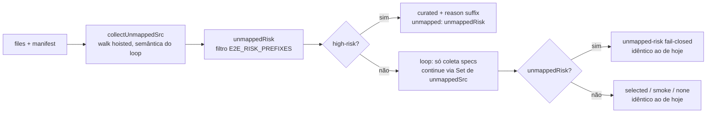

# Impl: OPS86+: curated não engole unmapped-risk sem rastro

Status: rascunho
Atualizado em: 2026-08-24
Issue: #846
Intenção: docs/plans/escala-dry-pos-ops86.md
Appetite restante: herdado (~2h)

## Leitura da intenção

- **Outcome:** um diff high-risk **combinado** com arquivo de área de risco sem
  entry no manifesto deixa rastro: `selectE2eSpecs` computa os unmapped de
  área de risco **antes** do early-return do curated e os expõe no `unmapped` e
  no `reason` do resultado — sem mudar o mode (`curated` continua vencendo).
- **O que NÃO negociar:** mode `curated` continua vencendo o `unmapped-risk`
  (a curadoria cobre as superfícies de risco; a rede forte não troca por falso
  negativo); pins `ciSkipInvariants`/`e2eAffectedManifest` intactos; nenhum
  consumidor muda de semântica (`unmapped` populado em modo curated só soma
  diagnóstico — ninguém falha com ele).
- **O que reavaliar:**
  1. O que o `unmapped` do resultado curated deve conter: só os arquivos de
     risco (filtro `E2E_RISK_PREFIXES`) ou a lista hoisted completa. Ver D1.
  2. Forma do hoist: helper puro dedicado vs pre-pass inline vs duplicar o
     loop. Ver D2.
  3. Wording do `reason`. Ver D3.

## Abordagem recomendada



**Opções consideradas:**

- **D1 — conteúdo do `unmapped` no curated:** A) só `unmappedRisk`
  (recomendada); B) a lista hoisted completa.
  - A mantém o pin existente (`testAffected.unit.spec.ts:123-130`: high-risk
    `src/migrations/x.ts` → `unmapped toEqual([])`) — `src/migrations/` é
    high-risk, é unmapped no manifesto de fixture, mas **não** é prefixo de
    risco; se o curated devolvesse a lista completa, esse pin quebraria.
  - A preserva a semântica OPS86 de `unmapped` = "conjunto descoberto
    relevante ao fail-closed" (o mesmo conjunto que o `reason` nomeia).
  - A evita ruído de stderr: com a lista completa, todo PR de migration
    printaria `[ci-scope] src/ paths with no e2e manifest mapping (selection
may not cover them): src/migrations/...` num run curated que **cobre**
    aquele arquivo por design (label enganosa; o manifesto de produção não
    mapeia `src/migrations/` de propósito).
  - B rejeitada: quebra o pin, dilui a semântica e cria ruído em todo diff de
    schema/lockfile.
- **D2 — forma do hoist:** A) helper puro `collectUnmappedSrc(files, manifest)`
  module-local com a walk completa, e o loop principal **consome** a lista
  hoisted (via `Set` no `continue`, sem re-coletar `unmapped`) — recomendada;
  B) helper + loop mantém a coleta própria (duas cópias da walk);
  C) primitiva compartilhada `hasManifestMatch(path, manifest)` com o loop
  mantendo a walk própria.
  - A é a única com UMA fonte de verdade da semântica de walk (skip de e2e
    spec deletada, só `src/`, `startsWith` nos prefixes do manifesto) — o
    `unmapped.push` do loop (:242-244) desaparece, o `continue` vira
    `unmappedSet.has(path)`, e o `manifest.filter` recomputa os matches só para
    arquivos mapeados (custo trivial: dezenas de arquivos × ~230 prefixes).
  - B rejeitada: reintroduz exatamente a duplicação que a escala denuncia —
    se as cópias divergirem (ex. uma esquece o guard `status === 'D'`), o bug
    ressurge sem teste que o pegue.
  - C rejeitada: compartilha só o predicado; a walk (quais arquivos contam)
    continua duplicada; A é estritamente mais limpa.
  - Sub-decisão: helper **não exportado** — um único call site, sem novo
    surface público; o comportamento é pinado por `selectE2eSpecs`, que é o
    contrato real.
- **D3 — wording do reason:** sufixo `; curated + risk files without mapping:
<join(', ')>` apensado ao texto atual do curated quando `unmappedRisk` não
  vazio. Texto-base intocado; sufixo greppável e fiel ao exemplo da intenção.
  Rejeitada: fundir os arquivos na frase existente (sentence longa, menos
  greppável). Não há pin do reason do curated (único pin de reason no arquivo:
  `:166` `toContain('dev-mode-only')`, branch setup-only), então o wording é
  contrato-fraco — mas o pin novo casa o substring, então fica semi-pinado.

**Recomendação:** D1-A + D2-A + D3 — helper puro hoisted, curated devolve só
`unmappedRisk` com reason-suffix, loop consome a lista hoisted. Nenhum outro
branch muda de comportamento (`unmapped-risk`/smoke/selected/none idênticos:
as listas são as mesmas por construção — a walk do helper espelha exatamente
:230-247).

### Componentes / mudanças

- **`scripts/lib/test-affected-core.mjs`** — único arquivo de produto:
  - Novo helper module-local acima de `selectE2eSpecs`:
    ```mjs
    function collectUnmappedSrc(files, manifest) {
      const unmapped = []
      for (const { path, status } of files) {
        if (status === 'D' && E2E_SPEC_PATTERN.test(path)) continue
        if (E2E_SPEC_PATTERN.test(path)) continue
        if (!path.startsWith('src/')) continue
        if (manifest.some((entry) => entry.prefixes.some((prefix) => path.startsWith(prefix))))
          continue
        unmapped.push(path)
      }
      return unmapped
    }
    ```
  - `selectE2eSpecs` (:218): hoist logo no topo —
    `const unmappedSrc = collectUnmappedSrc(files, manifest)` e
    `const unmappedRisk = unmappedSrc.filter((path) => E2E_RISK_PREFIXES.some((prefix) => path.startsWith(prefix)))`.
  - Early-return high-risk (:219-227): devolve `unmapped: unmappedRisk` e
    `reason` com o sufixo (D3) quando `unmappedRisk.length > 0`.
  - Loop principal (:230-247): `const unmapped = unmappedSrc`; `unmapped.push`
    (:242-244) vira `continue` via `unmappedSet.has(path)` (Set construído da
    lista hoisted); a coleta de specs continua igual.
  - Filtro `unmappedRisk` de :248-250 e branch fail-closed :251-258: usam o
    `unmappedRisk` hoisted (mesma lista, uma cópia do filtro).
  - Branches smoke/setup-only/none/selected: intocados (a variável `unmapped`
    já é a lista hoisted; o `unmapped: []` do branch `none` (:273) fica como
    está — inalcançável com unmapped não vazio, diff mínimo).
- **`tests/unit/testAffected.unit.spec.ts`** — pin novo, junto ao bloco curated
  (:123-130), usando o manifesto de fixture (:88-91, que não tem entry de
  risco — o caso combinado cai limpo):
  ```ts
  it('high-risk + risk file without mapping → curated com unmapped no reason', () => {
    const result = selectE2eSpecs(
      [changed('src/migrations/x.ts'), changed('src/utilities/access/brandNewPolicy.ts')],
      manifest,
    )
    expect(result.mode).toBe('curated')
    expect(result.specs).toEqual(E2E_CURATED_SPECS)
    expect(result.unmapped).toEqual(['src/utilities/access/brandNewPolicy.ts'])
    expect(result.reason).toContain('curated + risk files without mapping')
  })
  ```
  (`src/migrations/x.ts` = high-risk via prefixo; `src/utilities/access/...` =
  prefixo de risco sem match no manifesto de fixture → unmapped; curated vence.)
- **Consumidores** (`ci-scope.mjs:59-66`, `e2e-affected.mjs:50-57`,
  `run-e2e-affected.mjs:50-61`, `gate-ci.mjs:89-94`): **intocados** — nenhum
  falha com `unmapped` populado em curated; o rastro aparece como stderr-warning
  (label não-risco, correta para o caso) e no `reason` impresso pelo
  `run-e2e-affected`.
- **Manifesto** (`scripts/lib/e2e-affected-manifest.mjs`), `ci-pr.yml`,
  `deploy.yml`: intocados. Em produção todo prefixo de risco tem entry (pin
  `e2eAffectedManifest.unit.spec.ts:67-75`), então o caso real só ocorre em
  drift de manifesto — o pin unitário é o guard.
- **Migration/schema/UI/Access/Consent:** nenhum.

## Fases verificáveis

1. **Núcleo:** helper + reordenação em `selectE2eSpecs` (D1-A/D2-A/D3) no
   `test-affected-core.mjs`. Rodar `pnpm test:unit` — pins existentes verdes
   (curated :123-130, unmapped-risk :139-156, deleted-e2e :107-113, reason
   setup-only :166) + exercitar o caso combinado à mão:
   `node -e` importando `selectE2eSpecs` com files sintéticos + manifesto de
   fixture (espelho do pin novo) e conferindo `mode`/`unmapped`/`reason`.
2. **Pin:** caso "high-risk + risco não-mapeado → curated com unmapped no
   reason" em `testAffected.unit.spec.ts`. `pnpm test:unit` verde.
3. **Gates:** `pnpm gate:fast` (lint + typecheck + test:unit); opcional
   `pnpm gate:ci` (espelho full local, incl. int/build); changelog:
   `docs/changelog/2026-08-24-ops86-curated-unmapped-rastro.md` (entrada curta,
   append-only); push via `pnpm push`.

## Rabbit holes / Não escopo (engenharia)

- `classifyTestScope`/`classifyStaticScope`/`classifyBuildScope`,
  `findUncoveredE2eDomainPrefixes` — intocados.
- Resultados sintéticos sem merge-base (`ci-scope.mjs:42`, `e2e-affected.mjs:32`)
  — sem files a classificar, nada a hoist.
- Wording do label de warning do `ci-scope`/`e2e-affected` em modo curated
  ("selection may not cover them") — cosmético, deixa quieto: o warning agora
  acerta quando há unmapped de risco de verdade (drift) e nunca aparece nos
  diffs high-risk normais.
- `seed-posts.mjs` unmapped (taxonomia) — fora do caminho e2e.
- `e2eShardConfig` (removido no OPS62) — não existe mais.
- `deploy.yml` verify (suíte full) — intocado.
- S7 (prefixo `src/utilities/ai` sem trailing slash over-seleciona futuro
  `src/utilities/ai*`) e S9 (argv do `vitest-changed-or-full.mjs`) — defers com
  gatilho do plano de intenção, mantidos.
- Não adicionar warn próprio do curated nos consumidores (o `reason` já carrega
  o rastro e o stderr genérico cobre).

## Riscos e mitigação

- **Quebrar o pin curated existente (`:128` `unmapped toEqual([])`)**: só
  acontece se a entrega devolver a lista completa em vez de `unmappedRisk`
  (D1-B). Mitigação: D1-A justificada no plano + o próprio pin :123-130 roda
  em `src/migrations/x.ts` (high-risk + unmapped, não-risco) — se o D1-B
  vazar, o CI falha loud.
- **Helper divergir da semântica do loop** (ex. esquecer o guard de e2e spec
  deletada): com D2-A não há segunda cópia para divergir — o loop consome a
  lista hoisted; os pins existentes de deleted-e2e (`:107-113`) e deleted-src
  (`:115-121`) exercitam a walk em modos não-curated.
- **Diff auto-referencial**: `test-affected-core.mjs` e
  `testAffected.unit.spec.ts` estão em `HIGH_RISK_EXACT` — o PR desta entrega
  roda o próprio classificador no CI (curated) e `gate:ci` roda unit full.
  Mitigação: `pnpm test:unit` + `pnpm gate:fast` locais antes do push.
- **Custo da walk sempre executada** (hoje o early-return pula a walk em
  high-risk): O(files × prefixes do manifesto), dezenas × ~230 — desprezível;
  nenhum consumidor mede esse caminho.
- **Wording do reason sem pin**: o pin novo casa o substring
  `curated + risk files without mapping`; texto-base do curated preservado
  (nenhum teste depende dele, mas estabilidade evita ruído de diff).

## Aceite de engenharia

- [ ] `collectUnmappedSrc` module-local espelha a walk do loop (skip de e2e
      spec deletada, só `src/`, `startsWith` nos prefixes) e é a única fonte de
      `unmapped` em `selectE2eSpecs`.
- [ ] Early-return high-risk devolve `unmapped: unmappedRisk` (só prefixos de
      risco — pin :123-130 verde) e `reason` com sufixo
      `; curated + risk files without mapping: <join>` só quando não vazio.
- [ ] Branches `unmapped-risk`/smoke/setup-only/none/selected com listas
      idênticas ao comportamento atual (pins :107-161 verdes).
- [ ] Pin novo "high-risk + risco não-mapeado → curated com unmapped no
      reason" em `testAffected.unit.spec.ts` (mode/specs/unmapped/reason).
- [ ] `ciSkipInvariants`/`e2eAffectedManifest` e consumidores
      (`ci-scope`/`e2e-affected`/`run-e2e-affected`/`gate-ci`/`ci-pr.yml`)
      intactos.
- [ ] `pnpm test:unit` e `pnpm gate:fast` verdes; changelog entry curta
      append-only; `pnpm push`.
