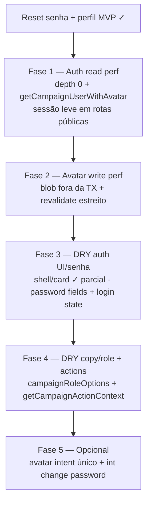

# Escala e DRY pós-reset de senha + foto de perfil

Status: registrado no roadmap (fases pendentes)
Atualizado em: 2026-07-19 (Fase 3 parcial: polish `/campanha/login` + simplify; absorção `capture-review-debts` 2026-07-19)
Item do roadmap: [docs/roadmap.md](../roadmap.md) (RS+, fill-in de engenharia pós-MVP)
Responsável: —

## Contexto

O fill-in **Reset de senha self-service + foto de perfil** ([reset-senha-foto-perfil.md](reset-senha-foto-perfil.md)) entregou: adapter Resend + `forgotPassword`/`resetPassword`, `/campanha/esqueci-senha` e `/campanha/redefinir-senha`, troca de senha logada e upload/remoção de `avatar` em `/campanha/perfil`, shell com avatar/iniciais e migration `20260719_061302_add_campaign_user_avatar`. Duas passagens `/simplify` (2026-07-19) aplicaram cleanup pontual; os revisores (quality / performance / reuse) deixaram débitos **maiores que cleanup** — registrados aqui.

**Já resolvido no simplify (não reabrir):** `CampaignFormActionState` compartilhado; constantes de copy (`CAMPAIGN_PASSWORD_RESET_*`, `CAMPAIGN_LEADERSHIP_FORGOT_PASSWORD_MESSAGE`, `CAMPAIGN_SESSION_EXPIRED_MESSAGE`); `campaignUserShellView` / `CampaignUserShellView`; `canUpdateCampaignUserAvatar` delegando para `canUpdateCampaignUser`; `fieldError` nos forms; `FormActionStatus` no perfil; remoção de wrappers `passwordFormError`/`profileFormError`; exports internos de `resetCampaignPassword`/`changeCampaignPassword`; teste int renomeado para login com senha errada.

**Já resolvido na Fase 3 parcial (merge `main` 2026-07-19, `246ca85` — não reabrir):** `CampaignAuthPageShell` em `login` / `esqueci-senha` / `redefinir-senha` (incl. card de token inválido); `campaignAuthHeadingClassName` + copy compartilhada (`CAMPAIGN_LEADERSHIP_LOGIN_RECOVERY_HINT`, `CAMPAIGN_LEADERSHIP_PHONE_ACCESS_HINT`); login com `inputMode` dinâmico tel/email, `aria-invalid`/`aria-describedby` nos dois campos, `w-full` no submit.

**Já resolvido no polish + `/simplify` de `/campanha/login` (2026-07-19 — não reabrir):** critique Impeccable P1–P3 fechados (alinhamento título/subtítulo `!text-center`, ritmo `gap-2` + `leading-snug`, `CampaignLogo` no shell, `
` para primeiro acesso); `CampaignAuthCardHeader`, `CampaignAuthBackToLoginLink`; tokens `campaignAuthDescriptionClassName`, `campaignAuthMutedTextClassName`, `campaignAuthTextLinkClassName`; `CAMPAIGN_LOGIN_SUBTITLE` (conta individual); `fieldError` sem dupla chamada em forgot/reset. Snapshot: [`.impeccable/critique/2026-07-19T21-47-04Z__src-app-campaign-campanha-login.md`](../../.impeccable/critique/2026-07-19T21-47-04Z__src-app-campaign-campanha-login.md).

## Objetivos

- Auth hot path sem join de `media` em rotas que não exibem avatar (núcleos, apoiadores, planos, etc.).
- Upload de avatar sem segurar transação Postgres aberta durante I/O de blob/sharp.
- Shell compartilhado das páginas públicas de auth (`login`, `esqueci-senha`, `redefinir-senha`) — **parcial ✓** (shell + card header + logo + critique login fechados; pendem password fields + login state — Fase 3).
- Um único módulo de validação/campos de senha reutilizado por convite, reset e perfil.
- Login alinhado ao shape `CampaignFormActionState` + `mapCampaignFormActionError` das demais actions de campanha.
- Guardrails: sem novo `Consent`; sem SMS/WhatsApp para token; comportamento de produto 1C inalterado salvo bugs encontrados.

## Decisões travadas

- **Um plano RS+, cinco fases ordenadas.** Mesmo racional de VR+/O0+/C8: um registro no roadmap, PRs por fase. Ordem: auth read perf → transação/revalidate avatar → DRY UI/senha/login → consolidação forms avatar → opcionais.
- **Dependência suave do fill-in Reset senha + perfil ✓.** Não bloqueia uso do MVP; melhora I/O, consistência visual e manutenção.
- **Sem migration nova** salvo índice/campo não previsto — escopo é refactor de leitura/escrita e componentes.
- **Cortável:** Fases 3–5 até outra vertical de auth ganhar terceiro consumidor; **Fase 1** (auth read) é a mais valiosa se `/campanha` ficar lento com muitos usuários simultâneos.
- **i18n e naming** (AGENTS.md): identificadores em inglês (`getCampaignUserWithAvatar`, `CampaignAuthPageShell`, `CampaignPasswordFields`), strings visíveis em pt-BR.

## Questões em aberto

- **`depth: 0` + `getCampaignUserWithAvatar()` vs `select` parcial em `authenticateCampaignToken`?** Hoje `depth: 1` popula `avatar` em todo request autenticado. **Recomendação:** `depth: 0` no gate + helper `getCampaignUserWithAvatar()` só no layout `(app)` e `/perfil`; páginas públicas usam check de sessão leve (`payload.auth` sem `findByID` completo).
- **Upload fora da transação: apagar `media` órfão em falha?** **Recomendação:** upload/commit blob primeiro; TX curta para `campaignUser.avatar` + delete do anterior; em falha pós-blob, job best-effort de limpeza (log + delete órfão) — documentar no plano de produto se volume crescer.
- **Unificar schemas de senha com `invite.ts` agora?** Três surfaces (convite login, reset, perfil). **Recomendação:** Fase 3 — extrair `campaignPasswordFields.ts` (schema + `refineMatchingPasswords`) consumido por `campaignPassword.ts` e `invite.ts`; não bloqueia RS+ Fase 1–2.
- **Migrar `LoginForm` para `CampaignFormActionState`?** Login é outlier com `{ error?: string }`. **Recomendação:** Fase 3 junto com `CampaignAuthPageShell`; baixo risco, alto alinhamento com forgot/reset/perfil.

## Abordagem proposta

### Fase 1 — Auth read performance

- **`src/utilities/campaignAuth.ts`:** `authenticateCampaignToken` volta a `depth: 0` com `select` mínimo (`name`, `role`, `email`, `username`, `id`); novo `getCampaignUserWithAvatar()` (ou `populateCampaignUserAvatar`) com `depth: 1` só onde necessário.
- **`src/app/(campaign)/campanha/(app)/layout.tsx`:** trocar `getCampaignUser()` por leitura com avatar para o shell.
- **`src/app/(campaign)/campanha/esqueci-senha/page.tsx`**, **`redefinir-senha/page.tsx`:** substituir `getCampaignUser()` por check leve de sessão (redirect se já autenticado sem carregar `media`).
- Atualizar **`tests/int/campaignAuth.int.spec.ts`** (`depth: 0` no gate; teste separado para layout avatar se necessário).

### Fase 2 — Avatar write performance

- **`src/app/(campaign)/campanha/actions/profile.ts`:** criar `media` (blob) **antes** de `withPayloadTransaction`; TX curta só para `campaignUser.update` + `media.delete` do anterior.
- Trocar `revalidatePath('/campanha', 'layout')` por tag/path mais estreito (`/campanha/perfil` + invalidação do layout só quando sidebar precisar — avaliar `revalidateTag` por usuário).
- Paralelizar `getPayload` + `getCampaignUser` onde aplicável (`Promise.all` ou `getCampaignActionContext` na Fase 4).

### Fase 3 — DRY UI e senha

**Entregue parcialmente (2026-07-19):** `CampaignAuthPageShell`, `CampaignAuthCardHeader`, `CampaignAuthBackToLoginLink`, tokens de copy/classes em `campaignAuthCopy.ts`, `CampaignLogo` no shell, polish Impeccable `/campanha/login` (ver Contexto).

**Pendente nesta fase:**

- Extrair **`CampaignPasswordFields`** (ou `CampaignNewPasswordFieldGroup`): campos `password` + `passwordConfirmation` com `errorProps` — reuso em `ResetPasswordForm`, bloco de senha do perfil e `CampaignInviteForm` (`kind === 'login'`).
- **`src/lib/schemas/campaignPassword.ts` + `invite.ts`:** factory compartilhada `refineMatchingPasswords` / `passwordSchema` (substituir check manual no convite).
- **`LoginForm.tsx` + `actions/auth.ts`:** migrar para `CampaignFormActionState` + `mapCampaignFormActionError`.

### Fase 4 — DRY copy, role e action context

- Consolidar strings de liderança/convite (`CAMPAIGN_LEADERSHIP_*`, `CAMPAIGN_FIRST_ACCESS_HINT`, `CAMPAIGN_LOGIN_SUBTITLE` + mensagem server em `campaignPasswordReset.ts`) numa fonte única com variantes por contexto.
- **`campaignRoleLabels`** ↔ opções do campo `role` em `CampaignUser.ts` (fonte única `campaignRoleOptions`).
- Propagar para **`NucleusUpdateFeed.tsx`** e outros `roleLabels` locais quando esses arquivos forem tocados.
- **`password.ts` / `profile.ts`:** adotar `getCampaignActionContext()` (`src/utilities/campaignActionContext.ts`) como `supporter.ts` / `actionPlan.ts`.

### Fase 5 — Opcional / cortável

- **`CampaignProfileSettings`:** um `useActionState` com `intent` (`upload` | `remove`) em vez de dois hooks de avatar.
- Validador de avatar retornando `Result` em vez de `throw` + `safeMessages`.
- Teste int de `changeCampaignPassword` com cookie de sessão simulado (hoje só cobre `payload.login` com senha errada).
- Fila assíncrona para e-mail de forgot-password (cold path; só se latência Resend incomodar).

## Dependências

- **Reset senha + perfil MVP ✓** ([reset-senha-foto-perfil.md](reset-senha-foto-perfil.md); engenharia pronta em branch local).
- Reusa `campaignAuth.ts`, `campaignPasswordReset.ts`, `campaignUserProfile.ts`, `campaignFormActionError.ts`, `campaignFormFields.ts`, `campaignActionContext.ts`.
- Sem migration, sem `Consent` novo.

## Não escopo

- Forgot por SMS/WhatsApp → permanece convite `login` ([reset-senha-foto-perfil.md](reset-senha-foto-perfil.md)).
- Edição de nome/telefone/e-mail no perfil → item futuro separado.
- RBAC em `users` (admin Payload) → [roadmap](../roadmap.md) Admin Payload.
- Unificar **todo** o ciclo 1 de auth (convite + login + admin) num único mega-refactor — RS+ cobre só o fill-in entregue e vizinhos diretos.

## Explicitamente fora (critique/simplify desta sessão — não reabrir)

- Split-screen login com publicações ou painel motivacional (decisão produto 2026-07-19; critique recomendou não).
- Link de saída para o site público na tela de login (heurística 3, score 2).
- Placeholder longo dual-format no identificador; submit helper global (`Spinner` + `aria-live`); constantes de rota auth; `flat-type-hierarchy` do detector runtime no body.
- Comentário em `styles.css` para auth — workaround com tokens/componentes já suficiente.

## Referências

- [reset-senha-foto-perfil.md](reset-senha-foto-perfil.md) — MVP entregue
- [escala-dry-pos-visitados-recentemente.md](escala-dry-pos-visitados-recentemente.md) — precedente RS+/VR+
- `src/utilities/campaignAuth.ts`, `src/app/(campaign)/campanha/actions/password.ts`, `profile.ts`
- `src/components/campaign/CampaignProfileSettings.tsx`, `CampaignSidebar.tsx`, `CampaignUserAvatar.tsx`
- `src/components/campaign/CampaignAuthPageShell.tsx`, `CampaignAuthCardHeader.tsx`, `CampaignAuthBackToLoginLink.tsx`
- `src/lib/campaignAuthCopy.ts`
- `src/app/(campaign)/campanha/login/`, `esqueci-senha/`, `redefinir-senha/`
- `src/lib/schemas/campaignPassword.ts`, `src/lib/schemas/invite.ts`
- `src/collections/CampaignUser.ts`
- `tests/int/campaignPasswordReset.int.spec.ts`, `tests/int/campaignAuth.int.spec.ts`
- `docs/roadmap.md` (fill-ins RS+)
- AGENTS.md — Campaign auth, naming, `overrideAccess: false`, transações
