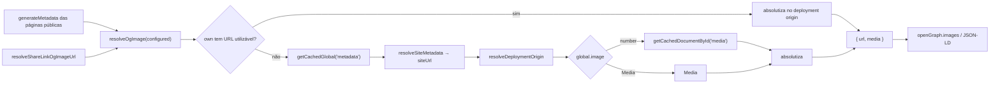

# Impl: Escala e DRY pós-S27 — dono único do OG image de fallback do frontend público

Status: aprovado
Atualizado em: 2026-09-23
Issue: #1276
Intenção: docs/plans/escala-dry-pos-s27.md
Appetite restante: herdado (~0,5 dia)
Aprovação: auto-aprovada pela sessão em modo `--auto` (work-issue) em 2026-09-23 — sem gate humano nesta etapa.

## Leitura da intenção

- **Outcome:** o fallback de imagem OG do frontend público passa a viver num dono único server-only — resolve a imagem configurada (quando houver), senão a imagem do global `metadata` (populando o id quando numérico), senão `null`, sempre absoluta contra o origin de deploy (`resolveDeploymentOrigin`) — e os 8 consumidores atuais (2 do S27 + pré-existentes) migram sem mudança observável nas URLs de OG.
- **O que NÃO negociar:**
  - `src/utilities/seo.ts` permanece **puro** (sem I/O); o resolver com I/O nasce ao lado dos reads de global.
  - `artigos/page.tsx` fica **fora** (fonte `home.image`, não o global).
  - Sem migration; sem mudança de comportamento visível; `pnpm gate:fast` + int + e2e das rotas públicas verdes.
  - Origin de deploy, **nunca** o domínio canônico do global, para URL de mídia/OG.
  - `resolveShareLinkOgImageUrl` passa a delegar — sem twin.
- **O que reavaliar (hipóteses do explorador):**
  - `{ url, media }` cobre os 3 formatos de own (string relativa, string absoluta externa, `Media`) e os 2 perfis de consumo (URL-only vs metadados).
  - `layout.tsx` compartilha o fallback (é só-global, sem own) e hoje emite URL relativa.
  - A delegação do shareLink não altera o int test (mesma URL em `https://site.test`, mesmo `null`, mesmo fallback).
  - F3 não é viável para layout/abaixo-assinado sem seed do global `metadata` image — só dá para pinar own-image paths onde o e2e já semeia.
  - Aceitar `number` na fonte configurada é robustez barata (paridade com o ramo do global) ou escopo a mais — decisão 1.

## Abordagem recomendada

**Opções consideradas:** A | B | C
**Recomendação:** A — um dono novo (`src/utilities/ogImageReads.ts`, server-only) exportando `resolveOgImage(configured) → { url, media }`; `resolveShareLinkOgImageUrl` delega. Um read por página serve os dois consumidores, e é a única opção em que o fallback não pode divergir.
**Rejeitadas:** B (duas funções URL-only/Media-only) porque duplica a leitura do global/mídia em cada página e cria dois lugares para o fallback divergir; C (URL-only + resolução de `Media` por fora) porque reintroduz exatamente o bloco que o item veio apagar nos call sites que precisam de metadados (artigo, petição, layout) — twin.

### Componentes / mudanças

- **`resolveOgImage`** (`src/utilities/ogImageReads.ts`, novo): `import 'server-only'` + doc-comment; exporta `OgImageSource = Media | number | string | null | undefined` e `resolveOgImage(configured): Promise<{ url: string | null; media: Media | null }>`. Regra única: a fonte configurada vence quando tem URL utilizável; senão lê o global `metadata` (`getCachedGlobal`), resolve `number → getCachedDocumentById('media')`, e devolve `{ url: absolutizada | null, media }`. Reusa `resolveSiteMetadata`/`resolveDeploymentOrigin`/`toAbsoluteUrl` de `seo.ts`; `mediaOf`/`resolveMediaSource` internos (não exportados). O guard `codebaseConventions.unit.spec.ts:833-853` é satisfeito por construção (chama `resolveSiteMetadata` no mesmo arquivo).
- **`resolveShareLinkOgImageUrl`** (`src/utilities/shareLinkReads.ts:87-104`): vira `(await resolveOgImage(link.image)).url`; saem os imports de `getCachedDocumentById`, `getCachedGlobal`, `resolveDeploymentOrigin`, `resolveSiteMetadata`, `toAbsoluteUrl`, o `mediaOf` local e o tipo `Media`; a doc-comment origin-vs-canônico migra para o dono e o wrapper fica com um ponteiro curto.
- **Call sites migrados (F1):** `conteudos/(catalog)/page.tsx:47-100` (own = `firstImage.file.path`, string; alt `CATALOG_TITLE`) e `conteudos/[slug]/page.tsx:31-90` (own = `item.file.path` com o gate `mimeType.startsWith('image/')`; alt `item.title`).
- **Call sites migrados (F2):** `jingles/page.tsx:30-70` (own = `items[0].coverUrl`; alt `items[0]?.coverAlt ?? JINGLES_TITLE`); `corte/[id]/page.tsx:66-100` (own = `youtubeCoverUrl(cut)`, absoluta externa); `abaixo-assinado/[id]/page.tsx` nas duas cópias (`generateMetadata` e `Page`/JSON-LD; own = `extractFirstImageFromLexical(petition.body)`; metadados da `Media`); `[type]/[category]/[slug]/page.tsx:46-64,87,158` (deleta o helper local `resolveOgImage`/`Metadatum`; own = cover → body image, política do post fica no call site); `layout.tsx:20-68` (own = `null`; `url` absoluta + `media?.width/height/alt`).
- **Pin de convenções** (`tests/unit/codebaseConventions.unit.spec.ts:423-564`): registrar `'ogImageReads.ts'` em `pinnedTopLevel` com comentário-razão (dono único do OG fallback; irmão de `globalReads.ts`/`documentReads.ts`).
- **Teste novo (F1):** unit do resolver, mockando `@/utilities/globalReads`/`@/utilities/documentReads` por caminho de módulo (mesmo padrão de `tests/unit/siteMetadataFallback.unit.spec.ts`), cobrindo sem imagem → `null`; global numérico → `media` populada; URL relativa → absoluta no deployment origin; absoluta passa sem origin.
- **Migration:** nenhuma.
- **Access / Consent:** n/a — leitura pública read-only, nenhuma collection/access tocado, nenhum opt-in/PII.
- **UI:** n/a — Impeccable A; meta tags são `<head>`, nenhuma superfície visual muda.

### Dados → forma (se aplicável)

n/a — nenhuma superfície de dados/KPI; só URLs de `og:image`/JSON-LD, já no formato atual.

## Fases verificáveis

1. **F1 — dono único + os 2 call sites do S27** (~60% do appetite). Criar `ogImageReads.ts` + pin + unit; migrar catálogo e peça; delegar `resolveShareLinkOgImageUrl`. Prova: unit do resolver verde; `frontendConteudos` (og:image da peça) verde; `tests/int/shareLink.int.spec.ts:385-432` verde sem tocar na asserção.
2. **F2 — migrar as cópias pré-existentes.** `jingles`, `corte/[id]`, `abaixo-assinado/[id]` (×2), `[type]/[category]/[slug]` e `layout.tsx`. Prova: `frontendJingles`/`campaignSpeechCut`/`frontend`/`frontendShareLink` verdes sem mudança de asserção.
3. **F3 — apertar a rede (primeira a cair se o appetite estourar).** Assert de `og:image` nos e2e que já cobrem a página e semeiam a fonte: `frontendJingles` (capa própria → absoluta em `/api/media/file/`) e `campaignSpeechCut` (thumbnail do YouTube). Nenhum teste novo além do unit de F1; layout/abaixo-assinado ficam sem assert (o global image não é semeado nos e2e).
4. **Gates.** `pnpm gate:fast`; `pnpm exec knip` (imports órfãos da delegação morrem no mesmo delivery); int + e2e citados; `pnpm push`; entrada em `docs/changelog/2026-09-23-s27-followup-dry.md`.

## Rabbit holes / Não escopo (engenharia)

- `artigos/page.tsx` (fonte `home.image`) — fora, como manda a intenção.
- Mover I/O para `seo.ts` (rejeitado: o módulo é puro por contrato) ou renomear/realocar `seo.ts`.
- Exportar `mediaOf`/`resolveMediaSource` do dono para reuso em `corte/[id]` (helper de 1 uso; ver decisão 5).
- Unificar `alt`, `secureUrl` ou dimensões entre call sites além do que cada um já emite — `alt` permanece no call site.
- `contentPieceReads` depth, `contentPieceDownloadFilename`, `firstValue`, wrapper WhatsApp, shell de jingles — defers já registrados na intenção.
- Adicionar campo ao global `metadata` (não existe `contentMedia`; schema intocado) ou seed do global image em e2e só para F3.
- Mexer em canonical/JSON-LD `url` (seguem no `siteUrl` canônico).

## Riscos e mitigação

- **Regressão silenciosa de URL OG em rotas sem e2e de og:image** (layout, abaixo-assinado): unit do resolver cobre os ramos; o int do shareLink pina a URL absoluta e o fallback; F3 adiciona assert de own-image onde o e2e já cobre.
- **Delta intencional origin vs canônico** em corte/abaixo-assinado/artigo (fallback/own absolutizados no deployment origin) e layout (relativa → absoluta): registrar na descrição do PR; nos testes os dois coincidem (`playwright.config.ts:290-296` injeta `NEXT_PUBLIC_SITE_URL` = `baseURL`/`CANONICAL_E2E_ORIGIN`) e as asserções pinam forma/path, não host.
- **`Media` própria sem `url`** passa a cair no fallback global (regra única), diferente do comportamento atual de petição/artigo nesse edge: registrado como decisão; nenhum teste depende do comportamento antigo.
- **Twin residual no `shareLinkReads`**: a delegação acontece no mesmo delivery; `knip` denuncia qualquer import órfão.
- **Guards de convenção** (`server-only`, pin, metadata→`resolveSiteMetadata`) quebram o CI se esquecidos: fazem parte do aceite de F1.
- **Estouro de appetite:** cortar F3 primeiro; se F2 revelar call site com política própria, ele fica fora em vez de ganhar flag.

## Aceite de engenharia

- [ ] Aceite de produto da intenção ainda coberto — dono único server-only com a assinatura configurada → global (number→media) → `null`, sempre no deployment origin; `artigos` fora.
- [ ] Invariantes AGENTS/engineering-standards — "Edit the owner, don't twin" (delegação do shareLink, sem twin); `server-only`; sem migration; sem `as never`; identificadores em inglês.
- [ ] Testes de domínio previstos — unit do resolver (sem imagem → `null`; global numérico → media populada; relativa → absoluta no origin); `tests/int/shareLink.int.spec.ts` verde sem mudar asserção; e2e `frontendConteudos`/`frontendJingles`/`campaignSpeechCut`/`frontend`/`frontendShareLink` verdes.
- [ ] Sem migration; sem access/Consent; Impeccable A; UI n/a.
- [ ] `pnpm gate:fast` + `pnpm exec knip` limpos; `pnpm push`; entrada em `docs/changelog/`.

## Decisões de engenharia

### 1. Dono e assinatura do resolver

**Opções:** A) um dono novo `src/utilities/ogImageReads.ts` devolvendo `{ url, media }`, com `resolveShareLinkOgImageUrl` delegando | B) duas funções (URL-only + Media-only) com leitura duplicada | C) URL-only e cada call site de metadados resolve a `Media` por fora.

**Recomendação:** A. `resolveOgImage(configured: Media | number | string | null | undefined)` devolve `{ url: string | null; media: Media | null }`, onde `media` é a `Media` resolvida quando a fonte escolhida é `Media`, senão `null`. Aceitar `number` na configurada é robustez deliberada: mesma defesa de depth-0/cache envenenado que o ramo do global já exige, custo de um `resolveMediaSource` interno (3 linhas) e evita a armadilha do próximo call site que passar um upload cru. Regra de escolha: "URL utilizável, senão fallback" — uma só regra para todos.
**Alternativas rejeitadas:** B porque dobra os reads de global/mídia por página e cria dois donos do fallback; C porque reintroduz o bloco duplicado nos call sites de metadados (artigo/petição/layout); D (aceitar `number` só no global) porque perde a defesa barata e mantém a armadilha para o próximo consumidor. Também rejeitada a preservação da divergência atual (petição/artigo não caem para o global quando a `Media` própria existe sem `url`; shareLink cai) — o edge só aparece com mídia quebrada e a regra única é o ponto do dono.

### 2. Delegação de `resolveShareLinkOgImageUrl`

**Opções:** A) delegar para o dono | B) manter o bloco atual em `shareLinkReads.ts` | C) mover a função inteira (com o tipo `ShareLink`) para o novo módulo.

**Recomendação:** A. `resolveShareLinkOgImageUrl(link)` vira `(await resolveOgImage(link.image)).url`; `shareLinkReads.ts` deixa de importar `getCachedDocumentById`/`getCachedGlobal`/helpers de `seo.ts` e perde o `mediaOf` local; a doc-comment origin-vs-canônico passa ao dono e o wrapper fica com um ponteiro. O int test (`tests/int/shareLink.int.spec.ts:385-432`) permanece verde sem tocar na asserção: mesma URL `https://site.test...`, mesmo `null` sem default, mesmo fallback.
**Alternativas rejeitadas:** B é o twin que o item veio apagar; C puxa `ShareLink` e a semântica de card para o módulo de imagem — acoplamento sem ganho.

### 3. Origin de deploy vs domínio canônico

**Opções:** A) sempre `resolveDeploymentOrigin(siteUrl)` | B) manter `siteUrl` canônico nos call sites legados | C) usar o origin só quando o global "parecer externo".

**Recomendação:** A. O proxy `/api/media/file/…` só existe no origin do deployment e OG exige URL absoluta. Deltas **intencionais e corretos**: `corte`/`abaixo-assinado`/`[type]/[category]/[slug]` absolutizam own/fallback no deployment origin quando `metadata.URL ≠ NEXT_PUBLIC_SITE_URL`; `layout.tsx` passa de relativa para absoluta. Canonical e JSON-LD `url` continuam no `siteUrl` canônico. Prova sem quebrar e2e: os specs injetam `NEXT_PUBLIC_SITE_URL` (`playwright.config.ts:290-296`) e as asserções de OG existentes pinam forma/path, não host.
**Alternativas rejeitadas:** B mantém o 404 latente no crawler quando o canônico é servido por outra plataforma (o motivo do comentário em `shareLinkReads.ts:77-86`); C é heurística sem contrato — o global é canônico por definição, o origin é o deployment.

### 4. Own absoluta sem origin (YouTube/corte)

**Opções:** A) absoluta passa; relativa exige origin | B) exigir origin sempre, mesmo para absoluta.

**Recomendação:** A. `toAbsoluteUrl` já devolve absoluta intacta; a checagem extra é só "sem origin, relativa → `null` e cai no fallback". Preserva o thumbnail do YouTube do corte (o e2e `campaignSpeechCut` asserta `https://i.ytimg.com/...` no HTML) sem ramo extra.
**Alternativas rejeitadas:** B faria o thumbnail sumir num ambiente sem env, sem contrapartida de segurança (URL absoluta de terceiro não passa pelo proxy).

### 5. `mediaOf` duplicado

**Opções:** A) o dono tem `mediaOf` local e o de `corte/[id]` fica | B) exportar um `mediaOf` compartilhado do dono | C) absorver o de corte no dono.

**Recomendação:** A, pelo depth check: o `mediaOf` de `shareLinkReads.ts:74` morre com a delegação; o de `corte/[id]/page.tsx:27` lê `cut.media` para o vídeo/filename da página — outra responsabilidade, outra assinatura. Exportar helper de 1 uso é cerimônia.
**Alternativas rejeitadas:** B acopla o player de corte ao módulo de OG por uma linha; C mistura duas políticas (mídia da página vs imagem de preview).

### 6. Ordem das fases e corte

**Opções:** A) F1 → F2 → F3, com F3 cortável | B) só F1+F2 | C) começar pelos pré-existentes.

**Recomendação:** A. F1 entrega o dono e os call sites do S27 (o ROI e o gatilho do item); F2 é migração mecânica; F3 aperta a rede e é a primeira a cair se o appetite estourar. Se F2 revelar um call site com política própria (ex.: `artigos`), ele fica fora em vez de ganhar flag.
**Alternativas rejeitadas:** B perde a caracterização barata do OG nos e2e existentes; C adia a validação do contrato e deixa o S27 (motivo do item) por último.

## Self-score (decision-quality)

1. Decisões caras com rejeitadas? **Sim** — dono/assinatura, delegação, origin vs canônico, absoluta sem origin, `mediaOf` e ordem/corte, todas com rejeitadas; nada de access/schema/PII entra.
2. Cabe no appetite? **Sim** — ~0,5 dia: 1 módulo (~40 linhas), 8 consumidores migrados mecanicamente, 1 unit novo; sem migration.
3. Rabbit holes nomeados? **Sim** — `artigos`, I/O no `seo.ts`, seed do global para F3, helper exportado, unificação de `alt`/dimensões.
4. Depth check? **Sim** — reusa `getCachedGlobal`/`getCachedDocumentById`/`resolveSiteMetadata`/`resolveDeploymentOrigin`/`toAbsoluteUrl`; o novo módulo encapsula conhecimento que hoje vaza em 8 arquivos; nenhum pass-through novo.
5. Outcome do S27 intocado? **Sim** — só estrutura interna; nenhuma URL de OG muda nos e2e (os deltas de host são intencionais e registrados; canonical/JSON-LD intocados).

**Score: 5/5.**
