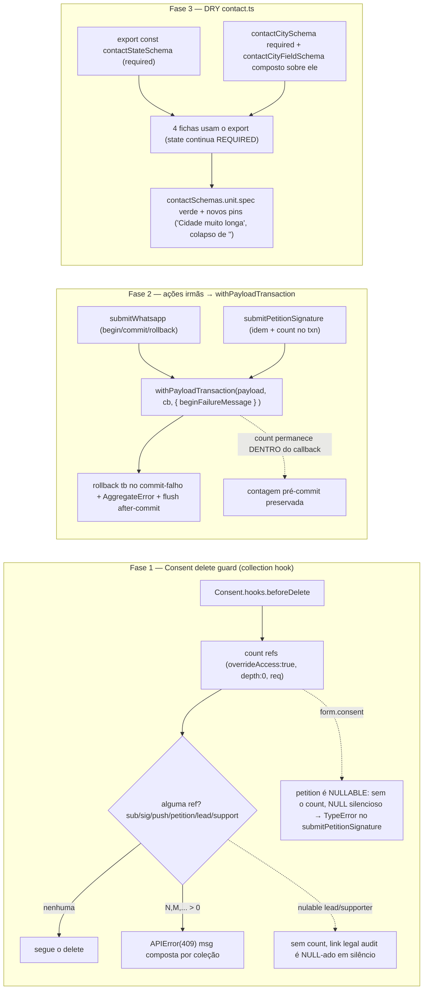

# Impl: Escala/DRY pós-S9 — integridade e alinhamento das ações públicas

Status: rascunho
Atualizado em: 2026-08-24
Issue: #771
Intenção: docs/plans/escala-dry-pos-s9-acoes-publicas.md
Appetite restante: herdado (~0,5–1 dia eng; 3 fases pequenas, lock primeiro) — nada além do que a intenção já corta

## Leitura da intenção

- **Outcome:** 3 fases de higiene/integridade pós-S9, sem mudança de contrato: (1) deletar `Consent` em uso passa a falhar com erro admin-amigável (não mais `23502` cru); (2) `submitWhatsapp`/`submitPetitionSignature` delegam o transaction lifecycle ao dono `withPayloadTransaction` (rollback também no commit-falho, `AggregateError`, after-commit flush); (3) as 4 fichas de `contact.ts` passam a usar os exports únicos de estado/cidade — DRY de conhecimento no dono.
- **O que NÃO negociar:** comportamento protetivo de consent LGPD fail-closed (recusa de gravar/consumir enquanto a chave configurada falta); contratos públicos das actions (`{ ok: true }`, `{ ok: true, signatureNumber }`); migrations congeladas (nunca editar `20260715_163458_initial` nem re-derivar FKs); contratos pinned de `onPayloadTransactionCommit`/notificação (`notificationPushScheduleConventions.unit.spec.ts:15-16`); invariante de escrita multi-collection em transação com `req: { transactionID }`.
- **O que reavaliar:** o brief afirma "mesma mensagem, mesmo comportamento" para a cidade — **falso** (o explorador e a leitura do código provam divergência, ver Fase 3); o guard da Fase 1 precisa decidir escopo (só os NOT NULL blockers vs todos os usos semânticos) com o caso `petition.form_consent_id` NULLABLE como armadilha silenciosa; na Fase 2, a única mutação observável é a mensagem de begin-failure (não há teste que a pinea) — decisão de preservá-la por action ou aceitar o default PT; na Fase 3, exportar o `contactStateSchema` REQUIRED (não o `optionalContactStateSchema`) e o `contactCityFieldSchema` difere das cópias também na **colapsagem que exclui** `''` — não só na mensagem.

## Abordagem recomendada

**Opções consideradas (por fase):** ver decisões abaixo — F1: A/B; F2: A/B/C; F3: estado A/B, cidade a/b/c/d.
**Recomendação:** F1 guard cobre **todos os usos semânticos** (409, hook `beforeDelete` inline no `Consent`); F2 preserva as mensagens de begin-failure via `{ beginFailureMessage }`; F3 exporta `contactStateSchema` e padroniza as mensagens de cidade no próprio `contactCityFieldSchema` (min `'Cidade inválida'`, max `'Cidade muito longa'`) — porque é a única opção que unifica mensagem E comportamento no dono do concern, sem custo novo de superfície.
**Rejeitadas:** guard só-NOT NULL (deixa os NULL silenciosos, exatamente o tipo de bug que esta issue quer eliminar); default PT de begin-failure (muda comportamento observável na mesma diff mecânica); per-field `message` params de cidade (mais API, mantém a divergência); manter divórcio de mensagens documentado (derrota a intenção DRY).

### Componentes / mudanças

- **`Consent`** (`src/collections/Consent.ts`): adicionar `hooks: { beforeDelete: [...] }`. Hook conta referências em `payload.count` paralelo (`Promise.all`) com `where: { consent: { equals: id } }` (+ `where: { 'form.consent': { equals: id } }` em `petition`; `where: { voteIntentionConsent: { equals: id } }` em `supporter`), `depth: 0`, `overrideAccess: true`, `req`. Se total > 0, `throw new APIError(msg, 409)` com contagem por coleção (`subscription`, `signature`, `pushSubscription`, `petition`, `leadership`, `supporter`). Reusa o padrão de `CampaignUser.ts:336-343` (CollectionBeforeDeleteHook com overrideAccess) e de `personDelete.ts:113-130` para o count. Hook fica inline (convenção do repo: hooks dentro do arquivo da collection).
- **Migration:** sem migration — nenhuma mudança de schema; as colunas já existem (`subscription.consent_id`/`signature.consent_id`/`push_subscription.consent_id` NOT NULL; `petition.form_consent_id`, `leadership.consent_id`, `supporter.consent_id`/`vote_intention_consent_id` nullable).
- **`submitWhatsapp.ts` / `submitPetitionSignature.ts`** (`src/app/(frontend)/actions/`): trocar o hand-roll `beginTransaction/try/commit/rollback` por `return withPayloadTransaction(payload, async ({ req }) => {...}, { beginFailureMessage })`. Reads pré-transação (`requireConsentByKey` de whatsapp L17-22; `findByID` do petition L25-31) ficam FORA do helper, como hoje. Conta de `signatureNumber` e o `Promise.all` paralelo permanecem DENTRO do callback (lê dentro da txn não commitada — comportamento atual preservado). Retornos intocados. `payloadTransaction.ts` **não muda** (`codebaseConventions.unit.spec.ts:487` pina).
- **`contact.ts`** (`src/lib/schemas/contact.ts`): `contactStateSchema` deixa de ser privado (export) e as 4 fichas trocam o `z.custom<StateKey>` inline por ele; `optionalContactStateSchema` permanece composto sobre ele. Novo `contactCitySchema` (required: `trim().min(3,'Cidade inválida').max(100,'Cidade muito longa')`) e `contactCityFieldSchema` redefinido como composição sobre ele (união com `''` + colapso p/ `undefined` + `.optional()`). Comentário L31-35 atualizado (remover "consolidating them is a follow-up").
- **Teste helper** (`tests/helpers/testDatabaseLease.ts:643-647`): o delete "re-create re-verify" do `withMutableConsentFixture` passa de `payload.delete` para raw SQL — a única chamada de lifecycle que podia derrubar a janela D10.
- **Access / Consent:** guard com `overrideAccess: true` no count é bypass intencional (o delete já é admin-only; o hook é autorização própria do padrão `CampaignUser`). Fail-closed preservado: recusa é a proteção, não um canal novo. Sem chave nova de consentimento.
- **UI:** nenhuma nova; no admin o efeito é o erro amigável no delete (a mensagem do `APIError` chega à superfície do painel).

## Fases verificáveis

1. **Fase 1 (schema+server)** — hook `beforeDelete` no `Consent` + contagem multi-collection + `APIError(409)`; teste helper D10 migrado para raw SQL. **Fase 2 (server)** — refactor das duas actions para `withPayloadTransaction`. **Fase 3 (lib pura)** — exports `contactStateSchema`/`contactCitySchema`; `contactCityFieldSchema` recomposição; 4 fichas consolidadas.
2. **UI** — nenhuma; verificação é a mensagem admin (superfície da Fase 1) via int spec e o painel e2e de newsletter seguindo verde.
3. **Gates** — `pnpm migrate:create` **não** é necessário (sem schema); `pnpm gate:fast` (curated: unit `contactSchemas`; int `submitWhatsapp`, `submitPetitionSignature`, `payloadTransaction`, novo `consentDeleteGuard`, `onda0Provision`, supporter D10; e2e `campaignNewsletter`); push via `pnpm push`.

## Rabbit holes / Não escopo (engenharia)

- "Arquivamento" de Consent (soft-delete/flag protegida) — é a decisão de produto/jurídico que a intenção já resolveu pela mensagem; refatorar isso vira issue própria.
- Editar migrations congeladas ou rever FKs `ON DELETE SET NULL` — fora (migrations congeladas são invariante).
- `payload_locked_documents_rels` — cascade OK (migration `20260715_163458_initial:286`), não conta.
- `onPayloadTransactionCommit`/notificações — pinned, não tocar; as duas actions não registram after-commit (sem `Lead` ainda).
- Procurar outros hand-rolls de transação — não existem (`beginTransaction` só em `payloadTransaction.ts` e nas duas actions desta Fase 2).
- Consolidar mensagens além de estado/cidade (ex.: sequences postais) — não é a intenção.
- Gatilho defasado: quando S10 precisar de `onPayloadTransactionCommit` para `Lead`, Fase 2 vira requisito — aqui só a higiene.

## Riscos e mitigação

1. **`petition.form_consent_id` NULLABLE (NULL silencioso):** deletar consent referenciado por petição hoje NULL-za a coluna sem erro e o `submitPetitionSignature.ts:30-31` estoura TypeError depois. Mitigação: o count da Fase 1 **inclui petition** via `where: { 'form.consent': { equals } }`, então nunca chega ao NULL silencioso.
2. **Lifecycles de teste que deletam consent via `payload.delete`** (hook roda, bypass natural p/ SQL raw): `deleteWhatsappConsentRows` (int whatsapp L26-33) e a purga do e2e newsletter já ordenam consumidores antes (comentário `campaignNewsletter.e2e.spec.ts:32-33` é a evidência do bug original); `deletionOrder` do `campaignE2EFixtures.ts:46-63` e o `campaignFixtures.ts:1020-1045` já põem `consent` penúltimo. O único conflito real é o `withMutableConsentFixture` (janela D10, `testDatabaseLease.ts:643-647`), que pode apagar a chave canônica com consumers vivos — mitigado trocando esse ponto para raw SQL (já é o padrão local do setup/restore, linhas 575/680; `removeOnda0ConsentAndPrivacyDb` também é raw e segue intacto).
3. **Mensagens divergentes da cidade** (Fase 3): o brief dizia "mesma mensagem" e não é — as cópias dão `'Cidade muito longa'` no max; `contactCityFieldSchema` dá `'Cidade inválida'` nas duas bordas. Decisão abaixo padroniza no schema exportado; consumidor `campaignNewsletter` muda o texto de "cidade longa demais" (melhoria, não pinada em teste).
4. **`contactCityFieldSchema` colapsa `''`→undefined, cópias não:** a troca nas fichas passa a aceitar `''` como ausente (antes `'Cidade inválida'`); é o comportamento que S9 já definiu como canônico (combobox limpa para `''`), e `contactSchema` público mantém cidade **required** via o novo `contactCitySchema`. Bordas: string só-de-espaços vira erro em vez de colapso — divergência aceita, sem teste pinado, forms enviam `''`.
5. **`contactStateSchema` knip:** o export S9 declarou-o privado ("só 1 consumidor"); com a Fase 3 ele tem 4 consumidores — exportar não acende knip.
6. **Count no hook antes do delete** precisa de `depth: 0` (evita popular relações — custo) e `overrideAccess: true` (o `read` de `Consent` é `payloadAdminOnly`; o padrão casa com os hooks de `CampaignUser`).

## Aceite de engenharia

- [ ] Aceite de produto da intenção ainda coberto (3 fases, zero mudança de contrato público).
- [ ] Invariantes AGENTS/engineering-standards: editar o dono (Consent, payloadTransaction, contact.ts), sem twin; sem módulo novo top-level em `src/utilities/`; multi-collection sempre em transação; migrations intactas.

### Painel de teste/verificação por fase

- **F1 — `tests/int/consentDeleteGuard.int.spec.ts` (novo):** cria consent + refs em cada consumidor (subscription, signature, pushSubscription, petition via `form.consent`, leadership, supporter `consent`/`voteIntentionConsent`); asserta `payload.delete({ collection: 'consent', id })` rejeitando com `APIError` 409 e mensagem com as contagens por coleção; asserta que remove refs → delete OK; que delete de consent sem refs passa; e que `DELETE` raw SQL bypassa o guard (espelho do `removeOnda0ConsentAndPrivacyDb`). Fixture descarta refs próprias antes do cleanup (controla a ordem por si).
- **F1 — regressão dos lifecycles:** `submitWhatsapp.int.spec.ts` (com `deleteWhatsappConsentRows`), `campaignNewsletter.e2e.spec.ts` (purga emissão 32-33), `campaignMunicipalities.e2e.spec.ts` (lease), `onda0Provision.int.spec.ts` (provision/remove) verdes; `testDatabaseLease.ts:643-647` → raw SQL.
- **F2 — `tests/int/submitWhatsapp.int.spec.ts`** (fail-closed com a mensagem exata + path feliz com subscription linkada ao consent) e **`tests/int/submitPetitionSignature.int.spec.ts`** (`signatureNumber` pré-commit preservado) verdes; **`tests/int/payloadTransaction.int.spec.ts`** verde (helper intocado); `pnpm gate:fast`.
- **F3 — `tests/unit/contactSchemas.unit.spec.ts`:** mantém verdes os pins existentes (state REQUIRED L20-30; city L64-71); **adicionar pins novos:** mensagem `'Cidade muito longa'` no contato do `contactFieldUpdateSchema`/`contactCreateSchema` após a consolidação; `''` em `city` colapsa para `undefined` nos schemas das fichas; `contactStateSchema` exportado aceita `'BA'` e rejeita `'XX'`. Homônimo `contactCityMigration.unit.spec.ts` é de migration — não tocar.

### Conclusão

Toda decisão não trivial vem com opções/recomendação/rejeitadas (uma por fase abaixo). Self-score decision-quality: **4,5/5** — decisões caras têm rejeitadas explicitadas (escopo do guard, mensagem da cidade, kind de teste D10), a abordagem cabe no appetite ~0,5–1 dia, rabbit holes nomeados (arquivamento, `locked_documents`, S10/Lead), depth-check reusa próprios donos (`payloadTransaction`, hooks inline, exports S9), e a intenção (o outcome das 3 fases) é satisfeita sem mudar contrato.

## Decisões de engenharia (uma por fase)

**F1 — Escopo do guard + status + lifecycles de teste.**
Opções: A) contar só os NOT NULL blockers (subscription/signature/pushSubscription) → cobre o sintoma 23502; B) contar todos os usos semânticos (A + petition via `form.consent` + leadership + supporter×2) → também elimina os NULL silenciosos.
Recomendação: **B** — porque o concern é o texto legal versionado: `petition.form_consent_id` NULLABLE hoje NULL-za silencioso e quebra o `submitPetitionSignature` (TypeError), e leadership/supporter têm `consentContentHash`/`consentedAt` que ficariam órfãos do link; multicount em `Promise.all` custa nada e a mensagem composta orienta o admin. Alternativas rejeitadas: A) deixa exatamente a classe de bug que a issue quer matar (NULL silencioso em público), e um guard de "uso parcial" é mais confuso que um de "uso".
Status HTTP: Opções: 400 | 409 | 500. Recomendação: **409** (`APIError(msg, 409)`) — conflito com estado existente, com precedente real no repo (`CampaignDemand.ts:144/278`, `Activity.ts:92`, `Organization.ts:27`, `VotePledge.ts:78`). Rejeitadas: 400 (semântica errada; erro não é do payload) e 500 (erro cru é o sintoma).
Integração com lifecycles: os fixtures já ordenam consumidores antes do consent (`campaignFixtures.ts:1020-1045`, `campaignE2EFixtures.ts:46-63`); o único ponto em conflito é o delete do `withMutableConsentFixture` (janela D10, `testDatabaseLease.ts:643-647`), que pode ter consumers vivos. Opções: A) mudar esse ponto para raw SQL; B) `overrideAccess`/flag de contorno no hook; C) fragilizar fixtures. Recomendação: **A** — hook `beforeDelete` NÃO roda para SQL raw (bypass natural do próprio harness), casa com o setup/restore raw já existente (575, 680) e com `removeOnda0ConsentAndPrivacyDb`. Rejeitadas: B) contorno no hook é um buraco de segurança que vaza para o admin; C) delegar ordem aos tests quebrados é mais fraco.

**F2 — Mensagem de begin-failure.**
Opções: A) `{ beginFailureMessage: 'failed to start transaction' }` no whatsapp e `{ beginFailureMessage: 'Failed to begin transaction' }` no petition; B) aceitar o default PT `'Não foi possível iniciar a transação.'`; C) criar uma PT compartilhada nova.
Recomendação: **A** — o refactor é preservação de contrato; a mensagem de begin-failure é o único output observável que muda e a opção existe exatamente para isso; zero risco de regressão oculta na mesma diff. Rejeitadas: B) altera comportamento observável (EN→PT) sem requisito por trás — limpeza desacoplada da Mecânica; C) strings novas só para "uniformizar" sem ganho, menos DRY que A. Nota: reads pré-transação (consent/petition) ficam fora do helper; count e `Promise.all` dentro (pré-commit).

**F3 — Estado: exportar o schema required.**
Opções: A) exportar `contactStateSchema` (required, atual privado) e usar nas 4 fichas; B) compor `optionalContactStateSchema` (ou união ad-hoc) nas fichas.
Recomendação: **A** — todas as 4 fichas exigem state (`contactCreateSchema` tem pin "rejects a missing state" em `contactSchemas.unit.spec.ts:25-30`); o optional é só o público S9. B) mudaria validação (state deixa de ser obrigatório) e quebraria o pin. Rejeitadas: B. O comentário L31-35 ("follow-up") é a dívida exatamente desta Fase 3 — atualizar ao exportar.

**F3 — Cidade: padronizar mensagens no schema canônico.**
Opções: a) padronizar em `contactCityFieldSchema` (min `'Cidade inválida'`, max `'Cidade muito longa'`), mudando o max dos consumidores atuais (incl. campaignNewsletter); b) manter mensagens distintas nas fichas via message params; c) padronizar num base required `contactCitySchema` e recompor `contactCityFieldSchema` sobre ele (união `''` + colapso); d) aceitar a divergência e documentar.
Recomendação: **c**, em coerência com o padrão do state — um base required (`contactCitySchema`, com as mensagens que as cópias já estabelecem) e o field schema como composição (união com `''`, colapso, `.optional()`); isso unifica as 4 fichas e mantém o colapso `''` dos consumidores S9. A mensagem de cidade-muito-longa do `campaignNewsletter` muda `'Cidade inválida'` → `'Cidade muito longa'` (melhoria informativa, não pinada). Rejeitadas: a) muda comportamento de refs S9 sem base requerida e duplica o pred do `contactSchema`; b) amplia a superfície de `contactCityFieldSchema` com params e preserva a divergência que a intenção quer matar; d) derrota o motivo da Fase 3. `contactSchema.city` (público, via `whatsAppFormSchema`/`petitionFormSchema`) continua **required** — usar `contactCitySchema`, nunca o field optional.
