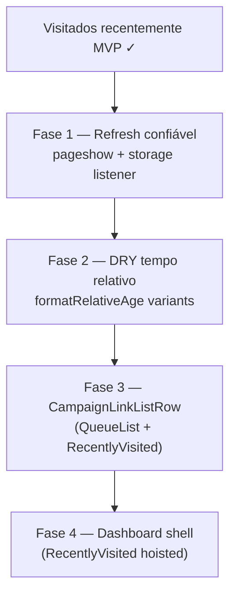

# Escala e DRY pós-visitados recentemente

Status: registrado no roadmap (fases pendentes)
Atualizado em: 2026-07-19
Item do roadmap: [docs/roadmap.md](../roadmap.md) (VR+, fill-in de engenharia pós-MVP)
Responsável: —

## Contexto

O fill-in **Visitados recentemente** ([visitados-recentemente.md](visitados-recentemente.md)) entregou o MVP client-side: `recentVisits.ts` + `RecentVisitTracker` + `RecentlyVisited` no dashboard `/campanha`, integração em detalhe/listagem de núcleos, `buildNucleusListVisitLabel` / `buildNucleusListVisitHref`, labels de cobertura/estimativa compartilhados com `NucleusFilters`, e limpeza no logout (`CampaignSidebar`). Três passagens `/simplify` (2026-07-19) aplicaram cleanup pontual; os revisores (quality / performance / reuse) deixaram débitos **maiores que cleanup** — registrados aqui.

**Já resolvido no simplify (não reabrir):** `formatRelativeAge` extraído para `src/utilities/formatRelativeAge.ts` (evita puxar `campaignTime.ts` no client); prop `now` do servidor; remoção de `RECENT_VISITS_CHANGED_EVENT` (morto — painel e tracker não coexistem na mesma rota); `nucleusListCoverageLabels` / `nucleusListEstimateLabels` compartilhados; `buildNucleusListVisitHref` sem `page` (dedup de paginação); `listVisitHref` lazy no branch com filtro.

## Objetivos

- Painel reflete visitas recentes após navegação back/forward (bfcache) e escrita em outra aba do mesmo origin.
- Um único helper de tempo relativo no dashboard (substituir `lastUpdateLabel` / `relativeDateLabel` locais onde fizer sentido).
- Linha de lista do dashboard reutiliza shell compartilhado (`QueueList` ↔ `RecentlyVisited`) sem duplicar markup.
- `RecentlyVisited` montado uma vez no wrapper do dashboard, respeitando `max-width` por role.
- Guardrails: sem collection/migration/Consent; histórico continua client-only; comportamento de dwell/dedup inalterado salvo bugs encontrados.

## Decisões travadas

- **Um plano VR+, quatro fases ordenadas.** Mesmo racional de O0+/B5/C8: um registro no roadmap, PRs por fase. Ordem: refresh confiável → DRY tempo relativo → DRY row shell → DRY layout dashboard.
- **Dependência suave do fill-in Visitados recentemente ✓.** Não bloqueia uso do MVP; melhora UX em back-navigation e consistência visual.
- **Sem sync servidor.** Histórico multi-dispositivo, poda reativa de acesso e histórico de planos/apoiadores permanecem fora de escopo (exigiriam modelo + `Consent`).
- **Cortável:** Fases 3–4 (row shell + layout wrapper) até o dashboard ganhar mais painéis do mesmo padrão; Fase 2 (relative time) é barata e reduz drift — preferir se houver folga.
- **i18n e naming** (AGENTS.md): identificadores em inglês (`useRecentVisits`, `CampaignLinkListRow`, `formatLastUpdateLabel`), strings visíveis em pt-BR.

## Questões em aberto

- **`pageshow` + `storage` vs reintroduzir evento custom?** O evento foi removido porque tracker e painel não montam juntos; bfcache e multi-tab são os casos reais restantes. **Recomendação:** `pageshow` (`event.persisted`) + `window.addEventListener('storage', …)` filtrando `STORAGE_KEY` — sem event bus custom.
- **Unificar `floor` (dias) vs `round` (minutos/horas)?** `lastUpdateLabel` usa dias inteiros; `formatRelativeAge` arredonda minutos/horas/dias. **Recomendação:** exportar variantes explícitas em `formatRelativeAge.ts` (`formatRelativeAgeDays`, `formatRelativeAge`) em vez de forçar um único comportamento.
- **Extrair row shell agora?** Só dois consumidores (`QueueList`, `RecentlyVisited`) com diferenças (ícone leading vs `ArrowRight`, prefixo "Última atualização"). **Recomendação:** extrair quando um terceiro painel de atalhos aparecer, ou na Fase 3 se o drift visual incomodar produto.
- **`next/dynamic` no painel?** **Recomendação:** só se Lighthouse mostrar o chunk como relevante no `/campanha`; o painel já retorna `null` quando vazio.

## Abordagem proposta

### Fase 1 — Refresh confiável do painel

- **`RecentlyVisited`** (`src/components/campaign/RecentlyVisited.tsx`): no `useEffect` de mount, registrar `pageshow` (refresh quando `event.persisted`) e `storage` (quando `e.key === STORAGE_KEY` ou `e.key === null` para `clear()`).
- Opcional: extrair `useRecentVisits()` (`useState` + listeners + `listRecentVisits`) se Fase 1 crescer — hoje um hook de ~15 linhas é suficiente.

### Fase 2 — DRY de tempo relativo no dashboard

- **`formatRelativeAge.ts`**: adicionar `formatRelativeAgeInDays(timestampMs, nowMs)` (floor, como `lastUpdateLabel`) além do bucketing atual.
- **`CampaignDashboard.tsx`**: migrar `lastUpdateLabel` para helper compartilhado (manter prefixo "Última atualização" no call site).
- **`NucleusListOverview.tsx`**: migrar `relativeDateLabel` para o mesmo helper (dia-only).
- **`NucleusUpdateFeed.tsx`**: substituir `new Intl.RelativeTimeFormat` por instância do módulo compartilhado (hoje aloca formatter a cada call).

### Fase 3 — DRY de linha de lista

- Extrair **`CampaignLinkListRow`** (ex. `src/components/campaign/CampaignLinkListRow.tsx`): props `href`, `title`, `subtitle?`, `leadingIcon?`, `trailingIcon?` (`ArrowRightIcon` default para filas).
- Refatorar **`QueueList`** em `CampaignDashboard.tsx` e **`RecentlyVisited`** para usar o componente; alinhar classes (`truncate` no subtítulo, `min-h-11`).

### Fase 4 — Shell do dashboard por role

- Introduzir wrapper **`CampaignDashboardShell`** com prop `maxWidthClass` (`max-w-screen-2xl` / `max-w-5xl` / `max-w-4xl`) renderizando header slot + **`<RecentlyVisited now={now} />`** + children.
- `GeneralDashboard` / `CoordinatorDashboard` / `LeadershipDashboard` passam a compor o shell em vez de repetir o painel.

### Fase 5 — Micro-perf (opcional, cortável)

- **`next/dynamic`** com `ssr: false` para `RecentlyVisited` em `CampaignDashboard.tsx` se o bundle do dashboard for gargalo.
- **`recordRecentVisit`**: leitura interna sem re-validação completa no write path (`_readRaw`) — só se profiling mostrar custo (improvável com `MAX_ENTRIES = 8`).
- **`nucleos/page.tsx`**: deduplicar `resolveNucleusListUrl` (pré-existente, fora do core visitados) — registrar junto com A7/C10 se virar padrão de lista.

## Dependências

- **Visitados recentemente MVP ✓** (fill-in entregue em branch local; merge pendente).
- Reusa `formatRelativeAge.ts`, `recentVisits.ts`, `CampaignDashboard.tsx`, `NucleusListOverview.tsx`, `NucleusUpdateFeed.tsx`.
- Sem migration, sem collection, sem `Consent`.

## Não escopo

- Sync multi-dispositivo / histórico no servidor → exigiria collection + `Consent` (permanece no [visitados-recentemente.md](visitados-recentemente.md)).
- Histórico de planos/apoiadores/outras rotas → item separado se produto pedir.
- Poda reativa ao perder acesso (best-effort no MVP) → só se virar confusão recorrente.
- Telemetria/analytics de navegação.
- `buildNucleusDetailHref` — inline `/campanha/nucleos/${slug}` é o padrão do codebase hoje.

## Referências

- [visitados-recentemente.md](visitados-recentemente.md) — MVP entregue
- [escala-dry-pos-onda0.md](escala-dry-pos-onda0.md) — precedente de registro pós-`/simplify`
- `src/utilities/recentVisits.ts`, `src/utilities/formatRelativeAge.ts`
- `src/components/campaign/RecentlyVisited.tsx`, `RecentVisitTracker.tsx`
- `src/components/campaign/CampaignDashboard.tsx` (`QueueList`, `lastUpdateLabel`)
- `src/components/campaign/NucleusListOverview.tsx`, `NucleusUpdateFeed.tsx`
- `src/utilities/nucleusUi.ts` (`buildNucleusListVisitLabel`, `buildNucleusListVisitHref`)
- `docs/roadmap.md` (fill-ins VR+)
- AGENTS.md — naming, sem migration para este item
