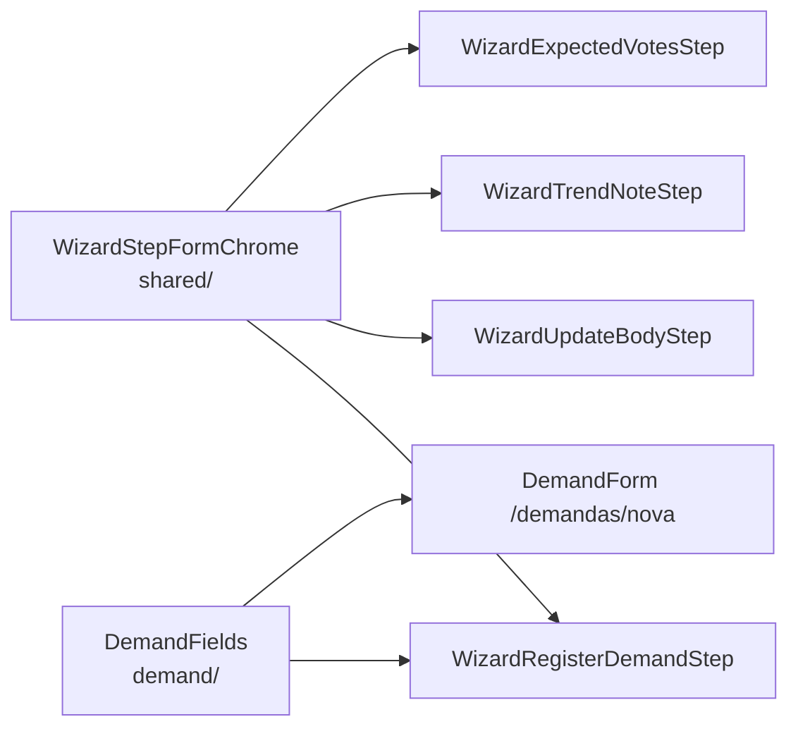

# Impl: Escala/DRY: chrome comum dos passos finais do wizard (pós-B195)

Status: aprovado
Atualizado em: 2026-08-11
Issue: #619 (D11)
Intenção: docs/plans/escala-dry-pos-wizard-steps.md
Appetite restante: herdado (~0,5–1 dia eng) — não estoura

## Leitura da intenção

- **Outcome:** os 4 passos finais do wizard de `/campanha/acoes` param de duplicar (a) submit bar + pendência e (b) campos do cadastro de demanda, sem mudar comportamento, copy, toast/push/retorno ou a11y pinada por e2e.
- **O que NÃO negociar:** copy intocada (`Salvando…`, sr-only de cada passo, labels de CTA, `WIZARD_*`/`CAMPAIGN_DEMAND_*` continuam onde estão e com os mesmos valores); e2e de foco/a11y verdes (`contentFocus`, aria-live, label do botão); não renomear arquivos de steps (histórico de PRs); não unificar os corpos dos steps; nada de migration/schema.
- **O que reavaliar (hipóteses da intenção):**
  1. `WizardStepFormChrome` como "form + pending chrome + submit bar" — o 4º step (`WizardExpectedVotesStep`) **não é form**: usa `useTransition` + `fetch` + CTA `type="button"`, sem `useActionState`. Forçá-lo a form mudaria comportamento (Enter passaria a salvar). A extração precisa de dois modos, não de um form só.
  2. "Campos de demanda parametrizado por prefixo de id + `showMunicipality`" — a diferença entre os dois cadastros é maior que prefixo: município fixo (hidden input + search já vinculado) vs selecionável (gating do combobox, placeholder locked, reset de atividade, copy condicional, grid 2 colunas).

## Abordagem recomendada

**`WizardStepFormChrome`** — dono do chrome de passo final: wrapper (`<form action>` ou `
`), `aria-busy`/`data-pending`, submit bar com CTA (Spinner + `Salvando…` + label), região sr-only `aria-live` com `pendingAnnouncement`. Dois modos **por união discriminada** (type-safe, sem `as`/`variant` genérico): `{ action }` (3 steps form) | `{ onCtaClick }` (votos, preserva `useTransition`/fetch). Props de forma: `leadingSubmit?` (Limpar do trend), `submitBarClassName?` (flex-wrap do trend), `ctaClassName?` (largura).

**`DemandFields`** — dono dos campos do cadastro de demanda: Tipo (`NativeSelect`), Atividade (`AsyncSearchCombobox`), descrição (`Textarea`), erros via `fieldError`. Prop `municipality?` opcional: ausente = modo wizard (stacked, combobox sempre pronto, search já vinculado pelo passo); presente = modo `/demandas/nova` (grid 2 colunas Tipo+Município, gating `isQueryReady`/`queryTooShortMessage`, placeholder button locked, reset de atividade na troca de município, copy condicional da descrição). O gating/reset/copy condicional só disparam em modo município — no wizard o DOM sai idêntico ao de hoje.

**Opções consideradas:**

- **Chrome:** A) um componente com união discriminada `action | onCtaClick` — **recomendada**; B) só-form nos 3 steps e votos mantém o bloco duplicado — rejeitada: o débito do /simplify renasce no passo 4 com o mesmo conhecimento; C) `variant`/`as` genérico — rejeitada: mesma cobertura com API mais frouxa e modos não checados por tipo.
- **Campos:** A) `DemandFields` com `municipality?` opcional — **recomendada**; B) campos comuns sem município + DemandForm mantém o select/gating próprios — rejeitada: o Field de atividade (combobox vs placeholder locked) é inseparável do estado do município; deixar metade fora re-duplica; C) DemandForm vira dono e o wizard o consome inteiro — rejeitada: layout (`max-w-2xl gap-4` vs `gap-6`), ids, `disabled={isPending}` e estado diferem; mudaria o DOM e o comportamento do wizard.

### Componentes / mudanças

- **`WizardStepFormChrome`** (`src/components/campaign/shared/WizardStepFormChrome.tsx`): novo. Props comuns `isPending`, `pendingAnnouncement`, `ctaLabel`, `children`, `leadingSubmit?`, `submitBarClassName?`, `ctaClassName?`; união `{ action: CampaignFormAction } | { onCtaClick: () => void }`. Renderiza `<form action>` ou `
` com `className="flex flex-col gap-6"`, `aria-busy={isPending || undefined}`, `data-pending`; bar default `flex items-center justify-end`; CTA `min-h-11` + `min-w-[7rem]` default + `<Spinner data-icon="inline-start" aria-hidden="true" />` + `Salvando…`; sr-only `aria-live="polite"` por último. `Salvando…` passa a viver aqui (1 site).
- **`DemandFields`** (`src/components/campaign/demand/DemandFields.tsx`): novo. Props `idPrefix`, `disabled?`, `state: CampaignFormActionState`, `activity`, `onActivityChange`, `searchActivities`, `municipality?`. Reusa `fieldError` (`utilities/campaignFormFields`), consts de `lib/schemas/campaignDemand` (B195, intocadas). Layout: `municipality` ausente → campos empilhados (hoje do wizard); presente → `grid gap-4 sm:grid-cols-2` com Tipo+Município, e gating de atividade.
- **`WizardRegisterDemandStep`** (`shared/`): passa a compor `WizardStepFormChrome` (modo `action`, `WIZARD_DEMAND_PENDING_ARIA`, `CAMPAIGN_DEMAND_SUBMIT_LABEL`, `ctaClassName="min-w-[8rem]"`) + `DemandFields` (prefixo `wizard-demand-`, `disabled={isPending}`). Mantém hidden `municipalityId`, `searchActivities` vinculado ao `municipalityId` prop, toast/push/`recordLastActedMunicipality`, hidden input e `CampaignFormActionMessage` como children.
- **`WizardUpdateBodyStep`** (`municipality/`): compõe `WizardStepFormChrome` (modo `action`, sr-only `Salvando atualização.`, `WIZARD_UPDATE_SAVE_LABEL`, largura default). Hidden inputs, corpo (textarea/polaridade/urgente/adversary), `CampaignFormActionMessage` como children.
- **`WizardTrendNoteStep`** (`municipality/`): idem + `leadingSubmit` = botão Limpar (`WIZARD_TREND_CLEAR_LABEL`, `disabled` por `note.length === 0`) + `submitBarClassName="flex-wrap gap-3"`. `autoFocus` da textarea intocado.
- **`WizardExpectedVotesStep`** (`shared/`): modo `onCtaClick={handleConfirm}` (mesma validação `getWizardVoteViolation`, transition e `postCampaignJson`), `pendingAnnouncement="Salvando votos estimados."`, `ctaLabel={WIZARD_VOTES_FINAL_CTA_LABEL}`, `ctaClassName="w-full"`. Corpo (inputs, shortcuts, alerts) como children. Micro-diferenças conscientes: `aria-busy` omite `false` no idle (hoje votos emite `aria-busy="false"`) e sr-only passa a vir depois do CTA — sem efeito perceptível.
- **`DemandForm`** (`demand/`): passa a compor `DemandFields` com `municipality` config (options/value/onValueChange); perde o select, o gating, o reset e a copy condicional próprios. Mantém `<form>` próprio (`max-w-2xl gap-4`, `CampaignFormActionMessage`, botão `self-start` com Spinner + `CAMPAIGN_DEMAND_SUBMIT_LABEL`) — não é passo de wizard, não entra no chrome.
- **Migration:** nenhuma. **Access/Consent:** nenhum. **UI:** extração mecânica com DOM equivalente (não é Impeccable B/C/D; é refactor). **Dados → forma:** n/a.

## Fases verificáveis

1. **Chrome:** criar `WizardStepFormChrome` + refatorar os 4 steps (sem `DemandFields` ainda). `pnpm gate:fast` + e2e: `campaignHomeActions`, `campaignWizardChrome`, `campaignRegisterDemand` (foco, aria-live, labels).
2. **Campos:** criar `DemandFields` + refatorar `DemandForm` e `WizardRegisterDemandStep`. `pnpm gate:fast` + e2e `campaignRegisterDemand` + `campaignMunicipalities` (caminho /demandas/nova), `campaignUpdatesMobile` (form de update no mobile).
3. **Gates totais e fechamento:** `pnpm gate:fast` + `pnpm push` (lint 0 warnings, format, knip — imports órfãos dos steps morrem na entrega, `check:cycles`, unit+int, build) → `/simplify` → `capture-review-debts` com gate humano → PR Ready + auto-merge.

## Rabbit holes / Não escopo (engenharia)

- Não unificar corpos dos steps (cada um tem campos próprios) — só o chrome/pending e os campos de demanda.
- Não renomear arquivos de steps nem `CampaignWizardShell`/`DemandForm`.
- Não mexer em copy: `WIZARD_UPDATE_*` vs `WIZARD_DEMAND_*` continua deferido (cosmético, gatilho: próxima casa de copy).
- Não transformar `WizardExpectedVotesStep` em `<form>` (Enter salvaria — mudança de comportamento).
- Não mover hidden inputs nem `CampaignFormActionMessage` para dentro do chrome (cada passo decide os seus).

## Já resolvido no simplify (não reabrir)

- Duplicação interna do chrome (branches form/div) → hoist de `content` em `WizardStepFormChrome`.
- Kind field duplicado inline → hoist de `kindField` em `DemandFields`.
- Micro-mudanças conscientes (documentadas): votos omite `aria-busy` no idle (vs `"false"`), Spinner do votos ganha `data-icon="inline-start"` (~4px no pending), sr-only do votos passa a vir após o CTA, `required` inerte no kind select do `DemandForm`, `fieldError` normaliza 1º erro (produtores emitem ≤1).

## Explicitamente fora (descartes/defer deste triage)

- Flake e2e `getByLabel('Atividade relacionada')` strict mode → **registrado como D12** (Issue #641, pré-existente em main — provado via stash; não é débito do D11).
- Defer com gatilho (do plano de intenção, mantidos): fail-closed `campaignDemandUniqueSlug` sem teste (gatilho: próxima mudança no hook); copy "Informe um título com letras ou números." (gatilho: feedback em campo); casa de copy `WIZARD_UPDATE_*` vs `WIZARD_DEMAND_*` (gatilho: próxima casa de copy); `canLeaderEdit` morto (pré-existente); update de demanda com descrição inalterada ainda grava (documentado em teste).

## Riscos e mitigação

- **Regressão de a11y/foco nos steps legados** → e2e `campaignHomeActions`/`campaignWizardChrome`/`campaignRegisterDemand` pinam `contentFocus`, aria-live e labels; rodar nas fases 1 e 2.
- **Mudança visual acidental no wizard** → o chrome em modo form reproduz o DOM exato de hoje (mesmas classes, mesma ordem de children); conferir por diff dos 4 steps.
- **`DemandFields` virar config soup** → cada prop mapeia uma diferença real entre os 2 call sites existentes; nenhum prop especulativo; se um 3º cadastro surgir, o dono já está definido.
- **Imports órfãos nos steps** (Spinner/Button/NativeSelect removidos) → knip no gate final aponta; remover na entrega (não `knip --fix` cego).

## Aceite de engenharia

- [x] Aceite de produto da intenção coberto (extração sem mudar copy/comportamento/toast/retorno)
- [x] Invariantes AGENTS/engineering-standards (sem migration, sem access, sem transação, identificadores em inglês)
- [x] Testes: e2e dos 3 specs de wizard + demandas nas fases; gates completos no fechamento
- [x] Depth check: `CampaignWizardShell`, consts B195 e `fieldError` reusados; os 2 módulos novos são os donos das 2 duplicações
