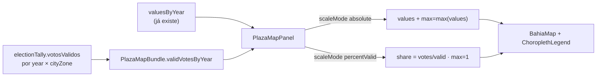

# Escala percentual no Mapa das Praças (0–100% dos válidos)

Status: rascunho
Atualizado em: 2026-07-21
Item do roadmap: [docs/roadmap.md](../roadmap.md) (Trilha B, item B11)
Impeccable: B — encaixe em `PlazaMapPanel` / `BahiaMap` / `ChoroplethLegend` (sem rota nova)
Appetite: ~0,5–1 dia eng; tally por ano no bundle + seletor de escala + legenda 0–100%
Responsável: —

## Design (Impeccable)

Âncoras: `PRODUCT.md` / `DESIGN.md` (register product — Field Desk) · tema `data-theme='campaign'` · shells existentes (`PlazaMapPanel`, `BahiaMap`, `ChoroplethLegend`, `NativeSelect`).

Na implementação (`implement-roadmap-item`): craft compacto → critique → polish (controle + copy da legenda; sem shape longo).

Brief compacto:

- **Persona / contexto:** Assessor/Coordenador Geral (Alex) compara municípios de portes muito diferentes e hoje o coroplético é dominado pelo total absoluto (Salvador “pinta” a escala).
- **Job principal:** escolher ver a cor como **participação nos votos válidos da Praça** (0–100%), não como total relativo à maior Praça.
- **Estratégia de cor:** Restrained — mesma rampa vermelha sequencial; só muda o domínio da métrica. Modo comparar (divergente) inalterado neste item.
- **Anti-goals:** não segunda paleta; não hero-metric SaaS; não redesenhar o mapa; não inventar denominador fora de `votosValidos` do TSE.

## Contexto

O **Mapa das Praças** (`PlazaMapPanel` em `/campanha/pracas`) pinta municípios com `choroplethFillColor(value, max)` onde `max = choroplethMaxValue(values)` — o **maior total absoluto** no escopo (`src/lib/choroplethColorScale.ts`). Municípios pequenos com boa penetração ficam pálidos; Salvador/grandes centros saturam a escala.

Os votos nominais já vêm de `loadCandidateVotesByCityZone` + `sumVotesForGeography` em `plazaMapData.ts`. O denominador pedido — **votos válidos** (sem nulos, brancos nem abstenções) — já existe em `electionTally.votosValidos` (seed TSE; usado no detalhe via `plazaElectoralBaseline` / `PlazaBaselineCard`). Pedido de produto (2026-07-21): opção de escala **percentual na Praça**, domínio fixo **0% → 100%**.

Não cobre: filtro URL (**B7**), hover (**B10**), `setStyle` incremental (**B6**), polígonos-zona (**B8**).

## Objetivos

- Controle no painel do mapa: escala **Total (votos)** | **% dos válidos** (rótulos pt-BR).
- Em `% dos válidos`: cor = `votos_candidato / votosValidos` da geografia da Praça (células `cityCode × zone` no escopo), com `max` fixo = **1** (legenda 0–100%), não o máximo observado entre Praças.
- Anos TSE (2014/2018/2022): denominador = `electionTally.votosValidos` do **mesmo ano** + mesmo cargo/turno federal T1 já usados no mapa.
- Guardrails: sem migration, sem collection, sem Consent, sem server action; leituras de tally com o mesmo padrão de access do baseline (`assertCanReadElectionData` / `overrideAccess: true` após assert, como `loadCandidateVotesByCityZone`).
- Modo **Comparar** (divergente): permanece em diferença absoluta; o seletor de escala percentual some ou fica desabilitado com copy curta (não misturar % e diff no v1).

## Decisões travadas

- **Item próprio B11 (não absorver em B7/B10/B6 nem R6).** É semântica da métrica do coroplético, não filtro, hover, perf nem polish genérico. (2026-07-21, roadmap-item.) **Rejeitado:** fill-in sem plano (denominador + 2026 + compare precisam de decisão); fase de classificação territorial A5 (já usa % no detalhe, não no mapa).
- **Denominador = `electionTally.votosValidos` (TSE).** Exclui nulos, brancos e quem não compareceu (abstenção). Alinha ao card de baseline (“% dos válidos”). **Rejeitado:** `aptos` (inclui abstenção); `comparecimento` (inclui nulos/brancos); denominador “votos nominais totais do cargo” sem tally (mais query, mesma intenção do campo oficial).
- **Escala fixa 0–100%, não max-of-shares.** `choroplethFillColor(share, 1)` (ou equivalente). Um município com 8% dos válidos fica igualmente claro em qualquer escopo. **Rejeitado:** normalizar pelo maior % do mapa (ainda distorce leitura entre filtros).
- **2026 (estimativas): denominador = válidos 2022 da mesma geografia.** Não há tally 2026. Copy da legenda: “% dos válidos 2022”. **Rejeitado:** desabilitar % em 2026 (perde o ano operacional); usar `voteGoals`/metas (outra semântica); inventar eleitorado IBGE.
- **Comparar (divergente) fora do modo % neste item.** Diff absoluto Solla − outro permanece; percentual de shares (ou diff de %) é rabbit hole. **Rejeitado:** forçar % no compare no v1.
- **Default da UI = `% dos válidos`.** Absoluto continua disponível. _(assumido — validar com produto; se preferirem preservar o comportamento atual, inverter o default sem mudar o resto.)_ **Rejeitado:** só absoluto com “avançado” escondido (o pedido é a leitura útil).
- **i18n e naming** (AGENTS.md): identificadores em inglês (`scaleMode: 'absolute' | 'percentValid'`, `validVotesByYear`, `percentValues`); strings visíveis em pt-BR (`Total (votos)`, `% dos válidos`, legenda `0` … `100%`).

## Questões em aberto

- **Persistir escala na URL (`?scale=percent|absolute`)?** **Opções:** A) só estado local (como o seletor Ano) | B) query string. **Recomendação:** A no v1 — barato; B se a coordenação começar a compartilhar links do mapa com a escala (gatilho abaixo).
- **Praça com `votosValidos === 0` ou tally ausente?** **Opções:** A) tratar como sem dado (cinza, como valor ausente) | B) 0%. **Recomendação:** A — evita divisão por zero e “0%” falso quando falta seed.
- **Salvador/Camaçari agregados no polígono municipal:** % = soma dos votos das Praças-zona **no escopo** / soma dos válidos das mesmas células (já é o padrão do absoluto). Breakdown textual continua em votos (ou mostra % se barato). **Recomendação:** breakdown em votos no v1; % só no coroplético + legenda.

## Abordagem proposta

Componentes:

- **`loadValidVotesByCityZone`** (em `src/utilities/plazaElectoralBaseline.ts`, ao lado de `loadCandidateVotesByCityZone`): para um `year`, retorna `Map<cityCode:zone, votosValidos>` a partir de `electionTally` (federal T1). Reusar `sumVotesForGeography` (mesmo shape de chave) — depth check: não criar `plazaMapPercent.ts` pass-through.
- **`loadPlazaMapBundle`** (`src/utilities/plazaMapData.ts`): preencher `validVotesByYear: Record<string, Record<string, number>>` (codarea → válidos agregados por geografia no escopo), espelhando o loop de `valuesByYear` para 2014/2018/2022; para a chave `'2022'` reutilizar no modo 2026. Estender o tipo `PlazaMapBundle`.
- **`PlazaMapPanel`**: `NativeSelect` (ou segmented leve já usado no tema) `scaleMode`; quando `percentValid` e não-compare, derivar `values` como shares 0–1 e passar `max={1}` à legenda; `metricLabel` → `participação nos válidos (…)` / copy 2026 com “válidos 2022”. Em compare: forçar absoluto + ocultar/desabilitar o seletor.
- **`ChoroplethLegend`**: aceitar formatação de extremo direito (`formatElectionNumber` vs `100%` / `percentFormatter`) — prop opcional `maxLabel` ou `formatMax`, sem segundo componente de legenda.
- **Testes:** unit de `share = votes/valid` (0, 1, divisão por zero → omitir); smoke mental/checklist: ano TSE, 2026, compare desliga %, Salvador agregado.
- **Migration:** Sem migration, sem collection, sem server action.

## Dependências

- **Dura:** R2 (mapa Praças) — entregue.
- **Suave:** seed TSE com `electionTally` nos anos do mapa (já no fluxo `pnpm db:seed:tse`); A9 só se a métrica 2026 do numerador mudar (`expectedVotes`) — o denominador % continua 2022.
- Reusa: `plazaMapData.ts`, `plazaElectoralBaseline.ts`, `choroplethFillColor`, `PlazaMapPanel`, `ChoroplethLegend`, `electionTally.votosValidos`.

## Não escopo

- Filtrar mapa pela URL → **B7** ([mapa-pracas-filtrado.md](mapa-pracas-filtrado.md)).
- Hover com readout → **B10** ([hover-mapa-pracas.md](hover-mapa-pracas.md)); quando ambos existirem, o readout em modo % deve mostrar % (não só votos) — coordenar na implementação do que estiver segundo.
- Diff percentual no modo Comparar → adiado (rabbit hole abaixo).
- Polígonos Praças-zona → **B8**.
- `setStyle` incremental → **B6**.
- Alterar classificação territorial A5 / limiares — já entregue; só compartilha a noção de `% dos válidos`.

## Rabbit holes

- **Diff de shares no modo Comparar.** Se alguém “só completar”: segunda escala divergente em pp, legenda bipolar em %, e copy confusa com o vermelho/azul atual. **Mitigação:** compare = absoluto apenas neste item.
- **Denominador por cargo majoritário ou aptos.** Muda a leitura política e quebra paridade com o baseline. **Mitigação:** só `votosValidos` federal T1.
- **Persistir preferência por usuário / cookie.** Fora do appetite. **Mitigação:** estado local; URL só com gatilho.

## Adiado com gatilho

- **`?scale=` na URL.** Revisitar quando: alguém pedir link compartilhável do mapa já em % (ou o mesmo padrão for adotado para `year`).
- **Modo Comparar em pontos percentuais (Solla% − outro%).** Revisitar quando: a coordenação usar o compare e reclamar que o diff absoluto favorece municípios grandes.
- **Breakdown por zona em %.** Revisitar quando: B8 pintar Praças-zona ou B10 mostrar readout em % e a lista de zonas ficar inconsistente.

## Referências

- `docs/roadmap.md` (Trilha B / Janela 1 — B11)
- `src/utilities/plazaMapData.ts` — bundle e agregação por `ibgeCode`
- `src/utilities/plazaElectoralBaseline.ts` — `loadCandidateVotesByCityZone` / `sumVotesForGeography` / tally no detalhe
- `src/lib/choroplethColorScale.ts` — `choroplethFillColor(value, max)`
- `src/components/campaign/PlazaMapPanel.tsx` / `ChoroplethLegend.tsx` / `BahiaMap.tsx`
- `src/components/campaign/PlazaBaselineCard.tsx` — precedente de “% dos válidos” na UI
- `src/collections/ElectionTally.ts` — campo `votosValidos`
- AGENTS.md — Campaign Praças model (mapa / `plazaMapData`); naming EN/pt-BR
- `PRODUCT.md` / `DESIGN.md` — Field Desk; inteligência a serviço da organização
